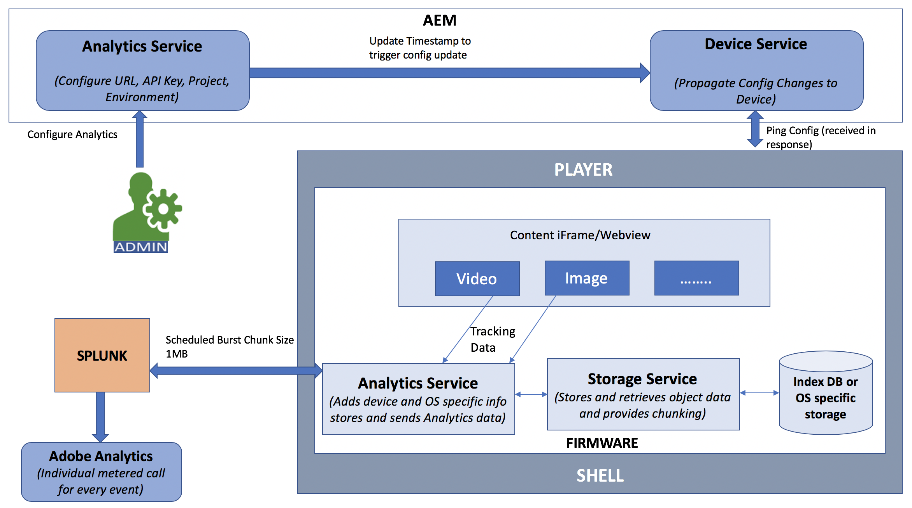

# AEM Screens과 Adobe Analytics 통합 {#adobe-analytics-integration-with-aem-screens}

>[!CAUTION]
>
>이 AEM Screens 기능은 최소 버전의 AEM 6.4.2 기능 팩 2 또는 AEM 6.3.3 기능 팩 4를 설치한 경우에만 사용할 수 있습니다. AEM Screens Cloud Service 고객의 경우 Adobe 관계 관리자에게 문의하여 Screens Cloud에서 Adobe Analytics을 활성화하십시오.

>[!NOTE]
>
>이러한 기능 팩 중 하나에 액세스하려면 Adobe 지원 센터에 문의하여 액세스를 요청하십시오. Adobe ID을 사용하여 [소프트웨어 배포 포털](https://experience.adobe.com/#/downloads/content/software-distribution/en/aem.html)에서 AEM Screens용 최신 기능 팩을 다운로드할 수 있습니다.

이 섹션에서는 다음 주제를 다룹니다.

* **개요**
* **아키텍처 세부 정보**
* **속성 구성**

## 개요 {#overview}

***AEM Screens***&#x200B;은(는) Adobe Analytics을 사용하므로 시장에서 고유한 것(위치에 표시된 콘텐츠를 다른 데이터 소스와 상호 연관시키는 데 도움이 되는 크로스 채널 분석)을 달성할 수 있습니다.

AEM Screens은 Adobe Analytics과의 획기적인 통합을 제공하며 재생 증명을 제공합니다.

이 섹션에서는 Adobe Analytics과 AEM Screens 프로젝트 연결과 관련된 다음 기능에 대해 설명합니다.

* 장치별 재생 증명 보고 허용
* 자산별 재생 증명 보고 허용
* 모든 플레이어 이벤트가 캡처되고 타임스탬프가 지정되었는지 확인합니다.
* 플레이가 네트워크에 연결되어 있지 않은 경우 모든 플레이어 이벤트가 로컬에 저장되도록 합니다.
* 시간에 따른 재생 이벤트를 추적하는 피드백 루프를 생성할 수 있습니다
* 콘텐츠 작성자가 정의한 성공 기준에 따라 시스템이 콘텐츠 및 레이아웃을 편집할 수 있도록 해줍니다

따라서 AEM Screens과 Adobe Analytics 통합은 다음 *목표*&#x200B;를 적용합니다.

* 디지털 사이니지 구현에서 ROI 활성화
* 향후 사용 정보 수집 및 분석을 위한 기반으로 Analytics 통합

## 아키텍처 세부 정보 {#architectural-details}

AEM Screens 고객은 표시된 시간과 기간(집계된) 동안 표시되는 콘텐츠를 이해하려고 합니다. 이러한 필요성은 간판 솔루션의 공통 기능입니다. AEM Screens은 별도의 분석 애플리케이션을 빌드하는 대신 Adobe Analytics을 사용합니다. 이 조합을 통해 위치에 표시된 콘텐츠를 다른 데이터 소스와 상호 연관시키는 데 도움이 되는 크로스 채널 분석 이라는 시장에서 고유한 기능을 달성할 수 있습니다.

다음 아키텍처 다이어그램은 AEM Screens과 Adobe Analytics 통합에 대해 설명합니다.

## AEM Screens에서 Adobe Analytics 활성화 {#enabling-adobe-analytics-in-aem-screens}

Adobe Analytics 설정은 OSGi 콘솔에서 구성할 수 있습니다.

Adobe Experience Manager용 Adobe Analytics을 구성할 수 있도록 **AEM Screens 웹 콘솔 구성**(으)로 이동합니다.

## Screens Analytics: 지원 흐름 {#screens-analytics-enablement-flow}

>[!CAUTION]
>
>속성을 구성하기 전에 Adobe 관계 관리자에게 문의하여 AEM Screens에서 사용할 **Analytics API 키** 및 **Analytics 프로젝트**&#x200B;를 얻을 수 있는 티켓을 만드십시오.

### 속성 구성 {#configuring-the-properties}

>[!CAUTION]
>
>속성을 구성하기 전에 Adobe 관계 관리자에게 문의하여 AEM Screens에서 사용할 **Analytics API 키** 및 **Analytics 프로젝트**&#x200B;를 얻을 수 있는 티켓을 만드십시오.

다음 표에서는 Adobe Analytics for AEM Screens 구성에 대한 설명과 함께 속성을 강조 표시합니다.

<table>
 <tbody>
  <tr>
   <td><strong>속성</strong></td>
   <td><strong>설명</strong></td>
  </tr>
  <tr>
   <td><strong>Analytics URL</strong></td>
   <td>플레이어에서 분석 데이터를 게시할 URL입니다.  
   개발/단계</em> - https://cc-api-data-stage.adobe.io/ingest/  <em>프로덕션</em> - https://cc-api-data.adobe.io/ingest/   </td>
  </tr>
  <tr>
   <td><strong>Analytics API 키</strong></td>
   <td>Adobe Analytics 서버 인증을 위한 API 키(계정 관리자가 제공).</td>
  </tr>
  <tr>
   <td><strong>Analytics 프로젝트</strong></td>
   <td>데이터를 수신하도록 분석에 구성된 AEM Screens 프로젝트(계정 관리자가 제공).</td>
  </tr>
  <tr>
   <td><strong>환경</strong></td>
   <td>
스테이지 또는 프로덕션 환경(스테이지 또는 프로덕션 선택).
</td>
  </tr>
  <tr>
   <td><strong>Analytics 전송 빈도</strong></td>
   <td>플레이어에서 분석 데이터를 전송하는 빈도(분)입니다. 기본적으로 15분으로 설정되어 있습니다.</td>
  </tr>
 </tbody>
</table>

>[!NOTE]
>
>기본적으로 **Analytics 전송 빈도**&#x200B;는 15분입니다.

#### AEM Screens에서 Adobe Analytics 서비스 사용 {#using-adobe-analytics-service-in-aem-screens}

이 시나리오는 펌웨어의 분석 서비스에서 REST 호출을 통해 Analytics API를 호출합니다. 또한 AEM screens-core 구성 요소를 계측하여 특정 사용 사례에 맞는 이벤트를 만들고 전송할 수 있습니다. 이 모든 기능을 통해 사용자 지정 메시지를 사용자 지정 개발 채널에서 Analytics로 보낼 수 있는 확장성을 확보할 수 있습니다.

Analytics 이벤트는 indexedDB에 오프라인으로 저장되고 나중에 청크되어 클라우드로 전송됩니다.

>[!NOTE]
>
>***시퀀싱*** 및 ***이벤트에 대한 표준 데이터 모델***&#x200B;에 대한 자세한 내용은 **[AEM Screens에 대한 Adobe Analytics 구성](configuring-adobe-analytics-aem-screens.md)**&#x200B;을 참조하세요.
