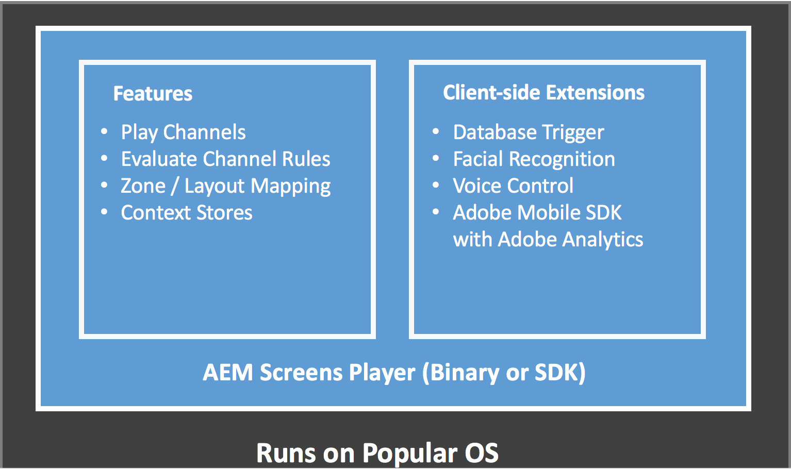

# AEM Screens 소개{#what-is-aem-screens}

**AEM(Adobe Experience** Manager) Screens - 포괄적인 디지털 마케팅 플랫폼과 함께 다양한 유형의 화면에서 발생하는 인터랙티브한 디지털 경험과 인터랙션을 게시할 수 있는 디지털 서명 솔루션입니다.

AEM Screens에 대한 킥스타트를 사용하여 간단한 디지털 [사이니지 환경을 시작하고 실행합니다](kickstart-for-aem-screens.md).

## 개요 {#overview}

**AEM Screens** 는 AEM ****** Sites의 견고한 기반을 기반으로 구축되었으며 마케터 및 IT 직원이 브랜드 구축 및 수요 창출을 위한 매장/매장 내 목표에 영향을 미치는 여러 디지털 화면에서 경험을 만들고 관리할 수 있도록 지원합니다. AEM Screens와 Sites의 통합을 통해 기존 컨텐츠를 다시 사용하고 일관되고 일관된 고객 솔루션을 효과적으로 제공할 수 있습니다. 이를 통해 비용 효과적이고 유용한 전용 디지털 경험을 제작할 수 있는 간소화된 워크플로우를 제공합니다. 또한 브랜드 인지도와 결정에 영향을 주어 구매 및 참여에 대한 고객 참여를 높일 수 있습니다.

AEM Screens는 전용 디지털 메뉴 보드, 제품 권장 사항, 라이프스타일 이미지를 만들어 고객 인터랙션을 확대하고 동일한 AEM 플랫폼에서 매장, 호텔, 은행, 의료 및 교육 기관 등과 같은 실제 공간으로 일관되고 유용한 브랜드 경험을 제공할 수 있는 강력한 웹 기반 솔루션입니다. 스크린은 인터랙티브한 디스플레이, 방향 검색, 브랜딩, 환경 분위기와 같은 다양한 고유 애플리케이션을 제공하며 이러한 애플리케이션이 배포된 도메인을 기반으로 고객과 직원을 위한 환경을 조성합니다.

AEM Screens를 사용하여 애플리케이션을 만들고 관리하는 것은 간단하고 직관적입니다. 응용 *프로그램은* 고객 또는 구현 파트너별로 AEM Screens용으로 제작된 웹 페이지를 호스팅합니다. *위치는* 사전 정의된 계층을 관리하고 *디스플레이를*&#x200B;포함합니다. 각 디스플레이에는 서로 다른 장치 및 화면을 표시하는 대시보드가 있습니다. AEM Screens용 콘텐츠는 *채널*&#x200B;에서 관리됩니다. AEM Screens 플레이어는 채널 내에 있는 콘텐츠를 디스플레이로 렌더링합니다.

AEM Screens와 연관된 주요 용어를 이해하려면 용어집을 [참조하십시오](screens-glossary.md).

### Screens 플레이어의 아키텍처 {#architecture-of-screens-player}

다음 다이어그램은 AEM Screens 플레이어의 일반 아키텍처를 보여줍니다.

### 5분 만에 디지털 서명 경험 제작 {#create-a-digital-signage-experience-in-minutes}

데모 스크린 프로젝트를 만들고 Screens 플레이어로 컨텐츠를 게시하려면 AEM Screens [용 시작 페이지를 참조하십시오](kickstart-for-aem-screens.md).

## 새 AEM Screens 프로젝트 시작 {#starting-a-new-aem-screens-project}

새로운 디지털 사이니지 경험을 시작하려면 먼저 역할을 결합해야 사용이 가능합니다. 다음 역할은 새 스크린 프로젝트를 만들기 위한 시작점을 제공합니다.

* **작성**
* **개발자**
* **시스템 관리자/기술자**

다음 그림은 AEM Screens의 개인 및 역할을 정의합니다.

>[!NOTE]
>
>*또한 역할에 따라 다른 책임을 보려면 위에 언급된 개인 정보를 클릭합니다.*

## 필수 지식 {#pre-requisite-knowledge}

AEM Screens를 사용하여 디지털 서명 프로젝트 작업을 시작하기 전에 AEM(Adobe Experience Manager) 지식이 필요하며 AEM Screens 프로젝트에서 작업하기 전에 완료해야 합니다.

Adobe Experience Manager 6.5에 대한 자세한 내용은 다음 자습서와 리소스를 참조하십시오.

* **Adobe Experience Manager 시작하기:** Adobe Experience Manager에 대한 시작 기사 및 비디오 자습서를 살펴보십시오.
* **AEM 6.5 자습서 및 비디오**:AEM 6.5 릴리스를 통해 AEM Sites, Assets, Forms, Screens 및 Foundation에 대한 새로운 기능과 업데이트된 기능을 모두 강조하는 자습서 및 비디오 모음입니다.
* **AEM 코어 개념**:AEM이 구조화된 방법과 JCR, Sling, OSGi, 발송자, 워크플로우 및 MSM에 대한 이해를 포함하여 AEM을 기반으로 개발하는 방법에 대한 핵심 개념에 대한 개요입니다.

## 추가 리소스 {#additional-resources}

* **가이드 구현 필수**

   AEM Screens에서 **[지원되는 고급 기능은](https://guided.adobe.com/?launch=AEM-7a#recommended/solutions/experience-manager)**물론 기본 기능을 다루는 가이드 학습 경로를 따르십시오.

* **AEM Screens 프로젝트에 대한 모범 사례 안내서**

   AEM **[Screens 프로젝트를](https://docs.adobe.com/content/help/en/experience-manager-screens/using/about-guide.html)**구현하는 동안 일반적인 함정을 식별하기 위해 고안된 AEM Screens 프로젝트에 대한 우수 사례 가이드를 따르십시오. 이 자료는 주로 프로젝트 역할 및 책임, 다른 역할에 대한 RACI 차트 AEM 플랫폼 구성, 지원 및 모니터링에 중점을 둡니다.
