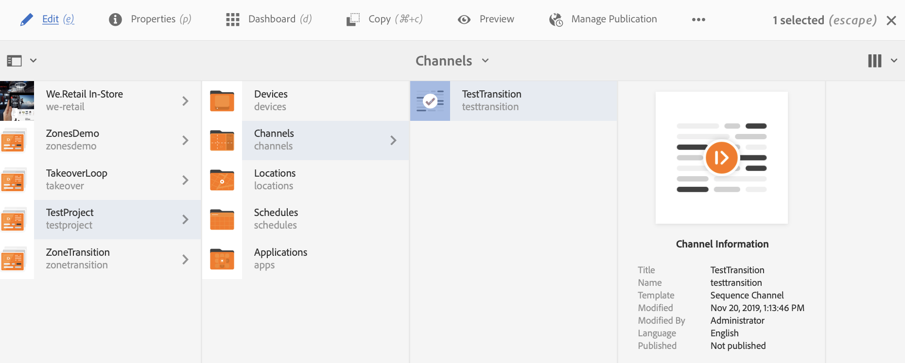

# 전환 적용 {#applying-transitions}

>[!IMPORTANT]
>이 콘텐츠는 AEM On-Premise/AMS(AEM 6.5LTS 및 AEM 6.5)에 유효합니다. AEM as a Cloud Service Screens 콘텐츠의 경우 [AEM as a Cloud Service 안내서](https://experienceleague.adobe.com/en/docs/experience-manager-cloud-service/content/screens-as-cloud-service/overview/introduction)를 참조하십시오.

이 단원에서는 서로 다른 에셋(이미지 및 비디오)과 채널에 포함된 시퀀스 사이에 **전환** 구성 요소를 적용하는 방법에 대해 설명합니다.

>[!CAUTION]
>
>**Transition** 구성 요소의 속성에 대한 자세한 내용은 [Transitions](adding-components-to-a-channel.md#transition)을 참조하세요.

## 채널에서 Assets에 전환 구성 요소 추가 {#adding-transition}

AEM Screens 프로젝트에 전환 구성 요소를 추가하려면 아래 단계를 따르십시오.

>[!NOTE]
>
>**사전 요구 사항**
>
>채널 **TestTransition**&#x200B;을(를) 사용하여 AEM Screens 프로젝트 **TestProject**&#x200B;을(를) 만듭니다. 또한 출력을 볼 위치 및 디스플레이를 설정합니다.

1. 채널 **TestTransition**(으)로 이동하고 작업 표시줄에서 **편집**&#x200B;을 클릭합니다.

   

   >[!NOTE]
   >
   >**TestTransition** 채널에 이미 몇 가지 자산(이미지 및 비디오)이 있습니다. 예를 들어 **TestTransition** 채널에는 아래와 같이 세 개의 이미지와 두 개의 비디오가 포함됩니다.

   

1. **전환** 구성 요소를 편집기로 끌어서 놓습니다.

   >[!CAUTION]
   >
   >채널의 에셋에 전환을 추가하기 전에 순차적 채널의 첫 번째 에셋 앞에 전환을 추가하지 마십시오. 채널의 첫 번째 항목은 전환이 아닌 자산이어야 합니다.

   

   >[!NOTE]
   >
   >기본적으로 **Type**&#x200B;과(와) 같은 전환 구성 요소의 속성은 **Fade**(으)로 설정되고 **Duration**&#x200B;은(는) *1600밀리초*(으)로 설정됩니다. 또한 적용 중인 에셋보다 긴 전환 지속 시간을 설정하는 것은 바람직하지 않습니다.

1. 또한 이 채널 편집기에 **포함된 시퀀스** 구성 요소(시퀀스 채널 포함)를 추가하면 마지막에 전환 구성 요소를 추가할 수 있습니다. 이렇게 하면 다음 이미지에 표시된 대로 컨텐츠가 올바른 순서로 재생됩니다.

   
