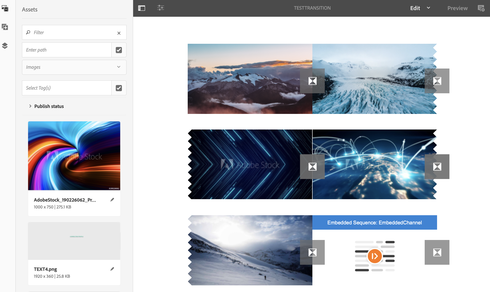

# 전환 적용 중 {#applying-transitions}

이 섹션에서는 채널에서 포함된 시퀀스와 다른 자산(이미지 및 비디오) 사이에 있는 **Transition** 구성 요소를 적용하는 방법에 대해 설명합니다.

>[!CAUTION]
>
>**전환** 구성 요소의 속성에 대해 자세히 알려면 [전환](adding-components-to-a-channel.md#transition)을 참조하십시오.

## 채널 {#adding-transition}의 자산에 전환 구성 요소 추가

아래 절차에 따라 AEM Screens 프로젝트에 전환 구성 요소를 추가하십시오.

>[!NOTE]
>
>**전제 조건**
>
>채널 **TestTransition**&#x200B;을 사용하여 AEM Screens 프로젝트 **TestProject**&#x200B;를 만듭니다. 또한 출력을 볼 위치 및 디스플레이를 설정합니다.

1. 채널 **TestTransition**&#x200B;으로 이동하고 작업 표시줄에서 **편집**&#x200B;을 클릭합니다.

   

   >[!NOTE]
   >
   >**TestTransition** 채널에는 이미 자산(이미지 및 비디오)이 거의 없습니다. 예를 들어 **TestTransition** 채널은 아래와 같이 세 개의 이미지와 두 개의 비디오를 포함합니다.

   

1. **전환** 구성 요소를 편집기에 끌어다 놓습니다.
   >[!CAUTION]
   >
   >채널의 자산에 전환을 추가하기 전에 순차적 채널의 첫 번째 자산 전에 전환을 추가하지 마십시오. 채널에서 첫 번째 항목은 전환이 아닌 자산이어야 합니다.

   

   >[!NOTE]
   >
   >기본적으로 **유형**&#x200B;과 같은 전환 구성 요소의 속성은 **페이드**&#x200B;로 설정되고 **기간**&#x200B;은 *1600ms*&#x200B;로 설정됩니다.  또한 적용 중인 자산보다 긴 전환 지속 시간을 설정하는 것은 권장되지 않습니다.

1. 또한 이 채널 편집기에 **포함된 시퀀스** 구성 요소(시퀀스 채널을 포함하는)를 추가하는 경우 아래 그림과 같이 컨텐츠가 순서대로 재생되도록 끝에 전환 구성 요소를 추가할 수 있습니다.

   

