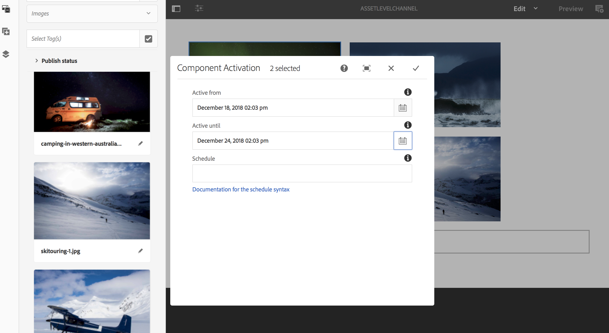

# 자산 수준 활성화 {#asset-level-scheduling}

이 페이지에서는 채널에 사용되는 자산에 대한 자산 수준 활성화를 설명합니다.

이 섹션에서는 다음 주제를 다룹니다.

* 개요
* 활성화 창
* 단일 이벤트 재생
* 자산의 되풀이 처리
   * DayParting
   * WeekParting
   * MonthParting
   * 부품 조합
* 다중 자산 활성화

>[!CAUTION]
>
>이 AEM Screens 기능은 AEM 6.3 기능 팩 3 또는 AEM 6.4 Screens 기능 팩 1을 설치한 경우에만 사용할 수 있습니다.
>
>이 Feature Pack에 액세스하려면 Adobe 지원 센터에 연락하여 액세스 권한을 요청해야 합니다. 권한이 있으면 [패키지 공유]에서 다운로드할 수 있습니다.

## 개요 {#overview}

***자산 수준 활성화*** 를 사용하면 플레이어의 로컬 시간대에 있는 예약된 기간에 대해 채널에서 특정 자산을 활성화할 수 있습니다. 이미지, 비디오, 전환, 페이지 및 포함된 채널(동적 또는 정적)에 사용할 수 있습니다.

*예를 들어* 월요일 및 수요일에 해피 시간(오후 2시~오후 5시)에만 특별 프로모션을 표시하려는 경우

이 기능을 사용하여 시작 및 종료 날짜 및 시간을 지정할 수 있을 뿐만 아니라 반복 패턴도 지정할 수 있습니다.

## 활성화 창 {#single-event-playback}

자산 수준 활성화는 자산의 속성에 액세스하는 동안 **활성화** 탭을 구성하여 수행합니다.

아래 절차에 따라 자산 수준 예약을 수행합니다.

1. 채널을 선택하고 작업 표시줄에서 **편집** 을 클릭하여 채널에서 컨텐츠를 추가하거나 편집합니다.

   

   >[!NOTE]
   >
   >방법에 대해 자세히 알아보려면
   >
   >* 프로젝트를 만들려면 [새 프로젝트 만들기](creating-a-screens-project.md)를 참조하십시오.
   >* 채널에 컨텐츠를 만들고 추가하려면 [채널 관리](managing-channels.md)를 참조하십시오.

1. **편집**&#x200B;을 클릭하여 채널 편집기를 열고 예약을 적용할 자산을 선택합니다.

   

1. 자산을 선택하고 왼쪽 위 **구성**(공구아이콘)을 클릭하여 이미지의 속성을 엽니다.

   **활성화** 탭을 클릭합니다.

   

1. **Active from** 및 **Active -** 필드를 사용하여 날짜 선택기에서 날짜를 지정할 수 있습니다.

   **활성**&#x200B;과 **활성** 날짜 및 시간을 선택하는 경우, 자산은 각각 해당 시작 날짜/시간과 종료 날짜/시간 사이에만 표시되고 루프가 발생합니다.

   

## 자산 {#handling-recurrence-in-assets}의 되풀이 처리

요구 사항에 따라 자산을 일별, 주별 또는 월별 기준으로 특정 간격으로 반복하도록 예약할 수 있습니다.

금요일 오후 1시부터 오후 10시까지 이미지만 표시한다고 가정합니다. **활성화** 탭을 사용하여 자산에 대해 원하는 반복 간격을 설정할 수 있습니다.

### 시간대 {#day-parting}

1. 자산을 선택하고 **구성**(공구아이콘)을 클릭하여 속성 대화 상자를 엽니다.

1. 시작 날짜/시간 및 종료/날짜 시간을 입력한 후 표현식 또는 자연어 텍스트 버전을 사용하여 되풀이 일정을 지정할 수 있습니다.

   >[!NOTE]
   >**Active from** 및 **Active Until** 필드를 건너뛰거나 포함하고 필요에 따라 Schedules 필드에 표현식을 추가할 수 있습니다.

1. **예약**&#x200B;에 표현식을 입력하면 특정 시간 간격에 대한 자산이 표시됩니다.

#### 일 분할 {#example-one} 표현식 예

다음 표에는 디스플레이에 채널을 지정하는 동안 예약에 추가할 수 있는 몇 가지 표현식 예가 요약되어 있습니다.

| **표현식** | **해석** |
|---|---|
| 오전 8시 이전 | 채널의 자산이 매일 오전 8시 전에 재생됩니다 |
| 오후 2시 이후 | 채널의 자산이 매일 오후 2시 이후에 재생됩니다 |
| 12시 15분 후 및 12시 45분 전 | 채널의 자산이 매일 오후 12:15 후 30분 동안 재생됩니다 |
| 12시 15분 이전 12시 45분 이후도 | 채널의 자산이 매일 오후 12:15 전에 재생되고 오후 12:45도 후에 재생됩니다 |

>[!NOTE]
>
>*am/pm* 표기법(즉, 오후 2:00) 대신 _군대 시간_ 표기법(즉, 14:00)을 사용할 수도 있습니다.

### WeekParting {#week-parting}

1. 자산을 선택하고 **구성**(공구아이콘)을 클릭하여 속성 대화 상자를 엽니다.

1. 시작 날짜/시간 및 종료/날짜 시간을 입력한 후 표현식 또는 자연어 텍스트 버전을 사용하여 되풀이 일정을 지정할 수 있습니다.

   >[!NOTE]
   >**Active from** 및 **Active Until** 필드를 건너뛰거나 포함하고 필요에 따라 Schedules 필드에 표현식을 추가할 수 있습니다.

1. **예약**&#x200B;에 표현식을 입력하면 특정 시간 간격에 대한 자산이 표시됩니다.

#### WeekParting {#example-two}에 대한 표현식 예

다음 표에는 디스플레이에 채널을 지정하는 동안 예약에 추가할 수 있는 몇 가지 표현식 예가 요약되어 있습니다.

| **표현식** | **해석** |
|---|---|
| 월,수,금 | 이 자산은 매주 월요일, 수요일, 금요일부터 채널에서 재생됩니다 |
| 월목 | 자산은 월요일부터 목요일까지 채널에서 재생됩니다 |

>[!NOTE]
>
>_약식_ 표기법(즉, 월요일,수요일,금요일) 대신 _전체_ 표기법을 사용할 수도 있습니다(예: 월,수,금).

### MonthParting {#month-parting}

1. 자산을 선택하고 **구성**(공구아이콘)을 클릭하여 속성 대화 상자를 엽니다.

1. 시작 날짜/시간 및 종료/날짜 시간을 입력한 후 표현식 또는 자연어 텍스트 버전을 사용하여 되풀이 일정을 지정할 수 있습니다.

   >[!NOTE]
   >**Active from** 및 **Active Until** 필드를 건너뛰거나 포함하고 필요에 따라 Schedules 필드에 표현식을 추가할 수 있습니다.

1. **예약**&#x200B;에 표현식을 입력하면 특정 시간 간격에 대한 자산이 표시됩니다.

#### MonthParting {#example-three}에 대한 표현식 예

다음 표에는 디스플레이에 채널을 지정하는 동안 예약에 추가할 수 있는 몇 가지 표현식 예가 요약되어 있습니다.

| **표현식** | **해석** |
|---|---|
| 2월, 5월, 8월, 11월 | 자산은 2월, 5월, 8월, 11월에 채널에서 재생됩니다 |
| 2월~7월 | 자산은 2월부터 7월 말까지 채널에서 재생됩니다 |

>[!NOTE]
>요일 및 월을 정의할 때 월/월요일 및 1월/1월과 같은 약식 및 전체 이름 표기법을 사용할 수 있습니다.

### 부품 조합 {#combined-parting}

1. 자산을 선택하고 **구성**(공구아이콘)을 클릭하여 속성 대화 상자를 엽니다.

1. 시작 날짜/시간 및 종료/날짜 시간을 입력한 후 표현식 또는 자연어 텍스트 버전을 사용하여 되풀이 일정을 지정할 수 있습니다.

   >[!NOTE]
   >**Active from** 및 **Active Until** 필드를 건너뛰거나 포함하고 필요에 따라 Schedules 필드에 표현식을 추가할 수 있습니다.

1. **예약**&#x200B;에 표현식을 입력하면 특정 시간 간격에 대한 자산이 표시됩니다.

#### 부분 조합 표현식 {#example-four} 예

다음 표에는 디스플레이에 채널을 지정하는 동안 예약에 추가할 수 있는 몇 가지 표현식 예가 요약되어 있습니다.

| **표현식** | **해석** |
|---|---|
| 월 6시 이후와 18시 이전, 1월 3월 수 | 자산 은 1월부터 3월 말까지 매주 월요일, 수요일 오전 6시부터 오후 6시까지 채널에서 재생됩니다 |
| 1월 1일 오후 2:00 그리고 1월 2일 또한 1월 3일 오전 3:00 전에 3일에 | 채널의 자산은 1월 1일 오후 2시 이후에 재생되며, 1월 2일에는 하루 종일 1월 3일 오전 3시까지 계속 재생됩니다 |
| 1월 1일-2일 오후 2시 또한 1월 2일-3일 오전 3시 | 채널의 자산 시작 플레이어는 1월 1일 오후 2:00 이후 1월 2일 오전 3시까지 계속 재생되고 1월 2일 오후 2시에 다시 시작되고 1월 3일 오전 3시까지 계속 재생됩니다 |

>[!NOTE]
>요일 및 월을 정의할 때 월/월요일 및 1월/1월과 같은 약식 및 전체 이름 표기법을 사용할 수 있습니다.  또한 *am/pm* 표기법(즉, 오후 2:00) 대신 _군대 시간_ 표기법(즉, 14:00)을 사용할 수도 있습니다.

## 다중 자산 활성화 {#multi-asset-scheduling}

>[!CAUTION]
>
>**다중 자산 활성화** 기능은 AEM 6.3 기능 팩 5 또는 AEM 6.4 기능 팩 3을 설치한 경우에만 사용할 수 있습니다.

***다중 자산*** 활성화 사용자는 여러 자산을 선택하고 선택한 모든 자산에 재생 일정을 적용할 수 있습니다.

### 전제 조건 {#prerequisites}

자산에 대해 다중 자산 수준 활성화를 사용하려면 시퀀스 채널로 AEM Screens 프로젝트를 만드십시오. 예를 들어 다음 사용 사례에서는 기능 구현을 보여줍니다.

* **MultiAssetDemo**(으)로 명명된 AEM Screens 프로젝트를 만듭니다.
* **MultiAssetChannel**&#x200B;이라는 이름의 채널을 만들고 아래 그림과 같이 채널에 컨텐츠를 추가합니다

아래 절차에 따라 여러 자산을 선택하고 AEM Screens 프로젝트에 대한 표시를 예약하십시오.

1. **MultiAssetChannel**&#x200B;을 선택하고 작업 표시줄에서 **편집**&#x200B;을 클릭하여 편집기를 엽니다.

   

1. 편집기에서 여러 자산을 선택하고 **활성화 편집**(왼쪽 상단 아이콘)을 클릭합니다.

   

1. **구성 요소 활성화** 대화 상자에서 **활성** 및 **활성**&#x200B;에서 날짜 및 시간을 선택합니다. 스케줄 선택을 완료하면 확인 표시 아이콘을 클릭합니다.

   

1. 다중 자산 일정이 적용되는 자산을 확인하려면 새로 고침 을 클릭합니다.

   >[!NOTE]
   >
   >다중 자산 활성화를 사용하는 자산의 오른쪽 상단 모서리에 예약 아이콘이 표시됩니다.

   

