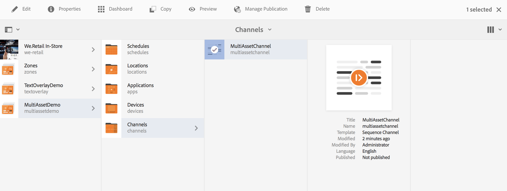

# 자산 수준 활성화 {#asset-level-scheduling}

이 페이지에서는 채널에 사용된 에셋에 대한 에셋 레벨 활성화에 대해 설명합니다.

다음 항목은 이 섹션에서 다룹니다.

* 개요
* 활성화 창
* 단일 이벤트 재생
* Assets에서 반복 처리
   * 시간대 지정
   * 주 분할
   * 월 분할
   * 파티션의 조합
* 다중 자산 활성화
* 범용 시작 시간에 대한 전역 재정의

<!-- REFERS TO ARCHIVED VERSIONS THAT ADOBE NO LONGER SUPPORTS>
>[!CAUTION]
>
>This AEM Screens functionality is only available if you have installed AEM 6.3 Feature Pack 3 or AEM 6.4 Screens Feature Pack 1.
>
>To get access to this Feature Pack, contact Adobe Support and request access. When you have permission, you can download it from Package Share. -->

## 개요 {#overview}

***자산 수준 활성화***&#x200B;를 사용하면 플레이어의 로컬 시간대 내에서 예약된 시간대 동안 채널의 특정 자산을 활성화할 수 있습니다. 이 기능은 이미지, 비디오, 전환, 페이지 및 포함된 채널(동적 또는 정적)에 사용할 수 있습니다.

*예를 들어*&#x200B;월요일 및 수요일에 해피아워(오후 2시~오후 5시) 동안만 특별 프로모션을 표시할 수 있습니다.

이 기능을 사용하면 시작 및 종료 날짜 및 시간을 지정할 수 있을 뿐만 아니라 반복 패턴도 지정할 수 있습니다.

## 활성화 창 {#single-event-playback}

자산 수준 활성화는 자산의 속성에 액세스하는 동안 **활성화** 탭을 구성하여 수행됩니다.

자산 수준 예약을 수행하려면 아래 단계를 따르십시오.

1. 채널을 클릭한 다음 작업 표시줄에서 **편집**&#x200B;을 클릭합니다.

   

   >[!NOTE]
   >
   >방법 자세히 알아보기
   >
   >* 프로젝트를 만듭니다. [새 프로젝트 만들기](creating-a-screens-project.md)를 참조하십시오.
   >* 컨텐츠를 만들고 채널에 추가합니다. [채널 관리](managing-channels.md)를 참조하십시오.

1. 채널 편집기를 열고 일정을 적용할 자산을 클릭하려면 **편집**&#x200B;을 클릭하세요.

   

1. 자산을 클릭한 다음 왼쪽 상단 **구성**(렌치 아이콘)을 클릭합니다.

   **활성화** 탭을 클릭합니다.

   

1. **활성 시작** 및 **활성 종료** 필드를 사용하여 날짜 선택기에서 날짜를 지정할 수 있습니다.

   **활성 시작** 및 **활성 종료** 날짜 및 시간을 클릭하면 자산이 각각 해당 시작 날짜/시간과 종료 날짜/시간 사이에만 표시되고 반복됩니다.

   

## Assets에서 반복 처리 {#handling-recurrence-in-assets}

요구 사항에 따라 매일, 매주 또는 매월 특정 간격으로 자산이 반복되도록 예약할 수 있습니다.

금요일 오후 1시부터 10시까지만 이미지를 표시한다고 가정합니다. **활성화** 탭을 사용하여 에셋에 대해 원하는 반복 간격을 설정할 수 있습니다.

### 시간대 지정 {#day-parting}

1. 자산을 클릭하고 **구성**(렌치 아이콘)을 클릭하여 속성 대화 상자를 엽니다.

1. 시작 날짜/시간 및 종료/날짜 시간을 입력한 후 표현식 또는 자연어 텍스트 버전을 사용하여 반복 일정을 지정할 수 있습니다.

   >[!NOTE]
   >요구 사항에 따라 **활성 시작** 및 **활성 끝** 필드를 건너뛰거나 포함하고 [일정] 필드에 식을 추가할 수 있습니다.

1. **일정**&#x200B;에 식을 입력하면 특정 시간 간격 동안 자산이 표시됩니다.

#### 요일 분할에 대한 표현식 예 {#example-one}

다음 표에는 디스플레이에 채널을 할당하는 동안 일정에 추가할 수 있는 몇 가지 표현식 예가 요약되어 있습니다.

| **식** | **해석** |
|---|---|
| 오전 8시 이전 | 채널의 에셋은 매일 오전 8시 이전에 재생됩니다. |
| 오후 2시 이후 | 채널의 에셋은 매일 오후 2시 이후에 재생됩니다. |
| 오후 0:15 후 및 오후 0:45 전 | 채널의 에셋은 30분 동안 매일 오후 12시 15분 이후에 재생됩니다 |
| 12:15 이전 또는 12:45 이후 | 채널의 에셋은 매일 오후 12시 15분 전에 재생되고 오후 12시 45분 이후에도 재생됩니다. |

>[!NOTE]
>
>*A.M./P.M.*(오후 2:00) 대신 _군사 시간_ 표기법(14:00)을 사용할 수도 있습니다.

### 주 분할 {#week-parting}

1. 자산을 클릭한 다음 **구성**(렌치 아이콘)을 클릭합니다.

1. 시작 날짜/시간 및 종료/날짜 시간을 입력한 후 표현식 또는 자연어 텍스트 버전을 사용하여 반복 일정을 지정할 수 있습니다.

   >[!NOTE]
   >요구 사항에 따라 **활성 시작** 및 **활성 끝** 필드를 건너뛰거나 포함하고 [일정] 필드에 식을 추가할 수 있습니다.

1. **일정**&#x200B;에 식을 입력하면 특정 요일 및 시간 간격에 대한 에셋이 표시됩니다.

#### WeekParting의 표현식 예 {#example-two}

다음 표에는 디스플레이에 채널을 할당하는 동안 일정에 추가할 수 있는 몇 가지 표현식 예가 요약되어 있습니다.

| **식** | **해석** |
|---|---|
| `Mon,Wed,Fri` | 자산이 월요일, 수요일, 금요일부터 채널에서 재생됩니다. |
| `Mon-Thu` | 자산이 월요일부터 목요일까지 채널에서 재생됩니다. |

>[!NOTE]
>
>_짧게_(`Mon,Wed,Fri`) 대신 _전체_ 표기법(`Monday,Wednesday,Friday`)을 사용할 수도 있습니다.

### 월 분할 {#month-parting}

1. 자산을 클릭한 다음 **구성**(렌치 아이콘)을 클릭합니다.

1. 시작 날짜/시간 및 종료/날짜 시간을 입력한 후 표현식 또는 자연어 텍스트 버전을 사용하여 반복 일정을 지정할 수 있습니다.

   >[!NOTE]
   >요구 사항에 따라 **활성 시작** 및 **활성 끝** 필드를 건너뛰거나 포함하고 [일정] 필드에 식을 추가할 수 있습니다.

1. **일정**&#x200B;에 식을 입력하면 특정 요일 및 시간 간격에 대한 에셋이 표시됩니다.

#### MonthParting의 표현식 예 {#example-three}

다음 표에는 디스플레이에 채널을 할당하는 동안 일정에 추가할 수 있는 몇 가지 표현식 예가 요약되어 있습니다.

| **식** | **해석** |
|---|---|
| `on February,May,August,November` | 에셋은 2월, 5월, 8월, 11월에 채널에서 재생됩니다 |
| `on February-July` | 에셋이 2월부터 7월 말까지 채널에서 재생됩니다. |

>[!NOTE]
>요일 및 월을 정의할 때 월/월요일 및 1월/1과 같은 약식 및 전체 이름 표기를 모두 사용할 수 있습니다.

### 파티션의 조합 {#combined-parting}

1. 자산을 클릭한 다음 **구성**(렌치 아이콘)을 클릭합니다.

1. 시작 날짜/시간 및 종료/날짜 시간을 입력한 후 표현식 또는 자연어 텍스트 버전을 사용하여 반복 일정을 지정할 수 있습니다.

   >[!NOTE]
   >요구 사항에 따라 **활성 시작** 및 **활성 끝** 필드를 건너뛰거나 포함하고 [일정] 필드에 식을 추가할 수 있습니다.

1. **일정**&#x200B;에 식을 입력하면 특정 요일 및 시간 간격에 대한 에셋이 표시됩니다.

#### 분할 영역 조합에 대한 표현식 예 {#example-four}

다음 표에는 디스플레이에 채널을 할당하는 동안 일정에 추가할 수 있는 몇 가지 표현식 예가 요약되어 있습니다.

| **식** | **해석** |
|---|---|
| `after 6:00 and before 18:00 on Mon,Wed of Jan-Mar` | 자산은 1월부터 3월 말까지 월요일과 수요일 오전 6시에서 오후 6시 사이에 채널에서 재생됩니다 |
| `on the 1st day of January after 2:00 P.M. also on the 2nd day of January also on the 3rd day of January before 3:00 A.M.` | 채널의 에셋은 1월 1일 오후 2시 이후에 재생되기 시작하고 1월 2일 하루 종일 1월 3일 오전 3시까지 계속 재생됩니다 |
| `on the 1-2 days of January after 2:00 P.M. also on the 2-3 days of January before 3:00 A.M.` | 채널의 에셋은 1월 1일 오후 2시 이후에 플레이어를 시작하여 1월 2일 오전 3시까지 계속 재생되고, 1월 2일 오후 2시에 다시 시작되어 1월 3일 오전 3시까지 계속 재생됩니다 |

>[!NOTE]
>요일 및 월을 정의할 때 월/월요일 및 1월/1과 같은 약식 및 전체 이름 표기를 모두 사용할 수 있습니다. 또한 *A.M./P.M.*(오후 2:00) 대신 _군사 시간_ 표기법(14:00)을 사용할 수도 있습니다.

## 다중 자산 활성화 {#multi-asset-scheduling}

<!--
>[!CAUTION]
>
>The **Multi-asset Activation** feature is only available if you have installed AEM 6.3 Feature Pack 5 or AEM 6.4 Feature Pack 3. -->

***다중 자산 활성화***&#x200B;를 통해 사용자는 여러 자산을 클릭하고 재생 일정을 선택한 모든 자산에 적용할 수 있습니다.

### 사전 요구 사항 {#prerequisites}

에셋에 대해 다중 에셋 수준 활성화를 사용하려면 시퀀스 채널을 사용하여 AEM Screens 프로젝트를 만듭니다. 예를 들어 다음 사용 사례에서는 기능의 구현을 보여줍니다.

* 제목이 **MultiAssetDemo**&#x200B;인 AEM Screens 프로젝트를 만듭니다.
* 아래 그림과 같이 제목이 **MultiAssetChannel**&#x200B;인 채널을 만들고 채널에 콘텐츠를 추가합니다.

아래 단계에 따라 여러 자산을 클릭하고 AEM Screens 프로젝트에서 해당 표시를 예약합니다.

1. **MultiAssetChannel**&#x200B;을 클릭한 다음 작업 표시줄에서 **편집**&#x200B;을 클릭합니다.

   

1. 편집기에서 여러 자산을 클릭한 다음 **활성화 편집**(왼쪽 상단 아이콘)을 클릭합니다.

   

1. **구성 요소 활성화** 대화 상자에서 **활성 시작** 및 **활성 종료**&#x200B;의 날짜 및 시간을 클릭합니다. 일정 선택을 마치면 확인 표시 아이콘을 클릭합니다.

   

1. 새로 고침 을 클릭하여 다중 자산 일정이 적용되는 자산을 확인합니다.

   >[!NOTE]
   >
   >다중 자산 활성화가 있는 자산의 오른쪽 상단 모서리에 예약 아이콘이 표시됩니다.

   

## 범용 시작 시간에 대한 전역 재정의 {#global-override-scheduling}

***범용 시작 시간에 대한 전역 재정의***&#x200B;은(는) 콘텐츠 작성자가 특정 시간을 기준으로 이미지 또는 비디오 에셋의 재생을 정의할 수 있는 설정입니다. 개별 플레이어의 시간/시간대 설정은 사용되지 않습니다.

일반적으로 주어진 플레이어의 로컬 시간이 재생을 결정합니다. 그러나 전역 재정의를 사용하면 특정 범용 시작 시간을 사용하여 에셋 재생을 시작할 수 있습니다.

따라서 콘텐츠 작성자는 특정 에셋의 재생을 지정할 수 있습니다. 할당된 컨텐츠가 있는 플레이어의 로컬 시계에 관계없이 특정 날짜/시간에 발생하도록 할 수 있습니다.

자산의 속성에 액세스하는 동안 **활성화** 탭을 구성하여 ***범용 시작 시간에 대한 전역 재정의***&#x200B;를 수행합니다. 자산 예약에 대한 전역 재정의를 수행하려면 아래 단계를 따르십시오.

1. 채널을 클릭한 다음 작업 표시줄에서 **편집**&#x200B;을 클릭하여 채널의 콘텐츠를 추가하거나 편집할 수 있습니다.

   

1. **편집**&#x200B;을 클릭합니다.
1. 채널 편집기에서 일정을 적용할 자산을 클릭합니다.

   

1. 전역 재정의의 경우 자산의 **표준 시간대 재정의** 섹션에 활성화 시간을 입력하십시오. 이 영역에 아무 것도 입력하지 않으면 적용된 시간대가 플레이어의 시간대입니다.

