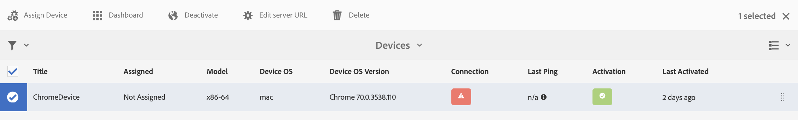

# AEM Screens에서 작성자 및 게시 구성 {#configuring-author-and-publish-in-aem-screens}

이 페이지에서는 다음 항목을 강조합니다.

* **작성자 및 게시 인스턴스 구성**
* **게시 토폴로지 설정**
* **게시 관리: 작성자에서 게시로 콘텐츠 업데이트를 장치에 전달**

## 사전 요구 사항 {#prerequisites}

작성자 및 게시 서버를 시작하기 전에 다음 사항에 대한 사전 지식이 있어야 합니다.

* **AEM 토폴로지**
* **AEM Screens 프로젝트 만들기 및 관리**
* **장치 등록 프로세스**

>[!NOTE]
>
>이 AEM Screens 기능은 AEM 6.4 Screens 기능 팩 2를 설치한 경우에만 사용할 수 있습니다. 이 기능 팩에 액세스하려면 Adobe 지원에 문의하고 액세스를 요청해야 합니다. 권한이 있으면 패키지 공유에서 다운로드할 수 있습니다.

>[!IMPORTANT]
>
>Dispatcher에 게시 인스턴스를 두 개 이상 사용하려면 Dispatcher에서 dispatcher.any 파일을 업데이트해야 합니다. 다음을 참조하십시오 [고정 세션 활성화](dispatcher-configurations-aem-screens.md#enable-sticky-session) 을 참조하십시오.

## 작성자 및 게시 인스턴스 구성 {#configuring-author-and-publish-instances}

>[!NOTE]
>
>작성자 및 게시 아키텍처 개요, 그리고 콘텐츠가 AEM 작성자 인스턴스에서 작성된 다음 여러 게시 인스턴스로 순방향 복제되는 방법에 대한 자세한 내용은 을 참조하십시오. [아키텍처 개요 작성 및 게시](author-publish-architecture-overview.md).

다음 섹션에서는 작성자 및 게시 토폴로지에서 복제 에이전트를 설정하는 방법에 대해 설명합니다.

작성자 한 명과 게시 인스턴스 두 개를 호스팅하는 간단한 예를 설정할 수 있습니다.

* 작성자 —> localhost:4502
* Publish 1(pub1) —> localhost:4503
* Publish 2 (pub2) —> localhost:4504

## 작성자에 대한 복제 에이전트 설정 {#setting-replication-agents}

복제 에이전트를 만들려면 표준 복제 에이전트를 만드는 방법을 배워야 합니다.

Screens에 필요한 복제 에이전트는 다음과 같습니다.

1. **기본 복제 에이전트 ***(다음으로 지정됨)*** 표준 복제 에이전트**)
1. **화면 복제 에이전트**
1. **역복제 에이전트**

### 1단계: 기본 복제 에이전트 생성 {#step-creating-a-default-replication-agent}

기본 복제 에이전트를 만들려면 아래 단계를 따르십시오.

1. AEM 인스턴스 —> hammer 아이콘 —> 으로 이동합니다. **작업** —> **구성**.

   

1. 다음 항목 선택 **복제** 왼쪽 탐색 트리에서.

   

1. 다음 항목 선택 **작성자의 에이전트** 다음에서 **복제** 폴더 및 클릭 **신규** 새 표준 복제 에이전트를 만듭니다.

   

1. 다음을 입력합니다. **제목** 및 **이름** 복제 에이전트를 생성하고 **만들기**.

   

1. 복제 에이전트를 마우스 오른쪽 단추로 클릭하고 **열기** 설정을 편집합니다.

   

1. 클릭 **편집** 을(를) 열려면 **에이전트 설정** 세부 정보를 입력하는 대화 상자

   >[!NOTE]
   >
   >사용자가 확인해야 함 **활성화됨** 복제 에이전트를 사용하도록 설정합니다. 기본, 화면 및 역방향 복제 에이전트에서 이 옵션을 선택해야 합니다.

   

1. 다음 위치로 이동 **전송** 탭을 클릭하고 다음을 입력합니다. **URI**, **사용자** 및 **암호**.

   

   >[!NOTE]
   >
   >기존 기본 복제 에이전트를 복사하고 이름을 변경할 수도 있습니다.

#### 표준 복제 에이전트 생성  {#creating-standard-replication-agents}

1. pub1용 표준 복제 에이전트를 만듭니다(기본 에이전트는 이미 구성되어 있어야 함)(예: *https://&lt;hostname>:4503/bin/receive?sling:authRequestLogin=1*)
1. pub2용 표준 복제 에이전트를 만듭니다. pub1용 복제 에이전트를 복사하고 전송 구성에서 포트를 변경하여 pub2에 사용할 전송을 업데이트할 수 있습니다. (예: *https://&lt;hostname>:4504/bin/receive?sling:authRequestLogin=1*)

#### Screens 복제 에이전트 만들기 {#creating-screens-replication-agents}

1. pub1용 screens 복제 에이전트를 만듭니다. 기본적으로 포트 4503을 가리키는 Screens 복제 에이전트라는 이름의 에이전트가 있습니다. 활성화해야 합니다.
1. pub2용 screens 복제 에이전트를 만듭니다. pub1용 Screens 복제 에이전트를 복사하고 pub2용 4504를 가리키도록 포트를 변경합니다.

   >[!NOTE]
   >Screens 복제 에이전트를 구성하는 방법은 다음을 참조하십시오. [Screens 복제 에이전트 구성](https://experienceleague.adobe.com/docs/experience-manager-screens/user-guide/administering/configure-screens-replication.html?lang=en).

#### Screens 역방향 복제 에이전트 만들기 {#creating-screens-reverse-replication-agents}

1. pub1에 대한 역방향 복제 에이전트를 만듭니다.
1. pub2에 대한 역방향 복제 에이전트를 만듭니다. 전송 구성에서 포트를 변경하여 pub1에 대한 역방향 복제 에이전트를 복사하고 pub2에 사용할 전송을 업데이트할 수 있습니다.

## 게시 토폴로지 설정 {#setting-up-publish-topology}

### 1단계: Apache Sling Oak 기반 검색 구성 {#step-configure-apache-sling-oak-based-discovery}

토폴로지의 모든 게시 인스턴스에 대해 Apache Sling Oak 기반 검색 설정

각 게시 인스턴스의 경우:

1. 다음으로 이동 `https://<host>:<port>/system/console/configMgr`
1. 선택 **Apache Sling Oak 기반 검색 서비스** 구성.
1. 토폴로지 커넥터 URL 업데이트: 다음과 같은 모든 게시 인스턴스의 URL을 추가합니다.
   * `https://publish:4503/libs/sling/topology/connector`
   * `https://publish:4504/libs/sling/topology/connector`
1. **토폴로지 커넥터 허용 목록**: 모든 게시 인스턴스를 포함하는 IP 또는 서브넷에 적응합니다. 포트 번호 없이 모든 게시 인스턴스의 IP/호스트 이름을 화이트리스트에 추가해야 합니다.

1. 사용 **로컬 루프 자동 중지**

각 게시 인스턴스에 대해 구성이 동일해야 하며 자동 중지 로컬 루프가 무한 루프를 방지합니다.

#### 2단계: 게시 토폴로지 확인 {#step-verify-publish-topology}

게시 인스턴스의 경우 다음 위치로 이동합니다. `https://:/system/console/topology`. 아래 토폴로지에 표시된 각 게시 인스턴스가 표시됩니다. **나가는 토폴로지 커넥터**.

#### 3단계: ActiveMQ Artemis 클러스터 설정 {#step-setup-activemq-artemis-cluster}

이 단계에서는 ActiveMQ Artemis 클러스터에 대한 암호화된 암호를 만들 수 있습니다.
토폴로지에 있는 모든 게시 인스턴스의 클러스터 사용자와 암호가 동일해야 합니다. ActiveMQ Artemis 구성의 암호를 암호화해야 합니다. 각 인스턴스에는 자체 암호화 키가 있으므로 암호화 지원을 사용하여 암호화된 암호 문자열을 만들어야 합니다. 그런 다음 암호화된 암호가 ActiveMQ에 대한 OSGi 구성에서 사용됩니다.

각 게시 인스턴스에서 다음을 수행합니다.

1. OSGi 콘솔에서 다음 위치로 이동합니다. **기본** —> **암호화 지원** (`https://&lt;host&gt;:&lt;port&gt;/system/console/crypto`).
1. 원하는 일반 텍스트 암호(모든 인스턴스에 대해 동일함)를 입력합니다. **일반 텍스트**
1. 클릭 **Protect**.
1. 값 복사 **보호된 텍스트** 메모장 또는 텍스트 편집기에 연결합니다. 이 값은 ActiveMQ에 대한 OSGi 구성에서 사용됩니다.

각 게시 인스턴스에는 기본적으로 고유한 암호화 키가 있으므로 각 게시 인스턴스에서 이 단계를 수행하고 다음 구성을 위해 고유한 키를 저장해야 합니다.

>[!NOTE]
>
>암호는 중괄호로 시작하고 끝나야 합니다. 예:
>`{1ec346330f1c26b5c48255084c3b7272a5e85260322edd59119828d1fa0a610e}`

#### 4단계: ActiveMQ Artemis 클러스터 활성화 {#step-activate-activemq-artemis-cluster}

각 게시 인스턴스에서 다음을 수행합니다.

1. OSGi 구성 관리자로 이동합니다. `https://&lt;host&gt;:&lt;port&gt;/system/console/configMgr`
1. 선택 **Apache ActiveMQ Artemis JMS 공급자** 구성
1. 다음 내용을 업데이트합니다.

   * ***클러스터 암호***: 각 인스턴스당 이전 단계의 암호화된 값 사용
   * ***주제***: `{name: 'commands', address: 'com.adobe.cq.screens.commands', maxConsumers: 50}`

#### ActiveMQ Artemis 클러스터 확인 {#verify-activemq-artemis-cluster}

각 게시 인스턴스에서 아래 단계를 수행합니다.

1. OSGi 콘솔 -> 메인 > ActiveMQ 아르테미스 로 이동합니다. `https://localhost:4505/system/console/mq`.
1. 클러스터 정보 > 토폴로지 > 노드=2, 멤버=2에서 다른 인스턴스의 포트를 확인하고 확인합니다.
1. 테스트 메시지 보내기(Broker Information 아래 화면 상단)
1. 필드에 다음 변경 사항을 입력합니다.

   1. **대상**: /com.adobe.cq.screens/devTestTopic
   1. **텍스트**: 헬로 월드
   1. 각 인스턴스의 error.log를 보고 클러스터에서 메시지가 전송되고 수신되었는지 확인합니다

>[!NOTE]
>
>이전 단계에서 구성을 저장한 후 OSGi 콘솔로 이동하는 데 몇 초 정도 걸릴 수 있습니다. 자세한 내용은 error.log를 참조하십시오.

예를 들어 다음 이미지는 ActiveMQ Artemis Server의 성공적인 구성 시 표시됩니다.

에서 다음 구성이 표시되지 않는 경우 */system/console/mq*&#x200B;를 클릭한 다음 로 이동합니다. */system/console/mq* 및 클릭 **다시 시작** 브로커를 다시 시작합니다.

#### 레퍼러 헤더 요구 사항 제거 {#remove-referrer-header-requirement}

각 게시 인스턴스의 단계를 따릅니다.

1. 다음 위치로 이동 **OSGi 콘솔** > **구성 관리자**
1. 선택 **Apache Sling Referrer 필터**
1. 구성 및 업데이트 **빈 항목 허용 확인**

### 작성자 및 게시 인스턴스 구성 {#configuring-author-and-publish-instance}

게시 토폴로지를 설정한 후에는 실제 구현 결과를 보려면 작성자 및 게시 인스턴스를 구성해야 합니다.

>[!NOTE]
>
>**전제 조건**
>
>이 예제를 시작하려면 새 AEM Screens 프로젝트를 만든 다음 프로젝트에서 위치, 표시 및 채널을 만듭니다. 채널에 콘텐츠를 추가하고 디스플레이에 채널을 할당합니다.

#### 1단계: AEM Screens 플레이어 시작(장치) {#step-starting-an-aem-screens-player-device}

1. 별도의 브라우저 창을 시작합니다.
1. 를 사용하여 스크린 플레이어로 이동 *웹 브라우저*, 즉,`https://localhost:4502/content/mobileapps/cq-screens-player/firmware.html` 또는 AEM Screens 앱을 시작합니다. 장치를 열면 장치의 상태가 등록되지 않은 것으로 표시됩니다.

>[!NOTE]
>
>다운로드한 AEM Screens 앱 또는 웹 브라우저를 사용하여 AEM Screens 플레이어를 열 수 있습니다.

#### 2단계: 작성자에 장치 등록 {#step-registering-a-device-on-author}

1. 다음으로 이동 `https://localhost:4502/screens.html/content/screens/we-retail` 또는 프로젝트를 선택하고 장치 > 장치 관리자로 이동합니다.
1. 선택 **장치 등록**.
1. 클릭 **장치 등록** 디바이스를 봅니다.
1. 등록할 장치를 선택하고 **장치 등록**.
1. 등록 코드를 확인하고 **유효성 검사**.
1. 장치의 제목을 입력하고 클릭 **등록**.

#### 3단계: 표시할 장치 할당 {#step-assigning-the-device-to-display}

1. 클릭 **디스플레이 할당** 이전 단계의 대화 상자에서 가져올 수 있습니다.
1. 에서 채널의 표시 경로 선택 **위치** 폴더를 삭제합니다.
1. 클릭 **할당**.
1. 클릭 **완료** 프로세스를 완료하면 장치가 할당됩니다.

플레이어를 확인하면 채널에 추가한 콘텐츠가 표시됩니다.

#### 4단계: 게시 인스턴스에 장치 구성 게시 {#step-publishing-device-configuration-to-publish-instances}

**장치 확인**

장치 사용자를 복제하려면 아래 단계를 따르십시오.

1. 사용자 관리 페이지로 이동합니다(예: `https://localhost:4502/useradmin`
1. 검색 **screens-devices-master** 그룹
1. 그룹을 마우스 오른쪽 단추로 클릭하고 **활성화**

>[!CAUTION]
>
>작성자 작업에서 사용하는 시스템 사용자이므로 작성자-publish-screens-service를 활성화하지 마십시오.

장치 관리 콘솔에서 장치를 활성화할 수도 있습니다. 아래 단계를 따르십시오.

1. Screens 프로젝트로 이동 —> **장치**.
1. 클릭 **장치 관리자** 작업 표시줄에서
1. 장치를 선택하고 **활성화** 아래 그림과 같이 작업 표시줄에서 을 선택합니다.

>[!NOTE]
>
>또는 장치를 활성화한 후 을 클릭하여 서버 URL을 편집하거나 업데이트할 수도 있습니다. **서버 URL 편집** 아래 그림과 같이 작업 표시줄에서 을 선택하면 변경 사항이 AEM Screens 플레이어에 전파됩니다.

### 게시 확인 목록 {#publishing-check-list}

다음은 게시 검사 목록을 요약한 것입니다.

* *화면 장치 사용자* - AEM 사용자로 저장되며 **도구** > **보안** > **사용자**. 사용자에게 &quot;screens&quot; 접두사에 긴 직렬화된 문자열이 붙습니다.

* *프로젝트* - AEM Screens 프로젝트
* *위치* - 장치가 연결된 위치입니다.
* *채널* - 위치에 표시 중인 하나 이상의 채널
* *예약* - 일정을 사용하는 경우 게시되는지 확인
* *위치, 일정 및 채널 폴더* - 해당 리소스가 폴더 내에 있는 경우.

작성자/게시 동작을 확인하려면 아래 단계를 따르십시오.

1. 작성자 인스턴스에서 일부 채널 콘텐츠 업데이트
1. 수행 **게시 관리** 모든 게시 인스턴스에 새 변경 사항을 게시하려면
1. 누르기 **활성화** 에서 장치를 활성화하려면 **장치 관리자**
1. **URL 편집** 작성자 인스턴스 URL에서 게시 인스턴스 URL 중 하나로
1. 업데이트된 채널 콘텐츠가 AEM Screens 플레이어에 표시되는지 확인합니다
1. 다른 게시 인스턴스를 사용하여 이 단계를 반복합니다

#### 5단계: 관리 패널에서 게시 인스턴스로 장치 지정 {#step-pointing-the-device-to-publish-instance-in-the-admin-panel}

1. Screens 플레이어에서 관리자 UI를 보고 왼쪽 상단 모서리에서 을 길게 눌러 터치 사용 AEM Screens 플레이어에서 또는 마우스를 사용하여 관리자 메뉴를 엽니다.
1. 다음을 클릭합니다. **구성** 사이드 패널의 옵션입니다.
1. 에서 작성자 인스턴스를 게시 인스턴스로 변경 **서버**.

AEM Screens 플레이어에서 변경 사항을 봅니다.

또는 다음 단계를 사용하여 장치 관리 콘솔에서 서버 URL을 업데이트/편집할 수도 있습니다.

1. AEM Screens 프로젝트로 이동하여 **장치** 폴더를 삭제합니다.
1. 클릭 **장치 관리자** 작업 표시줄에서
1. 장치를 선택하고 **서버 URL 편집** 아래 그림과 같이 작업 표시줄에서 을 선택하면 변경 사항이 AEM Screens 플레이어에 전파됩니다.

다음 **게시 관리** 기능을 사용하면 작성자에서 장치로 게시할 컨텐츠 업데이트를 전달할 수 있습니다. 전체 AEM Screens 프로젝트에 대한 콘텐츠 또는 채널, 위치, 장치, 애플리케이션 또는 일정 중 하나에 대한 콘텐츠만 게시/게시 취소할 수 있습니다. 이 기능에 대한 자세한 내용은 [온디맨드 콘텐츠 업데이트](on-demand-content.md).

## 문제 해결 팁 {#troubleshoot-tips}

작성자/게시 설정과 관련된 FAQ에 대한 답변을 보려면 아래 섹션을 따르십시오.

### 초기 등록 및 할당 후에 https에서 http로 리디렉션을 추가하는 방법 {#add-redirect}

**솔루션**
활성화 설정 `Proxy/Load Balancer Connection in the Jetty configuration` 끝 `true`.

### 외부에 있는 에셋으로 오프라인 콘텐츠 및 플레이어 다운로드 문제를 업데이트하는 방법 `/content/dam/projects/<project>`? {#update-offline-content}

**솔루션**
모두를 위한 bulk-offline-update-screens-service 사용자 및 screens-devices-master 그룹에 대한 읽기 권한 부여 `/content/dam` 또는 더 제한적으로 사용하려는 경우 사용할 특정 에셋입니다.

### Screens 복제 에이전트 오류를 해결하는 방법 {#replication-agent}

**솔루션**
에이전트 구성에서 역방향 복제에 사용 옵션을 선택하지 않았는지 확인합니다. Screens 복제 에이전트는 역방향 복제 에이전트로 사용할 수 없으며, 이 기능의 범위는 장치 명령을 작성자에서 게시로 전달하는 것입니다.