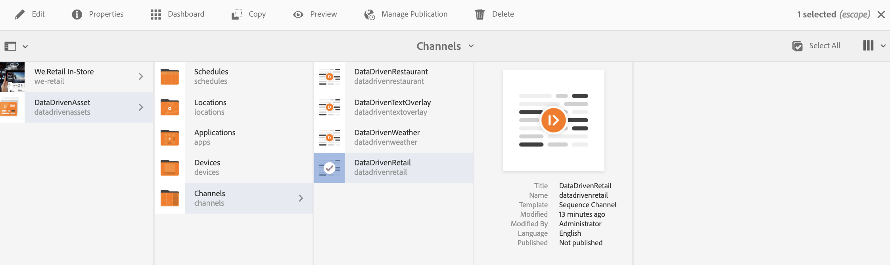

# 데이터 트리거를 사용하여 작성 {#authoring-with-data-triggers}

이 섹션에서는 채널에서 타깃팅을 활성화하는 방법을 설명합니다.

>[!IMPORTANT]
> AEM Screens 채널에서 데이터 트리거를 지원하는 최소 버전은 AEM 6.4.3 Feature Pack 3입니다.

## 전제 조건 {#prereqs}

아래 단계에 따라 채널에서 타깃팅을 활성화하기 전에 AEM Screens에서 [ContextHub 및 AEM Screens의 타깃팅을 이해하는 데 필요한](configuring-context-hub.md) 구성 주요 약관에 대해 알아야 합니다.

>[!IMPORTANT]
> AEM Screens 채널에서 타깃팅을 활성화하기 전에 ContextHub 구성을 이해하고 설정하는 것이 좋습니다.

자세한 내용은 아래 링크를 참조하십시오.

1. **[데이터 저장소 설정](configuring-context-hub.md)**
1. **[고객 세분화 설정](configuring-context-hub.md)**

이전 단계를 완료하면 채널에서 타깃팅을 활성화할 수 있습니다.

## 데이터 트리거를 사용한 작성 개요 {#author-targeting}

>[!VIDEO](https://video.tv.adobe.com/v/31921)

## AEM Screens 채널에서 타깃팅 활성화 {#enabling-targeting}

채널에서 타깃팅을 활성화하려면 아래 절차를 따르십시오.

1. AEM Screens 채널 중 하나로 이동합니다. 다음 단계는 AEM Screens 채널에서 **만든 DataDrivenRetail** (시퀀스 채널) *을* 사용하여 타깃팅을 활성화하는 방법을 보여줍니다.

1. 채널 DataDrivenRetail **을** 선택하고 작업 **표시줄에서** 속성을 클릭합니다.

   

1. 개인화 **탭을 선택하여** ContextHub 구성을 설정합니다.

   1. ContextHub 경로를 **** libs **** 설정 **>** 설정 **> clouddefault** > DefaultConfigurationsBehance ContextBehaviorClickHub SelectSelect로 **** **** ****&#x200B;선택합니다.

   1. 세그먼트 경로를 ************ conf로 **선택합니다.** 소매 **설정 >** wcm > wcm **** ****&#x200B;세그먼트 > 세그먼트세그먼트선택 을 클릭합니다.

   1. 저장 **및 닫기를 클릭합니다**.
   >[!NOTE]
   >
   >ContextHub 및 세그먼트 경로를 사용합니다. 여기서 처음에 컨텍스트 허브 구성 및 세그먼트를 저장했습니다.

   

1. DataDrivenAssets 채널에서 **DataDrivenRetail** 을 **찾아** 선택하고 **작업** 표시줄에서 **[편집]을 클릭합니다** .

   >[!NOTE]
   >
   >모든 것을 올바르게 설정한 경우 아래 그림과 **같이** 편집기의 드롭다운에 타깃팅 옵션이 표시됩니다.

   

   >[!NOTE]
   >
   >채널에 대해 ContextHub 구성을 구성한 후에는 아래의 모든 사용 사례를 따르려면 다른 세 시퀀스 채널에 대해 1부터 4까지의 이전 단계를 따르십시오.

### 자세한 내용:사용 사례 예 {#learn-more-example-use-cases}

AEM Screens 프로젝트에 대해 ContextHub를 구성한 후에는 다른 사용 사례를 통해 데이터를 트리거한 자산이 다양한 업계에서 중요한 역할을 수행하는 방법을 파악할 수 있습니다.

1. **[소매 인벤토리 대상 활성화](retail-inventory-activation.md)**
1. **[출장 센터 온도 활성화](local-temperature-activation.md)**
1. **[숙박 예약 활성화](hospitality-reservation-activation.md)**

