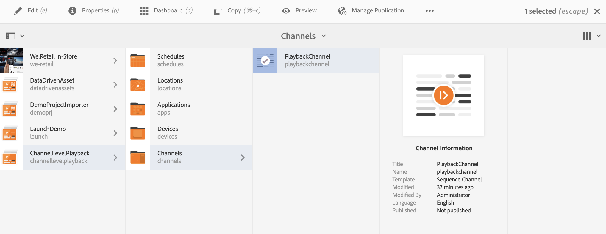
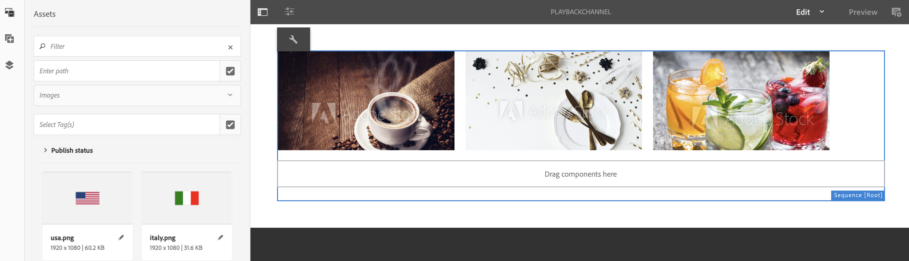

# 채널 레벨 벌크 이미지 재생 기간 {#channel-level-bulk-image-playback-duration}

## 개요 {#overview}

시퀀스 채널을 만들고 여기에 이미지를 추가하면 기본적으로 모든 이미지가 채널 레벨 구성에 정의된 재생 기간을 가정합니다. 개별 이미지는 여전히 기본값을 재정의하고 다른 재생 시간을 가질 수 있습니다. 이 기능은 특정 이미지 구성 요소의 재생 시간을 편집하여 수행됩니다.

### 사전 요구 사항 {#prerequisites}

이 기능의 구현을 시작하기 전에 먼저 이 기능의 구현을 시작하기 위한 필수 조건으로 프로젝트를 설정했는지 확인하십시오. 예:

1. AEM Screens 프로젝트 예인 **ChannelLevelPlayback**&#x200B;을(를) 만듭니다.

1. **채널** 폴더 아래에 시퀀스 채널을 **PlaybackChannel**(으)로 만듭니다.

1. **PlaybackChannel**&#x200B;에 콘텐츠를 추가합니다.

## 채널 수준 이미지 재생 기간 할당 편집 {#editing-channel-level-image-playback-duration-assignment}

아래 섹션에서는 AEM Screens 채널에서 컨텐츠 재생 기간을 편집하는 방법에 대해 설명합니다.

### 채널에서 이미지의 재생 시간 업데이트 {#updating-the-playback-duration-for-images-in-a-channel}

채널 수준 이미지 재생 기간 할당을 업데이트하는 방법을 배우려면 아래 단계를 따르십시오.

1. 시퀀스 채널 **PlaybackChannel**(으)로 이동합니다.

   

1. 작업 표시줄에서 **편집**&#x200B;을 클릭합니다.

   

1. 아래 그림과 같이 채널 편집기에 이미지를 두 개 이상 추가합니다.

   

1. 채널의 모든 이미지를 클릭하고 아래 그림과 같이 왼쪽 상단의 렌치 아이콘을 클릭하여 채널 수준 구성 대화 상자를 열 수 있습니다.

   

1. **페이지** 대화 상자가 열립니다.

   >[!NOTE]
   >기본적으로 채널의 이미지는 재생 시간(8초)으로 설정됩니다.

   

   **기간**&#x200B;을(를) 8000(밀리초)에서 3000(밀리초)까지(즉, 3초) 편집합니다. 변경 내용을 저장할 수 있도록 **페이지** 대화 상자의 오른쪽 맨 위에 있는 확인 표시를 클릭합니다.

   

### 결과 보기 {#viewing-the-result}

채널 재생 기간(이 예에서는 세 개의 이미지 모두)을 업데이트한 후 이미지가 8초(기본값)가 아닌 3초 동안 재생됩니다.

