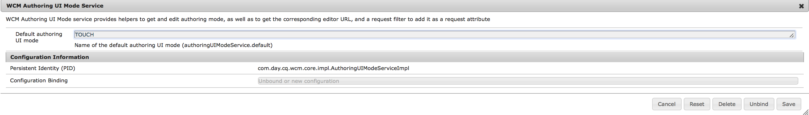

# AEM Screens 구성 및 배포 {#configuring-and-deploying-aem-screens}

이 페이지에서는 장치에 Screens 플레이어를 설치하고 구성하는 방법을 보여줍니다.

## 서버 구성 {#server-configuration}

>[!NOTE]
>
>**중요 사항**:
>
>AEM Screens 플레이어는 CSRF(Cross-Site Request Forgery) 토큰을 사용하지 않습니다. 따라서 AEM Screens에 사용할 준비가 되도록 및 AEM 서버를 구성하려면 빈 레퍼러를 허용하여 레퍼러 필터를 건너뜁니다.

## 상태 확인 프레임워크 {#health-check-framework}

Health Check 프레임워크를 사용하면 AEM Screens 프로젝트를 실행하기 전에 필요한 두 가지 구성이 설정되어 있는지 확인할 수 있습니다.

사용자는 다음 두 가지 구성 확인을 통해 AEM Screens 프로젝트를 실행할지 즉, 다음 두 필터의 상태를 확인할 수 있습니다.

1. **빈 레퍼러 허용**
2. **https**

다음 두 가지 중요한 구성이 AEM Screens에 대해 활성화되어 있는지 확인하려면 아래 단계를 따르십시오.

1. [Adobe Experience Manager Web Console Sling 상태 확인으로 이동합니다](http://localhost:4502/system/console/healthcheck?tags=screensconfigs&amp;overrideGlobalTimeout=).

   

2. **선택한 상태 검사 실행**&#x200B;을 클릭하여 위에 나열된 두 속성에 대한 유효성 검사를 실행합니다.

   두 필터가 모두 활성화되면 **화면 구성 상태 서비스**&#x200B;에 **결과**&#x200B;가 두 구성이 모두 활성화된 **OK**&#x200B;가 표시됩니다.

   

   하나 또는 둘 다 비활성화되어 있으면 아래 그림과 같이 사용자에 대한 경고가 표시됩니다.

   다음 경고는 두 필터가 모두 비활성화된 경우에 표시됩니다.
   

>[!NOTE]
>
>* **Apache Sling Referrer Filter**&#x200B;를 활성화하려면 [빈 레퍼러 요청 허용](/help/user-guide/configuring-screens-introduction.md#allow-empty-referrer-requests)을 참조하십시오.
>* **HTTP** 서비스를 활성화하려면 [Apache Felix Jetty Based HTTP Service](/help/user-guide/configuring-screens-introduction.md#allow-apache-felix-service)를 참조하십시오.

### 전제 조건 {#prerequisites}

아래 주요 사항은 AEM Screens에 사용할 수 있도록 및 AEM 서버를 구성하는 데 도움이 됩니다.

#### 빈 레퍼러 요청 허용 {#allow-empty-referrer-requests}

1. AEM 인스턴스 —> 망치 아이콘 —> **작업** —> **웹 콘솔**&#x200B;을 통해 **Adobe Experience Manager 웹 콘솔 구성**&#x200B;으로 이동합니다.

   

1. **Adobe Experience Manager 웹 콘솔 구성** 이 열립니다. sling 레퍼러를 검색합니다.

   Sling 레퍼러 속성을 검색하려면 **Command+F****Mac** 및 **Control+F****을 누르십시오.**

1. 아래 그림과 같이 **Allow Empty** 옵션을 선택합니다.

   

1. **저장** 을 클릭하여 Apache Sling 레퍼러 필터가 빈 채로 허용을 활성화합니다.

#### Apache Felix Jetty 기반 HTTP 서비스 {#allow-apache-felix-service}

1. AEM 인스턴스 —> 망치 아이콘 —> **작업** —> **웹 콘솔**&#x200B;을 통해 **Adobe Experience Manager 웹 콘솔 구성**&#x200B;으로 이동합니다.

   

1. **Adobe Experience Manager 웹 콘솔 구성** 이 열립니다. Apache Felix Jetty 기반 HTTP 서비스를 검색합니다.

   이 속성을 검색하려면 **Command+F****Mac** 및 **Control+F****을 누르십시오.**

1. 아래 그림과 같이 **ENABLE HTTP** 옵션을 선택합니다.

   

1. **저장**&#x200B;을 클릭하여 *http* 서비스를 사용하도록 설정합니다.

#### AEM Screens용 Touch UI 활성화 {#enable-touch-ui-for-aem-screens}

AEM Screens에는 터치 UI가 필요하며 Adobe Experience Manager(AEM)의 클래식 UI에서는 작동하지 않습니다.

1. *&lt;yourAuthorInstance>/system/console/configMgr/com.day.cq.wcm.core.impl.AuthoringUIModeServiceImpl*&#x200B;로 이동합니다.
1. 아래 그림과 같이 **기본 작성 UI 모드**&#x200B;가 **TOUCH**&#x200B;로 설정되어 있는지 확인합니다

또는 AuthorInstance *->* 도구(망치 아이콘) -> **작업** -> **웹 콘솔** 을 사용하여 동일한 설정을 수행하고 **WCM 작성 UI 모드 서비스**&#x200B;를 검색할 수도 있습니다.

>[!NOTE]
>
>사용자 환경 설정을 사용하는 특정 사용자에 대해 항상 클래식 UI를 활성화할 수 있습니다.

#### NOSAMPLECONTENT 실행 모드의 AEM {#aem-in-nosamplecontent-runmode}

프로덕션에서 AEM을 실행하면 **NOSAMPLECONTENT** 실행 모드가 사용됩니다. *X-Frame-Options=SAMEORIGIN* 헤더(추가 응답 헤더 섹션에서)를

`https://localhost:4502/system/console/configMgr/org.apache.sling.engine.impl.SlingMainServlet`.

AEM Screens 플레이어에서 온라인 채널을 재생하는 데 필요합니다.

#### 암호 제한 {#password-restrictions}

***DeviceServiceImpl***&#x200B;에 대한 최신 변경 사항으로 인해 암호 제한을 제거할 필요가 없습니다.

화면 장치 사용자에 대한 암호를 만드는 동안 암호 제한을 사용하도록 아래 링크에서 ***DeviceServiceImpl***&#x200B;을 구성할 수 있습니다.

`https://localhost:4502/system/console/configMgr/com.adobe.cq.screens.device.impl.DeviceService`

아래 절차에 따라 ***DeviceServiceImpl***&#x200B;을 구성하십시오.

1. AEM 인스턴스 —> 망치 아이콘 —> **작업** —> **웹 콘솔**&#x200B;을 통해 **Adobe Experience Manager 웹 콘솔 구성**&#x200B;으로 이동합니다.

1. **Adobe Experience Manager 웹 콘솔 구성** 이 열립니다. *deviceservice*&#x200B;를 검색합니다. 속성을 검색하려면 macOS의 경우 **Command+F** 및 Microsoft Windows의 경우 **Control+F**&#x200B;를 누르십시오.

#### Dispatcher 구성 {#dispatcher-configuration}

AEM Screens 프로젝트에 대한 Dispatcher를 구성하는 방법에 대해 알려면 [AEM Screens 프로젝트에 대한 Dispatcher 구성](dispatcher-configurations-aem-screens.md)을 참조하십시오.

#### Java 인코딩 {#java-encoding}

***Java 인코딩***&#x200B;을 유니코드로 설정합니다. 예를 들어 *Dfile.encoding=Cp1252*&#x200B;이 작동하지 않습니다.

>[!NOTE]
>**추천:**
>프로덕션 사용 시 AEM Screens 서버에 HTTPS를 사용하는 것이 좋습니다.
