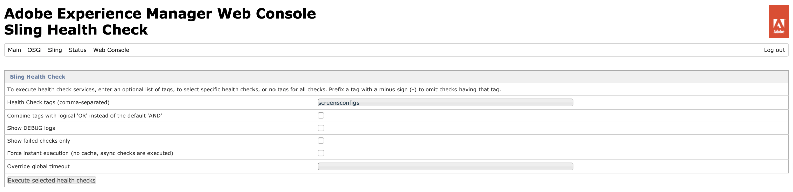

# AEM Screens 구성 및 배포 {#configuring-and-deploying-aem-screens}

이 페이지에서는 장치에 Screens 플레이어를 설치하고 구성하는 방법을 보여 줍니다.

## 서버 구성 {#server-configuration}

>[!IMPORTANT]
>
>AEM Screens Player는 CSRF(크로스 사이트 요청 위조) 토큰을 사용하지 않습니다. 따라서 AEM Screens에 사용할 준비가 되도록 AEM 서버를 구성하려면 빈 레퍼러를 허용하여 레퍼러 필터를 건너뜁니다.

## 상태 확인 프레임워크 {#health-check-framework}

상태 검사 프레임워크를 사용하면 AEM Screens 프로젝트를 실행하기 전에 필요한 두 구성이 설정되어 있는지 확인할 수 있습니다.

이를 통해 사용자는 AEM Screens 프로젝트를 실행하기 위한 다음의 두 가지 구성 검사를 확인할 수 있습니다. 즉, 다음 두 필터의 상태를 확인할 수 있습니다.

1. **빈 레퍼러 허용**
2. **https**

AEM Screens에 대해 이러한 두 가지 중요한 구성이 활성화되어 있는지 확인하려면 아래 단계를 따르십시오.

1. [Adobe Experience Manager 웹 콘솔 Sling 상태 검사](http://localhost:4502/system/console/healthcheck?tags=screensconfigs&amp;overrideGlobalTimeout=)(으)로 이동합니다.

   

2. 위에 나열된 두 속성에 대한 유효성 검사를 실행할 수 있도록 **선택한 상태 검사 실행**&#x200B;을 클릭합니다.

   두 필터가 모두 활성화된 경우 **Screens 구성 상태 서비스**&#x200B;는 두 구성이 모두 활성화된 상태에서 **결과**&#x200B;을(를) **확인**(으)로 표시합니다.

   

   하나 또는 두 필터가 모두 비활성화된 경우 아래 그림과 같이 사용자에 대한 경고가 표시됩니다.

   다음 경고는 두 필터가 모두 비활성화된 경우를 보여 줍니다.
   

>[!NOTE]
>
>* **Apache Sling 레퍼러 필터**&#x200B;를 사용하려면 [빈 레퍼러 요청 허용](/help/user-guide/configuring-screens-introduction.md#allow-empty-referrer-requests)을 참조하십시오.
>* **HTTP** 서비스를 사용하려면 [Apache Felix Jetty 기반 HTTP 서비스](/help/user-guide/configuring-screens-introduction.md#allow-apache-felix-service)를 참조하십시오.

### 사전 요구 사항 {#prerequisites}

아래의 주요 사항은 AEM Screens에 사용할 수 있도록 및 AEM 서버를 구성하는 데 도움이 됩니다.

#### 빈 레퍼러 요청 허용 {#allow-empty-referrer-requests}

1. AEM 인스턴스 > hammer 아이콘 > **작업** > **웹 콘솔**&#x200B;을 통해 **Adobe Experience Manager 웹 콘솔 구성**(으)로 이동합니다.

   

1. **Adobe Experience Manager 웹 콘솔 구성**&#x200B;이 열립니다. Sling 레퍼러를 검색합니다.

   sling 레퍼러 속성을 검색하려면 **Mac**&#x200B;의 경우 **Command+F**&#x200B;를 누르고 **Windows**&#x200B;의 경우 **Control+F**&#x200B;를 누릅니다.

1. 아래 그림과 같이 **비우기 허용** 옵션을 선택합니다.

   

1. Apache Sling Referrer Filter Allow Empty를 활성화하려면 **저장**&#x200B;을(를) 클릭하십시오.

#### Apache Felix Jetty 기반 HTTP 서비스 {#allow-apache-felix-service}

1. AEM 인스턴스 > hammer 아이콘 > **작업** > **웹 콘솔**&#x200B;을 통해 **Adobe Experience Manager 웹 콘솔 구성**(으)로 이동합니다.

   

1. **Adobe Experience Manager 웹 콘솔 구성**&#x200B;이 열립니다. Apache Felix Jetty 기반 HTTP 서비스를 검색합니다.

   이 속성을 검색하려면 **Mac**&#x200B;의 경우 **Command+F**&#x200B;를 누르고 **Windows**&#x200B;의 경우 **Control+F**&#x200B;를 누르십시오.

1. 아래 그림과 같이 **HTTP 사용** 옵션을 선택합니다.

   

1. *Http* 서비스를 사용하려면 **저장**&#x200B;을 클릭하세요.

#### AEM Screens용 Touch UI 활성화 {#enable-touch-ui-for-aem-screens}

AEM Screens은 TOUCH UI가 필요하며 Adobe Experience Manager(AEM)의 클래식 UI에서 작동하지 않습니다.

1. `*<yourAuthorInstance>/system/console/configMgr/com.day.cq.wcm.core.impl.AuthoringUIModeServiceImpl*`(으)로 이동
1. 아래 그림과 같이 **기본 제작 UI 모드**&#x200B;가 **TOUCH**(으)로 설정되어 있는지 확인하십시오

또는 AuthorInstance *>* 도구(망치 아이콘) > **작업** > **웹 콘솔**&#x200B;을 사용하여 동일한 설정을 수행하고 **WCM 작성 UI 모드 서비스**&#x200B;를 검색할 수도 있습니다.

>[!NOTE]
>
>사용자 환경 설정을 사용하여 특정 사용자에 대해 클래식 UI를 항상 활성화할 수 있습니다.

#### NOSAMPLECONTENT 실행 모드의 AEM {#aem-in-nosamplecontent-runmode}

프로덕션에서 AEM을 실행하면 **NOSAMPLECONTENT** 실행 모드가 사용됩니다. 추가 응답 헤더 섹션에서 *X-Frame-Options=SAMEORIGIN* 헤더를 제거합니다.

`https://localhost:4502/system/console/configMgr/org.apache.sling.engine.impl.SlingMainServlet`

AEM Screens 플레이어에서 온라인 채널을 재생하려면 이 제거를 수행해야 합니다.

#### 암호 제한 {#password-restrictions}

***DeviceServiceImpl***&#x200B;에 대한 최신 변경 내용으로 인해 암호 제한을 제거할 필요가 없습니다.

화면 장치 사용자에 대한 암호를 만드는 동안 암호 제한을 사용하도록 아래 링크에서 ***DeviceServiceImpl***&#x200B;을 구성할 수 있습니다.

`https://localhost:4502/system/console/configMgr/com.adobe.cq.screens.device.impl.DeviceService`

***DeviceServiceImpl***&#x200B;을(를) 구성하려면 아래 단계를 따르십시오.

1. AEM 인스턴스 > hammer 아이콘 > **작업** > **웹 콘솔**&#x200B;을 통해 **Adobe Experience Manager 웹 콘솔 구성**(으)로 이동합니다.

1. **Adobe Experience Manager 웹 콘솔 구성**&#x200B;이 열립니다. `*deviceservice*`을 검색합니다. 속성을 검색하려면 macOS의 경우 **Command+F**, Microsoft® Windows의 경우 **Control+F**&#x200B;을 누릅니다.

#### Dispatcher 구성 {#dispatcher-configuration}

AEM Screens 프로젝트에 대한 Dispatcher을 구성하는 방법은 [AEM Screens 프로젝트에 대한 Dispatcher 구성](dispatcher-configurations-aem-screens.md)을 참조하십시오.

#### Java™ 인코딩 {#java-encoding}

***Java™ 인코딩***&#x200B;을 유니코드로 설정합니다. 예를 들어 `*Dfile.encoding=Cp1252*`은(는) 작동하지 않습니다.

>[!NOTE]
>
>프로덕션에서 AEM Screens 서버에 HTTPS를 사용합니다.
