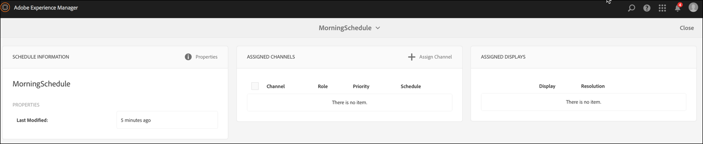
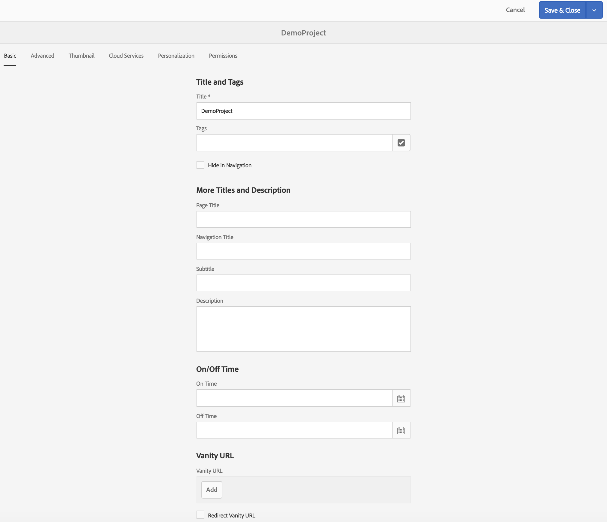

# 프로젝트 만들기 및 관리 {#creating-and-managing-projects}

Adobe Experience Manager 링크(왼쪽 위)를 선택한 다음, [스크린]을 선택하여 AEM Screens를 사용할 수 있습니다.

또는 다음 위치로 직접 이동할 수 있습니다. `http://localhost:4502/screens.html/content/screens`

서로 다른 프로젝트는 서로 다른 브랜드, 배포, 고객 등이 될 수 있습니다.

>[!NOTE]
>
>**탐색 팁:**
>
>커서 키를 사용하여 AEM에서 다양한 폴더를 탐색할 수도 있습니다. 또한 특정 엔티티를 선택한 후에는 스페이스바를 눌러 해당 특정 폴더의 속성을 편집하거나 볼 수도 있습니다.

## 새 스크린 프로젝트 생성 {#creating-a-new-screens-project}

아래 절차에 따라 새 스크린 프로젝트를 생성하십시오.

1. AEM 대시보드에서 **스크린**&#x200B;를 선택합니다.
1. Click **Create **--&gt;** Create Project **and **Create Screens Project** wizard will open.

1. Select the **Screens** template and click **Next**.

1. Enter the properties (**Title** and **Name**) as required and click **Create**.

>[!NOTE]
>
>By default, the initial structure will contain the **Schedules**, **Locations**, **Applications**, **Channels**, and **Devices** master pages, but this can be manually adjusted if needed. 사용 가능한 옵션이 프로젝트와 관련이 없는 경우 옵션을 제거할 수 있습니다.

프로젝트가 생성되고 다시 스크린 프로젝트 콘솔로 돌아갑니다. 이제 프로젝트를 선택할 수 있습니다.

프로젝트에는 아래 그림에 표시된 대로 네 가지 폴더가 있습니다.

* **예약**
* **위치**
* **애플리케이션**
* **채널**
* **장치**

### 속성 보기 {#viewing-properties}

Once you create the Screens project, click **Properties** on the action bar to edit properties of an exiting AEM Screens project.

The following options allow you to edit/change properties of your *DemoProject*.

### 사용자 지정 폴더 만들기 {#creating-a-custom-folder}

또한 예약, 위치 **,**&#x200B;애플리케이션 **,**&#x200B;채널 **,**&#x200B;장치 **마스터 페이지에서 사용자 정의 폴더를 만들**&#x200B;수 **** 있습니다.

사용자 지정 폴더를 만들려면 다음을 수행하십시오.

1. Select your project and click on **Create** next to plus icon in the action bar.
1. **만들기** 마법사가 열리면 적절한 선택 사항을 선택합니다.
1. **다음**&#x200B;을 클릭합니다.
1. 속성을 입력하고 **만들기**&#x200B;를 클릭합니다.

다음 단계에서는 DemoProject에서 응용 프로그램 **마스터** 페이지에 응용 프로그램 폴더를 만드는 방법을 *보여 줍니다*.

### 다음 단계 {#the-next-steps}

Once you have created your own project, see [Channel Management](managing-channels.md) to create and manage content in your channel.

또한 자신만의 예약, 응용 프로그램, 위치 또는 장치를 만들 수 있습니다.
