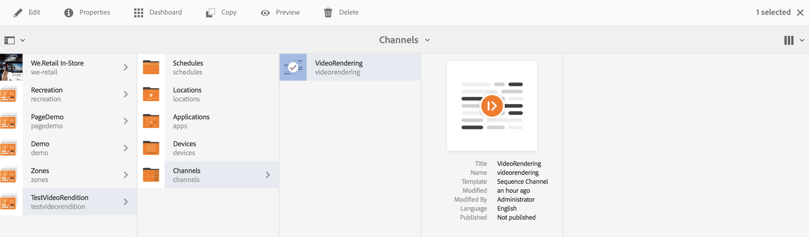

# 비디오 패딩 워크플로우 만들기 {#creating-a-video-padding-workflow}

이 섹션에서는 다음 주제를 다룹니다.

* **개요**
* **전제 조건**
* **비디오 패딩 워크플로우 만들기**
   * **워크플로우 만들기**
   * **AEM Screens 프로젝트에서 워크플로우 사용**

* **워크플로우에 대한 출력 확인**

## 개요 {#overview}

다음 사용 사례에는 디스플레이가 1920 x 1080인 채널에 비디오를 배치하고(예: 1280 x 720) 비디오를 0x0(왼쪽 상단)에 배치하는 작업이 포함됩니다. 비디오를 어떠한 방식으로든 늘리거나 수정해서는 안 되며, **커버** 비디오 구성 요소

비디오는 픽셀 1로부터 픽셀 1280까지 픽셀 1로부터 픽셀 720까지 아래쪽으로 가로질러 픽셀 1280까지 객체로서 표시될 것이며, 채널의 나머지는 기본 색상일 것이다.

## 사전 요구 사항 {#prerequisites}

비디오에 대한 워크플로우를 만들기 전에 다음 사전 요구 사항을 완료하십시오.

1. 에서 비디오 업로드 **에셋** AEM 인스턴스의 폴더
1. AEM Screens 프로젝트 만들기(예: **TestVideoRendition**) 및 ( 라는 채널&#x200B;**비디오 렌더링**), 아래 그림과 같이

## 비디오 패딩 워크플로우 만들기 {#creating-a-video-padding-workflow-1}

비디오 패딩 워크플로를 만들려면 비디오에 대한 워크플로를 만든 다음 AEM Screens 프로젝트 채널에서 사용해야 합니다.

워크플로우를 만들고 사용하려면 아래 단계를 따르십시오.

1. 워크플로우 만들기
1. AEM Screens 프로젝트에서 워크플로우 사용

### 워크플로우 만들기 {#creating-a-workflow}

비디오에 대한 워크플로우를 만들려면 아래 단계를 따르십시오.

1. AEM 인스턴스로 이동하고 사이드 레일에서 도구 를 클릭합니다. 선택 **워크플로** —> **모델** 를 클릭하여 새 모델을 만듭니다.

   

1. 클릭 **모델** —> **만들기** —> **모델 만들기**. 다음을 입력합니다. **제목** (as) **비디오 렌디션**) 및 **이름** 다음에서 **워크플로우 모델 추가**. 클릭 **완료** 워크플로 모델을 추가합니다.

   

1. 워크플로우 모델을 만든 후 모델(**비디오 렌디션**), 클릭 **편집** 작업 표시줄에서

   

1. 을(를) 끌어다 놓습니다. **명령줄** 구성 요소를 워크플로에 추가합니다.

   

1. 다음 항목 선택 **명령줄** 구성 요소를 클릭하고 속성 대화 상자를 엽니다.

   

1. 다음 항목 선택 **인수** 탭에서 필드 입력 **명령줄 - 단계 속성** 대화 상자.

   다음 위치에 형식을 입력합니다. **Mime 유형** (as) ***video/mp4***) 및 (***/usr/local/Cellar/ffmpeg -i ${filename} -vf &quot;pad=1920:height=1080:x=0:y=0:color=black&quot; cq5dam.video.fullhd-hp.mp4***)와 같은 명령을 사용하여 **명령** 필드.

   다음에 대한 세부 사항을 참조하십시오. **Mime 유형** 및 **명령** 아래 참고 사항에서.

   

1. 워크플로우 선택(**비디오 표현물**) 및 클릭 **워크플로우 시작** 작업 표시줄에서 **워크플로우 실행** 대화 상자.

   

1. 에서 에셋의 경로 선택 **페이로드** (as) ***/content/dam/huseinpeyda-crossroads01_512kb 2.mp4***) 및 를 입력합니다. **제목** 다음으로: ***RunVideo*** 및 클릭 **실행**.

   

### AEM Screens 프로젝트에서 워크플로우 사용 {#using-the-workflow-in-an-aem-screens-project}

AEM Screens 프로젝트에서 워크플로우를 사용하려면 아래 단계를 따르십시오.

1. AEM Screens 프로젝트(**TestVideoRendition** —> **채널** —>**비디오 렌디션**).

   

1. 클릭 **편집** 작업 표시줄에서 처음에 업로드한 비디오를 드래그 앤 드롭합니다. **에셋**.

   

1. 비디오를 업로드했으면 다음을 클릭합니다. **미리 보기** 출력을 봅니다.

   

## 워크플로우에 대한 출력 확인 {#validating-the-output-for-the-workflow}

다음을 수행하여 출력의 유효성을 검사할 수 있습니다.

* 채널에서 비디오 미리보기 확인
* 다음 위치로 이동 ***/content/dam/testvideo.mp4/jcr:content/renditions/cq5dam.video.fullhd-hp.mp4*** 아래 그림과 같이 CRXDE Lite에서

