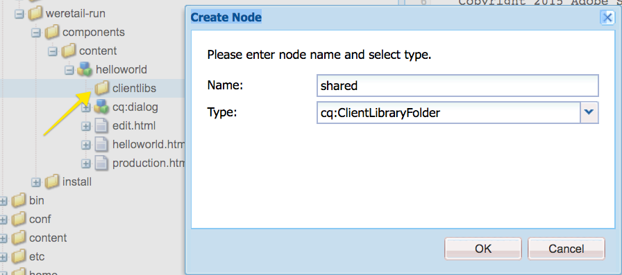

# AEM Screens {#developing-a-custom-component-for-aem-screens}용 사용자 지정 구성 요소 개발

다음 자습서에서는 AEM Screens용 사용자 정의 구성 요소를 만드는 단계를 안내합니다. AEM Screens은 다른 AEM 제품의 기존의 많은 디자인 패턴과 기술을 재사용합니다. 이 자습서에서는 AEM Screens을 개발할 때 차이점과 특별한 고려 사항을 다룹니다.

## 개요 {#overview}

이 튜토리얼은 AEM Screens을 처음 사용하는 개발자를 위한 것입니다. 이 자습서에서는 AEM Screens의 시퀀스 채널에 대해 간단한 &quot;Hello World&quot; 구성 요소를 만듭니다. 대화 상자를 사용하면 작성자가 표시된 텍스트를 업데이트할 수 있습니다.


## 전제 조건 {#prerequisites}

이 자습서를 완료하려면 다음 사항이 필요합니다.

1. [AEM 6.5 ](https://helpx.adobe.com/kr/experience-manager/6-4/release-notes.html) 또는  [AEM 6.3](https://helpx.adobe.com/kr/experience-manager/6-3/release-notes.html) + 최신 스크린 기능 팩

1. [AEM 스크린 플레이어](https://helpx.adobe.com/experience-manager/6-4/sites/deploying/using/configuring-screens-introduction.html)
1. 로컬 개발 환경

자습서 단계 및 스크린샷은 **CRXDE-Lite**&#x200B;를 사용하여 수행됩니다. IDE를 사용하여 자습서를 완료할 수도 있습니다. IDE를 사용하여 AEM과 함께 [을(를) 개발하는 방법에 대한 자세한 내용은 여기를 참조하십시오.](https://helpx.adobe.com/experience-manager/kt/sites/using/getting-started-wknd-tutorial-develop/part1.html#eclipse-ide)


## 프로젝트 설정 {#project-setup}

스크린 프로젝트의 소스 코드는 일반적으로 다중 모듈 Maven 프로젝트로 관리됩니다. 자습서를 더 신속하게 진행하기 위해 [AEM 프로젝트 원형 13](https://github.com/Adobe-Marketing-Cloud/aem-project-archetype)을(를) 사용하여 프로젝트가 미리 생성되었습니다. Maven AEM Project Tranype을 사용하여 프로젝트를 만드는 방법에 대한 자세한 내용은 [에서 참조할 수 있습니다.](https://helpx.adobe.com/experience-manager/kt/sites/using/getting-started-wknd-tutorial-develop/part1.html#maven-multimodule)

1. [CRX 패키지 관리자](http://localhost:4502/crx/packmgr/index.jsp)를 사용하여 다음 패키지를 다운로드하고 설치합니다.

   [파일 가져오기](assets/base-screens-weretail-runuiapps-001-snapshot.zip)

   [파일 가져오기](assets/base-screens-weretail-runuicontent-001-snapshot.zip)
   **선택** 사항: Eclipse 또는 다른 IDE를 사용하여 작업하는 경우 아래 소스 패키지를 다운로드합니다. Maven 명령을 사용하여 프로젝트를 로컬 AEM 인스턴스에 배포합니다.

   **`mvn -PautoInstallPackage clean install`**

   HelloWorld SRC 화면 We.Retail 실행 프로젝트 시작

   [파일 가져오기](assets/src-screens-weretail-run.zip)

1. [CRX 패키지 관리자](http://localhost:4502/crx/packmgr/index.jsp)에서 다음 두 패키지가 설치되어 있는지 확인합니다.

   1. **screens-weretail-run.ui.content-0.0.1-SNAPSHOT.zip**
   1. **screens-weretail-run.ui.apps-0.0.1-SNAPSHOT.zip**

   

   스크린 We.Retail 실행 Ui.Apps 및 Ui.CRX 패키지 관리자를 통해 설치된 컨텐츠 패키지

1. **screens-weretail-run.ui.apps** 패키지는 `/apps/weretail-run` 아래에 코드를 설치합니다.

   이 패키지에는 프로젝트의 사용자 지정 구성 요소를 렌더링하는 데 책임이 있는 코드가 들어 있습니다. 이 패키지에는 구성 요소 코드와 필요한 모든 JavaScript 또는 CSS가 포함되어 있습니다. 또한 이 패키지에는 프로젝트에 필요한 Java 코드가 포함된 **screens-weretail-run.core-0.0.1-SNAPSHOT.jar**&#x200B;도 포함됩니다.

   >[!NOTE]
   >
   >이 자습서에서는 Java 코드가 기록되지 않습니다. 보다 복잡한 비즈니스 로직이 필요한 경우 핵심 Java 번들을 사용하여 백엔드 Java를 만들고 배포할 수 있습니다.

   

   CRXDE Lite의 ui.apps 코드 표시

   **helloworld** 구성 요소는 현재 자리 표시자에 불과합니다. 자습서 과정 중에 작성자가 구성 요소에 의해 표시되는 메시지를 업데이트할 수 있는 기능이 추가됩니다.

1. **screens-weretail-run.ui.content** 패키지는 다음 아래에 코드를 설치합니다.

   * `/conf/we-retail-run`
   * `/content/dam/we-retail-run`
   * `/content/screens/we-retail-run`

   이 패키지에는 프로젝트에 필요한 시작 내용 및 구성 구조가 들어 있습니다. **`/conf/we-retail-run`** We.Retail 실행 프로젝트에 대한 모든 구성을 포함합니다. **`/content/dam/we-retail-run`** 프로젝트에 대한 디지털 자산 시작을 포함합니다. **`/content/screens/we-retail-run`** 스크린 컨텐츠 구조를 포함합니다. 이러한 경로 아래의 컨텐츠는 주로 AEM에서 업데이트됩니다. 환경(로컬, 개발, 스테이지, 제품) 간 일관성을 유지하기 위해 종종 기본 컨텐츠 구조가 소스 제어에 저장됩니다.

1. **AEM Screens > We.Retail 실행 프로젝트로 이동합니다.**

   AEM 시작 메뉴 > 화면 아이콘을 클릭합니다. We.Retail 실행 프로젝트를 볼 수 있는지 확인합니다.

   

## Hello World 구성 요소 {#hello-world-cmp} 만들기

Hello World 구성 요소는 사용자가 화면에 표시할 메시지를 입력할 수 있는 간단한 구성 요소입니다. 구성 요소는 [AEM Screens 구성 요소 템플릿을 기반으로 합니다.https://github.com/Adobe-Marketing-Cloud/aem-screens-component-template](https://github.com/Adobe-Marketing-Cloud/aem-screens-component-template).

AEM Screens에는 기존 WCM 사이트 구성 요소에 반드시 적용되는 몇 가지 흥미로운 제한 사항이 있습니다.

* 대부분의 Screens 구성 요소는 대상 디지털 사이니지 장치에서 전체 화면으로 실행해야 합니다.
* 대부분의 스크린 구성 요소는 슬라이드쇼를 생성하려면 시퀀스 채널에 임베드 가능해야 합니다.
* 작성은 시퀀스 채널에서 개별 구성 요소를 편집할 수 있도록 허용해야 하므로 전체 화면을 렌더링하는 것은 문제가 되지 않습니다

1. **CRXDE-Lite** `http://localhost:4502/crx/de/index.jsp`(또는 선택 IDE)에서 `/apps/weretail-run/components/content/helloworld.`으로 이동합니다.

   `helloworld` 구성 요소에 다음 속성을 추가합니다.

   ```
       jcr:title="Hello World"
       sling:resourceSuperType="foundation/components/parbase"
       componentGroup="We.Retail Run - Content"
   ```

   

   /apps/weretail-run/components/content/helpWorld용 속성

   **helloworld** 구성 요소는 **foundation/components/parbase** 구성 요소를 확장하여 시퀀스 채널 내에서 올바르게 사용할 수 있습니다.

1. `helloworld.html.` 이름의 `/apps/weretail-run/components/content/helloworld` 아래에 파일 만들기

   다음 항목으로 파일을 채웁니다.

   ```xml
   <!--/*
   
    /apps/weretail-run/components/content/helloworld/helloworld.html
   
   */-->
   
   <!--/* production: preview authoring mode + unspecified mode (i.e. on publish) */-->
   <sly data-sly-test.production="${wcmmode.preview || wcmmode.disabled}" data-sly-include="production.html" />
   
   <!--/* edit: any other authoring mode, i.e. edit, design, scaffolding, etc. */-->
   <sly data-sly-test="${!production}" data-sly-include="edit.html" />
   ```

   스크린 구성 요소는 사용 중인 [제작 모드](https://helpx.adobe.com/experience-manager/6-4/sites/authoring/using/author-environment-tools.html#PageModes)에 따라 두 개의 다른 렌더링을 필요로 합니다.

   1. **프로덕션**:미리 보기 또는 게시 모드(wcmmode=disabled)
   1. **편집**:편집, 디자인, 스캐폴딩, 개발자 등 다른 모든 제작 모드에 사용됩니다.

   `helloworld.html`전환 역할을 하며 현재 활성 상태인 제작 모드를 확인하고 다른 HTL 스크립트로 리디렉션합니다. 스크린 구성 요소에서 사용하는 일반적인 규칙은 편집 모드에 대한 `edit.html` 스크립트와 프로덕션 모드에 대한 `production.html` 스크립트가 있어야 합니다.

1. `production.html.` 이름의 `/apps/weretail-run/components/content/helloworld` 아래에 파일 만들기

   다음 항목으로 파일을 채웁니다.

   ```xml
   <!--/*
    /apps/weretail-run/components/content/helloworld/production.html
   
   */-->
   
   <div data-duration="${properties.duration}" class="cmp-hello-world">
    <h1 class="cmp-hello-world__message">${properties.message}</h1>
   </div>
   ```

   위에 있는 것은 Hello World 구성 요소의 제작 마크업입니다. 구성 요소가 시퀀스 채널에서 사용되므로 `data-duration` 속성이 포함됩니다. `data-duration` 속성은 시퀀스 항목이 표시되는 시간을 알기 위해 시퀀스 채널에서 사용됩니다.

   구성 요소는 텍스트가 있는 `div` 및 `h1` 태그를 렌더링합니다. `${properties.message}` 는 이름이 지정된 JCR 속성의 내용을 출력하는 HTL 스크립트의 일부입니다 `message`. 나중에 사용자가 `message` 속성 텍스트 값을 입력할 수 있는 대화 상자가 만들어집니다.

   또한 BEM(블록 요소 수정자) 표기법은 구성 요소와 함께 사용됩니다. BEM은 재사용 가능한 구성 요소를 손쉽게 만들 수 있는 CSS 코딩 규칙입니다. BEM은 [AEM 코어 구성 요소](https://github.com/Adobe-Marketing-Cloud/aem-core-wcm-components/wiki/CSS-coding-conventions)에서 사용하는 표기법입니다. 자세한 내용은[https://getbem.com/](https://getbem.com/)

1. `edit.html.` 이름의 `/apps/weretail-run/components/content/helloworld` 아래에 파일 만들기

   다음 항목으로 파일을 채웁니다.

   ```xml
   <!--/*
   
    /apps/weretail-run/components/content/helloworld/edit.html
   
   */-->
   
   <!--/* if message populated */-->
   <div
    data-sly-test.message="${properties.message}"
    class="aem-Screens-editWrapper cmp-hello-world">
    <p class="cmp-hello-world__message">${message}</p>
   </div>
   
   <!--/* empty place holder */-->
   <div data-sly-test="${!message}"
        class="aem-Screens-editWrapper cq-placeholder cmp-hello-world"
        data-emptytext="${'Hello World' @ i18n, locale=request.locale}">
   </div>
   ```

   상단은 Hello World 구성 요소의 편집 마크업입니다. 대화 상자 메시지를 채운 경우 첫 번째 블록은 구성 요소의 편집 버전을 표시합니다.

   대화 상자 메시지를 입력하지 않은 경우 두 번째 블록이 렌더링됩니다. `cq-placeholder` 및 `data-emptytext` 레이블을 이 경우 ***Hello World*** 자리 표시자로 렌더링합니다. 여러 로케일의 작성을 지원하기 위해 i18n을 사용하여 레이블의 문자열을 국제화할 수 있습니다.

1. **Hello World 구성 요소에 사용할 스크린 이미지 복사 대화 상자를 참조하십시오.**

   기존 대화 상자에서 시작한 다음 수정하는 것이 가장 쉽습니다.

   1. 대화 상자 복사 위치:`/libs/screens/core/components/content/image/cq:dialog`
   1. `/apps/weretail-run/components/content/helloworld` 아래에 대화 상자 붙여넣기

   

1. **메시지 탭을 포함하도록 Hello World 대화 상자를 업데이트합니다.**

   다음과 일치하도록 대화 상자를 업데이트합니다. 최종 대화 상자의 JCR 노드 구조는 아래에 XML로 제공됩니다.

   ```xml
   <?xml version="1.0" encoding="UTF-8"?>
   <jcr:root xmlns:sling="https://sling.apache.org/jcr/sling/1.0" xmlns:cq="https://www.day.com/jcr/cq/1.0" xmlns:jcr="https://www.jcp.org/jcr/1.0" xmlns:nt="https://www.jcp.org/jcr/nt/1.0"
       jcr:primaryType="nt:unstructured"
       jcr:title="Hello World"
       sling:resourceType="cq/gui/components/authoring/dialog">
       <content
           jcr:primaryType="nt:unstructured"
           sling:resourceType="granite/ui/components/coral/foundation/tabs"
           size="L">
           <items jcr:primaryType="nt:unstructured">
               <message
                   jcr:primaryType="nt:unstructured"
                   jcr:title="Message"
                   sling:resourceType="granite/ui/components/coral/foundation/fixedcolumns">
                   <items jcr:primaryType="nt:unstructured">
                       <column
                           jcr:primaryType="nt:unstructured"
                           sling:resourceType="granite/ui/components/coral/foundation/container">
                           <items jcr:primaryType="nt:unstructured">
                               <message
                                   jcr:primaryType="nt:unstructured"
                                   sling:resourceType="granite/ui/components/coral/foundation/form/textfield"
                                   fieldDescription="Message for component to display"
                                   fieldLabel="Message"
                                   name="./message"/>
                           </items>
                       </column>
                   </items>
               </message>
               <sequence
                   jcr:primaryType="nt:unstructured"
                   jcr:title="Sequence"
                   sling:resourceType="granite/ui/components/coral/foundation/fixedcolumns">
                   <items jcr:primaryType="nt:unstructured">
                       <column
                           jcr:primaryType="nt:unstructured"
                           sling:resourceType="granite/ui/components/coral/foundation/container">
                           <items jcr:primaryType="nt:unstructured">
                               <duration
                                   jcr:primaryType="nt:unstructured"
                                   sling:resourceType="granite/ui/components/coral/foundation/form/numberfield"
                                   defaultValue=""
                                   fieldDescription="Amount of time the image will be shown in the sequence, in milliseconds"
                                   fieldLabel="Duration (ms)"
                                   min="0"
                                   name="./duration"/>
                           </items>
                       </column>
                   </items>
               </sequence>
           </items>
       </content>
   </jcr:root>
   ```

   메시지의 textfield는 `message` 속성에 저장되고 지속 기간의 숫자 필드가 `duration` 속성에 저장됩니다. 이 두 속성은 모두 HTL이 `/apps/weretail-run/components/content/helloworld/production.html`에서 `${properties.message}` 및 `${properties.duration}`로 참조합니다.

   

   Hello World - 완료 대화 상자

## 클라이언트측 라이브러리 만들기 {#clientlibs}

클라이언트측 라이브러리는 AEM 구현에 필요한 CSS 및 JavaScript 파일을 구성하고 관리하는 메커니즘을 제공합니다.

AEM Screens 구성 요소는 편집 모드와 미리 보기/프로덕션 모드에서 다르게 렌더링됩니다. 두 개의 클라이언트 라이브러리가 만들어지고, 하나는 편집 모드이고 다른 하나는 미리 보기/프로덕션에 사용됩니다.

1. Hello World 구성 요소에 대한 클라이언트측 라이브러리 폴더를 만듭니다.

   `/apps/weretail-run/components/content/helloworld`아래 `clientlibs`라는 새 폴더를 만듭니다.

   

1. `clientlibs` 폴더 아래에 `cq:ClientLibraryFolder.` 유형의 `shared`이라는 새 노드를 만듭니다.

   

1. 공유 클라이언트 라이브러리에 다음 속성을 추가합니다.

   * `allowProxy` | 부울 | `true`

   * `categories`| 문자열[] |  `cq.screens.components`

   

   /apps/weretail-run/components/content/helloworld/clientlibs/shared용 속성

   categories 속성은 클라이언트 라이브러리를 식별하는 문자열입니다. cq.screens.componentscatory는 편집 및 미리 보기/프로덕션 모드에서 모두 사용됩니다. 따라서 sharedclientlib에 정의된 모든 CSS/JS는 모든 모드로 로드됩니다.

   제작 환경에서 모든 경로를 직접 /apps에 노출시키지 않는 것이 좋습니다. allowProxy 속성은 클라이언트 라이브러리 CSS 및 JS가 접두어 of/etc.clientlibs을 통해 참조되도록 합니다.

1. 공유 폴더 아래에 `css.txt`이라는 파일을 만듭니다.

   다음 항목으로 파일을 채웁니다.

   ```
   #base=css
   
   styles.less
   ```

1. `shared` 폴더 아래에 `css`이라는 폴더를 만듭니다. `css` 폴더 아래에 `style.less`이라는 파일을 추가합니다. 이제 클라이언트 라이브러리의 구조는 다음과 같아야 합니다.

   

   이 자습서에서는 CSS를 직접 작성하는 대신 LESS를 사용합니다. [LESS](https://lesscss.org/) 는 CSS 변수, 혼합 및 함수를 지원하는 널리 사용되는 CSS 사전 컴파일러입니다. AEM 클라이언트 라이브러리는 기본적으로 LESS 컴파일을 지원합니다. sass 또는 기타 사전 컴파일러는 사용할 수 있지만 AEM 외부에서 컴파일해야 합니다.

1. `/apps/weretail-run/components/content/helloworld/clientlibs/shared/css/styles.less`을(를) 다음 항목으로 채웁니다.

   ```css
   /**
       Shared Styles
      /apps/weretail-run/components/content/helloworld/clientlibs/shared/css/styles.less
   
   **/
   
   .cmp-hello-world {
       background-color: #fff;
   
    &__message {
     color: #000;
     font-family: Helvetica;
     text-align:center;
    }
   }
   ```

1. `shared` 클라이언트 라이브러리 폴더를 복사하여 붙여 넣어 `production`라는 새 클라이언트 라이브러리를 만듭니다.

   

   공유 클라이언트 라이브러리를 복사하여 새 프로덕션 클라이언트 라이브러리를 만듭니다.

1. 프로덕션 클라이언트 라이브러리의 `categories` 속성을 `cq.screens.components.production.`으로 업데이트합니다.

   그러면 미리 보기/프로덕션 모드에서 스타일을 로드할 때만 표시됩니다.

   

   /apps/weretail-run/components/content/help/clientlibs/production 속성

1. `/apps/weretail-run/components/content/helloworld/clientlibs/production/css/styles.less`을(를) 다음 항목으로 채웁니다.

   ```css
   /**
       Production Styles
      /apps/weretail-run/components/content/helloworld/clientlibs/production/css/styles.less
   
   **/
   .cmp-hello-world {
   
       height: 100%;
       width: 100%;
       position: fixed;
   
    &__message {
   
     position: relative;
     font-size: 5rem;
     top:25%;
    }
   }
   ```

   위 스타일은 화면 중앙에 메시지를 표시하지만 프로덕션 모드에서만 표시합니다.

세 번째 클라이언트 라이브러리 범주:`cq.screens.components.edit`을(를) 사용하여 구성 요소에 편집 전용 특정 스타일을 추가할 수 있습니다.

| Clientlib 범주 | 사용량 |
|---|---|
| `cq.screens.components` | 편집 모드와 제작 모드 간에 공유되는 스타일 및 스크립트 |
| `cq.screens.components.edit` | 편집 모드에서만 사용되는 스타일 및 스크립트 |
| `cq.screens.components.production` | 프로덕션 모드에서만 사용되는 스타일 및 스크립트 |

## 디자인 페이지 {#design-page} 만들기

AEM Screens은 전역 변경 사항에 [정적 페이지 템플릿](https://helpx.adobe.com/experience-manager/6-5/sites/developing/using/page-templates-static.html) 및 [디자인 구성](https://helpx.adobe.com/experience-manager/6-4/sites/authoring/using/default-components-designmode.html)을 사용합니다. 디자인 구성은 채널에서 Parsys에 대해 허용되는 구성 요소를 구성하는 데 자주 사용됩니다. 이러한 구성을 앱별 방식으로 저장하는 것이 좋습니다.

We.Retail 실행 프로젝트에만 해당하는 모든 구성을 저장하는 We.Retail 실행 디자인 페이지 아래에 만들어집니다.

1. **CRXDE-Lite** `http://localhost:4502/crx/de/index.jsp#/apps/settings/wcm/designs`에서 `/apps/settings/wcm/designs`로 이동합니다.
1. 디자인 폴더 아래에 `we-retail-run`이라는 새 노드를 만들고 `cq:Page` 유형으로 지정합니다.
1. `we-retail-run` 페이지 아래에서 `nt:unstructured` 유형의 `jcr:content`이라는 다른 노드를 추가합니다. `jcr:content` 노드에 다음 속성을 추가합니다.

   | 이름 | 유형 | 값 |
   |---|---|---|
   | jcr:title | 문자열 | We.Retail 실행 |
   | sling:resourceType | 문자열 | wcm/core/components/designer |
   | cq:doctype | 문자열 | html_5 |

   

   디자인 페이지( /apps/settings/wcm/designs/we-retail-run)

## 시퀀스 채널 {#create-sequence-channel} 만들기

Hello World 구성 요소는 시퀀스 채널에서 사용됩니다. 구성 요소를 테스트하려면 새 시퀀스 채널이 만들어집니다.

1. AEM 시작 메뉴에서 **스크린** > **We.Retail Ru** n > 로 이동하여 **채널**&#x200B;을 선택합니다.

1. **만들기** 단추를 클릭합니다.

   1. **개체 만들기**&#x200B;를 선택합니다.

   

1. 만들기 마법사에서:

1. 템플릿 단계 - **시퀀스 채널**&#x200B;을 선택합니다.

   1. 속성 단계
   * 기본 탭 > 제목 = **유휴 채널**
   * 채널 탭 > **채널을 온라인으로 만들기** 확인

   

1. 유휴 채널의 페이지 속성을 엽니다. 이전 섹션에서 만든 디자인 페이지를 가리키도록 디자인 필드를 업데이트합니다.`/apps/settings/wcm/designs/we-retail-run,`

   

   /apps/settings/wcm/designs/we-retail-run을 가리키는 디자인 구성

1. 새로 만든 유휴 채널을 편집하여 엽니다.

1. 페이지 모드를 **디자인** 모드로 전환

   1. Parsys의 **렌치** 아이콘을 클릭하여 허용된 구성 요소를 구성합니다.

   1. **Screens** 그룹과 **We.Retail Run - Content** 그룹을 선택합니다.

   

1. 페이지 모드를 **편집**&#x200B;으로 전환합니다. 이제 Hello World 구성 요소를 페이지에 추가하여 다른 시퀀스 채널 구성 요소와 결합할 수 있습니다.

   

1. **CRXDE-Lite** `http://localhost:4502/crx/de/index.jsp#/apps/settings/wcm/designs/we-retail-run/jcr%3Acontent/sequencechannel/par`에서 `/apps/settings/wcm/designs/we-retail-run/jcr:content/sequencechannel/par`로 이동합니다. 이제 `components` 속성에 `group:Screens`, `group:We.Retail Run - Content`가 포함됩니다.

   

   /apps/settings/wcm/designs/we-retail-run에서 디자인 구성

## 사용자 지정 핸들러용 템플릿 {#custom-handlers}

사용자 지정 구성 요소가 자산(이미지, 비디오, 글꼴, 아이콘 등), 특정 에셋 표현물 또는 클라이언트측 라이브러리(css, js 등)와 같은 외부 리소스를 사용하는 경우 기본적으로 HTML 마크업만 번들링하므로 이러한 리소스가 오프라인 구성에 자동으로 추가되지 않습니다.

플레이어에 다운로드되는 정확한 자산을 사용자 정의하고 최적화할 수 있도록 Adobe에서는 사용자 지정 구성 요소에 대한 확장 메커니즘을 제공하여 스크린의 오프라인 캐싱 로직에 종속 항목을 표시합니다.

아래 섹션은 해당 특정 프로젝트에 대한 `pom.xml`의 사용자 정의 오프라인 리소스 핸들러에 대한 템플릿과 최소 요구 사항을 보여줍니다.

```java
package …;

import javax.annotation.Nonnull;

import org.apache.felix.scr.annotations.Component;
import org.apache.felix.scr.annotations.Reference;
import org.apache.felix.scr.annotations.Service;
import org.apache.sling.api.resource.Resource;
import org.apache.sling.api.resource.ResourceUtil;
import org.apache.sling.api.resource.ValueMap;

import com.adobe.cq.screens.visitor.OfflineResourceHandler;

@Service(value = OfflineResourceHandler.class)
@Component(immediate = true)
public class MyCustomHandler extends AbstractResourceHandler {

 @Reference
 private …; // OSGi services injection

 /**
  * The resource types that are handled by the handler.
  * @return the handled resource types
  */
 @Nonnull
 @Override
 public String[] getSupportedResourceTypes() {
     return new String[] { … };
 }

 /**
  * Accept the provided resource, visit and traverse it as needed.
  * @param resource The resource to accept
  */
 @Override
 public void accept(@Nonnull Resource resource) {
     ValueMap properties = ResourceUtil.getValueMap(resource);
     
     /* You can directly add explicit paths for offline caching using the `visit`
        method of the visitor. */
     
     // retrieve a custom property from the component
     String myCustomRenditionUrl = properties.get("myCustomRenditionUrl", String.class);
     // adding that exact asset/rendition/path to the offline manifest
     this.visitor.visit(myCustomRenditionUrl);
     
     
     /* You can delegate handling for dependent resources so they are also added to
        the offline cache using the `accept` method of the visitor. */
     
     // retrieve a referenced dependent resource
     String referencedResourcePath = properties.get("myOtherResource", String.class);
     ResourceResolver resolver = resource.getResourceResolver();
     Resource referencedResource = resolver.getResource(referencedResourcePath);
     // let the handler for that resource handle it
     if (referencedResource != null) {
         this.visitor.accept(referencedResource);
     }
   }
}
```

다음 코드는 해당 특정 프로젝트에 대한 `pom.xml`의 최소 요구 사항을 제공합니다.

```css
   <dependencies>
        …
        <!-- Felix annotations -->
        <dependency>
            <groupId>org.apache.felix</groupId>
            <artifactId>org.apache.felix.scr.annotations</artifactId>
            <version>1.9.0</version>
            <scope>provided</scope>
        </dependency>

        <!-- Screens core bundle with OfflineResourceHandler/AbstractResourceHandler -->
        <dependency>
            <groupId>com.adobe.cq.screens</groupId>
            <artifactId>com.adobe.cq.screens</artifactId>
            <version>1.5.90</version>
            <scope>provided</scope>
        </dependency>
        …
      </dependencies>
```

## 모두 함께 {#putting-it-all-together}

아래 비디오에서는 완성된 구성 요소와 시퀀스 채널에 구성 요소를 추가하는 방법을 보여 줍니다. 그런 다음 채널이 위치 디스플레이에 추가되고 궁극적으로 스크린 플레이어에 할당됩니다.

>[!VIDEO](https://video.tv.adobe.com/v/22385?quaity=9)

## 완료된 코드 {#finished-code}

다음은 자습서의 완성된 코드입니다. **screens-weretail-run.ui.apps-0.0.1-SNAPSHOT.zip** 및 **screens-weretail-run.ui.content-0.0.1-SNAPSHOT.zip**&#x200B;은 컴파일된 AEM 패키지입니다. **SRC-screens-weretail-run-0.0.1.zip **은 Maven을 사용하여 배포할 수 있는 컴파일되지 않은 소스 코드입니다.

[파일 가져오기](assets/screens-weretail-runuiapps-001-snapshot.zip)

[파일 가져오기](assets/screens-weretail-runuicontent-001-snapshot.zip)

[파일 가져오기](assets/screens-weretail-run.zip)
