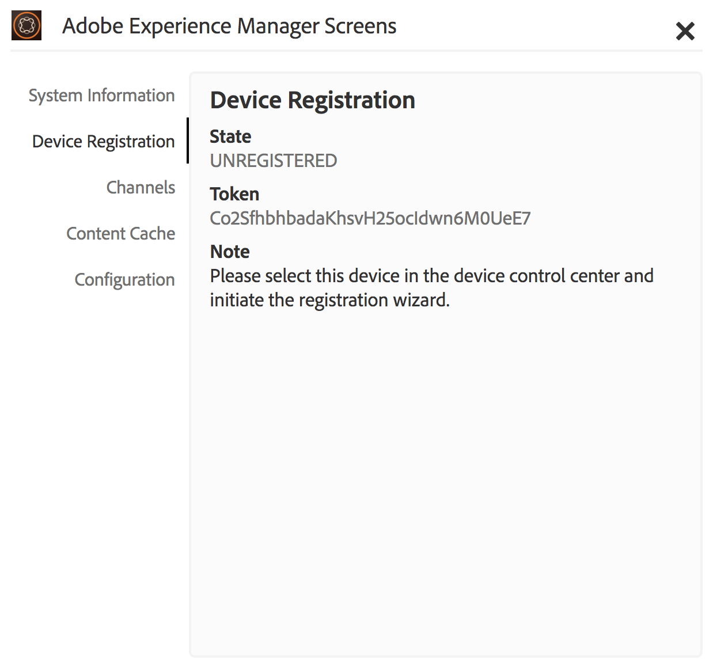

# 장치 등록 {#device-registration}

다음 페이지에서는 AEM Screens 프로젝트의 장치 등록 프로세스에 대해 설명합니다.

## 장치 등록 {#registering-a-device}

장치 등록 프로세스는 2개의 별도 시스템에서 수행됩니다.

* 등록할 실제 디바이스(예: 간판 디스플레이)
* 장치를 등록하는 데 사용되는 AEM 서버

>[!NOTE]
>
>최신 Windows Player(*.exe*), 출처 [AEM 6.4 플레이어 다운로드](https://download.macromedia.com/screens/) 페이지에서 플레이어의 단계에 따라 임시 설치를 완료합니다.
>
>1. 왼쪽 상단 모서리에서 길게 눌러 관리 패널을 엽니다.
>1. 다음으로 이동 **구성** 왼쪽 작업 메뉴에서 AEM 인스턴스의 위치 주소를 입력합니다 **서버** 및 클릭 **저장**.
>1. 을(를) 클릭합니다 **등록** 왼쪽 작업 메뉴 및 아래 단계를 연결하여 디바이스 등록 프로세스를 완료합니다.

>


1. 장치에서 AEM Screens 플레이어를 시작합니다. 등록 UI가 표시됩니다.

   

1. AEM에서 **장치** 프로젝트의 폴더입니다.

   >[!NOTE]
   >
   >AEM 대시보드에서 Screens용 새 프로젝트를 만드는 방법에 대한 자세한 내용은 [Screens 프로젝트 만들기 및 관리](creating-a-screens-project.md).

1. 탭/클릭 **장치 관리자** 단추를 클릭합니다.

   

1. 탭/클릭 **장치 등록** 오른쪽 상단의 버튼.

   

1. 필요한 장치(1단계와 동일)를 선택하고 탭/클릭합니다 **장치 등록**.

   

1. AEM에서 디바이스가 해당 등록 코드를 전송할 때까지 기다립니다.

   

1. 장치에서 다음을 확인합니다. **등록 코드**.

   

1. 다음과 같은 경우 **등록 코드** 두 컴퓨터에서 동일함, 탭/클릭 **유효성 검사** (6) 단계에 표시된 대로 AEM의 단추입니다.
1. 원하는 디바이스 이름을 설정하고 를 클릭합니다 **등록**.

   

1. 탭/클릭 **완료** 등록 프로세스를 완료합니다.

   

   >[!NOTE]
   >
   >다음 **새로 등록** 새 장치를 등록할 수 있습니다.
   >
   >다음 **디스플레이 할당** 장치를 디스플레이에 직접 추가할 수 있습니다.

   다음을 클릭: **완료**&#x200B;를 사용하려면 장치를 디스플레이에 할당해야 합니다.

   

   >[!NOTE]
   >
   >Screens 프로젝트용 디스플레이를 만들고 관리하는 방법에 대한 자세한 내용은 을 참조하십시오. [디스플레이 만들기 및 관리](managing-displays.md).

### 디스플레이에 장치 할당 {#assigning-device-to-a-display}

디스플레이에 장치를 할당하지 않은 경우 아래 단계에 따라 AEM Screens 프로젝트의 디스플레이에 장치를 할당합니다.

1. 장치를 선택하고 **장치 지정** 작업 표시줄에서

   

1. 에서 디스플레이 경로 선택 **디스플레이/장치 구성 경로**.

   

1. 클릭 **할당** 경로 선택 시.

   

1. 클릭 **완료** 장치가 성공적으로 할당되면 아래 그림과 같이

   

   또한 을 클릭하면 디스플레이 대시보드를 볼 수 있습니다. **완료**.

   

## 장치 관리자에서 장치 검색 {#search-device}

플레이어에 장치를 등록하면 장치 관리자 UI에서 모든 장치를 볼 수 있습니다.

1. AEM Screens 프로젝트에서 장치 관리자 UI로 이동합니다(예: ). **데모 화면** —> **장치**.

1. 다음 항목 선택 **장치** 폴더 및 클릭 **장치 관리자** 작업 표시줄에서

   

1. 등록된 장치 목록이 표시됩니다.

1. 등록된 장치의 목록이 길면 이제 작업 표시줄의 검색 아이콘을 사용하여 검색할 수 있습니다

   

   또는,

   클릭 `/` (슬래시) 검색 기능을 호출합니다.

   


### 검색 기능에 대한 제한 사항 {#limitations}

* 사용자는 *장치 ID* 또는 *장치 이름*.

   >[!NOTE]
   >다음과 같이 여러 단어로 장치 이름을 만드는 것이 좋습니다. *보스턴 스토어 로비* 단일 항목 대신 *보스톤스토어로비*.

* 다음과 같은 장치 이름을 만드는 경우 *보스턴 스토어 로비*, 모든 단어를 검색할 수 있습니다 *보스턴*, *스토어* 또는 *로비* 장치 이름이 인 경우 *보스톤스토어로비* 검색 중 *보스턴* 이(가) 결과를 표시하지 않습니다.

* 와일드카드, `*` 은 검색에 대해 지원됩니다. 이 경우 이름이 로 시작하는 모든 장치를 찾습니다. *보스턴*, 다음을 사용할 수 있습니다 *보스턴**.

* 장치 이름이 인 경우 *보스톤스토어로비* 및 검색 *보스턴* 을 대신 사용하여 결과를 반환하지 않습니다. *보스턴** 검색 기준에 있으면 결과가 반환됩니다.

## 장치 등록 제한 사항 {#limitations-on-device-registration}

시스템 전체 사용자 암호 제한으로 인해 디바이스 등록에 실패할 수 있습니다. 디바이스 등록은 디바이스 사용자를 생성하기 위해 무작위로 생성된 암호를 사용한다.

암호가 다음에 의해 제한된 경우 *AuthorizableActionProvider* 구성, 장치 사용자 만들기가 실패할 수 있습니다.

>[!NOTE]
>
>현재 생성된 무작위 암호는 33~122 범위의 36개의 ASCII 문자로 구성됩니다(거의 모든 특수 문자 포함).

```java
25.09.2016 16:54:03.140 *ERROR* [59.100.121.82 [1474844043109] POST /content/screens/svc/registration HTTP/1.1] com.adobe.cq.screens.device.registration.impl.RegistrationServlet Error during device registration
javax.jcr.nodetype.ConstraintViolationException: Password violates password constraint (^(?=.*\d).{7,9}$).
        at org.apache.jackrabbit.oak.spi.security.user.action.PasswordValidationAction.validatePassword(PasswordValidationAction.java:105)
        at org.apache.jackrabbit.oak.spi.security.user.action.PasswordValidationAction.onPasswordChange(PasswordValidationAction.java:76)
        at org.apache.jackrabbit.oak.security.user.UserManagerImpl.onPasswordChange(UserManagerImpl.java:308)
```

### 추가 리소스 {#additional-resources}

AEM Screens 플레이어에 대해 알아보려면 다음을 참조하십시오. [AEM Screens 플레이어](working-with-screens-player.md).
