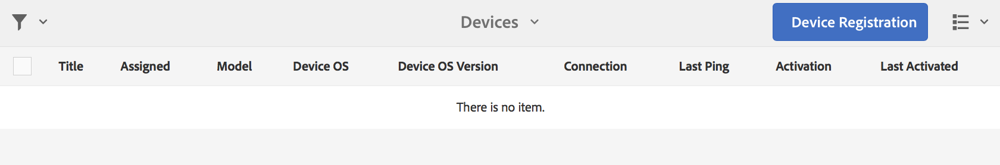

# 장치 등록 {#device-registration}

다음 페이지에서는 AEM Screens 프로젝트의 장치 등록 프로세스에 대해 설명합니다.

## 장치 등록 {#registering-a-device}

장치 등록 프로세스는 두 개의 별도 시스템에서 수행됩니다.

* 등록할 실제 장치(예: 간판 표시)
* 장치를 등록하는 데 사용되는 AEM 서버입니다

>[!NOTE]
>
>최신 Windows Player(*.exe*)를 다운로드하면 [AEM 6.4 Player 다운로드](https://download.macromedia.com/screens/) 페이지에서 플레이어의 단계에 따라 임시 설치를 완료합니다.
>
>1. 왼쪽 상단 모서리에서 을(를) 길게 눌러 관리 패널을 엽니다.
>1. 왼쪽 작업 메뉴에서 **구성**&#x200B;으로 이동하고 **서버**&#x200B;에 AEM 인스턴스의 위치 주소를 입력하고 **저장**&#x200B;을 클릭합니다.
>1. 왼쪽 작업 메뉴에서 **등록** 링크를 클릭하고 아래 단계를 클릭하여 장치 등록 프로세스를 완료합니다.

>


1. 장치에서 AEM Screens Player를 시작합니다. 등록 UI가 표시됩니다.

   

1. AEM에서 프로젝트의 **장치** 폴더로 이동합니다.

   >[!NOTE]
   >
   >AEM 대시보드에서 Screens용 새 프로젝트를 만드는 방법에 대한 자세한 내용은 [스크린 프로젝트 만들기 및 관리](creating-a-screens-project.md)를 참조하십시오.

1. 작업 표시줄에서 **장치 관리자** 단추를 탭/클릭합니다.

   

1. 오른쪽 상단에 있는 **장치 등록** 단추를 탭/클릭합니다.

   

1. 필요한 장치(1단계와 동일함)를 선택하고 **장치 등록**&#x200B;을 탭/클릭합니다.

   

1. AEM에서 장치가 등록 코드를 전송할 때까지 기다립니다.

   

1. 장치에서 **등록 코드**&#x200B;를 확인합니다.

   

1. **등록 코드**&#x200B;가 두 시스템에서 동일한 경우, (6)단계에서 표시된 대로 AEM에서 **유효성 검사** 단추를 탭/클릭합니다.
1. 장치에 대해 원하는 이름을 설정하고 **등록**&#x200B;을 클릭합니다.

   

1. **완료**&#x200B;를 탭/클릭하여 등록 프로세스를 완료합니다.

   

   >[!NOTE]
   >
   >**새로 등록**&#x200B;을 사용하면 새 장치를 등록할 수 있습니다.
   >
   >**디스플레이 지정**&#x200B;을 사용하면 장치를 디스플레이에 직접 추가할 수 있습니다.

   **완료**&#x200B;를 클릭하면 장치를 디스플레이에 할당해야 합니다.

   

   >[!NOTE]
   >
   >스크린 프로젝트용 디스플레이를 만들고 관리하는 방법에 대한 자세한 내용은 [디스플레이 만들기 및 관리](managing-displays.md)를 참조하십시오.

### 디스플레이에 장치 할당 {#assigning-device-to-a-display}

디스플레이에 장치를 할당하지 않은 경우 아래 절차에 따라 AEM Screens 프로젝트의 디스플레이에 장치를 할당하십시오.

1. 장치를 선택하고 작업 표시줄에서 **장치 지정**&#x200B;을 클릭합니다.

   

1. **디스플레이/장치 구성 경로**&#x200B;에서 디스플레이의 경로를 선택합니다.

   

1. 경로를 선택하면 **할당**&#x200B;을 클릭합니다.

   

1. 아래 그림과 같이 장치가 성공적으로 할당되면 **완료**&#x200B;를 클릭하십시오.

   

   또한 **완료**&#x200B;를 클릭하면 디스플레이 대시보드를 볼 수 있습니다.

   

## 장치 관리자에서 장치 검색 {#search-device}

플레이어에 장치를 등록했으면 장치 관리자 UI에서 모든 장치를 볼 수 있습니다.

1. AEM Screens 프로젝트에서 장치 관리자 UI로 이동합니다(예: **DemoScreens** —> **장치**).

1. **장치** 폴더를 선택하고 작업 표시줄에서 **장치 관리자**&#x200B;를 클릭합니다.

   

1. 등록된 장치 목록이 표시됩니다.

1. 등록된 장치 목록이 긴 경우 이제 작업 표시줄의 검색 아이콘을 사용하여 검색할 수 있습니다

   

   또는,

   `/`(슬래시)를 클릭하여 검색 기능을 호출합니다.

   


### 검색 기능 제한 사항 {#limitations}

* 사용자는 *장치 ID* 또는 *장치 이름*&#x200B;에 존재하는 단어를 검색할 수 있습니다.

   >[!NOTE]
   >장치 이름은 단일 *BostonStoreLobby*&#x200B;보다 *Boston Store Lobby*&#x200B;과 같은 여러 단어로 만드는 것이 좋습니다.

* *보스턴 스토어 로비와 같은 장치 이름을 만드는 경우*&#x200B;보스턴&#x200B;*,*&#x200B;스토어&#x200B;*또는*&#x200B;로비&#x200B;*라는 단어를 검색할 수 있지만, 장치 이름이* BostonStoreLobby *검색*&#x200B;보스톤&#x200B;*이 결과를 표시하지 않습니다.*

* 와일드카드, `*`에서 검색을 지원합니다. *boston*&#x200B;로 시작하는 이름을 가진 모든 장치를 찾으려면 *boston**을 사용할 수 있습니다.

* 장치 이름이 *BostonStoreLobby*&#x200B;이고 *boston*&#x200B;을 검색하면 검색 조건에 *boston**를 사용하는 대신 결과를 반환하지 않습니다.

## 장치 등록 제한 사항 {#limitations-on-device-registration}

시스템 전체 사용자 암호 제한으로 인해 장치 등록에 오류가 발생할 수 있습니다. 장치 등록에서는 임의의 생성된 암호를 사용하여 장치 사용자를 만듭니다.

*AuthorizableActionProvider* 구성에 의해 암호가 제한되어 있으면 장치 사용자를 만들지 못할 수 있습니다.

>[!NOTE]
>
>현재 생성된 무작위 암호는 33~122(거의 모든 특수 문자 포함)의 36개의 ASCII 문자로 구성됩니다.

```java
25.09.2016 16:54:03.140 *ERROR* [59.100.121.82 [1474844043109] POST /content/screens/svc/registration HTTP/1.1] com.adobe.cq.screens.device.registration.impl.RegistrationServlet Error during device registration
javax.jcr.nodetype.ConstraintViolationException: Password violates password constraint (^(?=.*\d).{7,9}$).
        at org.apache.jackrabbit.oak.spi.security.user.action.PasswordValidationAction.validatePassword(PasswordValidationAction.java:105)
        at org.apache.jackrabbit.oak.spi.security.user.action.PasswordValidationAction.onPasswordChange(PasswordValidationAction.java:76)
        at org.apache.jackrabbit.oak.security.user.UserManagerImpl.onPasswordChange(UserManagerImpl.java:308)
```

### 추가 리소스 {#additional-resources}

AEM Screens 플레이어에 대해 알아보려면 [AEM Screens Player](working-with-screens-player.md)를 참조하십시오.
