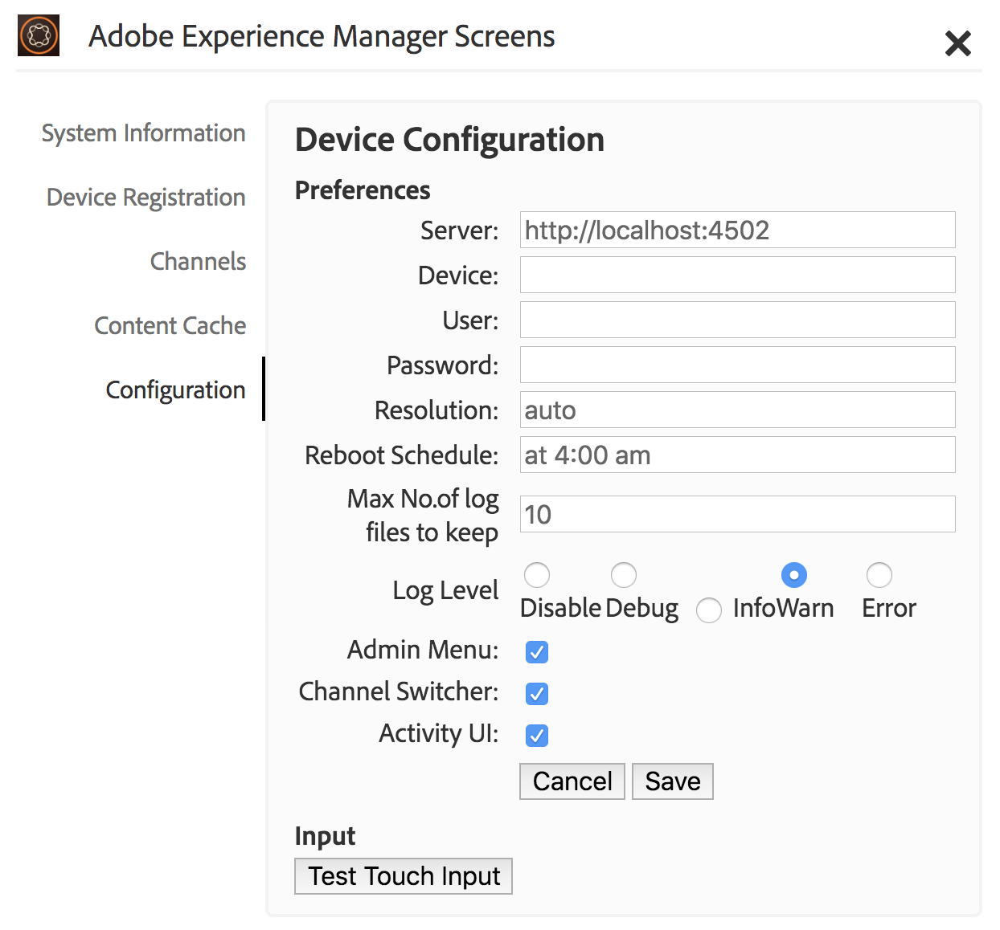

# 장치 등록 {#device-registration}

다음 페이지에서는 AEM Screens 프로젝트의 장치 등록 프로세스에 대해 설명합니다.

## 장치 등록 {#registering-a-device}

장치 등록 프로세스는 두 개의 별도 시스템에서 수행됩니다.

* 등록할 실제 디바이스(예: 간판 디스플레이)
* 장치를 등록하는 데 사용되는 AEM 서버

>[!NOTE]
>
>[AEM 6.4 플레이어 다운로드](https://download.macromedia.com/screens/) 페이지에서 최신 Windows Player(*.exe*)를 다운로드한 후, 플레이어의 단계에 따라 임시 설치를 완료합니다.
>
>1. 왼쪽 상단 모서리를 길게 눌러 관리 패널을 엽니다.
>1. 왼쪽 작업 메뉴에서 **구성**(으)로 이동하고 **서버**&#x200B;에 있는 AEM 인스턴스의 위치 주소를 입력한 다음 **저장**&#x200B;을 클릭합니다.
>1. 왼쪽 작업 메뉴에서 **등록** 링크를 클릭하고 아래 단계를 클릭하여 장치 등록 프로세스를 완료합니다.
>



1. 장치에서 AEM Screens 플레이어를 시작합니다. 등록 UI가 표시됩니다.

   

1. AEM에서 프로젝트의 **장치** 폴더로 이동합니다.

   >[!NOTE]
   >
   >AEM 대시보드에서 Screens용 프로젝트를 만드는 방법에 대한 자세한 내용은 [Screens 프로젝트 만들기 및 관리](creating-a-screens-project.md)를 참조하십시오.

1. 작업 표시줄에서 **장치 관리자** 단추를 클릭합니다.

   

1. 오른쪽 상단의 **Device Registration** 단추를 클릭합니다.

   

1. 필요한 장치(1단계와 동일)를 클릭하고 **장치 등록**&#x200B;을 클릭합니다.

   

1. AEM에서 디바이스가 해당 등록 코드를 전송할 때까지 기다립니다.

   

1. 장치에서 **등록 코드**&#x200B;를 확인하세요.

   

1. **등록 코드**&#x200B;이 두 컴퓨터에서 동일한 경우, (6)단계와 같이 AEM에서 **유효성 검사** 단추를 클릭하십시오.
1. 원하는 장치 이름을 설정하고 **등록**&#x200B;을 클릭합니다.

   

1. 등록 프로세스를 완료하려면 **완료**&#x200B;를 클릭하십시오.

   

   >[!NOTE]
   >
   >**새로 등록**&#x200B;을 통해 새 장치를 등록할 수 있습니다.
   >
   >**디스플레이 할당**&#x200B;을 사용하면 장치를 디스플레이에 직접 추가할 수 있습니다.

   **마침**&#x200B;을 클릭하면 장치를 디스플레이에 지정하십시오.

   

   >[!NOTE]
   >
   >Screens 프로젝트의 디스플레이를 만들고 관리하는 방법에 대한 자세한 내용은 [디스플레이 만들기 및 관리](managing-displays.md)를 참조하세요.

### 디스플레이에 장치 할당 {#assigning-device-to-a-display}

디스플레이에 장치를 할당하지 않은 경우 아래 단계에 따라 AEM Screens 프로젝트의 디스플레이에 장치를 할당합니다.

1. 장치를 클릭하고 작업 표시줄에서 **장치 할당**&#x200B;을 클릭합니다.

   

1. **디스플레이/장치 구성 경로**&#x200B;에서 디스플레이 경로를 클릭합니다.

   

1. 경로를 클릭하면 **할당**&#x200B;을 클릭합니다.

   

1. 아래 그림과 같이 장치가 할당되면 **마침**&#x200B;을 클릭합니다.

   

   **마침**&#x200B;을 선택하여 디스플레이 대시보드를 볼 수도 있습니다.

   

## 장치 관리자에서 장치 검색 {#search-device}

플레이어에 장치를 등록한 경우 장치 관리자 UI에서 모든 장치를 볼 수 있습니다.

1. AEM Screens 프로젝트에서 장치 관리자 UI로 이동합니다(예: **DemoScreens** > **장치**).

1. **장치** 폴더를 클릭하고 작업 표시줄에서 **장치 관리자**&#x200B;를 클릭합니다.

   

1. 등록된 장치 목록이 표시됩니다.

1. 등록된 장치의 목록이 길면 이제 작업 표시줄의 검색 아이콘을 사용하여 검색할 수 있습니다

   

   또는,

   검색 기능을 호출하려면 `/`(슬래시)을(를) 선택하십시오.

   


### 검색 기능에 대한 제한 사항 {#limitations}

* 사용자가 *장치 ID* 또는 *장치 이름*&#x200B;에 있는 단어를 검색할 수 있습니다.

  >[!NOTE]
  >하나의 단일 *`BostonStoreLobby`*&#x200B;이(가) 아닌 *`Boston Store Lobby`*&#x200B;과(와) 같은 여러 단어로 장치 이름을 만드는 것이 좋습니다.

* *`Boston Store Lobby`*&#x200B;과(와) 같은 장치 이름을 만든 경우 단어 *`boston`*, *`store`* 또는 *`lobby`*&#x200B;을(를) 검색합니다. 그러나 장치 이름이 *`BostonStoreLobby`*&#x200B;이면 *`boston`*&#x200B;을(를) 검색해도 결과가 표시되지 않습니다.

* 와일드카드 `*`이(가) 검색용으로 지원됩니다. 이름이 *`boston`*&#x200B;로 시작하는 모든 장치를 찾으려면 *`boston`**를 사용할 수 있습니다.

* 장치 이름이 *`BostonStoreLobby`*&#x200B;이고 *`boston`*&#x200B;을(를) 검색해도 결과가 반환되지 않으면 검색 기준에서 *`boston`**을(를) 사용하면 결과가 반환됩니다.

## 장치 등록 제한 사항 {#limitations-on-device-registration}

시스템 전체 사용자 암호 제한으로 인해 디바이스 등록에 실패할 수 있습니다. 디바이스 등록에서는 디바이스 사용자를 생성하기 위해 임의로 생성된 암호를 사용합니다.

*AuthorizableActionProvider* 구성에서 암호를 제한하면 장치 사용자 만들기가 실패할 수 있습니다.

>[!NOTE]
>
>현재 생성된 무작위 암호는 33에서 122 사이의 36개의 ASCII 문자로 구성됩니다(거의 모든 특수 문자 포함).

```java
25.09.2016 16:54:03.140 *ERROR* [59.100.121.82 [1474844043109] POST /content/screens/svc/registration HTTP/1.1] com.adobe.cq.screens.device.registration.impl.RegistrationServlet Error during device registration
javax.jcr.nodetype.ConstraintViolationException: Password violates password constraint (^(?=.*\d).{7,9}$).
        at org.apache.jackrabbit.oak.spi.security.user.action.PasswordValidationAction.validatePassword(PasswordValidationAction.java:105)
        at org.apache.jackrabbit.oak.spi.security.user.action.PasswordValidationAction.onPasswordChange(PasswordValidationAction.java:76)
        at org.apache.jackrabbit.oak.security.user.UserManagerImpl.onPasswordChange(UserManagerImpl.java:308)
```

### 기타 리소스 {#additional-resources}

AEM Screens 플레이어에 대한 자세한 내용은 [AEM Screens 플레이어](working-with-screens-player.md)를 참조하세요.
