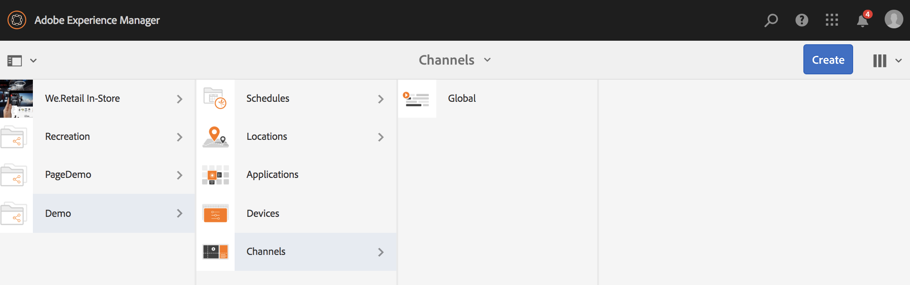
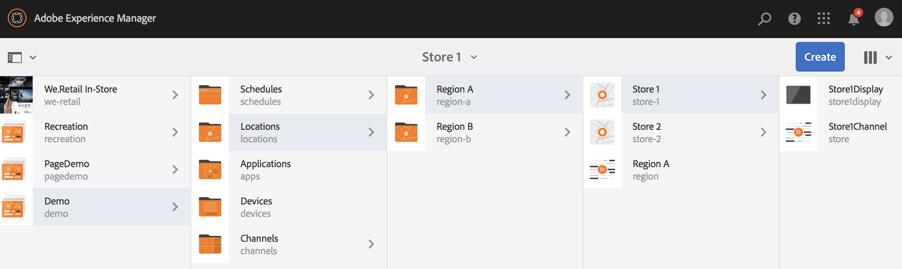
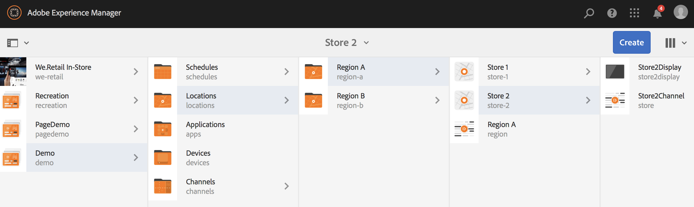
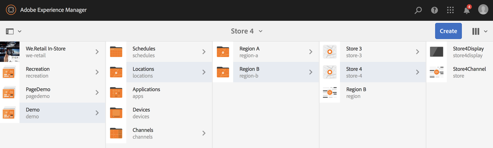

# 동적 포함 시퀀스 사용 {#using-dynamic-embedded-sequence}

동적 임베디드 시퀀스 사용 에서는 다음 주제를 다룹니다.

* **개요**
* **AEM Screens에서 Dynamic Embedded Experience 사용**
* **결과 보기**
* **사용자 제한 및 ACL 수정**

## 개요 {#overview}

***동적 포함된 시퀀스*** 상위-하위 계층 구조를 따르는 큰 프로젝트에 대해 만들어집니다. 이 경우 하위 폴더는 채널 폴더가 아닌 위치 폴더 내에서 참조됩니다. 다음과 같이 사용자가 채널 내에 시퀀스를 포함할 수 있습니다. ***채널 역할***. 이를 통해 사용자는 기본 채널 내에 임베드된 시퀀스를 사용하여 서로 다른 사무실에 대한 위치별 자리 표시자를 정의할 수 있습니다.

채널을 디스플레이에 할당하는 동안 디스플레이의 경로를 지정하거나 컨텍스트별로 실제 채널로 확인되는 채널의 역할을 지정할 수 있습니다.

동적 포함 시퀀스를 사용하려면 다음 방법으로 채널을 지정합니다 ***채널 역할***. 채널 역할은 디스플레이의 컨텍스트를 정의합니다. 역할은 다양한 작업이 타겟팅하며 역할을 수행하는 실제 채널과는 독립적입니다. 이 섹션에서는 역할별로 채널을 정의하는 사용 사례와 해당 콘텐츠를 글로벌 채널에 적용하는 방법에 대해 설명합니다. 또한 역할을 할당에 대한 식별자나 컨텍스트에서 채널에 대한 별칭으로 생각할 수 있습니다.

### 동적 임베디드 시퀀스 사용의 이점 {#benefits-of-using-dynamic-embedded-sequences}

채널 폴더 대신 위치 내에 시퀀스 채널을 배치하면 로컬 또는 지역 작성자가 시퀀스 채널과 관련된 콘텐츠를 편집할 수 있다는 이점이 있습니다. 이 모든 작업은 계층 구조 상단에 있는 채널 편집으로 제한됩니다.

참조 *역할별 채널*&#x200B;를 사용하면 위치별 콘텐츠를 동적으로 해결하기 위해 채널의 로컬 버전을 만들고 위치별 채널에 콘텐츠를 사용하는 전역 채널을 만들 수 있습니다.

>[!NOTE]
>
>**포함된 시퀀스 대 동적 포함된 시퀀스**
>
>Dynamic Embedded Sequence는 포함된 시퀀스와 유사하지만 한 채널에 대한 변경/업데이트가 관련된 다른 채널에 전파된 계층 구조를 따를 수 있습니다. 이 시퀀스는 상위-하위 계층 구조를 따르며 이미지나 비디오와 같은 에셋도 포함합니다.
>
>***동적 포함된 시퀀스*** 위치별 콘텐츠를 표시할 수 있지만 ***포함된 시퀀스*** 콘텐츠의 일반 슬라이드 쇼만 표시합니다. 또한 동적 포함 시퀀스를 설정하는 동안 채널 역할과 이름을 사용하여 채널을 구성해야 합니다. 실제 구현은 아래 단계를 참조하십시오.
>
>포함된 시퀀스 구현에 대한 자세한 내용은 [포함된 시퀀스](embedded-sequences.md) AEM Screens.

다음 예제에서는 다음 주요 용어에 초점을 맞춰 솔루션을 제공합니다.

* a ***주계열채널*** 전체 시퀀스.
* ***동적 포함 시퀀스*** 시퀀스의 각 로컬 사용자 지정 가능 부분에 대한 구성 요소입니다.
* ***개별 시퀀스 채널*** 이 있는 해당 위치 *역할* 와 일치하는 디스플레이에서 **동적 포함된 시퀀스 구성 요소 *역할***.

>[!NOTE]
>
>채널 지정에 대한 자세한 내용은 **[채널 할당](channel-assignment.md)** AEM Screens 설명서의 작성 섹션 아래에 있는 을 참조하십시오.

## 동적 포함 시퀀스 사용 {#using-dynamic-embedded-sequence-2}

다음 섹션에서는 AEM Screens 채널에서 동적 포함된 시퀀스를 만드는 방법에 대해 설명합니다.

### 사전 요구 사항 {#prerequisites}

이 기능의 구현을 시작하기 전에 동적 포함 시퀀스 구현을 시작하기 위한 다음 사전 요구 사항이 준비되었는지 확인하십시오.

* AEM Screens 프로젝트 만들기(이 예에서는 **데모**).
* 다음으로 채널 만들기 **글로벌** 아래에 **채널** 폴더를 삭제합니다.
* 에 콘텐츠 추가 **글로벌** 채널 (*확인&#x200B;**Resources.zip**관련 자산용*).

다음 이미지는 **데모** 프로젝트 포함 **글로벌** 의 채널 **채널** 폴더를 삭제합니다.

### 리소스 {#resources}

다음 리소스(이미지 및 에셋에 추가)를 다운로드하고 데모용 채널 콘텐츠로 사용할 수 있습니다.

[파일 가져오기](assets/resources.zip)

>[!NOTE]
>
>프로젝트를 만드는 방법 및 시퀀스 채널을 만드는 방법에 대한 자세한 내용은 다음 리소스를 참조하십시오.
>
>* **[프로젝트 생성 및 관리](creating-a-screens-project.md)**
>* **[채널 관리](managing-channels.md)**
>

AEM Screens 프로젝트에서 동적 임베디드 시퀀스를 구현하는 데에는 다음 세 가지 주요 작업이 포함됩니다.

1. **채널, 위치 및 디스플레이를 포함한 프로젝트 분류 설정**
1. **일정 만들기**
1. **각 디스플레이에 일정 할당**

아래 단계에 따라 기능을 구현하십시오.

>[!CAUTION]
>
>동적 임베디드 시퀀스를 구현하는 동안 **이름** 및 **제목** 각 위치에서 채널을 만드는 동안 필드가 표시됩니다. 명명법에 대한 지침을 주의 깊게 따르십시오.

1. **두 위치 폴더를 만듭니다.**

   다음으로 이동 **위치** 폴더를 AEM Screens 프로젝트에 만들고 두 개의 위치 폴더를 **지역 A** 및 **지역**.

   >[!NOTE]
   >
   >을(를) 만드는 동안 **지역 A** 위치 폴더를 입력하십시오. **제목** 다음으로: **지역 A** 그리고 당신은 **이름** 필드가 비어 있으므로 자동으로 **region-a** 이름이 선택되었습니다.
   >
   >위치 폴더를 만드는 경우도 마찬가지입니다 **지역**, 아래와 같이 표시됩니다.

   

   >[!NOTE]
   >위치를 만드는 방법에 대해 알아보려면 를 참조하십시오. **[위치 생성 및 관리](managing-locations.md)**.

1. **각 위치 폴더 아래에 두 개의 위치와 채널을 만듭니다.**

   1. 다음으로 이동 **데모** > **위치** > **지역 A**.
   1. 선택 **지역 A** 및 클릭 **+ 만들기** 작업 표시줄에서
   1. 선택 **위치** 을 사용하여 마법사에서 **제목** 다음으로: **스토어 1**. 마찬가지로 마법사에서 이라는 다른 위치를 만듭니다. **스토어 2** 포함 **제목** 다음으로: **스토어 2**. 다음을 떠나실 수 있습니다. **이름** 만드는 동안 필드가 비어 있음 **스토어 1** 및 **스토어 2**.
   1. 단계 (b)를 반복하고 이제 선택 **시퀀스 채널** 을 클릭합니다. 다음을 입력합니다. **제목** 다음으로: **지역 A** 및 **이름** 다음으로: **지역** 이 채널용입니다.

   >[!CAUTION]
   >
   >채널을 만드는 동안 다음을 확인하십시오 **지역 A**&#x200B;을(를) 입력한 후 **제목** 다음으로: **지역 A** 및 **이름** 다음으로: **지역**.

   

   마찬가지로 아래에 두 위치를 만듭니다. **지역** 제목이 다음으로 지정됨 **스토어 3** 및 **스토어 4**. 또한 다음을 생성합니다. **시퀀스 채널** 포함 **제목** 다음으로: **지역** 및 **이름** 다음으로: **지역**.

   >[!CAUTION]
   >
   >에서 만든 채널에 대해 동일한 이름을 사용할 수 있는지 확인하십시오 **지역 A** 및 **지역** 다음으로: **지역**.

   

1. **각 위치 아래에 디스플레이 및 채널을 만듭니다.**

   1. 다음으로 이동 **데모** > **위치** > **지역 A** > **스토어 1**.
   1. 선택 **스토어 1** 및 클릭 **+ 만들기** 작업 표시줄에서
   1. 선택 **표시** 마법사에서 만들고 **`Store1Display`**.
   1. 단계 (b)를 반복하고 이 시간 선택 **시퀀스 채널** 을 클릭합니다. 다음을 입력합니다. **제목** 다음으로: **`Store1Channel`** 및 **이름** 다음으로: **스토어**.

   >[!CAUTION]
   >
   >시퀀스 채널을 만들 때 중요합니다. **제목** 의 채널은 요구 사항일 수 있지만 **이름** 모든 로컬 채널에서 동일해야 합니다.
   >이 예에서 채널은 **지역 A** 및 **지역** 공유 **이름** 다음으로: **지역** 및 채널 **`Store 1`**, **`Store 2`**, **`Store 3`**, 및 **`Store 4`** 공유 **이름** 다음으로: **스토어**.

   

   마찬가지로 디스플레이를 만드는 방법: **`Store2Display`** 및 채널 **`Store2Channel`** 아래에 **`Store `2** (다음으로 이름 포함) **스토어**).

   >[!NOTE]
   >에서 만든 채널에 대해 동일한 이름을 사용할 수 있는지 확인하십시오 **`Store 1`** 및 **`Store 2`** 다음으로: **스토어**.

   

   채널을 만들고 를 표시할 수 있도록 이전 단계를 따르십시오. **`Store 3`** 및 **`Store 4`** 아래에 **지역**. 다시 말하지만, 동일한 코드를 사용해야 합니다 **이름** 다음으로: **스토어** 채널을 만드는 중 **`Store3Channel`** 및 **`Store4Channel`** 각각.

   다음 이미지는에서 디스플레이 및 채널을 보여 줍니다 **`Store 3`**.

   

   다음 이미지는에서 디스플레이 및 채널을 보여 줍니다 **`Store 4`**.

   

1. **해당 위치의 채널에 콘텐츠를 추가합니다.**

   다음 위치로 이동 **데모** > **위치** > **지역 A** > **지역 A** 및 클릭 **편집** 작업 표시줄에서 채널에 추가하려는 자산을 드래그 앤 드롭합니다.

   >[!NOTE]
   >다음을 사용할 수 있습니다. ***Resources.zip*** 파일 위치: **리소스** 위의 섹션에서 이미지를 채널 콘텐츠의 에셋으로 사용합니다.

   

   마찬가지로 다음 위치로 이동합니다. **데모** > **위치** > **지역** > **지역** 및 클릭 **편집** 아래 표시된 대로 작업 표시줄에서 자산을 채널로 드래그하여 놓습니다.

   

   다음 채널에 컨텐츠를 추가할 수 있도록 이전 단계 및 리소스를 따릅니다.

   * **`Store1Channel`**
   * **`Store2Channel`**
   * **`Store3Channel`**
   * **`Store4Channel`**

1. **일정 만들기**

   탐색 및 선택 **일정** AEM Screens 폴더를 추가합니다. 그런 다음 **만들기** 작업 표시줄에서

   다음 이미지는 **AdSchedule** 생성 위치 **데모** 프로젝트.

   

1. **예약에 채널 할당**

   1. 다음으로 이동 **데모** > **일정** > **AdSchedule** 및 클릭 **대시보드** 작업 표시줄에서
   1. 클릭 **+ 채널 할당** 출처: **할당된 채널** 패널 을 클릭하여 **채널 할당** 대화 상자.
   1. 선택 **참조 채널** 경로 기준.
   1. 다음 항목 선택 **채널 경로** 다음으로: **데모** > ***채널*** > ***글로벌***.
   1. 다음을 입력합니다. **채널 역할** 다음으로: **전역 세그먼트**.
   1. 다음 항목 선택 **지원되는 이벤트** 다음으로: **초기 로드**, **유휴 화면**, 및 **사용자 상호 작용**.
   1. **저장**&#x200B;을 클릭합니다.

   **지역에 대한 역할별 채널 할당:**

   1. 클릭 **+ 채널 할당** 출처: **할당된 채널** 패널.
   1. Channel Assignment 대화 상자에서 **참조 채널** 이름으로.
   1. 다음을 입력합니다. **채널 이름** 다음으로: **지역***.
   1. 다음을 입력합니다. **채널 역할** 다음으로: **지역 세그먼트**.
   1. **저장**&#x200B;을 클릭합니다.

   **스토어에 대해 역할별 채널 할당:**

   1. 클릭 **+ 채널 할당** 출처: **할당된 채널** 패널.
   1. Channel Assignment 대화 상자에서 **참조 채널** 이름으로.
   1. 다음을 입력합니다. **채널 이름** 다음으로: **스토어**.
   1. 다음을 입력합니다. **채널 역할** 다음으로: **StoreAdsegment**.
   1. **저장**&#x200B;을 클릭합니다.

   다음 이미지는 경로 및 역할별로 할당된 채널을 보여줍니다.

   

1. **전역 채널에 동적 포함 시퀀스를 구성합니다.**

   다음 위치로 이동 **글로벌** 처음에 만든 채널 **데모** 프로젝트.

   클릭 **편집** 작업 표시줄에서

   

   편집기에서 2를 끌어서 놓습니다. **동적 포함된 시퀀스** 채널 편집기의 구성 요소입니다.

   구성 요소 중 하나에서 속성을 열고 **채널 할당 역할** 다음으로: **지역 세그먼트**.

   마찬가지로 다른 구성 요소를 선택하고 등록 정보를 열어 **채널 할당 역할** 다음으로: **StoreAdsegment**.

   

1. **각 디스플레이에 일정 할당**

   1. 다음과 같은 각 표시로 이동합니다. **데모** > **위치** > **지역 A** >**스토어 1** >**`Store1Display`**.
   1. 클릭 **대시보드** 작업 표시줄에서
   1. 대시보드에서 을(를) 클릭합니다 **...** 다음에서 **할당된 채널 및 일정** 패널을 클릭한 다음 **+일정 할당**.
   1. 예약에 대한 경로를 선택합니다(예: 여기, **데모** > **일정** > **AdSchedule**).
   1. **저장**&#x200B;을 클릭합니다.

## 결과 보기 {#viewing-the-results}

채널 및 표시에 대한 설정이 완료되면 AEM Screens 플레이어를 시작하여 콘텐츠를 봅니다.

>[!NOTE]
>
>AEM Screens Player에 대해 알아보려면 다음 리소스를 참조하십시오.
>
>* [AEM Screens 플레이어 다운로드](https://download.macromedia.com/screens/)
>* [AEM Screens Player를 사용한 작업](working-with-screens-player.md)

다음 출력은 표시 경로에 따라 AEM Screens 플레이어에서 채널 컨텐츠를 확인합니다.

**시나리오 1**:

표시 경로를 다음과 같이 지정하는 경우 **데모** > **위치** > **지역 A** > **스토어 1** > **`Store1Display`**, 다음 콘텐츠는 AEM Screens 플레이어에 표시됩니다.

**시나리오 1**:

표시 경로를 다음과 같이 지정하는 경우 **데모** > **위치** > **지역** > **스토어 3** > **`Store3Display`**, 다음 콘텐츠는 AEM Screens 플레이어에 표시됩니다.

## 사용자 제한 및 ACL 수정 {#restricting-users-and-modifying-the-acls}

계층 구조 상단에 있는 채널 편집이 제한되어 있는 동안 전역, 지역 또는 로컬 작성자를 만들어 관련 콘텐츠를 편집할 수 있습니다.

위치에 따라 콘텐츠에 대한 사용자의 액세스를 제한할 수 있도록 ACL을 편집합니다.

### 예제 사용 사례 {#example-use-case}

다음 예에서는 위의 데모 프로젝트에 대해 세 명의 사용자를 만들 수 있습니다.

권한은 각 그룹에 다음과 같이 지정됩니다.

**그룹**:

* **Global-Author**: 의 모든 위치 및 채널에 액세스할 수 있는 사용자로 구성됩니다. **데모** 모든 읽기, 쓰기 및 편집 권한이 있어야 합니다.

* **Region-Author**: 다음에 대한 읽기, 쓰기 및 편집 권한이 있는 사용자로 구성됩니다. **지역 A** 및 **지역**.

* **Store-Author**: 다음에 대한 읽기, 쓰기 및 편집 권한만 있는 사용자로 구성됩니다. **스토어 1**, **스토어 2**, **스토어 3**, 및 **스토어 4**.

#### 사용자 그룹 생성, 사용자 및 ACL 설정 단계 {#steps-for-creating-user-groups-users-and-setting-up-acls}

>[!NOTE]
>
>각 개인 또는 팀이 자체 프로젝트를 처리하도록 ACL을 사용하여 프로젝트를 분리하는 방법에 대한 자세한 내용은 다음을 참조하십시오. **ACL 설정**.

그룹, 사용자를 만들고 권한에 따라 ACL을 수정하려면 아래 단계를 따르십시오.

1. **그룹 만들기**

   1. 다음으로 이동 **Adobe Experience Manager**.
   1. 클릭 **도구** > **보안** > **그룹**.
   1. 클릭 **그룹 만들기** 및 입력 **Global-Author** 위치: **ID**.
   1. **저장 및 닫기**&#x200B;를 클릭합니다.

   마찬가지로 다음과 같은 두 개의 다른 그룹을 만듭니다. **Region-Author** 및 **Store-Author**.

   

1. **사용자 만들기 및 그룹에 사용자 추가**

   1. 다음으로 이동 **Adobe Experience Manager**.
   1. **도구** > **보안** > **사용자**&#x200B;를 클릭합니다.
   1. 클릭 **사용자 만들기** 및 입력 **전역 사용자** 위치: **ID**.
   1. 입력 **암호** 및 이 사용자의 암호를 확인합니다.
   1. 다음을 클릭합니다. **그룹** 을(를) 탭하고 의 그룹 이름을 입력합니다. **그룹 선택**&#x200B;예를 들어 다음을 입력합니다. **Global-Author** 추가하려면 **전역 사용자** 특정 그룹에 연결합니다.
   1. **저장 및 닫기**&#x200B;를 클릭합니다.

   마찬가지로 와 같은 두 명의 다른 사용자를 만듭니다. **Region-User** 및 **Store-User** 및 추가 **Region-Author** 및 **Store-Author** 각각.

   >[!NOTE]
   >가장 좋은 방법은 그룹에 사용자를 추가한 다음 각 특정 사용자 그룹에 권한을 할당하는 것입니다.

   

1. **기여자에게 모든 그룹 추가**

   1. 다음으로 이동 **Adobe Experience Manager**.
   1. 클릭 **도구** > **보안** > **그룹**.
   1. 선택 **참가자** 목록에서 을(를) 선택하고 **구성원** 탭.
   1. 다음 항목 선택 **그룹** 과 같은 **Global-Author**, **Region-Author,** 및 **Store-Author** 기여자를 위해.
   1. **저장 및 닫기**&#x200B;를 클릭합니다.

1. **각 그룹에 대한 권한 액세스**

   1. 다음 위치로 이동 *Useradmin* 및 이 UI를 사용하여 다른 그룹에 대한 권한을 수정할 수 있습니다.
   1. 검색 대상 **Global-Author** 및 클릭 **권한** 아래 그림과 같이 탭으로 이동합니다.
   1. 마찬가지로 다음에 대한 권한에 액세스할 수 있습니다 **Region-Author** 및 **Store-Author**.

   

1. **각 그룹에 대한 권한 수정**

   **Global-Author용:**

   1. 다음 위치로 이동 **권한** 탭
   1. 다음으로 이동 ***/content/screens/demo*** 모든 권한 확인
   1. 다음으로 이동 ***/content/screens/demo/locations*** 모든 권한 확인
   1. 다음으로 이동 ***/content/screens/demo/locations/region-a*** 모든 권한을 확인합니다. 마찬가지로 다음에 대한 권한을 확인합니다. **`region-b`**.

   단계를 이해하려면 다음 그림을 참조하십시오.
   

   다음은 를 보여 줍니다. **전역 사용자** 에 대한 액세스 권한이 있습니다. **글로벌 채널**&#x200B;및 두 가지 모두 **지역 A** 및 **지역** 4개의 모든 상점을 가진 **스토어 1**, **스토어 2**, **스토어 3**, 및 **스토어 4**.

   

   **Region-Author용:**

   1. 다음 위치로 이동 **권한** 탭.
   1. 다음으로 이동 ***/content/screens/demo*** 다음 항목만 확인 **읽기** 사용 권한.
   1. 다음으로 이동 ***/content/screens/demo/locations*** 다음 항목만 확인 **읽기** 사용 권한.
   1. 다음으로 이동 ***/content/screens/demo/channels*** 다음에 대한 권한 선택 취소 **글로벌** 채널.
   1. 다음으로 이동 ***/content/screens/demo/locations***/***region-a*** 모든 권한을 확인합니다. 마찬가지로 다음에 대한 권한을 확인합니다. **`region-b`**.

   단계를 이해할 수 있도록 다음 이미지를 참조하십시오.

   

   다음은 지역 사용자가 두 항목에 모두 액세스할 수 있음을 보여 줍니다 **지역 A** 및 **지역**, 4개의 스토어 모두 포함, 즉 **스토어 1**, **스토어 2**, **스토어 3**, 및 **스토어 4**, 그러나 은 다음에 액세스하지 않습니다. **글로벌** 채널.

   

   **Store-Author용:**

   1. 다음 위치로 이동 **권한** 탭.
   1. 다음으로 이동 ***/content/screens/demo*** 다음 항목만 확인 **읽기** 사용 권한.
   1. 다음으로 이동 ***/content/screens/demo/locations*** 다음 항목만 확인 **읽기** 사용 권한.
   1. 다음으로 이동 ***/content/screens/demo/channels*** 다음에 대한 권한 선택 취소 **글로벌** 채널.
   1. 다음으로 이동 ***/content/screens/demo/locations/region-a*** 다음 항목만 확인 **읽기** 사용 권한. 마찬가지로 **읽기** 다음에 대한 권한 **`region-b`**.
   1. 다음으로 이동 ***/content/screens/demo/locations***/***region-a /store-1*** 모든 권한을 확인합니다. 마찬가지로 다음에 대한 권한을 확인합니다. **store-2, store-3,** 및 **스토어-**.

   단계를 이해할 수 있도록 다음 이미지를 참조하십시오.

   

   다음은 를 보여 줍니다. **Store-User** 에 대한 액세스 권한만 있음 **스토어 1**, **스토어 2**, **스토어 3**, 및 **스토어 4**, 그러나 은(는) 다음에 대한 액세스 권한이 없습니다. **글로벌** 또는 영역(**지역 A** 및 **지역**) 채널.

   

>[!NOTE]
>
>권한 설정에 대한 자세한 내용은 [ACL 설정](setting-up-acls.md).
