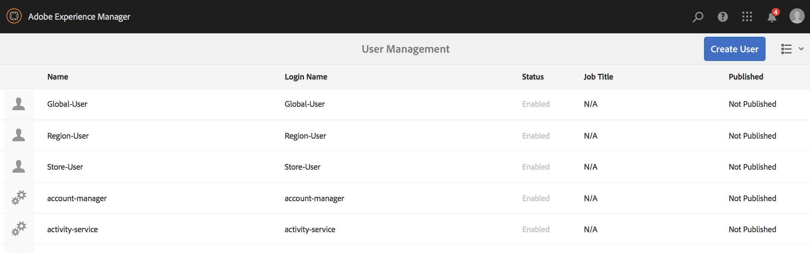

# 동적 포함된 시퀀스 사용 {#using-dynamic-embedded-sequence}

동적 포함된 시퀀스를 사용하면 다음 항목이 포함됩니다.

* **개요**
* **AEM Screens에서 동적 포함된 경험 사용**
* **결과 보기**
* **사용자 제한 및 ACL 수정**

## 개요 {#overview}

***동적*** 포함된 시퀀스는 상위 하위 계층 구조를 따르는 대규모 프로젝트에 대해 만듭니다. 이 경우 하위 폴더는 채널 폴더가 아니라 위치 폴더 내에서 참조됩니다. 이를 통해 사용자는 ***채널 역할***&#x200B;에 의해 채널 내에 시퀀스를 포함할 수 있습니다. 이를 통해 사용자는 기본 채널 내에 포함된 시퀀스를 사용하여 서로 다른 사무실에 대한 위치별 자리 표시자를 정의할 수 있습니다.

디스플레이에 채널을 지정하는 동안 디스플레이의 경로를 지정하거나 컨텍스트별로 실제 채널로 해결할 채널의 역할을 지정할 수 있습니다.

동적 포함된 시퀀스를 사용하려면 ***채널 역할***&#x200B;으로 채널을 할당합니다. 채널 역할은 표시 컨텍스트를 정의합니다. 이 역할은 다양한 작업에 의해 타깃팅되며 역할을 수행하는 실제 채널과 독립적입니다. 이 섹션에서는 역할별로 채널을 정의하는 사용 사례와 해당 컨텐츠를 글로벌 채널에 활용할 수 있는 방법에 대해 설명합니다. 또한 역할을 할당에 대한 식별자로 간주하거나,

### 동적 포함된 시퀀스 사용 이점 {#benefits-of-using-dynamic-embedded-sequences}

채널 폴더 대신 시퀀스 채널을 위치 내에 배치할 때 얻을 수 있는 주요 이점은 로컬 또는 지역 작성자가 계층 구조의 상위 채널에서 편집할 수 없도록 제한하면서 자신과 관련된 컨텐츠를 편집할 수 있다는 것입니다.

*역할별 채널*&#x200B;을 참조하면 위치별 컨텐츠를 동적으로 확인할 수 있도록 채널의 로컬 버전을 만들 수 있으며 위치별 채널의 컨텐츠를 활용하는 전역 채널을 만들 수도 있습니다.

>[!NOTE]
>
>**포함된 시퀀스와 동적 포함된 시퀀스**
>
>동적 포함된 시퀀스는 포함된 시퀀스와 유사하지만 하나의 채널에 대한 변경/업데이트가 관련된 다른 채널에 전파되는 계층 구조를 사용자가 따를 수 있습니다. 부모-자식 계층 구조를 따르며 이미지나 비디오와 같은 자산도 포함합니다.
>
>***동적 포함된 시퀀스*** 를 사용하면 위치별 컨텐츠를 표시할 수 있지만  ***포함된 시퀀스*** 는 컨텐츠의 일반 슬라이드 쇼만 표시할 수 있습니다. 또한 동적 포함된 시퀀스를 설정하는 동안 채널 역할 및 이름을 사용하여 채널을 구성해야 합니다. 실질적인 구현은 아래 단계를 참조하십시오.
>
>포함된 시퀀스 구현에 대한 자세한 내용은 AEM Screens의 [포함된 시퀀스](embedded-sequences.md)를 참조하십시오.

다음 예에서는 다음 주요 용어에 중점을 두고 솔루션을 제공합니다.

* 전역 시퀀스의 ***주 시퀀스 채널***
* ***시퀀스의 로컬에 사용자 정의 가능한 각 부분에 대한 동적 포함된*** 시퀀스 구성 요소
* ***개별 시퀀스*** 채널은  ** 동적 포함된 시퀀스 구성 요소의  **역할 *과 일치하는 표시*규칙을 사용하여 각 위치에표시됩니다.**

>[!NOTE]
>
>채널 지정에 대한 자세한 내용은 AEM Screens 설명서의 작성 섹션에서 **[채널 지정](channel-assignment.md)**&#x200B;을 참조하십시오.

## 동적 포함된 시퀀스 사용 {#using-dynamic-embedded-sequence-2}

다음 섹션에서는 AEM Screens 채널에서 동적 포함된 시퀀스 생성을 설명합니다.

### 전제 조건 {#prerequisites}

이 기능 구현을 시작하기 전에 동적 포함된 시퀀스 구현을 시작할 수 있는 다음 전제 조건이 있는지 확인하십시오.

* AEM Screens 프로젝트 만들기(이 예에서는 **Demo**)

* **채널** 폴더 아래에 **전역**&#x200B;으로 채널을 만듭니다.

* **전역** 채널에 컨텐츠 추가(*관련 에셋은&#x200B;**Resources.zip**를 확인하십시오*)

다음 이미지는 **채널** 폴더에 **전역** 채널이 있는 **Demo** 프로젝트를 보여줍니다.

### 리소스 {#resources}

다음 리소스(이미지 및 자산에 추가)를 다운로드하고 데모 목적으로 채널 컨텐츠로 추가로 사용할 수 있습니다.

[파일 가져오기](assets/resources.zip)

>[!NOTE]
>
>프로젝트를 만드는 방법과 시퀀스 채널을 만드는 방법에 대한 자세한 내용은 아래 리소스를 참조하십시오.
>
>* **[프로젝트 만들기 및 관리](creating-a-screens-project.md)**
>* **[채널 관리](managing-channels.md)**

>

AEM Screens 프로젝트에서 동적 포함된 시퀀스 구현에는 다음 세 가지 주요 작업이 포함됩니다.

1. **채널, 위치 및 표시를 포함한 프로젝트 분류 설정**
1. **예약 생성**
1. **각 디스플레이에 예약 할당**

기능을 구현하려면 아래 절차를 따르십시오.

>[!CAUTION]
>
>동적 포함된 시퀀스를 구현하는 동안 각 위치에 채널을 만드는 동안 **이름** 및 **제목** 필드를 주의하십시오. 명명법에 대한 지침을 주의 깊게 따르십시오.

1. **두 위치 폴더를 만듭니다.**

   AEM Screens 프로젝트에서 **위치** 폴더로 이동하고 두 개의 위치 폴더를 **지역 A** 및 **지역 B**&#x200B;으로 만듭니다.

   >[!NOTE]
   >
   >**지역 A** 위치 폴더를 만드는 동안 **제목**&#x200B;을 **지역 A**&#x200B;으로 입력하고 **이름** 필드를 비워 둘 수 있습니다. 따라서 자동으로 **region-a** 이름이 선택됩니다.
   >
   >이와 유사하게, 위치 폴더 **지역 B**&#x200B;을 만드는 경우도 아래와 같습니다.

   

   >[!NOTE]
   >위치를 만드는 방법을 알려면 **[위치 만들기 및 관리](managing-locations.md)**&#x200B;를 참조하십시오.

1. **각 위치 폴더 아래에 두 개의 위치와 채널을 만듭니다.**

   1. **Demo** —> **위치** —> **지역 A**&#x200B;으로 이동합니다.
   1. **지역 A**&#x200B;을 선택하고 작업 표시줄에서 **+ 만들기**&#x200B;를 클릭합니다.
   1. **제목**&#x200B;이 **스토어 1**&#x200B;인 마법사에서 **위치**&#x200B;을 선택합니다. 마찬가지로 **제목**&#x200B;이 **스토어 2**&#x200B;인 **스토어 2**&#x200B;라는 이름의 마법사에서 다른 위치를 만듭니다. **Store 1** 및 **Store 2**&#x200B;를 만드는 동안 **이름** 필드를 비워 둘 수 있습니다.
   1. 단계(b)를 반복하고 이제 마법사에서 **시퀀스 채널**&#x200B;을 선택합니다. 이 채널의 **제목**&#x200B;을 **지역 A** 및 **이름**&#x200B;을 **region**&#x200B;으로 입력합니다.

   >[!CAUTION]
   >
   >채널 **지역 A**&#x200B;을 만드는 동안 **제목**&#x200B;을 **지역 A**&#x200B;으로 입력하고 **이름**&#x200B;은 **region**&#x200B;으로 입력하십시오.

   

   마찬가지로 **지역 B** 아래에 **스토어 3**&#x200B;와 **스토어 4**&#x200B;로 제목이 있는 두 개의 위치를 만듭니다. 또한 **제목**&#x200B;이 **지역 B**&#x200B;이고 **이름**&#x200B;이 **지역**&#x200B;으로 있는 &lt;a0/>시퀀스 채널&#x200B;**을 만듭니다.**

   >[!CAUTION]
   >
   >**지역 A** 및 **지역 B**&#x200B;에서 만든 채널에 대해 **region**&#x200B;과 동일한 이름을 사용할 수 있는지 확인하십시오.

   

1. **각 위치에서 디스플레이 및 채널 만들기를 참조하십시오.**

   1. **Demo** —> **위치** —> **지역 A** —> **스토어 1**&#x200B;으로 이동합니다.
   1. **스토어 1**&#x200B;을 선택하고 작업 표시줄에서 **+ 만들기**&#x200B;를 클릭합니다.
   1. 마법사에서 **표시**&#x200B;를 선택하고 **Store1Display.** 만들기
   1. 단계(b)를 반복하고 이번에는 마법사에서 **시퀀스 채널**&#x200B;을 선택합니다. **제목**&#x200B;을 **Store1Channel**&#x200B;로 입력하고 **이름**&#x200B;을 **store**&#x200B;로 입력합니다.

   >[!CAUTION]
   >
   >시퀀스 채널을 만들 때는 채널의 **제목**&#x200B;이 요구 사항일 수 있지만, **이름**은 모든 로컬 채널에서 동일해야 합니다.
   >이 예제에서 **지역 A** 및 **지역 B**&#x200B;의 채널은 **region**&#x200B;과 동일한 &lt;a4/>이름&#x200B;**을 공유하고**&#x200B;스토어 1 **,**&#x200B;스토어 2 **아래의 채널을 공유합니다 ,**&#x200B;스토어 3 **와**&#x200B;스토어 4 **가** store **와 동일한**&#x200B;이름&#x200B;**을 공유합니다.**

   

   마찬가지로 **스토어 2** 아래의 **Store2Display**&#x200B;와 채널 **Store2Channel**&#x200B;로 디스플레이를 만드십시오(이름: **store**).

   >[!NOTE]
   >**store 1** 및 **Store 2**&#x200B;에서 만든 채널에 대해 &lt;a4/>store **와 동일한 이름을 사용할 수 있는지 확인하십시오.**

   

   위의 단계에 따라 채널을 만들고 **지역 B**&#x200B;의 **스토어 3** 및 **스토어 4**&#x200B;에 표시합니다. 다시 한 번 채널 **Store3Channel** 및 **Store4Channel**&#x200B;을 만들 때 **이름**&#x200B;을 **store**&#x200B;와 동일하게 사용해야 합니다.

   다음 이미지는 **스토어 3**&#x200B;의 표시 및 채널을 보여줍니다.

   

   다음 이미지는 **스토어 4**&#x200B;의 표시 및 채널을 보여줍니다.

   

1. **해당 위치의 채널에 컨텐츠 추가**

   **Demo** -> **위치** -> **지역 A** -> **지역 A**&#x200B;으로 이동하고 작업 표시줄에서 **편집**&#x200B;을 클릭합니다. 채널에 추가할 자산을 드래그하여 놓습니다.

   >[!NOTE]
   >위의 **리소스** 섹션의 ***Resources.zip*** 파일을 사용하여 이미지를 채널 컨텐츠의 자산으로 사용할 수 있습니다.

   

   마찬가지로, **Demo** -> **위치** -> **지역 B** -> **지역 B**&#x200B;으로 이동하고 작업 표시줄에서 **편집**&#x200B;을 클릭하여 아래 표시된 것처럼 자산을 채널에 드래그하여 놓습니다.

   

   다음 채널에 컨텐츠를 추가하려면 위의 단계 및 리소스를 따르십시오.

   * **스토어1채널**
   * **Store2Channel**
   * **Store3Channel**
   * **Store4Channel**

1. **일정 만들기**

   AEM Screens 프로젝트에서 **일정** 폴더로 이동하여 선택하고 작업 표시줄에서 **만들기**&#x200B;를 클릭하여 새 일정을 만듭니다.

   다음 이미지는 **Demo** 프로젝트에서 만든 **AdSchedule**&#x200B;을 보여줍니다.

   

1. **일정에 채널 지정**

   1. **데모** —> **일정** —> **AdSchedule**&#x200B;으로 이동하고 작업 표시줄에서 **대시보드**&#x200B;를 클릭합니다.
   1. **지정된 채널** 패널에서 **+ 채널 지정**&#x200B;을 클릭하여 **채널 지정** 대화 상자를 엽니다.
   1. 경로 기준 **참조 채널**..을 선택합니다.
   1. **채널 경로**&#x200B;를 **데모** —> ***채널*** —> ***전역***&#x200B;으로 선택합니다.
   1. **채널 역할**&#x200B;을 **GlobalAdSegment**&#x200B;로 입력합니다.
   1. **지원되는 이벤트**&#x200B;를 **초기 로드**, **유휴 화면** 및 **사용자 상호 작용**&#x200B;으로 선택합니다.
   1. **저장**&#x200B;을 클릭합니다.

   **영역에 대한 역할별 채널 지정:**

   1. **지정된 채널** 패널에서 **+ 채널 지정**&#x200B;을 클릭하여 **채널 지정** 대화 상자를 엽니다.
   1. **참조 채널**&#x200B;을 선택합니다. 이름 기준.
   1. **채널 이름**&#x200B;을 **region***으로 입력합니다.
   1. **채널 역할**&#x200B;을 **RegionAdSegment**&#x200B;로 입력합니다.
   1. **저장**&#x200B;을 클릭합니다.

   **스토어에 대한 역할별 채널 지정:**

   1. **지정된 채널** 패널에서 **+ 채널 지정**&#x200B;을 클릭하여 **채널 지정** 대화 상자를 엽니다.
   1. **참조 채널**&#x200B;을 선택합니다. 이름 기준.
   1. **채널 이름**&#x200B;을 **store**&#x200B;로 입력합니다.
   1. **채널 역할**&#x200B;을 **StoreAdSegment**&#x200B;로 입력합니다.
   1. **저장**&#x200B;을 클릭합니다.

   다음 이미지는 경로 및 역할별로 지정된 채널을 보여줍니다.

   

1. **전역 채널에 동적 포함된 시퀀스 구성.**

   **전역** 채널로 이동합니다. 처음에는 **Demo** 프로젝트에서 만들었습니다.

   작업에서 **편집**&#x200B;을 클릭하여 편집기를 엽니다.

   

   채널 편집기에서 두 개의 **동적 포함된 시퀀스** 구성 요소를 드래그하여 놓습니다.

   구성 요소 중 하나의 속성을 열고 **채널 지정 역할**&#x200B;을 **RegionAdSegment**&#x200B;으로 입력합니다.

   마찬가지로, 다른 구성 요소를 선택하고 속성을 열어 **채널 지정 역할**&#x200B;을 **StoreAdSegment**&#x200B;로 입력합니다.

   

1. **각 디스플레이에 스케줄 지정**

   1. **Demo** —> **위치** —> **지역 A** —>**스토어 1** —>**Store1Display**&#x200B;와 같은 각 디스플레이로 이동합니다.
   1. 동작에서 **대시보드**&#x200B;를 클릭하여 표시 대시보드를 엽니다.
   1. **...을 클릭합니다.**&#x200B;지정된 채널 및 일정&#x200B;**패널에서**&#x200B;을 클릭하고 **+일정 지정**&#x200B;을 클릭합니다.
   1. 일정 경로를 선택합니다(예: **Demo** —> **Schedues** —>**AdSchedule**).
   1. **저장**&#x200B;을 클릭합니다.

## 결과 보기 {#viewing-the-results}

채널 설정 및 전체 표시가 완료되면 AEM Screens 플레이어를 실행하여 콘텐츠를 확인하십시오.

>[!NOTE]
>
>AEM Screen Player에 대한 자세한 내용은 다음 리소스를 참조하십시오.
>
>* [AEM Screens 플레이어 다운로드](https://download.macromedia.com/screens/)
>* [AEM Screens 플레이어 작업](working-with-screens-player.md)

다음 출력은 디스플레이 경로에 따라 AEM Screens 플레이어의 채널 컨텐츠를 확인합니다.

**시나리오 1**:

표시 경로를 **Demo** —> **위치** —> **지역 A** —> **스토어 1** —> **Store1Display**&#x200B;로 지정하면 AEM Screens 플레이어에 다음 컨텐츠가 표시됩니다.

**시나리오 1**:

표시 경로를 **Demo** —> **위치** —> **지역 B** —> **스토어 3** —> **Store3Display**&#x200B;로 지정하는 경우, 다음 컨텐츠가 AEM Screens 플레이어에 표시됩니다.

## 사용자 제한 및 ACL 수정 {#restricting-users-and-modifying-the-acls}

상위 계층 구조 채널에서 편집이 제한된 상태에서 해당 채널과 관련된 컨텐츠를 편집할 글로벌, 지역 또는 로컬 작성자를 만들 수 있습니다.

사용자가 위치에 따라 컨텐츠에 대한 액세스를 제한하려면 ACL을 수정해야 합니다.

### 예제 사용 사례 {#example-use-case}

다음 예에서는 위의 데모 프로젝트에 대해 세 명의 사용자를 만들 수 있습니다.

권한은 다음과 같습니다.

**그룹**:

* **글로벌 작성자**:Demoproject의 모든 위치 및 채널에 액세스할 수 있고 모든 읽기, 쓰기 및 편집 권한이  **** 있는 사용자로 구성됩니다.

* **지역 작성자**:지역 및 지역 B에 대한 읽기, 쓰기 및 편집 권한을 가진 사용자 **로** 구성됩니다 ****.

* **스토어 작성자**:읽기, 쓰기 및 편집 권한은  **스토어 1**,  **스토어 2**,  **스토어 3**,  **스토어 4**&#x200B;에만 있는 사용자로 구성됩니다.

#### 사용자 그룹, 사용자 및 ACL 설정 단계{#steps-for-creating-user-groups-users-and-setting-up-acls}

>[!NOTE]
>
>개별 또는 팀이 자신의 프로젝트를 처리하도록 ACL을 사용하여 프로젝트를 분리하는 방법에 대해 자세히 알아보려면 **ACL 설정**&#x200B;을 참조하십시오.

권한에 따라 그룹, 사용자 및 ACL을 수정하려면 아래 단계를 따르십시오.

1. **그룹 만들기**

   1. **Adobe Experience Manager**&#x200B;으로 이동합니다.
   1. **도구** —> **보안** —> **그룹**&#x200B;을 클릭합니다.
   1. **그룹 만들기**&#x200B;를 클릭하고 **ID**&#x200B;에 **Global-Author**&#x200B;를 입력합니다.
   1. **저장 후 닫기**&#x200B;를 클릭합니다.

   마찬가지로 **Region-Author** 및 **Store-Author**&#x200B;와 같은 다른 두 그룹을 만듭니다.

   

1. **사용자 만들기 및 그룹에 사용자 추가**

   1. **Adobe Experience Manager**&#x200B;으로 이동합니다.
   1. **도구** —> **보안** —> **사용자**&#x200B;를 클릭합니다.
   1. **사용자 만들기**&#x200B;를 클릭하고 **ID**&#x200B;에 **전역 사용자**&#x200B;을 입력합니다.
   1. **암호**&#x200B;를 입력하고 이 사용자의 암호를 확인합니다.
   1. **그룹** 탭을 클릭하고 **그룹 선택**&#x200B;에 그룹 이름을 입력합니다. 예를 들어 **전역-작성자**&#x200B;를 입력하여 해당 특정 그룹에 **전역-사용자**&#x200B;을 추가합니다.
   1. **저장 후 닫기**&#x200B;를 클릭합니다.

   마찬가지로, **Region-User** 및 **Store-User**&#x200B;과 같은 두 명의 다른 사용자를 만들고 각각 **Region-Author** 및 **Store-Author**&#x200B;에 추가합니다.

   >[!NOTE]
   >그룹에 사용자를 추가한 다음 각 특정 사용자 그룹에 권한을 할당하는 것이 좋습니다.

   

1. **모든 그룹을 작성자에게 추가**

   1. **Adobe Experience Manager**&#x200B;으로 이동합니다.
   1. **도구** —> **보안** —> **그룹**&#x200B;을 클릭합니다.
   1. 목록에서 **기여자**&#x200B;를 선택하고 **멤버** 탭을 선택합니다.
   1. **Global-Author**, **Region-Author,** 및 **Store-Author**&#x200B;과 같은 &lt;a0/>그룹&#x200B;**을 작성자에게 선택합니다.**
   1. **저장 후 닫기**&#x200B;를 클릭합니다.

1. **각 그룹에 대한 권한 액세스**

   1. *Useradmin*&#x200B;으로 이동하고 이 UI를 사용하여 다른 그룹에 대한 권한을 수정합니다.
   1. 아래 그림과 같이 **Global-Author**&#x200B;를 검색하고 **권한** 탭을 클릭합니다.
   1. 마찬가지로 **Region-Author** 및 **Store-Author**&#x200B;에 대한 권한에 액세스할 수도 있습니다.

   

1. **각 그룹에 대한 권한 수정**

   **글로벌 작성자의 경우:**

   1. **권한** 탭으로 이동합니다.
   1. ***/content/screens/demo***&#x200B;로 이동하고 모든 권한을 확인합니다
   1. ***/content/screens/demo/locations***&#x200B;로 이동하여 모든 권한을 확인합니다
   1. ***/content/screens/demo/locations/region-a***&#x200B;로 이동하여 모든 권한을 확인합니다. 마찬가지로 **region-b**&#x200B;에 대한 권한을 확인하십시오.

   단계를 이해하려면 아래 그림을 참조하십시오.
   

   다음 이미지는 이제 **Global-User**&#x200B;이 **전역 채널**&#x200B;에 액세스할 수 있고, 4개 스토어 모두 **Store 1**&#x200B;인 **지역 A**&#x200B;이 모두&lt;a4/>인 것으로 보여줍니다. **스토어 2**, **스토어 3** 및 **스토어 4**.****

   

   **지역 작성자:**

   1. **권한** 탭으로 이동합니다.
   1. ***/content/screens/demo***&#x200B;로 이동하고 **읽기** 권한만 확인합니다.
   1. ***/content/screens/demo/locations***&#x200B;로 이동하고 **읽기** 권한만 확인합니다.
   1. ***/content/screens/demo/channels***&#x200B;로 이동하고 **Global** 채널에 대한 사용 권한을 선택 취소합니다.
   1. ***/content/screens/demo/locations***/***region-a***&#x200B;으로 이동하여 모든 권한을 확인합니다. 마찬가지로 **region-b**&#x200B;에 대한 권한을 확인하십시오.

   단계를 이해하려면 아래 그림을 참조하십시오.

   

   다음 이미지는 이제 지역-사용자가 **지역 A** 및 **지역 B**&#x200B;에 모두 액세스할 수 있으며, 이 네 가지 스토어 모두 **스토어 1**, **스토어 2**, **스토어 3** 및 &lt;a1 0/>스토어 4 **이지만**&#x200B;전역&#x200B;**채널에 액세스할 수 없습니다.**

   

   **스토어 작성자:**

   1. **권한** 탭으로 이동합니다.
   1. ***/content/screens/demo***&#x200B;로 이동하고 **읽기** 권한만 확인합니다.
   1. ***/content/screens/demo/locations***&#x200B;로 이동하고 **읽기** 권한만 확인합니다.
   1. ***/content/screens/demo/channels***&#x200B;로 이동하고 **Global** 채널에 대한 사용 권한을 선택 취소합니다.
   1. ***/content/screens/demo/locations/region-a***&#x200B;로 이동하고 **읽기** 권한만 확인합니다. 마찬가지로 **region-b**&#x200B;에 대한 **읽기** 권한만 확인하십시오.
   1. ***/content/screens/demo/locations***/***region-a /store-1***&#x200B;으로 이동하여 모든 권한을 확인합니다. 마찬가지로 **store-2, store-3,** 및 **store-4**&#x200B;에 대한 권한을 확인하십시오.

   단계를 이해하려면 아래 그림을 참조하십시오.

   

   다음 이미지는 이제 **Store-User**&#x200B;가 **Store 1**, **Store 2**, **Store 3** 및 **Store 4**&#x200B;에 대한 액세스 권한만 가지고 있지만 &lt;a11에 액세스할 수 있는 권한은 없습니다. 0/>전역&#x200B;**또는 지역(**&#x200B;지역 A **및**&#x200B;지역 B **) 채널.**

   

>[!NOTE]
>
>권한 설정에 대한 자세한 내용은 [ACL 설정](setting-up-acls.md)을 참조하십시오.

