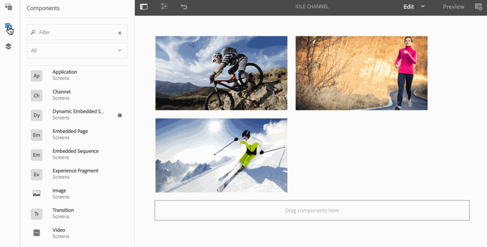
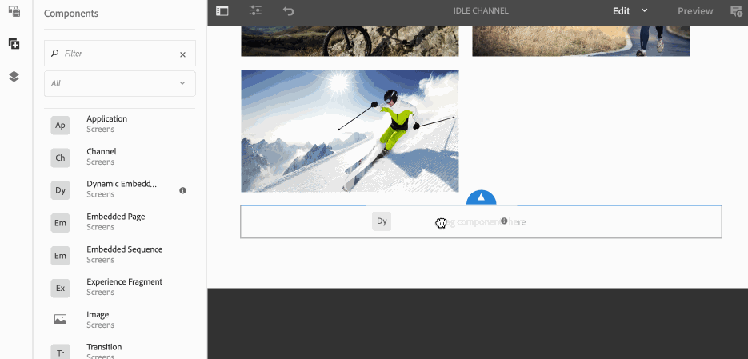

# 포함된 시퀀스 {#embedded-sequences}

>[!IMPORTANT]
>이 콘텐츠는 AEM On-Premise/AMS(AEM 6.5LTS 및 AEM 6.5)에 유효합니다. AEM as a Cloud Service Screens 콘텐츠의 경우 [AEM as a Cloud Service 안내서](https://experienceleague.adobe.com/ko/docs/experience-manager-cloud-service/content/screens-as-cloud-service/overview/introduction)를 참조하십시오.

채널에 대해 ***포함된 시퀀스***&#x200B;를 사용하면 사용자가 상위 채널에 구성 요소를 추가하고 다른 채널의 콘텐츠를 재사용하여 상위 채널에 포함할 수 있습니다.

## 포함된 시퀀스 추가 {#adding-embedded-sequences}

시퀀스 채널에 다음 구성 요소를 추가할 수 있습니다.

* 임베디드 시퀀스
* 동적 임베디드 시퀀스

>[!NOTE]
>
>Screens 프로젝트에서 다른 구성 요소를 사용하는 방법에 대한 자세한 내용은 [채널에 구성 요소 추가](adding-components-to-a-channel.md)를 참조하십시오.

### 포함된 시퀀스 추가 {#adding-an-embedded-sequence}

채널에 포함된 시퀀스를 추가할 수 있습니다. 포함된 시퀀스는 이미지 또는 비디오와 같은 에셋을 포함하는 다른 채널입니다. 포함된 시퀀스를 추가하면 사용자는 ***채널 경로***&#x200B;의 채널에 시퀀스를 추가할 수 있습니다.

>[!NOTE]
>***채널 경로***은(는) 채널에 대한 명시적 참조를 정의합니다.
>*채널 경로*&#x200B;에 대한 자세한 내용은 Screens 작성에서 [채널 할당](channel-assignment.md)을 참조하세요.

채널에 포함된 시퀀스를 추가하려면 아래 단계를 따르십시오.

1. 페이지를 포함할 채널을 클릭합니다. 예를 들어 **`We.Retail`매장 내** > **채널** > **유휴 채널**&#x200B;입니다.

1. 작업 표시줄에서 **편집**&#x200B;을 클릭합니다.
1. 편집기 모드에서 임베드된 페이지를 추가할 수 있도록 왼쪽 막대에서 구성 요소 아이콘을 클릭합니다. **포함된 시퀀스**&#x200B;을(를) 편집기로 끌어서 놓습니다.
1. 채널을 원래 시퀀스 채널에 추가할 수 있도록 **포함된 시퀀스** 구성 요소를 두 번 클릭합니다.
1. 채널의 **채널 경로**&#x200B;를 클릭합니다.
1. **시퀀스** 탭에서 포함된 채널의 **기간(밀리초)**&#x200B;을 클릭합니다. 기본적으로 기간은 **-1**(으)로 설정되어 있습니다. 즉, 포함된 채널이 완전히 실행됩니다. 지속 시간을 지정하면 지정된 시간에 하위 시퀀스가 중단됩니다(즉, 끊어짐).

1. **유료 재생 전략**&#x200B;을(를) **보통**(으)로 설정합니다.

기본적으로 **보통**(으)로 설정됩니다. 값을 **normal**(모든 항목 재생)로 설정하면 하위 시퀀스가 상위 시퀀스의 각 사이클에서 완전히 실행됩니다. 다른 가능한 값은 **단일 항목 재생**&#x200B;입니다. 이 값은 각 실행 시 하위 시퀀스의 한 항목만 표시합니다. 예를 들어 첫 번째 루프의 첫 번째 항목과 두 번째 루프의 두 번째 항목이 있습니다.

>[!IMPORTANT]
>
>포함된 시퀀스에 사용되는 채널을 동일한 디스플레이에 할당합니다.
>
>이전 단계에서 포함된 시퀀스를 채널에 추가한 후 아래 단계를 수행합니다.
>
>1. 디스플레이로 이동하고 **위치** 폴더에서 디스플레이를 클릭합니다.
>1. 작업 표시줄에서 **대시보드**&#x200B;를 클릭합니다.
>1. 디스플레이 대시보드에서 **할당된 채널 및 예약된 패널**&#x200B;에서 **+ 채널 할당**&#x200B;을 클릭하면 **채널 할당 대화 상자**&#x200B;를 열 수 있습니다.
>
>1. 포함된 시퀀스에서 사용한 채널의 경로를 **채널 경로**&#x200B;에서 클릭합니다.
>1. **우선 순위**&#x200B;가 기본 채널보다 낮은지 확인하십시오.
>
>1. **지원되는 이벤트**&#x200B;를 클릭하지 마십시오.
>1. 완료되면 **저장**&#x200B;을 클릭합니다.
>

다음 예제에서는 기존 채널(**유휴 채널**)에 포함된 시퀀스(**유휴 채널 - 야간**)를 추가하는 방법을 보여 줍니다.

### 동적 포함 시퀀스 추가 {#adding-a-dynamic-embedded-sequence}

채널에 동적 포함 시퀀스를 추가할 수 있습니다. 동적 임베디드 시퀀스는 임베디드 시퀀스와 유사하지만, 한 채널에 대한 변경/업데이트가 연관된 다른 채널에 전파되는 계층 구조를 따를 수 있습니다. 이 시퀀스는 상위-하위 계층 구조를 따르며 이미지나 비디오와 같은 에셋도 포함합니다. 동적 시퀀스를 추가하면 사용자가 채널 역할별로 채널을 추가할 수 있습니다.

>[!NOTE]
>
>***채널 역할***&#x200B;은(는) 표시의 컨텍스트를 정의합니다.
>
>*채널 역할*&#x200B;에 대한 자세한 내용은 Screens 작성의 [채널 할당](channel-assignment.md)을 참조하세요.

채널에 포함된 시퀀스를 추가하려면 아래 단계를 따르십시오.

1. 동적 시퀀스를 포함할 채널을 클릭합니다. 예를 들어 **`We.Retail`매장 내** > **채널** > **유휴 채널**&#x200B;입니다.

1. 작업 표시줄에서 **편집**&#x200B;을 클릭합니다.
1. 편집기 모드에서 동적 임베디드 시퀀스를 추가할 수 있도록 왼쪽 막대에서 구성 요소 아이콘을 클릭합니다. **Dynamic** **포함된 시퀀스**&#x200B;를 편집기로 끌어서 놓습니다.

1. **Dynamic** **포함된 시퀀스** 구성 요소를 두 번 클릭하면 시퀀스 채널에 페이지를 추가할 수 있습니다.

1. **채널 할당 역할**&#x200B;을 입력하십시오.
1. **유료 재생 전략**&#x200B;을(를) **보통**(으)로 설정합니다. 기본적으로 **보통**(으)로 설정됩니다. 값을 **normal**(모든 항목 재생)로 설정하면 하위 시퀀스가 상위 시퀀스의 각 사이클에서 완전히 실행됩니다. 다른 가능한 값은 **단일 항목 재생**&#x200B;입니다. 이 값은 각 실행 시 하위 시퀀스의 한 항목만 표시합니다. 예를 들어 첫 번째 루프의 첫 번째 항목과 두 번째 루프의 두 번째 항목이 있습니다.

1. 시퀀스에 포함된 채널의 **시퀀스** 탭에서 **기간(밀리초)**&#x200B;을 클릭합니다.

