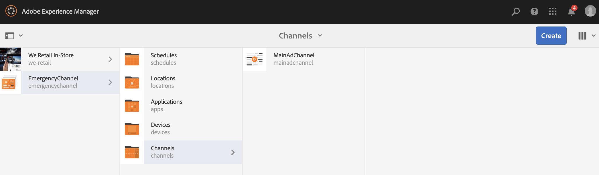
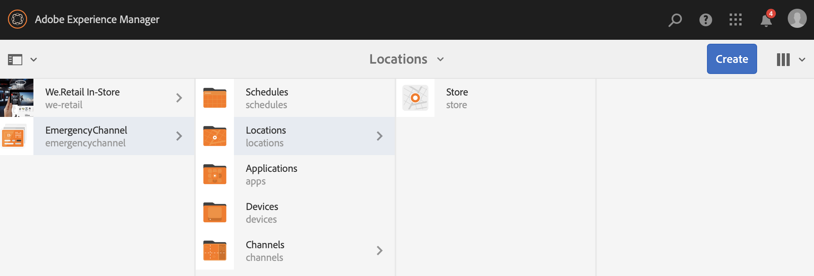
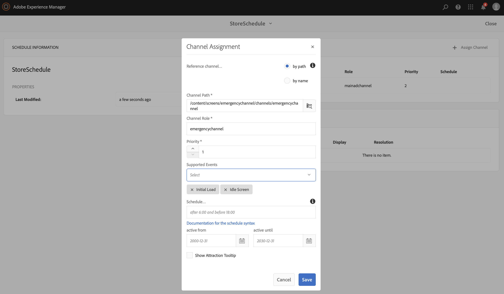
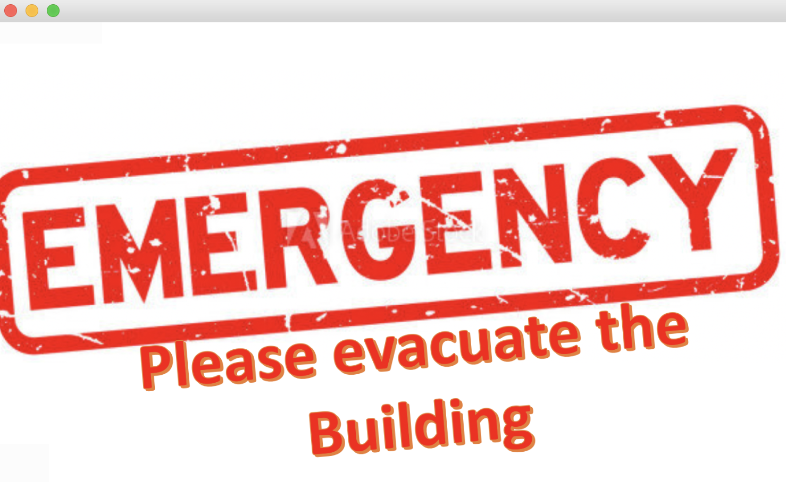

# 긴급 채널 {#emergency-channel}

## 사용 사례 설명 {#use-case-description}

이 섹션에서는 전제 조건이 있는 경우 콘텐츠 작성자가 시퀀스 채널에서 전환할 수 있는 긴급 채널을 만들고 관리하는 데 중점을 둔 사용 사례 예제를 설명합니다.

### 전제 조건 {#preconditions}

이 사용 사례를 시작하기 전에 다음 방법을 이해했는지 확인하십시오.

* **[채널 만들기 및 관리](managing-channels.md)**
* **[위치 생성 및 관리](managing-locations.md)**
* **[일정 만들기 및 관리](managing-schedules.md)**
* **[장치 등록](device-registration.md)**

### 기본 작업자 {#primary-actors}

콘텐츠 작성자

## 기본 플로우: 프로젝트 설정 {#basic-flow-setting-up-the-project}

긴급 채널을 설정하려면 아래 단계를 따르십시오.

1. (이)라는 이름의 AEM Screens 프로젝트 만들기 **긴급 채널**&#x200B;아래에 표시된 대로 를 클릭합니다.

   >[!NOTE]
   >AEM Screens에서 프로젝트를 만들고 관리하는 방법에 대한 자세한 내용은 프로젝트 만들기 를 참조하십시오.

   

1. **시퀀스 채널 만들기**

   1. 다음 항목 선택 **채널** 폴더 및 클릭 **만들기** 마법사를 열어 채널을 만듭니다.

   1. 선택 **시퀀스 채널** 마법사에서 라는 이름의 채널을 만들고 **주 광고 채널**.

   

1. **시퀀스 채널에 콘텐츠 추가**

   1. 채널 선택(**주 광고 채널**).
   1. 클릭 **편집** 작업 표시줄에서 을 클릭하여 편집기를 엽니다. 몇 개의 에셋을 채널로 드래그하여 놓습니다.

   

1. **긴급 채널 만들기**

   1. 다음 항목 선택 **채널** 폴더를 삭제합니다.
   1. 클릭 **만들기** 마법사를 열어 채널을 만듭니다.
   1. 선택 **시퀀스 채널** 마법사에서 라는 이름의 채널을 만들고 **긴급 채널**.

   >[!NOTE]
   >
   >일반적으로 긴급 채널은 기존 프로덕션 프로젝트에 추가됩니다.

   

1. **긴급 채널에 콘텐츠 추가**

   1. 채널 선택(**긴급 채널)**.
   1. 클릭 **편집** 작업 표시줄에서 을 클릭하여 편집기를 엽니다. 비상 중에 실행할 자산을 채널로 드래그 앤 드롭합니다.

   

1. **위치 생성**

   1. 다음으로 이동 **위치** 폴더를 삭제합니다.
   1. 클릭 **만들기** 작업 표시줄에서 이라는 위치를 만듭니다. **저장** 을 클릭합니다.

   

1. **위치에 디스플레이 만들기**

   내 위치로 이동(**저장**) 및 클릭 **만들기** 작업 표시줄에서 마법사에 따라 두 개의 **표시** 제목이 다음으로 지정됨 **StoreFront** 및 **StoreRear**.

   

1. **일정 만들기**

   1. 다음으로 이동 **일정** 폴더를 삭제합니다.
   1. 클릭 **만들기** 작업 표시줄에서 마법사에 따라 이라는 이름의 일정을 만듭니다. **StoreSchedule**.

   

1. 일정에 디스플레이 할당 및 우선 순위 설정

   1. 일정 선택 **(StoreSchedule)** 및 클릭 **대시보드** 작업 표시줄에서

   1. 클릭 **+ 채널 할당** 다음에서 **할당된 채널** 패널.

   1. 다음에서 **채널 할당** 대화 상자:

      1. 에 대한 경로 선택 **주 광고 채널**
      1. 설정 **우선 순위** as 2
      1. 지원되는 이벤트를 다음으로 설정 **초기 로드** 및 **유휴 화면**.
      1. **저장**&#x200B;을 클릭합니다

      마찬가지로 동일한 단계에 따라 를 할당해야 합니다. **긴급 채널** 및 설정 **우선 순위**.
   >[!NOTE]
   >
   >여러 할당이 재생 기준과 일치하는 경우 우선 순위를 사용하여 할당을 정렬합니다. 값이 가장 높은 것이 항상 낮은 값보다 우선합니다.

   

1. 클릭 **+ 채널 할당** 다음에서 **할당된 채널** 패널.

1. 다음에서 **채널 할당** 대화 상자:

   1. 에 대한 경로 선택 **긴급 채널**
   1. 설정 **우선 순위** as 1

   1. 지원되는 이벤트를 다음으로 설정 **초기 로드**, **유휴 화면**, 및 **사용자 상호 작용**

   1. **저장**&#x200B;을 클릭합니다

   

   다음에서 할당된 채널을 볼 수 있습니다. **StoreSchedule** 대시보드입니다.

   

1. **각 디스플레이에 일정 할당**

   1. 다음과 같은 각 표시로 이동합니다. **긴급 채널** —> **위치** —> **저장** —>**StoreFront**.

   1. 클릭 **대시보드** 을 클릭하여 디스플레이 대시보드를 엽니다.
   1. 클릭 **...** 다음에서 **할당된 채널 및 일정** 패널 및 추가 클릭 **+일정 할당**.

   1. 예약에 대한 경로를 선택합니다(예: 여기, **긴급 채널** —> **일정** —>**StoreSchedule**).

   1. **저장**&#x200B;을 클릭합니다.

   다음 화면에서 디스플레이에 할당된 일정을 볼 수 있습니다. **StoreSchedule** 대시보드입니다.
   

1. **장치 등록**

   장치 등록 프로세스를 완료하고 등록하면 AEM Screens 플레이어에서 다음 출력을 볼 수 있습니다.

   

## 긴급 채널로 전환 {#switching-to-emergency-channel}

긴급 상황 발생 시 다음 단계를 수행하십시오.

1. 다음으로 이동 **긴급 채널** —> **일정** —> **StoreSchedule** 및 선택 **대시보드** 작업 표시줄에서

   

1. 다음 항목 선택 **긴급 채널** 다음에서 **StoreSchedule** 대시보드 및 클릭 **할당 편집**.

   

1. 업데이트 **우선 순위** / **긴급 채널** 끝 **3** 다음에서 **채널 할당** 대화 상자 및 클릭 **저장**.

   

1. 채널의 우선 순위가 업데이트되는 즉시 모든 AEM Screens 플레이어에 가 표시됩니다. **긴급 채널** 컨텐츠(아래 참조)

   

### 결론 {#conclusion}

다음 **긴급 채널** 콘텐츠 작성자가 우선순위 값을 1로 재설정할 때까지 콘텐츠를 계속 표시합니다.

콘텐츠 작성자는 긴급 상황이 해결되었다는 지침을 받으면 의 우선 순위를 업데이트해야 합니다 **주 광고 채널** 일반 재생이 다시 시작됩니다.
