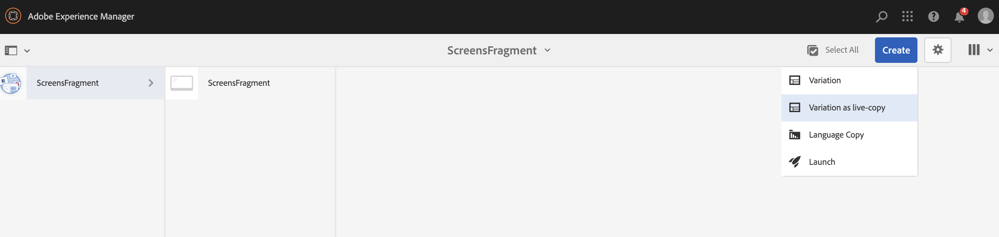
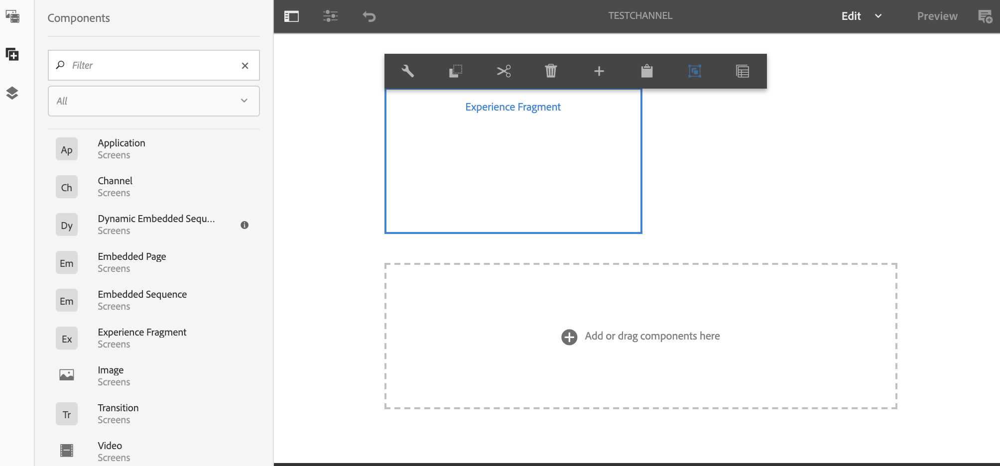

# 경험 조각 사용 {#using-experience-fragments}

이 페이지에서는 다음 주제를 다룹니다.

* **개요**
* **AEM Screens에서 경험 조각 사용**
* **페이지에 변경 내용 전파**

## 개요 {#overview}

***경험 조각***&#x200B;은(는) 페이지 내에서 참조할 수 있는 콘텐츠 및 레이아웃을 포함한 하나 이상의 구성 요소 그룹입니다. 경험 조각에는 모든 구성 요소가 포함될 수 있습니다. 예를 들어, 전체 경험에서 참조되거나 세 번째 끝점에서 요청한 단락 시스템 내의 모든 항목을 포함할 수 있는 하나 또는 여러 구성 요소를 포함할 수 있습니다.

## AEM Screens에서 경험 조각 사용 {#using-experience-fragments-in-aem-screens}

>[!NOTE]
>다음 예제에서는 경험 조각이 **Sites** 페이지에서 AEM Screens 프로젝트에 적용되는 데모 프로젝트로 **`We.Retail`**&#x200B;을(를) 사용합니다.

예를 들어 다음 워크플로에서는 Sites에서 `We.Retail`의 경험 조각을 사용하는 방법을 보여 줍니다. 웹 페이지를 선택하고 프로젝트 중 하나의 AEM Screens 채널에서 해당 콘텐츠를 사용할 수 있습니다.

### 전제 조건 {#pre-requisites}

**채널을 사용하여 데모 프로젝트 만들기**

***프로젝트 만들기***

1. 프로젝트를 만들려면 **Screens 프로젝트 만들기**&#x200B;를 클릭하십시오.
1. 제목을 **DemoProject**(으)로 입력하십시오.
1. **저장**&#x200B;을 클릭합니다.

**DemoProject**&#x200B;이(가) AEM Screens에 추가되었습니다.

***채널 만들기***

1. 만든 **DemoProject**(으)로 이동하여 **채널** 폴더를 클릭합니다.

1. 마법사를 열 수 있도록 작업 표시줄에서 **만들기**&#x200B;를 클릭합니다.
1. 마법사에서 **시퀀스 채널** 템플릿을 선택하고 **다음**&#x200B;을(를) 클릭합니다.

1. **제목**&#x200B;을(를) **TestChannel**(으)로 입력하고 **만들기**&#x200B;를 클릭합니다.

**TestChannel**&#x200B;이(가) **DemoProject**&#x200B;에 추가되었습니다.\

### 경험 조각 생성 {#creating-an-experience-fragment}

**`We.Retail`**&#x200B;의 콘텐츠를 **DemoProject**&#x200B;의 **TestChannel**&#x200B;에 적용하려면 아래 단계를 따르십시오.

1. **We.Retail에서 사이트 페이지로 이동**

   1. 사이트로 이동하고 **`We.Retail`** > **미국** > **영어** > **장비**&#x200B;를 클릭한 다음 이 페이지를 클릭하여 Screens 채널의 경험 조각으로 사용할 수 있습니다.

   1. Screens 채널에 대한 경험 조각으로 사용할 페이지를 열 수 있도록 작업 표시줄에서 **편집**&#x200B;을 클릭합니다.

1. **콘텐츠 재사용**

   1. 채널에 포함할 조각을 클릭합니다.
   1. **경험 조각으로 변환** 대화 상자를 열 수 있도록 오른쪽의 마지막 아이콘을 클릭합니다.

   

1. **경험 조각 만들기**

   1. **작업**&#x200B;을(를) **새 경험 조각 만들기**(으)로 선택합니다.

   1. **상위 경로**&#x200B;을(를) 클릭합니다.
   1. **템플릿**&#x200B;을 클릭합니다. 여기에서 **경험 조각 - Screens 변형** 템플릿을 선택하십시오(`/libs/settings/screens/experience-fragments/templates/experience-fragment-template-screens` 필드의 값).

   1. **조각 제목**&#x200B;을(를) **ScreensFragment**(으)로 입력하십시오.

   1. 새 경험 조각 만들기를 완료하려면 확인 표시를 클릭합니다.

   

   더 쉬운 옵션을 선택하려면 선택 대화 상자를 열 수 있도록 필드 오른쪽에 있는 확인 표시를 클릭합니다.

1. **경험 조각의 Live Copy 만들기**

   1. AEM 홈 페이지로 이동합니다.
   1. 아래 그림과 같이 **경험 조각**&#x200B;을 클릭하고 **ScreensFragment**&#x200B;을(를) 강조 표시한 다음 **라이브 카피로 변형**&#x200B;을(를) 클릭합니다.

   

   c. **Live Copy 만들기** 마법사에서 **ScreensFragment**&#x200B;을(를) 클릭하고 **다음**&#x200B;을(를) 클릭합니다.

   d. **제목** 및 **이름**&#x200B;을(를) **Screens**(으)로 입력합니다.

   e. **만들기**&#x200B;를 클릭하면 Live Copy를 만들 수 있습니다.

   f. **완료**&#x200B;를 클릭하면 **ScreensFragment** 페이지로 다시 이동할 수 있습니다.

   

   >[!NOTE]
   >
   >AEM Screens 조각을 만든 다음에는 조각의 속성을 편집할 수 있습니다. 조각을 클릭하고 작업 표시줄에서 **속성**&#x200B;을 클릭합니다.

   **Screens 조각의 속성 편집**

   1. 이전 단계에서 만든 **ScreensFragment**(으)로 이동하고 작업 표시줄에서 **속성**&#x200B;을(를) 클릭합니다.

   1. 아래 그림과 같이 **오프라인 구성** 탭을 클릭합니다.

   **클라이언트측 라이브러리**(Java™ 및 CSS) 및 **정적 파일**&#x200B;을 경험 조각에 추가할 수 있습니다.

   다음 예는 정적 파일의 일부로서 경험 조각에 클라이언트측 라이브러리와 글꼴을 추가하는 방법을 보여줍니다.  

1. **경험 조각을 Screens 채널에서 구성 요소로 사용**

   1. **Screens** 조각을 사용할 Screens 채널로 이동합니다.
   1. **TestChannel**&#x200B;을 클릭하고 작업 표시줄에서 **편집**&#x200B;을 클릭합니다.

   1. 측면 탭에서 구성 요소 아이콘을 클릭합니다.
   1. **경험 조각**&#x200B;을(를) 채널로 끌어다 놓습니다.

   

   e. **경험 조각** 구성 요소를 클릭하고 왼쪽 상단(렌치) 아이콘을 클릭하여 **경험 조각** 대화 상자를 열 수 있습니다.

   f. **경로**&#x200B;의 *3단계*&#x200B;에서 만든 조각의 **Screens** Live Copy를 클릭합니다.

   

   f. **경험 조각**&#x200B;의 *3단계*&#x200B;에서 만든 조각의 **Screens** Live Copy를 클릭합니다.

   

   시간. **기간**&#x200B;에 밀리초를 입력합니다.

   i. **경험 조각** 대화 상자에서 **오프라인 구성**&#x200B;을 클릭하여 클라이언트측 라이브러리와 정적 파일을 정의할 수 있습니다.

   >[!NOTE]
   >
   >(4)단계에서 구성한 내용 외에 클라이언트측 라이브러리 또는 정적 파일을 추가하려면 **경험 조각** 대화 상자의 **오프라인 구성** 탭에서 추가할 수 있습니다.

   

   j. 프로세스를 완료할 수 있도록 확인 표시를 클릭합니다.

### 결과 확인 {#validating-the-result}

이전 단계를 완료한 후 **ChannelOne**&#x200B;에서 다음 방법으로 경험 조각의 유효성을 검사할 수 있습니다.

1. **TestChannel**(으)로 이동 중입니다.
1. 작업 표시줄에서 **미리 보기**&#x200B;를 선택합니다.

아래 그림과 같이 채널의 **사이트** 페이지(경험 조각의 라이브 카피)에서 콘텐츠를 봅니다.\

## 페이지에 변경 사항 전파 {#propagating-changes-from-the-master-page}

***Live Copy***&#x200B;은(는) 롤아웃 구성에 정의된 동기화 작업에 의해 관리되는 (소스의) 복사본을 참조합니다.

만든 경험 조각은 **Sites** 페이지의 Live Copy이고 기본 페이지에서 특정 조각을 변경하면 채널에서 변경 사항을 볼 수 있습니다. 또는 경험 조각을 사용한 대상을 확인합니다.

>[!NOTE]
>
>라이브 카피에 대한 자세한 내용은 콘텐츠 재사용: 다중 사이트 관리자 및 라이브 카피 를 참조하십시오.

기본 채널에서 대상 채널로 변경 사항을 전파하려면 아래 단계를 따르십시오.

1. **Sites**(기본) 페이지에서 경험 조각을 클릭하고 연필 아이콘을 클릭하여 경험 조각의 항목을 편집할 수 있습니다.

   

1. 경험 조각 을 클릭하고 렌치 아이콘을 클릭하여 대화 상자를 열어 이미지를 편집할 수 있습니다.

   

1. **제품 표** 대화 상자가 열립니다.

   

1. 모든 이미지를 편집할 수 있습니다. 예를 들어 여기에서 첫 번째 이미지는 이 조각에서 대체됩니다.

   

1. 채널에서 사용되는 조각에 변경 사항을 전파할 수 있도록 경험 조각 을 클릭하고 롤아웃 아이콘을 클릭합니다.

   

1. 롤아웃 을 클릭합니다.

   변경 사항이 롤아웃됩니다.

   

### 변경 사항 확인 {#validating-the-changes}

채널의 변경 사항을 확인하려면 아래 단계를 따르십시오.

1. **Screens** > **채널** > **테스트 채널**&#x200B;로 이동합니다.

1. 작업 표시줄에서 **미리 보기**&#x200B;를 클릭합니다.

다음 이미지는 **TestChannel**&#x200B;의 변경 사항을 보여 줍니다.\

