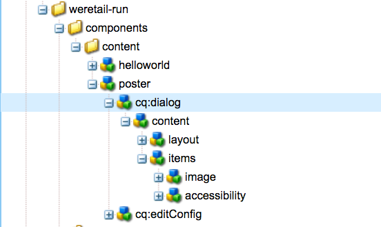

# AEM Screens 구성 요소 확장

다음 튜토리얼에서는 AEM Screens 구성 요소를 기본 제공하기 위한 단계 및 모범 사례를 안내합니다. 이미지 구성 요소가 확장되어 작성 가능한 텍스트 오버레이가 추가됩니다.

## 개요 {#overview}

이 튜토리얼은 AEM Screens을 처음 사용하는 개발자를 위한 것입니다. 이 자습서에서는 Screens 이미지 구성 요소를 확장하여 포스터 구성 요소를 만듭니다. 제목, 설명 및 로고가 이미지 위에 오버레이되어 시퀀스 채널에서 매력적인 경험을 만듭니다.

>[!NOTE]
>
>이 자습서를 시작하기 전에 다음 자습서를 완료하는 것이 좋습니다. [AEM Screens용 맞춤형 구성 요소 개발](developing-custom-component-tutorial-develop.md).


사용자 지정 포스터 구성 요소는 이미지 구성 요소를 확장하여 만들어집니다.

## 사전 요구 사항 {#prerequisites}

이 자습서를 완료하려면 다음이 필요합니다.

1. AEM 6.5 + 최신 Screens 기능 팩
1. [AEM 스크린 플레이어](/help/user-guide/aem-screens-introduction.md)
1. 로컬 개발 환경

튜토리얼 단계 및 스크린샷은 CRXDE-Lite를 사용하여 수행됩니다. [Eclipse](https://experienceleague.adobe.com/en/docs/experience-manager-65/content/implementing/developing/devtools/aem-eclipse) 또는 [IntelliJ](https://experienceleague.adobe.com/en/docs/experience-manager-65/content/implementing/developing/devtools/ht-intellij) IDE를 사용하여 자습서를 완료할 수도 있습니다. IDE 사용에 대한 추가 정보 [AEM을 사용한 개발은 여기에서 확인할 수 있습니다.](https://experienceleague.adobe.com/en/docs/experience-manager-learn/getting-started-wknd-tutorial-develop/project-archetype/project-setup).

## 프로젝트 설정 {#project-setup}

Screens 프로젝트의 소스 코드는 일반적으로 다중 모듈 Maven 프로젝트로 관리됩니다. 튜토리얼을 신속하게 수행하기 위해 다음을 사용하여 프로젝트가 사전 생성되었습니다. [AEM Project Archetype 13](https://github.com/adobe/aem-project-archetype). 에 대한 추가 세부 정보 [maven AEM Project Archetype으로 프로젝트를 만드는 방법은 여기에서 확인할 수 있습니다.](https://experienceleague.adobe.com/en/docs/experience-manager-learn/getting-started-wknd-tutorial-develop/project-archetype/project-setup).

1. 다음을 사용하여 다음 패키지를 다운로드하여 설치합니다. **CRX 패키지 관리** `http://localhost:4502/crx/packmgr/index.jsp)r:`

[파일 가져오기](assets/start-poster-screens-weretail-runuiapps-001-snapshot.zip)

   [파일 가져오기](assets/start-poster-screens-weretail-runuicontent-001-snapshot.zip)
   **선택적으로,** eclipse 또는 다른 IDE로 작업하는 경우 아래 소스 패키지를 다운로드합니다. Maven 명령을 사용하여 로컬 AEM 인스턴스에 프로젝트를 배포합니다.

   **`mvn -PautoInstallPackage clean install`**

   SRC 시작 화면 `We.Retail` 프로젝트 실행

[파일 가져오기](assets/start-poster-screens-weretail-run.zip)

1. 위치 **CRX 패키지 관리자** `http://localhost:4502/crx/packmgr/index.jsp` 다음 두 패키지가 설치됩니다.

   1. **`screens-weretail-run.ui.content-0.0.1-SNAPSHOT.zip`**
   1. **`screens-weretail-run.ui.apps-0.0.1-SNAPSHOT.zip`**

   

   AEM Screens `We.Retail Run Ui.Apps` 및 `Ui.Content` crx 패키지 관리자를 통해 설치된 패키지

## 포스터 구성 요소 만들기 {#poster-cmp}

포스터 구성 요소는 기본 AEM Screens 이미지 구성 요소를 확장합니다. 슬링의 메커니즘, `sling:resourceSuperType`를 사용하여 복사하여 붙여넣을 필요 없이 이미지 구성 요소의 핵심 기능을 상속할 수 있습니다. 의 기본 사항에 대한 추가 정보 [Sling 요청 처리는 여기에서 찾을 수 있습니다.](https://experienceleague.adobe.com/en/docs/experience-manager-65/content/implementing/developing/introduction/the-basics)

포스터 구성 요소는 미리 보기/프로덕션 모드에서 전체 화면으로 렌더링됩니다. 편집 모드에서는 시퀀스 채널 작성을 용이하게 하기 위해 구성 요소를 다르게 렌더링하는 것이 중요합니다.

1. 위치 **CRXDE-Lite** `http://localhost:4502/crx/de/index.jsp` (또는 선택 IDE) 아래에 `/apps/weretail-run/components/content`만들기 `cq:Component` 명명된 `poster`.

   에 다음 속성을 추가합니다 `poster` 구성 요소:

   ```xml
   <?xml version="1.0" encoding="UTF-8"?>
   <jcr:root xmlns:sling="https://sling.apache.org/jcr/sling/1.0" xmlns:cq="https://www.day.com/jcr/cq/1.0" xmlns:jcr="https://www.jcp.org/jcr/1.0"
       jcr:primaryType="cq:Component"
       jcr:title="Poster"
       sling:resourceSuperType="screens/core/components/content/image"
       componentGroup="We.Retail Run - Content"/>
   ```

   

   /apps/weretail-run/components/content/poster의 속성

   를 설정하여 `sling:resourceSuperType`속성이 다음과 같음 `screens/core/components/content/image`: 포스터 구성 요소는 이미지 구성 요소의 모든 기능을 효과적으로 상속합니다. 아래에 있는 동등한 노드 및 파일 `screens/core/components/content/image` 아래에 추가할 수 있습니다. `poster` 기능을 재정의하고 확장할 구성 요소입니다.

1. 다음을 복사합니다. `cq:editConfig` 노드 아래 `/libs/screens/core/components/content/image`. 붙여넣기 `cq:editConfig` 아래에 `/apps/weretail-run/components/content/poster` 구성 요소.

   다음에서 `cq:editConfig/cq:dropTargets/image/parameters` 노드, 업데이트 `sling:resourceType` 같지 않은 속성 `weretail-run/components/content/poster`.

   

   의 XML 표현 `cq:editConfig` 아래 표시:

   ```xml
   <?xml version="1.0" encoding="UTF-8"?>
   <jcr:root xmlns:sling="https://sling.apache.org/jcr/sling/1.0" xmlns:cq="https://www.day.com/jcr/cq/1.0" xmlns:jcr="https://www.jcp.org/jcr/1.0" xmlns:nt="https://www.jcp.org/jcr/nt/1.0"
       jcr:primaryType="cq:EditConfig">
       <cq:dropTargets jcr:primaryType="nt:unstructured">
           <image
               jcr:primaryType="cq:DropTargetConfig"
               accept="[image/.*]"
               groups="[media]"
               propertyName="./fileReference">
               <parameters
                   jcr:primaryType="nt:unstructured"
                   sling:resourceType="weretail-run/components/content/poster"
                   imageCrop=""
                   imageMap=""
                   imageRotate=""/>
           </image>
       </cq:dropTargets>
   </jcr:root>
   ```

1. WCM Foundation 복사 `image` 에 사용할 대화 상자 `poster` 구성 요소.

   기존 대화 상자에서 시작한 다음 수정하는 것이 가장 쉽습니다.

   1. 다음 위치에서 대화 상자를 복사합니다. `/libs/wcm/foundation/components/image/cq:dialog`
   1. 아래에 대화 상자 붙여넣기 `/apps/weretail-run/components/content/poster`

   

   다음 위치에서 복사된 대화 상자 `/libs/wcm/foundation/components/image/cq:dialog` 끝 `/apps/weretail-run/components/content/poster`

   더 AEM Screens `image` 구성 요소가 WCM Foundation으로 슈퍼타이핑되었습니다. `image` 구성 요소. 따라서 `poster` 구성 요소는 두 기능을 모두 상속합니다. 포스터 구성 요소의 대화 상자는 [스크린]과 [기초] 대화 상자의 조합으로 구성됩니다. 의 기능 **Sling 리소스 병합** 위 형식화된 구성 요소에서 상속된 관련 없는 대화 상자 필드 및 탭을 숨기는 데 사용됩니다.

1. 업데이트 `cq:dialog` 아래에 `/apps/weretail-run/components/content/poster` XML에 표시되는 다음 변경 사항:

   ```xml
   <?xml version="1.0" encoding="UTF-8"?>
   <jcr:root xmlns:sling="https://sling.apache.org/jcr/sling/1.0" xmlns:cq="https://www.day.com/jcr/cq/1.0" xmlns:jcr="https://www.jcp.org/jcr/1.0" xmlns:nt="https://www.jcp.org/jcr/nt/1.0"
       jcr:primaryType="nt:unstructured"
       jcr:title="Poster"
       sling:resourceType="cq/gui/components/authoring/dialog">
       <content
           jcr:primaryType="nt:unstructured"
           sling:resourceType="granite/ui/components/foundation/container">
           <layout
               jcr:primaryType="nt:unstructured"
               sling:resourceType="granite/ui/components/foundation/layouts/tabs"
               type="nav"/>
           <items jcr:primaryType="nt:unstructured">
               <image
                   jcr:primaryType="nt:unstructured"
                   jcr:title="Elements"
                   sling:resourceType="granite/ui/components/foundation/section">
                   <layout
                       jcr:primaryType="nt:unstructured"
                       sling:resourceType="granite/ui/components/foundation/layouts/fixedcolumns"
                       margin="{Boolean}false"/>
                   <items jcr:primaryType="nt:unstructured">
                       <column
                           jcr:primaryType="nt:unstructured"
                           sling:resourceType="granite/ui/components/foundation/container">
                           <items
                               jcr:primaryType="nt:unstructured"
                               sling:hideChildren="[linkURL,size]">
                               <file
                                   jcr:primaryType="nt:unstructured"
                                   sling:resourceType="cq/gui/components/authoring/dialog/fileupload"
                                   autoStart="{Boolean}false"
                                   class="cq-droptarget"
                                   fieldLabel="Image asset"
                                   fileNameParameter="./fileName"
                                   fileReferenceParameter="./fileReference"
                                   mimeTypes="[image]"
                                   multiple="{Boolean}false"
                                   name="./file"
                                   title="Upload Image Asset"
                                   uploadUrl="${suffix.path}"
                                   useHTML5="{Boolean}true"/>
                               <title
                                   jcr:primaryType="nt:unstructured"
                                   sling:resourceType="granite/ui/components/foundation/form/textfield"
                                   fieldLabel="Title"
                                   name="./jcr:title"/>
                               <description
                                   jcr:primaryType="nt:unstructured"
                                   sling:resourceType="granite/ui/components/foundation/form/textarea"
                                   fieldLabel="Description"
                                   name="./jcr:description"/>
                               <position
                                   jcr:primaryType="nt:unstructured"
                                   sling:resourceType="granite/ui/components/coral/foundation/form/select"
                                   fieldLabel="Text Position"
                                   name="./textPosition">
                                   <items jcr:primaryType="nt:unstructured">
                                       <left
                                           jcr:primaryType="nt:unstructured"
                                           text="Left"
                                           value="left"/>
                                       <center
                                           jcr:primaryType="nt:unstructured"
                                           text="Center"
                                           value="center"/>
                                       <right
                                           jcr:primaryType="nt:unstructured"
                                           text="Right"
                                           value="right"/>
                                   </items>
                               </position>
                               <color
                                   jcr:primaryType="nt:unstructured"
                                   sling:resourceType="granite/ui/components/coral/foundation/form/select"
                                   fieldLabel="Text Color"
                                   name="./textColor">
                                   <items jcr:primaryType="nt:unstructured">
                                       <light
                                           jcr:primaryType="nt:unstructured"
                                           text="Light"
                                           value="light"/>
                                       <dark
                                           jcr:primaryType="nt:unstructured"
                                           text="Dark"
                                           value="dark"/>
                                   </items>
                               </color>
                           </items>
                       </column>
                   </items>
               </image>
               <accessibility
                   jcr:primaryType="nt:unstructured"
                   sling:hideResource="{Boolean}true"/>
           </items>
       </content>
   </jcr:root>
   ```

   속성 `sling:hideChildren`= `"[linkURL,size]`는에서 사용됩니다. `items` 노드를 사용하여 **linkURL** 및 **크기** 대화 상자에서 필드가 숨겨집니다. 포스터 대화 상자에서 이러한 노드를 제거하는 것만으로는 충분하지 않습니다. 속성 `sling:hideResource="{Boolean}true"` 액세스 가능성 탭에서 을 사용하여 전체 탭을 숨깁니다.

   선택한 두 필드가 대화 상자에 추가되어 작성자가 제목 및 설명의 텍스트 위치와 색상을 제어할 수 있습니다.

   

   포스터 - 최종 대화 상자 구조

   이 시점에서 의 인스턴스는 `poster` 구성 요소를 **유휴 채널** 페이지의`We.Retail` 프로젝트 실행: `http://localhost:4502/editor.html/content/screens/we-retail-run/channels/idle-channel.edit.html`.

   

   포스터 대화 상자 필드

1. 아래에 파일 만들기 `/apps/weretail-run/components/content/poster` 명명된 `production.html.`

   파일을 다음과 같이 채웁니다.

   ```xml
   <!--/*
   
       /apps/weretail-run/components/content/poster/production.html
   
   */-->
   <div data-sly-use.image="image.js"
        data-duration="${properties.duration}"
        class="cmp-poster"
        style="background-image: url(${request.contextPath @ context='uri'}${image.src @ context='uri'});">
       <div class="cmp-poster__text
                   cmp-poster__text--${properties.textPosition @ context='attribute'}
                   cmp-poster__text--${properties.textColor @ context='attribute'}">
           <h1 class="cmp-poster__title">${properties.jcr:title}</h1>
            <h2 class="cmp-poster__description">${properties.jcr:description}</h2>
       </div>
    
   </div>
   ```

   포스터 구성 요소에 대한 프로덕션 마크업은 바로 위에 표시됩니다. HTL 스크립트 재정의 `screens/core/components/content/image/production.html`. 다음 `image.js` 는 POJO와 유사한 이미지 개체를 만드는 서버측 스크립트입니다. 그런 다음 Image 개체를 호출하여 `src` 를 인라인 스타일 background-image로 만듭니다.

   `The h1` h2 태그가 추가되면 구성 요소 속성에 따라 제목 및 설명 이 표시됩니다. `${properties.jcr:title}` 및 `${properties.jcr:description}`.

   주변 `h1` 및 `h2` 태그는 의 변형이 있는 3개의 CSS 클래스가 있는 div 래퍼입니다. `cmp-poster__text`&quot;. 에 대한 값 `textPosition` 및 `textColor` 속성은 작성자의 대화 상자 선택을 기반으로 렌더링된 CSS 클래스를 변경하는 데 사용됩니다. 다음 섹션에서 클라이언트 라이브러리의 CSS를 작성하여 표시에 이러한 변경 사항을 활성화합니다.

   로고는 또한 구성 요소에 오버레이로 포함됩니다. 이 예제의 경로` We.Retail` 로고가 DAM에 하드 코딩되어 있습니다. 사용 사례에 따라 로고 경로를 동적으로 채워진 값으로 만드는 대화 상자 필드를 만드는 것이 더 적절할 수 있습니다.

   또한 구성 요소에는 BEM(블록 요소 수정자) 표기법이 사용됩니다. BEM은 재사용 가능한 구성 요소를 쉽게 만들 수 있는 CSS 코딩 규칙입니다. BEM은 다음에 의해 사용되는 표기법입니다. [AEM 핵심 구성 요소](https://github.com/adobe/aem-core-wcm-components/wiki/CSS-coding-conventions). <!-- DEAD LINK More info can be found at: [https://getbem.com/](https://getbem.com/) -->

1. 아래에 파일 만들기 `/apps/weretail-run/components/content/poster` 명명된 `edit.html.`

   파일을 다음과 같이 채웁니다.

   ```xml
   <!--/*
   
       /apps/weretail-run/components/content/poster/edit.html
   
   */-->
   
   <div class="aem-Screens-editWrapper ${image.cssClass} cmp-poster" data-sly-use.image="image.js" data-emptytext="${'Poster' @ i18n, locale=request.locale}">
       
       <div class="cmp-poster__text
              cmp-poster__text--${properties.textPosition @ context='attribute'}
          cmp-poster__text--${properties.textColor @ context='attribute'}">
         <p class="cmp-poster__title">${properties.jcr:title}</p>
         <p class="cmp-poster__description">${properties.jcr:description}</p>
       </div>
   </div>
   ```

   다음 **편집** 포스터 구성 요소에 대한 마크업은 바로 위에 표시됩니다. HTL 스크립트 재정의 `/libs/screens/core/components/content/image/edit.html`. 마크업은 과 유사합니다. `production.html` 이미지 위에 제목과 설명을 표시합니다.

   다음 `aem-Screens-editWrapper`구성 요소가 편집기에서 전체 화면으로 렌더링되지 않도록 가 추가됩니다. 다음 `data-emptytext` 속성은 이미지 또는 컨텐츠가 채워지지 않은 경우 자리 표시자가 표시되도록 합니다.

## 클라이언트측 라이브러리 만들기 {#clientlibs}

클라이언트측 라이브러리는 AEM 구현에 필요한 CSS 및 JavaScript 파일을 구성하고 관리하는 메커니즘을 제공합니다. 사용에 대한 추가 정보 [클라이언트측 라이브러리는 여기에서 찾을 수 있습니다.](https://experienceleague.adobe.com/en/docs/experience-manager-65/content/implementing/developing/introduction/clientlibs)

AEM Screens 구성 요소는 편집 모드와 미리 보기/프로덕션 모드에서 다르게 렌더링됩니다. 두 세트의 클라이언트 라이브러리가 생성되는데, 하나는 편집 모드용이고 다른 하나는 미리보기/프로덕션용입니다.

1. 포스터 구성 요소의 클라이언트측 라이브러리에 대한 폴더를 만듭니다.

   아래에 `/apps/weretail-run/components/content/poster`, 폴더 만들기 `clientlibs`.

   

1. 아래 `clientlibs` 폴더, 다음 이름의 노드 만들기 `shared` 유형 `cq:ClientLibraryFolder.`

   

1. 공유 클라이언트 라이브러리에 다음 속성을 추가합니다.

   * `allowProxy` | 부울 | `true`
   * `categories` | 문자열[] | `cq.screens.components`

   

   /apps/weretail-run/components/content/poster/clientlibs/shared 속성

   다음 `categories` 속성은 클라이언트 라이브러리를 식별하는 문자열입니다. 다음 `cq.screens.components` 범주는 편집 모드와 미리 보기/프로덕션 모드 모두에서 사용됩니다. 에 정의된 모든 CSS/JS `shared` clientlib은 모든 모드에서 로드됩니다.

   프로덕션 환경에서는 경로를 /apps에 직접 노출하지 않는 것이 좋습니다. 다음 `allowProxy` 속성은 의 접두사를 통해 클라이언트 라이브러리 CSS 및 JS가 참조되도록 합니다. `/etc.clientlibs`. 에 대한 추가 정보 [allowProxy 속성은 여기에서 찾을 수 있습니다.](https://experienceleague.adobe.com/en/docs/experience-manager-65/content/implementing/developing/introduction/clientlibs)

1. 파일 만들기: `css.txt` 공유 폴더 아래에 있습니다.

   파일을 다음과 같이 채웁니다.

   ```
   #base=css
   
   styles.less
   ```

1. 다음 이름의 폴더 만들기 `css` 아래에 `shared` 폴더를 삭제합니다. 이름이 인 파일 추가 `style.less` 아래에 `css` 폴더를 삭제합니다. 이제 클라이언트 라이브러리의 구조는 다음과 같아야 합니다.

   

   이 자습서에서는 CSS를 직접 작성하는 대신 LESS를 사용합니다. [간단히](https://lesscss.org/) 는 CSS 변수, mixin 및 함수를 지원하는 널리 사용되는 CSS 사전 컴파일러입니다. AEM 클라이언트 라이브러리는 기본적으로 LESS 컴파일을 지원합니다. Sass 또는 기타 사전 컴파일러를 사용할 수 있지만 AEM 외부에서 컴파일해야 합니다.

1. 채우기 `/apps/weretail-run/components/content/poster/clientlibs/shared/css/styles.less` 다음을 사용하여:

   ```css
   /*
    /apps/weretail-run/components/content/poster/clientlibs/shared/css/styles.less
    Poster Component - Shared Style
   */
   
   @import url('https://fonts.googleapis.com/css?family=Fjalla+One|Open+Sans:400i');
   
   @text-light-color: #fff;
   @text-dark-color: #000;
   @title-font-family: 'Fjalla One', sans-serif;
   @description-font-family: 'Open Sans', sans-serif;
   
   .cmp-poster {
   
         &__text {
         position: absolute;
         color: @text-light-color;
         top: 0;
         text-align:center;
         width: 100%;
   
         &--left {
          text-align: left;
                margin-left: 1em;
         }
   
         &--right {
          text-align: right;
                margin-right: 1em;
         }
   
         &--dark {
          color: @text-dark-color;
         }
       }
   
       &__title {
         font-weight: bold;
            font-family: @title-font-family;
            font-size: 1.2em;
       }
   
       &__description {
     font-style: italic;
           font-family: @description-font-family;
    }
   
   }
   ```

   >[!NOTE]
   >
   >Google Web Fonts은 글꼴 패밀리에 사용됩니다. Web Fonts은 인터넷 연결이 필요하며 모든 AEM Screens 구현에 안정적인 연결이 있는 것은 아닙니다. 오프라인 모드를 계획하는 것은 AEM Screens 배포에 중요한 고려 사항입니다.

1. 다음을 복사합니다. `shared` 클라이언트 라이브러리 폴더입니다. 동위 멤버로 붙여넣고 이름을 로 변경합니다. `production`.

   

1. 업데이트 `categories` 다음이 될 프로덕션 클라이언트 라이브러리의 속성 `cq.screens.components.production.`

   다음 `cq.screens.components.production` 카테고리는 미리보기/프로덕션 모드일 때만 스타일이 로드되도록 합니다.

   

   /apps/weretail-run/components/content/poster/clientlibs/production에 대한 속성

1. 채우기 `/apps/weretail-run/components/content/poster/clientlibs/production/css/styles.less` 다음을 사용하여:

   ```css
   /*
    /apps/weretail-run/components/content/poster/clientlibs/production/css/styles.less
    Poster Component - Production Style
   */
   
   .cmp-poster {
   
       background-size: cover;
    height: 100%;
    width: 100%;
    position:absolute;
   
        &__text {
   
           top: 2em;
   
           &--left {
               width: 40%;
               top: 5em;
           }
   
           &--right {
               width: 40%;
               right: 1em;
           }
       }
   
       &__title {
     font-size: 5rem;
     font-weight: 900;
     margin: 0.1rem;
    }
   
    &__description {
     font-size: 2rem;
     margin: 0.1rem;
     font-weight: 400;
   
    }
   
       &__logo {
     position: absolute;
     max-width: 200px;
     top: 1em;
     left: 0;
    }
   
   }
   ```

   위의 스타일은 Title과 Description을 화면의 절대 위치에 표시합니다. 제목이 설명보다 크게 표시됩니다. 구성 요소의 BEM 표기법을 사용하여 cmp 포스터 클래스 내에서 스타일의 범위를 쉽게 지정할 수 있습니다.

세 번째 클라이언트 라이브러리 범주: `cq.screens.components.edit` 구성 요소에 특정 스타일만 편집 을 추가하는 데 사용할 수 있습니다.

| Clientlib 범주 | 사용 |
|---|---|
| `cq.screens.components` | 편집 모드와 프로덕션 모드 간에 공유되는 스타일 및 스크립트 |
| `cq.screens.components.edit` | 편집 모드에서만 사용되는 스타일 및 스크립트 |
| `cq.screens.components.production` | 프로덕션 모드에서만 사용되는 스타일 및 스크립트 |

## 시퀀스 채널에 포스터 구성 요소 추가 {#add-sequence-channel}

포스터 구성 요소는 시퀀스 채널에서 사용됩니다. 이 자습서의 시작 패키지에는 유휴 채널이 포함되어 있습니다. 유휴 채널은 그룹의 구성 요소를 허용하도록 미리 구성되어 있습니다. **`We.Retail Run - Content`**. 포스터 구성 요소의 그룹이 (으)로 설정됨 `We.Retail Run - Content` 를 채널에 추가할 수 있습니다.

1. 다음에서 유휴 채널 열기 `We.Retail` 프로젝트 실행: **`http://localhost:4502/editor.html/content/screens/we-retail-run/channels/idle-channel.edit.html`**
1. 의 새 인스턴스를 드래그 앤 드롭합니다. **포스터** 구성 요소를 작성합니다.

   

1. 이미지, 제목, 설명을 추가할 수 있도록 포스터 구성 요소의 대화 상자를 편집합니다. [텍스트 위치] 및 [텍스트 색상] 선택 항목을 사용하여 제목/설명을 이미지 위에서 읽을 수 있도록 합니다.

   

1. 몇 가지 포스터 구성 요소를 추가하려면 위의 단계를 반복하십시오. 구성 요소 사이에 전환을 추가합니다.

   

## 결합하기 {#putting-it-all-together}

아래 비디오는 완료된 구성 요소와 시퀀스 채널에 구성 요소를 추가하는 방법을 보여 줍니다. 그런 다음 채널은 위치 표시에 추가되고 최종적으로 Screens 플레이어에 할당됩니다.

>[!VIDEO](https://video.tv.adobe.com/v/22414?quaity=9)

## 완료된 코드 {#finished-code}

다음은 자습서의 완성된 코드입니다. 다음 **screens-weretail-run.ui.apps-0.0.1-SNAPSHOT.zip** 및 **screens-weretail-run.ui.content-0.0.1-SNAPSHOT.zip** 는 컴파일된 AEM 패키지입니다. 다음 **SRC-screens-weretail-run-0.0.1.zip** 는 Maven을 사용하여 배포할 수 있는 컴파일되지 않은 소스 코드입니다.

[파일 가져오기](assets/final-poster-screens-weretail-runuiapps-001-snapshot.zip)

[파일 가져오기](assets/final-poster-screens-weretail-runuicontent-001-snapshot.zip)

SRC 파이널 AEM Screens `We.Retail` 프로젝트 실행

[파일 가져오기](assets/src-screens-weretail-run-001.zip)
