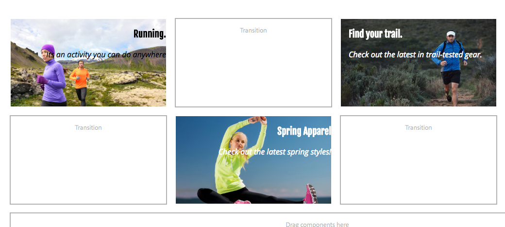

# AEM Screens 구성 요소 {#extending-an-aem-screens-component} 확장

다음 자습서에서는 AEM Screens 구성 요소 밖으로 확장하기 위한 단계 및 우수 사례를 안내합니다. 이미지 구성 요소는 제작 가능한 텍스트 오버레이를 추가하기 위해 확장됩니다.

## 개요 {#overview}

이 튜토리얼은 AEM Screens을 처음 사용하는 개발자를 위한 것입니다. 이 자습서에서는 스크린 이미지 구성 요소가 확장되어 포스터 구성 요소를 만듭니다. 제목, 설명 및 로고는 이미지 위에 겹쳐 시퀀스 채널에서 매력적인 경험을 만듭니다.

>[!NOTE]
>
>이 자습서를 시작하기 전에 자습서를 완료하는 것이 좋습니다.[AEM Screens](developing-custom-component-tutorial-develop.md)용 사용자 지정 구성 요소 개발


사용자 지정 포스터 구성 요소는 이미지 구성 요소를 확장하여 만듭니다.

## 전제 조건 {#prerequisites}

이 자습서를 완료하려면 다음 사항이 필요합니다.

1. [AEM 6.4 ](https://docs.adobe.com/content/help/ko-KR/experience-manager-64/release-notes/release-notes.html) 또는  [AEM 6.3](https://helpx.adobe.com/kr/experience-manager/6-3/release-notes.html) + 최신 스크린 기능 팩
1. [AEM 스크린 플레이어](/help/user-guide/aem-screens-introduction.md)
1. 로컬 개발 환경

자습서 단계와 스크린샷은 CRXDE-Lite를 사용하여 수행됩니다. [](https://docs.adobe.com/content/help/en/experience-manager-64/developing/devtools/aem-eclipse.html) IntelliIDE 또 [](https://docs.adobe.com/content/help/en/experience-manager-64/developing/devtools/ht-intellij.html) 는 자습서를 완료하는 데 사용할 수도 있습니다. IDE를 사용하여 [AEM을 사용하여 개발하는 방법에 대한 자세한 내용은 ](https://docs.adobe.com/content/help/en/experience-manager-learn/getting-started-wknd-tutorial-develop/project-setup.html#eclipse-ide)에서 참조할 수 있습니다.

## 프로젝트 설정 {#project-setup}

스크린 프로젝트의 소스 코드는 일반적으로 다중 모듈 Maven 프로젝트로 관리됩니다. 자습서를 더 신속하게 진행하기 위해 [AEM 프로젝트 원형 13](https://github.com/adobe/aem-project-archetype)을(를) 사용하여 프로젝트가 미리 생성되었습니다. Maven AEM Project Tranype을 사용하여 프로젝트를 만드는 방법에 대한 자세한 내용은 [에서 참조할 수 있습니다.](https://docs.adobe.com/content/help/en/experience-manager-learn/getting-started-wknd-tutorial-develop/project-setup.html#maven-multimodule)

1. **CRX 패키지 관리** `http://localhost:4502/crx/packmgr/index.jsp)r:`를 사용하여 다음 패키지를 다운로드하고 설치합니다.

   [파일 가져오기](assets/start-poster-screens-weretail-runuiapps-001-snapshot.zip)

   [파일 가져오기](assets/start-poster-screens-weretail-runuicontent-001-snapshot.zip)
   **Eclipse 또는 다른 IDE를 사용하여 작업하는** 경우 아래 소스 패키지를 다운로드할 수도 있습니다. Maven 명령을 사용하여 프로젝트를 로컬 AEM 인스턴스에 배포합니다.

   **`mvn -PautoInstallPackage clean install`**

   SRC 시작 화면 We.Retail 실행 프로젝트

   [파일 가져오기](assets/start-poster-screens-weretail-run.zip)

1. **CRX 패키지 관리자** `http://localhost:4502/crx/packmgr/index.jsp`에서 다음 두 패키지가 설치됩니다.

   1. **screens-weretail-run.ui.content-0.0.1-SNAPSHOT.zip**
   1. **screens-weretail-run.ui.apps-0.0.1-SNAPSHOT.zip**

   

   스크린 We.Retail 실행 Ui.Apps 및 Ui.CRX 패키지 관리자를 통해 설치된 컨텐츠 패키지

## 포스터 구성 요소 {#poster-cmp} 만들기

포스터 구성 요소는 기본 화면 이미지 구성 요소를 확장합니다. `sling:resourceSuperType` Sling 메커니즘은 복사 및 붙여넣기를 하지 않고도 이미지 구성 요소의 핵심 기능을 상속하는 데 사용됩니다. [Sling 요청 처리의 기본 사항에 대한 자세한 내용은 여기를 참조하십시오.](https://helpx.adobe.com/experience-manager/6-5/sites/developing/using/the-basics.html#SlingRequestProcessing)

포스터 구성 요소는 미리 보기/프로덕션 모드에서 전체 화면으로 렌더링됩니다. 편집 모드에서 구성 요소를 다르게 렌더링하여 시퀀스 채널을 쉽게 작성할 수 있도록 해야 합니다.

1. `/apps/weretail-run/components/content`아래의 **CRXDE-Lite** `http://localhost:4502/crx/de/index.jsp`(또는 선택 IDE)에서 `poster`라는 새 `cq:Component`를 만듭니다.

   `poster` 구성 요소에 다음 속성을 추가합니다.

   ```xml
   <?xml version="1.0" encoding="UTF-8"?>
   <jcr:root xmlns:sling="https://sling.apache.org/jcr/sling/1.0" xmlns:cq="https://www.day.com/jcr/cq/1.0" xmlns:jcr="https://www.jcp.org/jcr/1.0"
       jcr:primaryType="cq:Component"
       jcr:title="Poster"
       sling:resourceSuperType="screens/core/components/content/image"
       componentGroup="We.Retail Run - Content"/>
   ```

   

   /apps/weretail-run/components/content/poster용 속성

   `sling:resourceSuperType`속성을 `screens/core/components/content/image`과 동일하게 설정하면 포스터 구성 요소는 이미지 구성 요소의 모든 기능을 효과적으로 상속합니다. `screens/core/components/content/image` 아래에 있는 상응하는 노드 및 파일은 해당 기능을 재정의하고 확장하기 위해 `poster` 구성 요소 아래에 추가할 수 있습니다.

1. `/apps/weretail-run/components/content/poster` 구성 요소 아래에 `/libs/screens/core/components/content/image.`Paste the `cq:editConfig` 아래에 `cq:editConfig` 노드를 복사합니다.

   `cq:editConfig/cq:dropTargets/image/parameters` 노드에서 `sling:resourceType` 속성을 `weretail-run/components/content/poster`과(와) 동일하게 업데이트합니다.

   

   아래에 표시된 cq:editConfig의 XML 표현:

   ```xml
   <?xml version="1.0" encoding="UTF-8"?>
   <jcr:root xmlns:sling="https://sling.apache.org/jcr/sling/1.0" xmlns:cq="https://www.day.com/jcr/cq/1.0" xmlns:jcr="https://www.jcp.org/jcr/1.0" xmlns:nt="https://www.jcp.org/jcr/nt/1.0"
       jcr:primaryType="cq:EditConfig">
       <cq:dropTargets jcr:primaryType="nt:unstructured">
           <image
               jcr:primaryType="cq:DropTargetConfig"
               accept="[image/.*]"
               groups="[media]"
               propertyName="./fileReference">
               <parameters
                   jcr:primaryType="nt:unstructured"
                   sling:resourceType="weretail-run/components/content/poster"
                   imageCrop=""
                   imageMap=""
                   imageRotate=""/>
           </image>
       </cq:dropTargets>
   </jcr:root>
   ```

1. `poster` 구성 요소에 사용할 WCM Foundation `image` 대화 상자를 복사합니다.

   기존 대화 상자에서 시작한 다음 수정하는 것이 가장 쉽습니다.

   1. 대화 상자 복사 위치:`/libs/wcm/foundation/components/image/cq:dialog`
   1. `/apps/weretail-run/components/content/poster` 아래에 대화 상자 붙여넣기

   

   /libs/wcm/foundation/components/image/cq:dialog에서 /apps/weretail-run/components/content/poster로 대화 상자 복사

   스크린 `image` 구성 요소는 WCM Foundation `image` 구성 요소에 supertyped입니다. 따라서 `poster` 구성 요소는 두 가지 모두에서 기능을 상속합니다. 포스터 구성 요소의 대화 상자는 [스크린]과 [기본] 대화 상자의 조합으로 구성됩니다. **Sling Resource Combination**&#x200B;의 기능은 상위 형식의 구성 요소에서 상속된 관련 대화 상자 필드 및 탭을 숨기는 데 사용됩니다.

1. XML로 표시된 다음 변경 사항을 사용하여 `/apps/weretail-run/components/content/poster` 아래의 cq:dialog를 업데이트합니다.

   ```xml
   <?xml version="1.0" encoding="UTF-8"?>
   <jcr:root xmlns:sling="https://sling.apache.org/jcr/sling/1.0" xmlns:cq="https://www.day.com/jcr/cq/1.0" xmlns:jcr="https://www.jcp.org/jcr/1.0" xmlns:nt="https://www.jcp.org/jcr/nt/1.0"
       jcr:primaryType="nt:unstructured"
       jcr:title="Poster"
       sling:resourceType="cq/gui/components/authoring/dialog">
       <content
           jcr:primaryType="nt:unstructured"
           sling:resourceType="granite/ui/components/foundation/container">
           <layout
               jcr:primaryType="nt:unstructured"
               sling:resourceType="granite/ui/components/foundation/layouts/tabs"
               type="nav"/>
           <items jcr:primaryType="nt:unstructured">
               <image
                   jcr:primaryType="nt:unstructured"
                   jcr:title="Elements"
                   sling:resourceType="granite/ui/components/foundation/section">
                   <layout
                       jcr:primaryType="nt:unstructured"
                       sling:resourceType="granite/ui/components/foundation/layouts/fixedcolumns"
                       margin="{Boolean}false"/>
                   <items jcr:primaryType="nt:unstructured">
                       <column
                           jcr:primaryType="nt:unstructured"
                           sling:resourceType="granite/ui/components/foundation/container">
                           <items
                               jcr:primaryType="nt:unstructured"
                               sling:hideChildren="[linkURL,size]">
                               <file
                                   jcr:primaryType="nt:unstructured"
                                   sling:resourceType="cq/gui/components/authoring/dialog/fileupload"
                                   autoStart="{Boolean}false"
                                   class="cq-droptarget"
                                   fieldLabel="Image asset"
                                   fileNameParameter="./fileName"
                                   fileReferenceParameter="./fileReference"
                                   mimeTypes="[image]"
                                   multiple="{Boolean}false"
                                   name="./file"
                                   title="Upload Image Asset"
                                   uploadUrl="${suffix.path}"
                                   useHTML5="{Boolean}true"/>
                               <title
                                   jcr:primaryType="nt:unstructured"
                                   sling:resourceType="granite/ui/components/foundation/form/textfield"
                                   fieldLabel="Title"
                                   name="./jcr:title"/>
                               <description
                                   jcr:primaryType="nt:unstructured"
                                   sling:resourceType="granite/ui/components/foundation/form/textarea"
                                   fieldLabel="Description"
                                   name="./jcr:description"/>
                               <position
                                   jcr:primaryType="nt:unstructured"
                                   sling:resourceType="granite/ui/components/coral/foundation/form/select"
                                   fieldLabel="Text Position"
                                   name="./textPosition">
                                   <items jcr:primaryType="nt:unstructured">
                                       <left
                                           jcr:primaryType="nt:unstructured"
                                           text="Left"
                                           value="left"/>
                                       <center
                                           jcr:primaryType="nt:unstructured"
                                           text="Center"
                                           value="center"/>
                                       <right
                                           jcr:primaryType="nt:unstructured"
                                           text="Right"
                                           value="right"/>
                                   </items>
                               </position>
                               <color
                                   jcr:primaryType="nt:unstructured"
                                   sling:resourceType="granite/ui/components/coral/foundation/form/select"
                                   fieldLabel="Text Color"
                                   name="./textColor">
                                   <items jcr:primaryType="nt:unstructured">
                                       <light
                                           jcr:primaryType="nt:unstructured"
                                           text="Light"
                                           value="light"/>
                                       <dark
                                           jcr:primaryType="nt:unstructured"
                                           text="Dark"
                                           value="dark"/>
                                   </items>
                               </color>
                           </items>
                       </column>
                   </items>
               </image>
               <accessibility
                   jcr:primaryType="nt:unstructured"
                   sling:hideResource="{Boolean}true"/>
           </items>
       </content>
   </jcr:root>
   ```

   `sling:hideChildren`= `"[linkURL,size]`&quot; 속성은 `items` 노드에서 사용하여 **linkURL** 및 **size** 필드가 대화 상자에서 숨겨지도록 합니다. 포스터 대화 상자에서 이러한 노드를 제거해도 충분하지 않습니다. 액세스 가능성 탭의 속성 `sling:hideResource="{Boolean}true"`은 전체 탭을 숨기는 데 사용됩니다.

   두 개의 선택 필드가 대화 상자에 추가되어 작성자가 제목 및 설명의 텍스트 위치와 색상을 제어할 수 있습니다.

   

   포스터 - 최종 대화 상자 구조

   이때 `poster` 구성 요소의 인스턴스를 We.Retail 실행 프로젝트의 **유휴 채널** 페이지에 추가할 수 있습니다.`http://localhost:4502/editor.html/content/screens/we-retail-run/channels/idle-channel.edit.html`.

   

   포스터 대화 상자 필드

1. `production.html.` 이름의 `/apps/weretail-run/components/content/poster` 아래에 파일 만들기

   다음 항목으로 파일을 채웁니다.

   ```xml
   <!--/*
   
       /apps/weretail-run/components/content/poster/production.html
   
   */-->
   <div data-sly-use.image="image.js"
        data-duration="${properties.duration}"
        class="cmp-poster"
        style="background-image: url(${request.contextPath @ context='uri'}${image.src @ context='uri'});">
       <div class="cmp-poster__text
                   cmp-poster__text--${properties.textPosition @ context='attribute'}
                   cmp-poster__text--${properties.textColor @ context='attribute'}">
           <h1 class="cmp-poster__title">${properties.jcr:title}</h1>
            <h2 class="cmp-poster__description">${properties.jcr:description}</h2>
       </div>
    
   </div>
   ```

   위쪽은 포스터 구성 요소의 제작 마크업입니다. HTL 스크립트가 `screens/core/components/content/image/production.html`을(를) 무시합니다. `image.js`은 POJO와 같은 이미지 개체를 만드는 서버측 스크립트입니다. 그런 다음 이미지 개체를 호출하여 `src`을 인라인 스타일 배경 이미지로 렌더링할 수 있습니다.

   `The h1` 및 h2 태그가 추가되면 구성 요소 속성을 기반으로 제목 및 설명이 표시됩니다. `${properties.jcr:title}` 및 `${properties.jcr:description}`.

   `h1` 및 `h2` 태그 주위에는 &quot;a2/>&quot;의 변형이 있는 3개의 CSS 클래스가 있는 div 래퍼가 있습니다. `cmp-poster__text` `textPosition` 및 `textColor` 속성의 값은 작성자의 대화 상자 선택에 따라 렌더링되는 CSS 클래스를 변경하는 데 사용됩니다. 다음 섹션에서 클라이언트 라이브러리의 CSS가 기록되어 이러한 변경 사항이 표시됩니다.

   로고는 구성 요소에 오버레이로도 포함됩니다. 이 예에서 We.Retail 로고의 경로는 DAM에서 하드 코딩됩니다. 사용 사례에 따라 로고 경로를 동적으로 채워진 값으로 만들기 위해 새 대화 상자 필드를 만드는 것이 적절할 수 있습니다.

   또한 BEM(블록 요소 수정자) 표기법은 구성 요소와 함께 사용됩니다. BEM은 재사용 가능한 구성 요소를 손쉽게 만들 수 있는 CSS 코딩 규칙입니다. BEM은 [AEM 코어 구성 요소](https://github.com/Adobe-Marketing-Cloud/aem-core-wcm-components/wiki/CSS-coding-conventions)에서 사용하는 표기법입니다. 자세한 내용은[https://getbem.com/](https://getbem.com/)

1. `edit.html.` 이름의 `/apps/weretail-run/components/content/poster` 아래에 파일 만들기

   다음 항목으로 파일을 채웁니다.

   ```xml
   <!--/*
   
       /apps/weretail-run/components/content/poster/edit.html
   
   */-->
   
   <div class="aem-Screens-editWrapper ${image.cssClass} cmp-poster" data-sly-use.image="image.js" data-emptytext="${'Poster' @ i18n, locale=request.locale}">
       
       <div class="cmp-poster__text
              cmp-poster__text--${properties.textPosition @ context='attribute'}
          cmp-poster__text--${properties.textColor @ context='attribute'}">
         <p class="cmp-poster__title">${properties.jcr:title}</p>
         <p class="cmp-poster__description">${properties.jcr:description}</p>
       </div>
   </div>
   ```

   위쪽에는 포스터 구성 요소에 대한 **편집** 마크업이 있습니다. HTL 스크립트가 `/libs/screens/core/components/content/image/edit.html`을(를) 무시합니다. 마크업은 `production.html` 마크업과 비슷하며 이미지 상단에 제목과 설명을 표시합니다.

   구성 요소가 편집기에서 전체 화면을 렌더링하지 않도록 `aem-Screens-editWrapper`이 추가됩니다. `data-emptytext` 속성은 이미지나 컨텐츠가 채워지지 않았을 때 해당 자리 표시자가 표시되도록 합니다.

## 클라이언트측 라이브러리 만들기 {#clientlibs}

클라이언트측 라이브러리는 AEM 구현에 필요한 CSS 및 JavaScript 파일을 구성하고 관리하는 메커니즘을 제공합니다. [클라이언트측 라이브러리 사용에 대한 자세한 내용은 여기를 참조하십시오.](https://helpx.adobe.com/experience-manager/6-5/sites/developing/using/clientlibs.html)

AEM Screens 구성 요소는 편집 모드와 미리 보기/프로덕션 모드에서 다르게 렌더링됩니다. 두 개의 클라이언트 라이브러리 세트가 만들어지며, 하나는 편집 모드이고 다른 하나는 미리 보기/프로덕션에 사용됩니다.

1. 포스터 구성 요소에 대한 클라이언트측 라이브러리 폴더를 만듭니다.

   `/apps/weretail-run/components/content/poster,`아래 `clientlibs`라는 새 폴더를 만듭니다.

   

1. `clientlibs` 폴더 아래에 `cq:ClientLibraryFolder.` 유형의 `shared`이라는 새 노드를 만듭니다.

   

1. 공유 클라이언트 라이브러리에 다음 속성을 추가합니다.

   * `allowProxy` | 부울 | `true`
   * `categories` | 문자열[] |  `cq.screens.components`

   

   /apps/weretail-run/components/content/poster/clientlibs/shared용 속성

   `categories` 속성은 클라이언트 라이브러리를 식별하는 문자열입니다. `cq.screens.components` 카테고리는 편집 및 미리 보기/프로덕션 모드에서 모두 사용됩니다. 따라서 `shared` clientlib에 정의된 모든 CSS/JS는 모든 모드로 로드됩니다.

   제작 환경에서 모든 경로를 직접 /apps에 노출시키지 않는 것이 좋습니다. `allowProxy` 속성은 클라이언트 라이브러리 CSS 및 JS가 `/etc.clientlibs` 접두사를 통해 참조되도록 합니다. [allowProxy 속성에 대한 자세한 내용은 여기를 참조하십시오.](https://helpx.adobe.com/experience-manager/6-5/sites/developing/using/clientlibs.html#main-pars_title_8ced)

1. 공유 폴더 아래에 `css.txt`이라는 파일을 만듭니다.

   다음 항목으로 파일을 채웁니다.

   ```
   #base=css
   
   styles.less
   ```

1. `shared` 폴더 아래에 `css`이라는 폴더를 만듭니다. `css` 폴더 아래에 `style.less`이라는 파일을 추가합니다. 이제 클라이언트 라이브러리의 구조는 다음과 같아야 합니다.

   

   이 자습서에서는 CSS를 직접 작성하는 대신 LESS를 사용합니다. [LESS](https://lesscss.org/) 는 CSS 변수, 혼합 및 함수를 지원하는 널리 사용되는 CSS 사전 컴파일러입니다. AEM 클라이언트 라이브러리는 기본적으로 LESS 컴파일을 지원합니다. sass 또는 기타 사전 컴파일러는 사용할 수 있지만 AEM 외부에서 컴파일해야 합니다.

1. `/apps/weretail-run/components/content/poster/clientlibs/shared/css/styles.less`을(를) 다음 항목으로 채웁니다.

   ```css
   /*
    /apps/weretail-run/components/content/poster/clientlibs/shared/css/styles.less
    Poster Component - Shared Style
   */
   
   @import url('https://fonts.googleapis.com/css?family=Fjalla+One|Open+Sans:400i');
   
   @text-light-color: #fff;
   @text-dark-color: #000;
   @title-font-family: 'Fjalla One', sans-serif;
   @description-font-family: 'Open Sans', sans-serif;
   
   .cmp-poster {
   
         &__text {
         position: absolute;
         color: @text-light-color;
         top: 0;
         text-align:center;
         width: 100%;
   
         &--left {
          text-align: left;
                margin-left: 1em;
         }
   
         &--right {
          text-align: right;
                margin-right: 1em;
         }
   
         &--dark {
          color: @text-dark-color;
         }
       }
   
       &__title {
         font-weight: bold;
            font-family: @title-font-family;
            font-size: 1.2em;
       }
   
       &__description {
     font-style: italic;
           font-family: @description-font-family;
    }
   
   }
   ```

   >[!NOTE]
   >
   >Google 웹 글꼴은 글꼴 모음에 사용됩니다. 웹 글꼴은 인터넷 연결이 필요하며 모든 화면 구현이 안정적인 연결이 아닙니다. 오프라인 모드 계획은 스크린 배포에 있어 중요한 고려 사항입니다.

1. `shared` 클라이언트 라이브러리 폴더를 복사합니다. 동위 멤버로 붙여넣고 이름을 `production`으로 변경합니다.

   

1. 프로덕션 클라이언트 라이브러리의 `categories` 속성을 `cq.screens.components.production.`으로 업데이트합니다.

   `cq.screens.components.production` 범주는 미리 보기/프로덕션 모드에 있을 때만 스타일을 불러오도록 합니다.

   

   /apps/weretail-run/components/content/poster/clientlibs/production 속성

1. `/apps/weretail-run/components/content/poster/clientlibs/production/css/styles.less`을(를) 다음 항목으로 채웁니다.

   ```css
   /*
    /apps/weretail-run/components/content/poster/clientlibs/production/css/styles.less
    Poster Component - Production Style
   */
   
   .cmp-poster {
   
       background-size: cover;
    height: 100%;
    width: 100%;
    position:absolute;
   
        &__text {
   
           top: 2em;
   
           &--left {
               width: 40%;
               top: 5em;
           }
   
           &--right {
               width: 40%;
               right: 1em;
           }
       }
   
       &__title {
     font-size: 5rem;
     font-weight: 900;
     margin: 0.1rem;
    }
   
    &__description {
     font-size: 2rem;
     margin: 0.1rem;
     font-weight: 400;
   
    }
   
       &__logo {
     position: absolute;
     max-width: 200px;
     top: 1em;
     left: 0;
    }
   
   }
   ```

   위의 스타일은 화면에서 제목과 설명을 절대 위치에 표시합니다. 제목은 설정보다 크게 표시됩니다. 구성 요소의 BEM 표기법을 사용하면 cmp-poster 클래스 내에서 스타일을 주의 깊게 범위가 지정할 수 있습니다.

세 번째 클라이언트 라이브러리 범주:`cq.screens.components.edit`을(를) 사용하여 구성 요소에 특정 스타일만 편집하십시오.

| Clientlib 범주 | 사용량 |
|---|---|
| `cq.screens.components` | 편집 모드와 제작 모드 간에 공유되는 스타일 및 스크립트 |
| `cq.screens.components.edit` | 편집 모드에서만 사용되는 스타일 및 스크립트 |
| `cq.screens.components.production` | 프로덕션 모드에서만 사용되는 스타일 및 스크립트 |

## 시퀀스 채널 {#add-sequence-channel}에 포스터 구성 요소 추가

포스터 구성 요소는 시퀀스 채널에서 사용하도록 만들어졌습니다. 이 자습서의 시작 패키지에는 유휴 채널이 포함되어 있습니다. 유휴 채널은 **We.Retail Run - Content** 그룹의 구성 요소를 허용하도록 사전 구성되어 있습니다. 포스터 구성 요소의 그룹은 `We.Retail Run - Content`으로 설정되며 채널에 추가할 수 있습니다.

1. We.Retail 실행 프로젝트에서 유휴 채널을 엽니다.**`http://localhost:4502/editor.html/content/screens/we-retail-run/channels/idle-channel.edit.html`**
1. 오른쪽 막대에서 **포스터** 구성 요소의 새 인스턴스를 페이지로 드래그합니다.

   

1. 포스터 구성 요소의 대화 상자를 편집하여 이미지, 제목, 설명을 추가합니다. 텍스트 위치 및 텍스트 색상 옵션을 사용하여 제목/설명을 이미지 위에서 읽을 수 있도록 합니다.

   

1. 위 단계를 반복하여 몇 개의 포스터 구성 요소를 추가합니다. 구성 요소 간에 전환을 추가합니다.

   

## 모두 함께 {#putting-it-all-together}

아래 비디오에서는 완성된 구성 요소와 시퀀스 채널에 구성 요소를 추가하는 방법을 보여 줍니다. 그런 다음 채널이 위치 디스플레이에 추가되고 궁극적으로 스크린 플레이어에 할당됩니다.

>[!VIDEO](https://video.tv.adobe.com/v/22414?quaity=9)

## 완료된 코드 {#finished-code}

다음은 자습서의 완성된 코드입니다. **screens-weretail-run.ui.apps-0.0.1-SNAPSHOT.zip** 및 **screens-weretail-run.ui.content-0.0.1-SNAPSHOT.zip**&#x200B;은 컴파일된 AEM 패키지입니다. **SRC-screens-weretail-run-0.0.1.zip **은 Maven을 사용하여 배포할 수 있는 컴파일되지 않은 소스 코드입니다.

[파일 가져오기](assets/final-poster-screens-weretail-runuiapps-001-snapshot.zip)

[파일 가져오기](assets/final-poster-screens-weretail-runuicontent-001-snapshot.zip)

SRC 최종 화면 We.Retail 실행 프로젝트

[파일 가져오기](assets/src-screens-weretail-run-001.zip)
