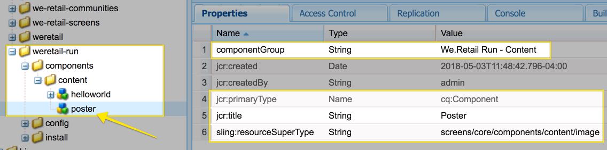

# AEM Screens 구성 요소 확장 {#extending-an-aem-screens-component}

다음 자습서에서는 기본 제공 AEM Screens 구성 요소를 확장하는 단계 및 모범 사례를 설명합니다. 이미지 구성 요소가 확장되어 작성 가능한 텍스트 오버레이를 추가합니다.

## 개요 {#overview}

이 튜토리얼은 AEM Screens을 처음 사용하는 개발자를 위한 것입니다. 이 자습서에서는 스크린 이미지 구성 요소가 확장되어 포스터 구성 요소를 만듭니다. 제목, 설명 및 로고는 이미지 위에 오버레이되어 시퀀스 채널에서 매력적인 경험을 만듭니다.

>[!NOTE]
>
>이 자습서를 시작하기 전에 자습서를 완료하는 것이 좋습니다. [AEM Screens용 사용자 지정 구성 요소 개발](developing-custom-component-tutorial-develop.md).


사용자 지정 포스터 구성 요소는 이미지 구성 요소를 확장하여 만들어집니다.

## 사전 요구 사항 {#prerequisites}

이 자습서를 완료하려면 다음이 필요합니다.

1. [AEM 6.4](https://experienceleague.adobe.com/docs/experience-manager-64/release-notes/release-notes.html?lang=ko-KR) 또는 [AEM 6.3](https://experienceleague.adobe.com/docs/experience-manager-release-information/aem-release-updates/previous-updates/aem-previous-versions.html) + 최신 스크린 기능 팩
1. [AEM 스크린 플레이어](/help/user-guide/aem-screens-introduction.md)
1. 로컬 개발 환경

자습서 단계 및 스크린샷은 CRXDE-Lite를 사용하여 수행됩니다. [Eclipse](https://experienceleague.adobe.com/docs/experience-manager-64/developing/devtools/aem-eclipse.html) 또는 [IntelliJ](https://experienceleague.adobe.com/docs/experience-manager-64/developing/devtools/ht-intellij.html) IDE를 사용하여 자습서를 완료할 수도 있습니다. IDE를 사용하여 다음을 수행하는 방법에 대한 자세한 정보 [AEM으로 개발](https://experienceleague.adobe.com/docs/experience-manager-learn/getting-started-wknd-tutorial-develop/project-archetype/project-setup.html).

## 프로젝트 설정 {#project-setup}

스크린 프로젝트의 소스 코드는 일반적으로 다중 모듈 Maven 프로젝트로 관리됩니다. 자습서를 더 신속히 처리하기 위해 를 사용하여 프로젝트가 미리 생성되었습니다 [AEM 프로젝트 원형 13](https://github.com/adobe/aem-project-archetype). 세부 정보 [maven AEM Project Archetype을 사용하여 프로젝트 만들기는 여기에서 확인할 수 있습니다.](https://experienceleague.adobe.com/docs/experience-manager-learn/getting-started-wknd-tutorial-develop/project-archetype/project-setup.html).

1. 을 사용하여 다음 패키지를 다운로드하여 설치합니다 **CRX 패키지 관리** `http://localhost:4502/crx/packmgr/index.jsp)r:`

[파일 가져오기](assets/start-poster-screens-weretail-runuiapps-001-snapshot.zip)

   [파일 가져오기](assets/start-poster-screens-weretail-runuicontent-001-snapshot.zip)
   **원할 경우,** eclipse 또는 다른 IDE를 사용하여 작업하는 경우 아래 소스 패키지를 다운로드하십시오. Maven 명령을 사용하여 프로젝트를 로컬 AEM 인스턴스에 배포합니다.

   **`mvn -PautoInstallPackage clean install`**

   SRC 시작 화면 We.Retail 실행 프로젝트

[파일 가져오기](assets/start-poster-screens-weretail-run.zip)

1. in **CRX 패키지 관리자** `http://localhost:4502/crx/packmgr/index.jsp` 다음 두 개의 패키지가 설치됩니다.

   1. **screens-weretail-run.ui.content-0.0.1-SNAPSHOT.zip**
   1. **screens-weretail-run.ui.apps-0.0.1-SNAPSHOT.zip**

   

   Screens We.Retail 실행 Ui.Apps 및 Ui.Content 패키지가 CRX Package Manager를 통해 설치됨

## 포스터 구성 요소 만들기 {#poster-cmp}

포스터 구성 요소는 기본 제공되는 screens 이미지 구성 요소를 확장합니다. 슬링 메커니즘 `sling:resourceSuperType`는 복사 및 붙여넣을 필요 없이 이미지 구성 요소의 핵심 기능을 상속하는 데 사용됩니다. 의 기본 사항에 대한 자세한 정보 [Sling 요청 처리는 여기에서 찾을 수 있습니다.](https://experienceleague.adobe.com/docs/experience-manager-65/developing/introduction/the-basics.html)

포스터 구성 요소는 미리 보기/프로덕션 모드에서 전체 화면으로 렌더링됩니다. 편집 모드에서 시퀀스 채널을 쉽게 작성할 수 있도록 구성 요소를 다르게 렌더링하는 것이 중요합니다.

1. in **CRXDE-Lite** `http://localhost:4502/crx/de/index.jsp` (또는 선택 가능한 IDE) 아래 `/apps/weretail-run/components/content`만들기 `cq:Component` 명명된 이름 `poster`.

   다음 속성을 `poster` 구성 요소:

   ```xml
   <?xml version="1.0" encoding="UTF-8"?>
   <jcr:root xmlns:sling="https://sling.apache.org/jcr/sling/1.0" xmlns:cq="https://www.day.com/jcr/cq/1.0" xmlns:jcr="https://www.jcp.org/jcr/1.0"
       jcr:primaryType="cq:Component"
       jcr:title="Poster"
       sling:resourceSuperType="screens/core/components/content/image"
       componentGroup="We.Retail Run - Content"/>
   ```

   

   /apps/weretail-run/components/content/poster에 대한 속성

   다음을 설정하여 `sling:resourceSuperType`다음과 같은 속성 `screens/core/components/content/image` 포스터 구성 요소는 이미지 구성 요소의 모든 기능을 효과적으로 상속합니다. 그 아래에 있는 등가 노드 및 파일 `screens/core/components/content/image` 아래에 을 추가할 수 있습니다. `poster` 구성 요소를 사용하여 기능을 재정의하고 확장합니다.

1. 를 복사합니다. `cq:editConfig` 노드 아래 `/libs/screens/core/components/content/image.`붙여넣기 `cq:editConfig` 아래 `/apps/weretail-run/components/content/poster` 구성 요소.

   설정 `cq:editConfig/cq:dropTargets/image/parameters` 노드 업데이트 `sling:resourceType` 속성이 같음 `weretail-run/components/content/poster`.

   

   아래에 표시된 cq:editConfig의 XML 표현:

   ```xml
   <?xml version="1.0" encoding="UTF-8"?>
   <jcr:root xmlns:sling="https://sling.apache.org/jcr/sling/1.0" xmlns:cq="https://www.day.com/jcr/cq/1.0" xmlns:jcr="https://www.jcp.org/jcr/1.0" xmlns:nt="https://www.jcp.org/jcr/nt/1.0"
       jcr:primaryType="cq:EditConfig">
       <cq:dropTargets jcr:primaryType="nt:unstructured">
           <image
               jcr:primaryType="cq:DropTargetConfig"
               accept="[image/.*]"
               groups="[media]"
               propertyName="./fileReference">
               <parameters
                   jcr:primaryType="nt:unstructured"
                   sling:resourceType="weretail-run/components/content/poster"
                   imageCrop=""
                   imageMap=""
                   imageRotate=""/>
           </image>
       </cq:dropTargets>
   </jcr:root>
   ```

1. WCM Foundation 복사 `image` 사용할 대화 상자 `poster` 구성 요소.

   기존 대화 상자에서 시작한 다음 수정하는 것이 가장 쉽습니다.

   1. 다음 위치에서 대화 상자 복사: `/libs/wcm/foundation/components/image/cq:dialog`
   1. 아래에 대화 상자를 붙여넣습니다. `/apps/weretail-run/components/content/poster`

   

   /libs/wcm/foundation/components/image/cq:dialog에서 /apps/weretail-run/components/content/poster로 대화 상자를 복사했습니다

   스크린 `image` 구성 요소가 WCM Foundation에 겹쳐집니다 `image` 구성 요소. 따라서 `poster` 구성 요소는 두 구성 요소의 기능을 모두 상속합니다. 포스터 구성 요소의 대화 상자는 [스크린]과 [기초] 대화 상자의 조합으로 구성됩니다. 의 기능 **Sling Resource Merger** 상위 형식화된 구성 요소에서 상속된 관련이 없는 대화 상자 필드 및 탭을 숨기는 데 사용됩니다.

1. 아래의 cq:dialog 를 업데이트합니다 `/apps/weretail-run/components/content/poster` 다음 변경 사항이 XML에 표시되어 있습니다.

   ```xml
   <?xml version="1.0" encoding="UTF-8"?>
   <jcr:root xmlns:sling="https://sling.apache.org/jcr/sling/1.0" xmlns:cq="https://www.day.com/jcr/cq/1.0" xmlns:jcr="https://www.jcp.org/jcr/1.0" xmlns:nt="https://www.jcp.org/jcr/nt/1.0"
       jcr:primaryType="nt:unstructured"
       jcr:title="Poster"
       sling:resourceType="cq/gui/components/authoring/dialog">
       <content
           jcr:primaryType="nt:unstructured"
           sling:resourceType="granite/ui/components/foundation/container">
           <layout
               jcr:primaryType="nt:unstructured"
               sling:resourceType="granite/ui/components/foundation/layouts/tabs"
               type="nav"/>
           <items jcr:primaryType="nt:unstructured">
               <image
                   jcr:primaryType="nt:unstructured"
                   jcr:title="Elements"
                   sling:resourceType="granite/ui/components/foundation/section">
                   <layout
                       jcr:primaryType="nt:unstructured"
                       sling:resourceType="granite/ui/components/foundation/layouts/fixedcolumns"
                       margin="{Boolean}false"/>
                   <items jcr:primaryType="nt:unstructured">
                       <column
                           jcr:primaryType="nt:unstructured"
                           sling:resourceType="granite/ui/components/foundation/container">
                           <items
                               jcr:primaryType="nt:unstructured"
                               sling:hideChildren="[linkURL,size]">
                               <file
                                   jcr:primaryType="nt:unstructured"
                                   sling:resourceType="cq/gui/components/authoring/dialog/fileupload"
                                   autoStart="{Boolean}false"
                                   class="cq-droptarget"
                                   fieldLabel="Image asset"
                                   fileNameParameter="./fileName"
                                   fileReferenceParameter="./fileReference"
                                   mimeTypes="[image]"
                                   multiple="{Boolean}false"
                                   name="./file"
                                   title="Upload Image Asset"
                                   uploadUrl="${suffix.path}"
                                   useHTML5="{Boolean}true"/>
                               <title
                                   jcr:primaryType="nt:unstructured"
                                   sling:resourceType="granite/ui/components/foundation/form/textfield"
                                   fieldLabel="Title"
                                   name="./jcr:title"/>
                               <description
                                   jcr:primaryType="nt:unstructured"
                                   sling:resourceType="granite/ui/components/foundation/form/textarea"
                                   fieldLabel="Description"
                                   name="./jcr:description"/>
                               <position
                                   jcr:primaryType="nt:unstructured"
                                   sling:resourceType="granite/ui/components/coral/foundation/form/select"
                                   fieldLabel="Text Position"
                                   name="./textPosition">
                                   <items jcr:primaryType="nt:unstructured">
                                       <left
                                           jcr:primaryType="nt:unstructured"
                                           text="Left"
                                           value="left"/>
                                       <center
                                           jcr:primaryType="nt:unstructured"
                                           text="Center"
                                           value="center"/>
                                       <right
                                           jcr:primaryType="nt:unstructured"
                                           text="Right"
                                           value="right"/>
                                   </items>
                               </position>
                               <color
                                   jcr:primaryType="nt:unstructured"
                                   sling:resourceType="granite/ui/components/coral/foundation/form/select"
                                   fieldLabel="Text Color"
                                   name="./textColor">
                                   <items jcr:primaryType="nt:unstructured">
                                       <light
                                           jcr:primaryType="nt:unstructured"
                                           text="Light"
                                           value="light"/>
                                       <dark
                                           jcr:primaryType="nt:unstructured"
                                           text="Dark"
                                           value="dark"/>
                                   </items>
                               </color>
                           </items>
                       </column>
                   </items>
               </image>
               <accessibility
                   jcr:primaryType="nt:unstructured"
                   sling:hideResource="{Boolean}true"/>
           </items>
       </content>
   </jcr:root>
   ```

   속성 `sling:hideChildren`= `"[linkURL,size]`&quot; `items` 노드 **linkURL** 및 **크기** 필드는 대화 상자에서 숨겨집니다. 포스터 대화 상자에서 이러한 노드를 제거해도 충분하지 않습니다. 속성 `sling:hideResource="{Boolean}true"` 액세스 가능성 탭에서 전체 탭을 숨기는 데 사용됩니다.

   두 개의 선택 필드가 대화 상자에 추가되어 작성자가 제목 및 설명의 텍스트 위치와 색상을 제어할 수 있습니다.

   

   포스터 - 최종 대화 상자 구조

   이 시점에서 의 인스턴스가 `poster` 구성 요소를 **유휴 채널** We.Retail 실행 프로젝트의 페이지: `http://localhost:4502/editor.html/content/screens/we-retail-run/channels/idle-channel.edit.html`.

   

   포스터 대화 상자 필드

1. 아래의 파일 만들기 `/apps/weretail-run/components/content/poster` 명명된 이름 `production.html.`

   파일을 다음으로 채웁니다.

   ```xml
   <!--/*
   
       /apps/weretail-run/components/content/poster/production.html
   
   */-->
   <div data-sly-use.image="image.js"
        data-duration="${properties.duration}"
        class="cmp-poster"
        style="background-image: url(${request.contextPath @ context='uri'}${image.src @ context='uri'});">
       <div class="cmp-poster__text
                   cmp-poster__text--${properties.textPosition @ context='attribute'}
                   cmp-poster__text--${properties.textColor @ context='attribute'}">
           <h1 class="cmp-poster__title">${properties.jcr:title}</h1>
            <h2 class="cmp-poster__description">${properties.jcr:description}</h2>
       </div>
    
   </div>
   ```

   위에 포스터 구성 요소의 프로덕션 마크업이 있습니다. HTL 스크립트 무시 `screens/core/components/content/image/production.html`. 다음 `image.js` 는 POJO 유사 이미지 개체를 만드는 서버측 스크립트입니다. 그런 다음 Image 개체를 호출하여 `src` 인라인 스타일 배경-이미지로 사용.

   `The h1` 및 h2 태그가 추가되면 구성 요소 속성을 기반으로 제목 및 설명이 표시됩니다. `${properties.jcr:title}` 및 `${properties.jcr:description}`.

   주변 `h1` 및 `h2` 태그는 변형된 세 개의 CSS 클래스를 사용하는 div 래퍼입니다. `cmp-poster__text`&quot;. 에 대한 값 `textPosition` 및 `textColor` 속성은 작성자의 대화 상자 선택에 따라 렌더링되는 CSS 클래스를 변경하는 데 사용됩니다. 다음 섹션에서 클라이언트 라이브러리의 CSS가 기록되어 이러한 변경 사항이 표시됩니다.

   로고는 구성 요소에 오버레이로도 포함됩니다. 이 예에서 We.Retail 로고의 경로는 DAM에서 하드 코딩됩니다. 사용 사례에 따라 로고 경로를 동적으로 채워진 값으로 만드는 대화 상자 필드를 만드는 것이 적절할 수 있습니다.

   또한 BEM(블록 요소 수정자) 표기법은 구성 요소와 함께 사용됩니다. BEM은 재사용 가능한 구성 요소를 쉽게 만들 수 있는 CSS 코딩 규칙입니다. BEM은 [AEM 코어 구성 요소](https://github.com/adobe/aem-core-wcm-components/wiki/CSS-coding-conventions). <!-- DEAD LINK More info can be found at: [https://getbem.com/](https://getbem.com/) -->

1. 아래의 파일 만들기 `/apps/weretail-run/components/content/poster` 명명된 이름 `edit.html.`

   파일을 다음으로 채웁니다.

   ```xml
   <!--/*
   
       /apps/weretail-run/components/content/poster/edit.html
   
   */-->
   
   <div class="aem-Screens-editWrapper ${image.cssClass} cmp-poster" data-sly-use.image="image.js" data-emptytext="${'Poster' @ i18n, locale=request.locale}">
       
       <div class="cmp-poster__text
              cmp-poster__text--${properties.textPosition @ context='attribute'}
          cmp-poster__text--${properties.textColor @ context='attribute'}">
         <p class="cmp-poster__title">${properties.jcr:title}</p>
         <p class="cmp-poster__description">${properties.jcr:description}</p>
       </div>
   </div>
   ```

   위의 항목은 다음과 같습니다 **편집** [포스터 구성 요소]에 대한 마크업. HTL 스크립트 무시 `/libs/screens/core/components/content/image/edit.html`. 마크업은 `production.html` 마크업 및 이미지 상단에 제목과 설명을 표시합니다.

   다음 `aem-Screens-editWrapper`구성 요소가 편집기에서 전체 화면이 렌더링되지 않도록 가 추가되었습니다. 다음 `data-emptytext` 속성을 사용하면 이미지나 컨텐츠가 채워지지 않을 때 자리 표시자가 표시됩니다.

## 클라이언트측 라이브러리 만들기 {#clientlibs}

클라이언트측 라이브러리는 AEM 구현에 필요한 CSS 및 JavaScript 파일을 구성하고 관리하는 메커니즘을 제공합니다. 사용에 대한 자세한 정보 [클라이언트측 라이브러리는 여기에서 찾을 수 있습니다.](https://experienceleague.adobe.com/docs/experience-manager-65/developing/introduction/clientlibs.html?lang=en)

AEM Screens 구성 요소가 편집 모드와 미리 보기/프로덕션 모드에서 다르게 렌더링됩니다. 두 개의 클라이언트 라이브러리 세트가 만들어지는데, 하나는 편집 모드이고 다른 하나는 미리 보기/프로덕션입니다.

1. 포스터 구성 요소의 클라이언트 측 라이브러리에 대한 폴더를 만듭니다.

   아래 `/apps/weretail-run/components/content/poster,`이름이 지정된 폴더 만들기 `clientlibs`.

   

1. 아래 `clientlibs` 폴더 이름이 지정된 노드 만들기 `shared` 유형 `cq:ClientLibraryFolder.`

   

1. 공유 클라이언트 라이브러리에 다음 속성을 추가합니다.

   * `allowProxy` | 부울 | `true`
   * `categories` | 문자열[] | `cq.screens.components`

   

   /apps/weretail-run/components/content/poster/clientlibs/shared에 대한 속성

   다음 `categories` 속성은 클라이언트 라이브러리를 식별하는 문자열입니다. 다음 `cq.screens.components` 카테고리는 편집 및 미리 보기/프로덕션 모드에서 모두 사용됩니다. 따라서 CSS/JS는 `shared` clientlib은 모든 모드로 로드됩니다.

   프로덕션 환경에서 /apps에 직접 경로를 노출하지 않는 것이 좋습니다. 다음 `allowProxy` 속성을 사용하면 클라이언트 라이브러리 CSS 및 JS가 `/etc.clientlibs`. 에 대한 추가 정보 [allowProxy 속성은 여기에서 찾을 수 있습니다.](https://experienceleague.adobe.com/docs/experience-manager-65/developing/introduction/clientlibs.html?lang=en)

1. 이름이 인 파일 만들기 `css.txt` 공유 폴더 아래에 표시됩니다.

   파일을 다음으로 채웁니다.

   ```
   #base=css
   
   styles.less
   ```

1. 이름이 인 폴더 만들기 `css` 아래 `shared` 폴더를 입력합니다. 이름이 인 파일 추가 `style.less` 아래 `css` 폴더를 입력합니다. 이제 클라이언트 라이브러리의 구조는 다음과 같습니다.

   

   이 자습서에서는 CSS를 직접 쓰는 대신 LESS를 사용합니다. [LESS](https://lesscss.org/) 는 CSS 변수, mixin 및 함수를 지원하는 인기 있는 CSS 사전 컴파일러입니다. AEM 클라이언트 라이브러리는 기본적으로 LESS 컴파일을 지원합니다. Sass 또는 기타 사전 컴파일러는 사용할 수 있지만 AEM 외부에서 컴파일해야 합니다.

1. 채우기 `/apps/weretail-run/components/content/poster/clientlibs/shared/css/styles.less` 사용:

   ```css
   /*
    /apps/weretail-run/components/content/poster/clientlibs/shared/css/styles.less
    Poster Component - Shared Style
   */
   
   @import url('https://fonts.googleapis.com/css?family=Fjalla+One|Open+Sans:400i');
   
   @text-light-color: #fff;
   @text-dark-color: #000;
   @title-font-family: 'Fjalla One', sans-serif;
   @description-font-family: 'Open Sans', sans-serif;
   
   .cmp-poster {
   
         &__text {
         position: absolute;
         color: @text-light-color;
         top: 0;
         text-align:center;
         width: 100%;
   
         &--left {
          text-align: left;
                margin-left: 1em;
         }
   
         &--right {
          text-align: right;
                margin-right: 1em;
         }
   
         &--dark {
          color: @text-dark-color;
         }
       }
   
       &__title {
         font-weight: bold;
            font-family: @title-font-family;
            font-size: 1.2em;
       }
   
       &__description {
     font-style: italic;
           font-family: @description-font-family;
    }
   
   }
   ```

   >[!NOTE]
   >
   >Google Web Fonts은 글꼴 패밀리에 사용됩니다. Web Fonts은 인터넷 연결을 필요로 하며, 일부 screens 구현은 안정적인 연결을 필요로 하지 않습니다. 오프라인 모드 계획은 스크린 배포에 중요한 고려 사항입니다.

1. 를 복사합니다. `shared` 클라이언트 라이브러리 폴더. 동위 멤버로 붙여넣고 이름을 다음으로 변경합니다. `production`.

   

1. 업데이트 `categories` 사용할 프로덕션 clientlibrary 속성 `cq.screens.components.production.`

   다음 `cq.screens.components.production` 카테고리를 사용하면 미리 보기/프로덕션 모드에 있을 때만 스타일이 로드됩니다.

   

   /apps/weretail-run/components/content/poster/clientlibs/production에 대한 속성

1. 채우기 `/apps/weretail-run/components/content/poster/clientlibs/production/css/styles.less` 사용:

   ```css
   /*
    /apps/weretail-run/components/content/poster/clientlibs/production/css/styles.less
    Poster Component - Production Style
   */
   
   .cmp-poster {
   
       background-size: cover;
    height: 100%;
    width: 100%;
    position:absolute;
   
        &__text {
   
           top: 2em;
   
           &--left {
               width: 40%;
               top: 5em;
           }
   
           &--right {
               width: 40%;
               right: 1em;
           }
       }
   
       &__title {
     font-size: 5rem;
     font-weight: 900;
     margin: 0.1rem;
    }
   
    &__description {
     font-size: 2rem;
     margin: 0.1rem;
     font-weight: 400;
   
    }
   
       &__logo {
     position: absolute;
     max-width: 200px;
     top: 1em;
     left: 0;
    }
   
   }
   ```

   위의 스타일은 화면에서 제목 및 설명을 절대 위치에 표시합니다. 제목이 설명보다 크게 표시됩니다. 구성 요소의 BEM 표기법을 사용하면 cmp-poster 클래스 내에서 스타일을 쉽게 범위로 지정할 수 있습니다.

세 번째 clientlibrary 카테고리: `cq.screens.components.edit` 를 사용하여 특정 스타일만 구성 요소에 추가할 수 있습니다.

| Clientlib 카테고리 | 사용량 |
|---|---|
| `cq.screens.components` | 편집 모드와 프로덕션 모드 간에 공유되는 스타일 및 스크립트 |
| `cq.screens.components.edit` | 편집 모드에서만 사용되는 스타일 및 스크립트 |
| `cq.screens.components.production` | 프로덕션 모드에서만 사용되는 스타일 및 스크립트 |

## 시퀀스 채널에 포스터 구성 요소 추가 {#add-sequence-channel}

포스터 구성 요소는 시퀀스 채널에서 사용됩니다. 이 자습서의 시작 패키지에는 유휴 채널이 포함되어 있습니다. 유휴 채널은 그룹의 구성 요소를 허용하도록 사전 구성되어 있습니다 **We.Retail 실행 - 컨텐츠**. 포스터 구성 요소의 그룹이 `We.Retail Run - Content` 및 을 채널에 추가할 수 있습니다.

1. We.Retail 실행 프로젝트에서 유휴 채널 을 엽니다. **`http://localhost:4502/editor.html/content/screens/we-retail-run/channels/idle-channel.edit.html`**
1. 드래그 + 의 새 인스턴스를 삭제합니다. **포스터** 구성 요소를 생성하지 않습니다.

   

1. 포스터 구성 요소의 대화 상자를 편집하여 이미지, 제목, 설명을 추가합니다. 텍스트 위치 및 텍스트 색상 선택 사항을 사용하여 이미지 위에서 제목/설명을 읽을 수 있도록 합니다.

   

1. 위의 단계를 반복하여 몇 가지 포스터 구성 요소를 추가합니다. 구성 요소 사이에 전환을 추가합니다.

   

## 결합하기 {#putting-it-all-together}

아래 비디오에서는 완료된 구성 요소와 시퀀스 채널에 추가하는 방법을 보여줍니다. 그런 다음 채널이 위치 표시에 추가되고 궁극적으로 스크린 플레이어에 할당됩니다.

>[!VIDEO](https://video.tv.adobe.com/v/22414?quaity=9)

## 완료된 코드 {#finished-code}

다음은 자습서에서 완성된 코드입니다. 다음 **screens-weretail-run.ui.apps-0.0.1-SNAPSHOT.zip** 및 **screens-weretail-run.ui.content-0.0.1-SNAPSHOT.zip** 는 컴파일된 AEM 패키지입니다. **SRC-screens-weretail-run-0.0.1.zip **는 Maven을 사용하여 배포할 수 있는 컴파일되지 않은 소스 코드입니다.

[파일 가져오기](assets/final-poster-screens-weretail-runuiapps-001-snapshot.zip)

[파일 가져오기](assets/final-poster-screens-weretail-runuicontent-001-snapshot.zip)

SRC 최종 화면 We.Retail 실행 프로젝트

[파일 가져오기](assets/src-screens-weretail-run-001.zip)
