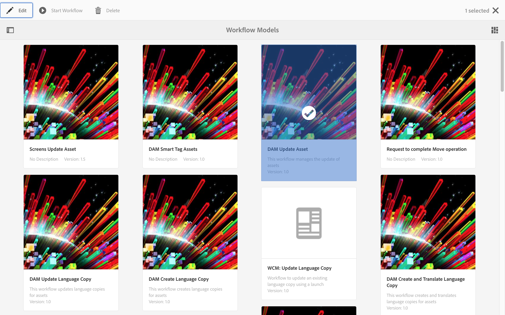
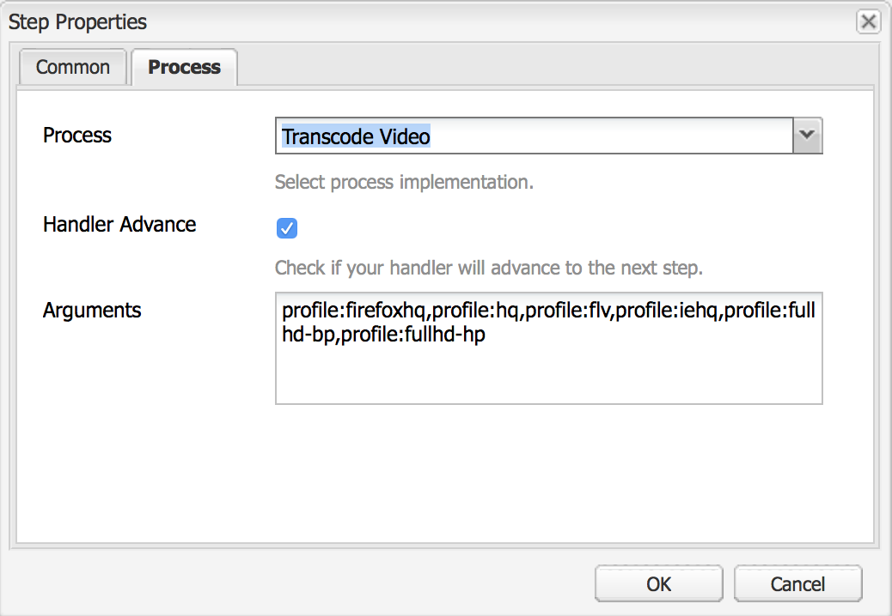
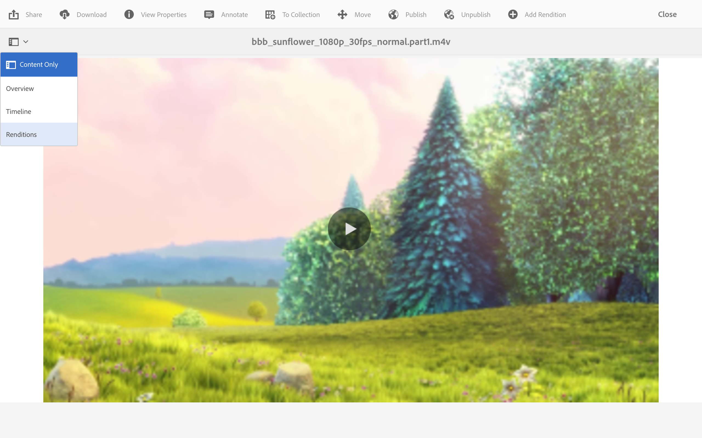
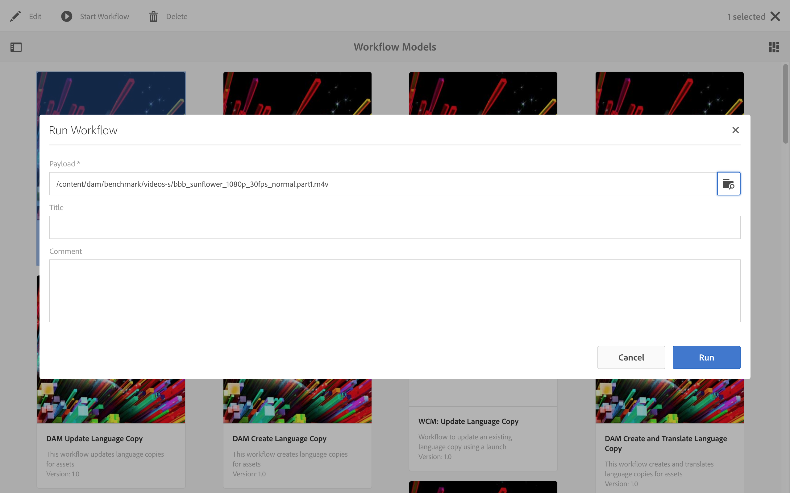

# 비디오 표현물 {#video-renditions}

수동 및 자동 Full HD 표현물을 생성할 수 있습니다. 다음 섹션에서는 자산에 렌디션을 추가하는 워크플로에 대해 설명합니다.

## Full HD 렌디션 자동 생성  {#automatically-generating-full-hd-renditions}

>[!NOTE]
>
>AEM Screens 비디오 렌디션이 장치에서 최적으로 재생되지 않는 경우 하드웨어 공급업체에 문의하여 비디오 사양을 확인하십시오. 이렇게 하면 장치에서 최상의 성능을 얻고 FFMPEG에 적합한 매개 변수를 제공하여 렌디션을 생성하는 사용자 정의 비디오 프로필을 만들 수 있습니다. 그런 다음 아래 단계를 사용하여 사용자 지정 비디오 프로필을 프로필 목록에 추가합니다.
>
>또한 다음을 참조하십시오 [비디오 문제 해결](troubleshoot-videos.md) 을 클릭하여 채널에서 비디오가 재생되는 문제를 해결하고 디버깅하십시오.

전체 HD 렌디션을 자동으로 생성하려면 아래 절차를 따르십시오.

1. Adobe Experience Manager 링크(왼쪽 상단)를 클릭하고 해머 아이콘을 클릭하여 **워크플로**.

   클릭 **모델**.

   

1. 워크플로우 모델 관리에서 **DAM 자산 업데이트** 모델 및 클릭 **편집** 작업 표시줄에서

   

1. 다음에서 **DAM 자산 업데이트** 창에서 두 번 클릭 **FFmpeg 코드 변환** 단계.

   

1. 다음을 클릭합니다. **프로세스** 탭.
1. 다음 목록에 전체 HD 프로필 입력: **인수** 를 다음과 같이 바꿉니다.
   ***`,profile:fullhd-bp,profile:fullhd-hp`***
1. **확인**&#x200B;을 클릭합니다.

   

1. 클릭 **저장** 의 왼쪽 상단 **DAM 자산 업데이트** 화면.

   

1. 다음으로 이동 **에셋** 새 비디오를 업로드하십시오. 비디오를 클릭하고 렌디션 사이드 레일을 엽니다. 2개의 풀 HD 비디오를 보십시오.

   

1. 열기 **표현물** 사이드 레일에서.

   

1. 2개의 새로운 풀 HD 표현물을 볼 수 있습니다.

   

## Full HD 렌디션 수동 생성 {#manually-generating-full-hd-renditions}

아래 단계에 따라 전체 HD 표현물을 수동으로 생성합니다.

1. Adobe Experience Manager 링크(왼쪽 상단)를 클릭하고 망치 아이콘을 클릭하여 도구를 클릭하고 을 클릭합니다 **워크플로**.

   클릭 **모델**.

   

1. 워크플로우 모델 관리에서 **화면 업데이트 자산** 모델을 만든 다음 **워크플로우 시작** 을(를) 열려면 **워크플로우 실행** 대화 상자.

   

1. 에서 원하는 비디오를 클릭합니다. **페이로드** 및 클릭 **실행**.

   

1. 다음으로 이동 **에셋**&#x200B;를 클릭하고 에셋으로 드릴다운한 다음 클릭합니다.

   

1. 를 엽니다. **표현물** 사이드 레일. 새로운 풀 HD 표현물을 확인하십시오.

   
