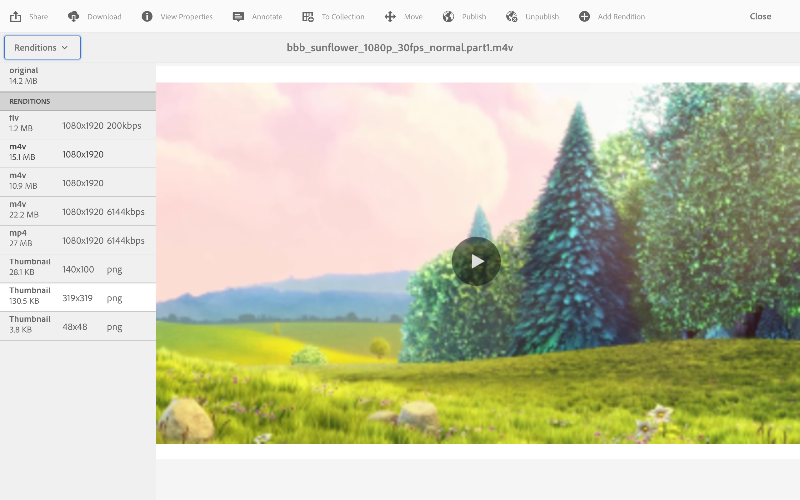

# 비디오 표현물 {#video-renditions}

수동 및 자동 풀 HD 변환을 생성할 수 있습니다. 다음 섹션에서는 자산에 렌디션을 추가하는 워크플로에 대해 설명합니다.

## Full HD 렌디션 자동 생성 {#automatically-generating-full-hd-renditions}

>[!NOTE]
>
>AEM Screens 비디오 렌디션이 장치에서 최적으로 재생되지 않는 경우 하드웨어 공급업체에 문의하여 비디오 사양을 확인하십시오. 이렇게 하면 장치에서 최상의 성능을 얻는 데 도움이 됩니다. 이렇게 하면 FFMPEG에 적합한 매개 변수를 제공하여 렌디션을 생성하는 사용자 지정 비디오 프로필을 만들 수 있습니다. 그런 다음 아래 단계를 사용하여 사용자 지정 비디오 프로필을 프로필 목록에 추가합니다.
>
>또한 채널에서 비디오 재생을 디버깅하고 문제를 해결하려면 [비디오 문제 해결](troubleshoot-videos.md)을 참조하십시오.

아래 단계에 따라 전체 HD 렌디션을 자동으로 생성합니다.

1. **워크플로**&#x200B;를 클릭할 수 있도록 Adobe Experience Manager 링크(왼쪽 상단)를 클릭하고 망치 아이콘을 클릭합니다.

   **모델**&#x200B;을 클릭합니다.

   

1. 워크플로우 모델 관리에서 **DAM 자산 업데이트** 모델을 클릭하고 작업 표시줄에서 **편집**&#x200B;을 클릭합니다.

   

1. **DAM 자산 업데이트** 창에서 **FFmpeg 코드 변환** 단계를 두 번 클릭합니다.

   

1. **프로세스** 탭을 클릭합니다.
1. **인수**&#x200B;의 목록에 전체 HD 프로필을 다음과 같이 입력하십시오.
   ***`,profile:fullhd-bp,profile:fullhd-hp`***
1. **확인**&#x200B;을 클릭합니다.

   

1. **DAM 자산 업데이트** 화면의 왼쪽 상단에서 **저장**&#x200B;을 클릭합니다.

   

1. **Assets**(으)로 이동하여 새 비디오를 업로드하십시오. 비디오를 클릭하고 렌디션 사이드 레일을 엽니다. 2개의 풀 HD 비디오를 보십시오.

   

1. 측면 레일에서 **렌디션**&#x200B;을 엽니다.

   

1. 2개의 새로운 풀 HD 표현물을 볼 수 있습니다.

   

## Full HD 렌디션 수동 생성 {#manually-generating-full-hd-renditions}

아래 단계에 따라 전체 HD 표현물을 수동으로 생성합니다.

1. Adobe Experience Manager 링크(왼쪽 상단)를 클릭하고 망치 아이콘을 클릭하면 도구를 클릭하고 **워크플로**&#x200B;를 클릭할 수 있습니다.

   **모델**&#x200B;을 클릭합니다.

   

1. 워크플로우 모델 관리에서 **Screens 자산 업데이트** 모델을 클릭하고 **워크플로우 시작**&#x200B;을 클릭하여 **워크플로우 실행** 대화 상자를 엽니다.

   

1. **페이로드**&#x200B;에서 원하는 비디오를 클릭하고 **실행**&#x200B;을 클릭합니다.

   

1. **Assets**(으)로 이동하여 에셋으로 드릴다운한 다음 클릭합니다.

   

1. **렌디션** 사이드 레일을 엽니다. 새로운 풀 HD 표현물을 확인하십시오.

   
