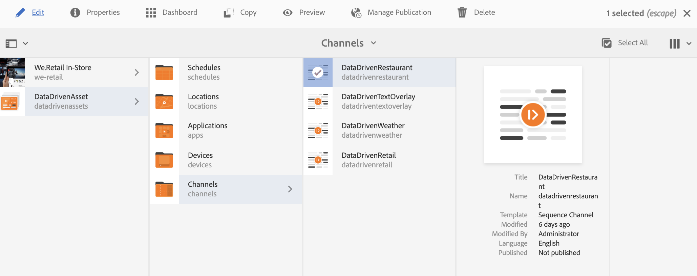
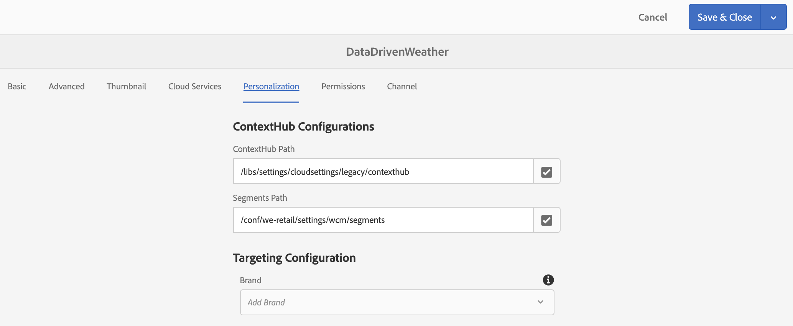

# 숙박 예약 활성화 {#hospitality-reservation-activation}

>[!IMPORTANT]
>이 콘텐츠는 AEM On-Premise/AMS(AEM 6.5LTS 및 AEM 6.5)에 유효합니다. AEM as a Cloud Service Screens 콘텐츠의 경우 [AEM as a Cloud Service 안내서](https://experienceleague.adobe.com/en/docs/experience-manager-cloud-service/content/screens-as-cloud-service/overview/introduction)를 참조하십시오.

다음 사용 사례에서는 Google Sheets에 채워진 값을 기반으로 병원 예약 활성화를 사용하는 방법을 보여줍니다.

## 설명 {#description}

이 사용 사례의 경우 Google Sheet는 두 개의 레스토랑 **`Restaurant1`** 및 **`Restaurant2`**&#x200B;에서 예약한 비율로 채워집니다. 수식은 `Restaurant1` 및 `Restaurant2`의 값을 기반으로 적용되며 수식을 기반으로 값 1 또는 2가 **AdTarget** 열에 할당됩니다.

값이 **`Restaurant1`** > **`Restaurant2`**&#x200B;인 경우 **AdTarget**&#x200B;에 값 **1**&#x200B;이(가) 할당되고, 그렇지 않은 경우 **AdTarget**&#x200B;에 값 **2**&#x200B;이(가) 할당됩니다. 값 1은 *스테이크 음식* 옵션을 생성하고 값 2는 표시 화면에 *태국 음식* 옵션을 표시합니다.

## 전제 조건 {#preconditions}

예약 활성화를 구현하기 전에 AEM Screens 프로젝트에서 ***데이터 저장소***, ***대상자 세분화*** 및 ***채널 타깃팅 사용***&#x200B;을 설정하는 방법에 대해 알아보세요.

자세한 내용은 [AEM Screens에서 ContextHub 구성](configuring-context-hub.md)을 참조하십시오.

## 기본 흐름 {#basic-flow}

아래 사용 사례 단계에 따라 AEM Screens 프로젝트에 대한 접대 예약 활성화를 구현합니다.

1. **Google 시트 채우기 및 수식 추가**.

   예를 들어 아래 그림과 같이 세 번째 열 **AdTarget**&#x200B;에 수식을 적용합니다.

   

1. **요구 사항에 따라 Audiences에서 세그먼트 구성**

   1. 대상의 세그먼트로 이동합니다(자세한 내용은 **[AEM Screens에서 ContextHub 구성](configuring-context-hub.md)** 페이지의 ***2단계: 대상 세분화 설정*** 참조).
   1. **시트 A1 1**&#x200B;을 클릭하고 **편집**&#x200B;을 클릭합니다.
   1. 비교 속성을 클릭하고 **구성** 아이콘을 클릭합니다.
   1. **속성 이름**&#x200B;의 드롭다운에서 **googlesheets/value/1/2**&#x200B;을(를) 클릭합니다.
   1. 드롭다운 메뉴에서 **Operator**&#x200B;을(를) **equal**(으)로 클릭합니다.
   1. **값**&#x200B;을(를) **1**(으)로 입력하십시오.
   1. 마찬가지로 **시트 A1 2**&#x200B;을 클릭하고 **편집**&#x200B;을 클릭합니다.
   1. 비교 속성을 클릭하고 **구성** 아이콘을 클릭합니다.
   1. **속성 이름**&#x200B;의 드롭다운에서 **googlesheets/value/1/2**&#x200B;을(를) 클릭합니다.
   1. **2**(으)로 **연산자**&#x200B;를 클릭합니다.

1. 이동 후 채널()을 클릭하고 작업 표시줄에서 **편집**&#x200B;을 클릭합니다. 다음 예인 **DataDrivenRestaurant**&#x200B;에서는 기능을 보여주는 데 순차적 채널이 사용됩니다.

   >[!NOTE]
   >
   >채널에는 이미 기본 이미지가 있어야 하며 [AEM Screens에서 ContextHub 구성](configuring-context-hub.md)에 설명된 대로 대상을 미리 구성해야 합니다.

   

   >[!CAUTION]
   >
   >채널 **속성** > **Personalization** 탭을 사용하는 **ContextHub** **구성**&#x200B;이(가) 이미 설정되어 있어야 합니다.

   

1. 편집기에서 **타깃팅**&#x200B;을 클릭하고 드롭다운 메뉴에서 **브랜드** 및 **활동**&#x200B;을 클릭한 다음 **타깃팅 시작**&#x200B;을 클릭합니다.
1. **미리 보기 확인**

   1. **미리 보기**&#x200B;를 클릭합니다. 또한 Google Sheets 를 열고 값을 업데이트합니다.
   1. **`Restaurant1`** 및 **`Restaurant2`** 열의 값을 업데이트합니다. **`Restaurant1`** > **`Restaurant2`,**&#x200B;인 경우 *스테이크* 음식 이미지를 볼 수 있어야 합니다. 그렇지 않으면 *태국어* 음식 이미지가 화면에 표시됩니다.

   

