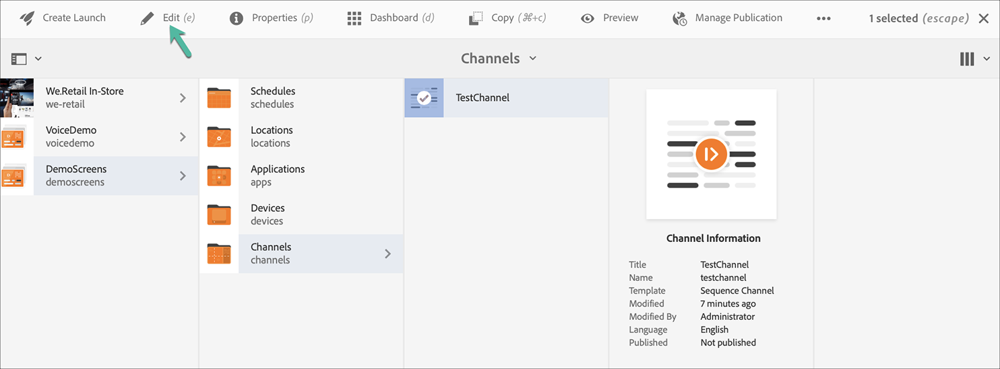
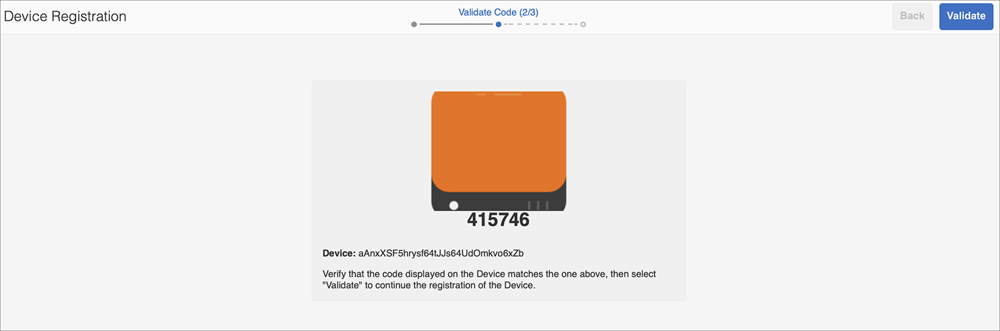
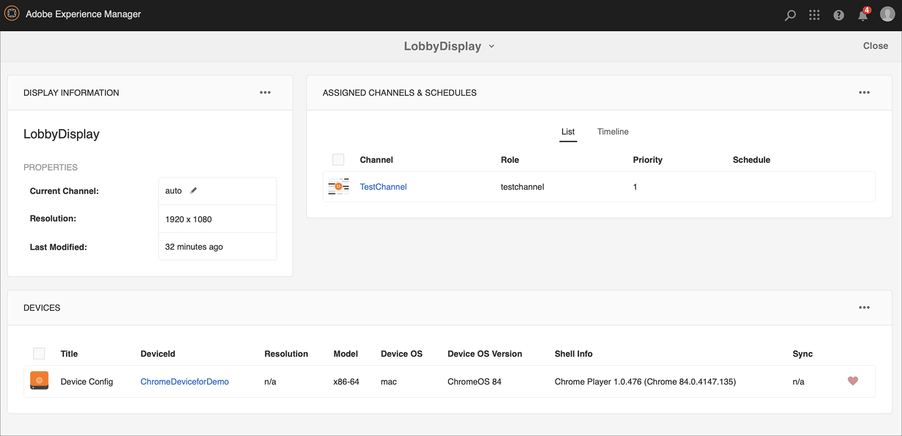

# 킥스타트 안내서 {#kickstart-guide}

AEM Screens에 대한 킥스타트는 AEM Screens 프로젝트를 설정하고 실행하는 방법을 보여 줍니다. 기본 디지털 사이니지 경험을 설정하고 각 채널에 에셋 및/또는 비디오와 같은 콘텐츠를 추가하고 콘텐츠를 AEM Screens 플레이어에 게시하는 과정을 안내합니다.

>[!NOTE]
>프로젝트 세부 정보 작업을 시작하기 전에 AEM Screens용 최신 기능 팩을 설치했는지 확인하십시오. 에서 최신 기능 팩을 다운로드할 수 있습니다. [소프트웨어 배포 포털](https://experience.adobe.com/#/downloads/content/software-distribution/en/aem.html) Adobe ID 사용.

## 사전 요구 사항 {#prerequisites}

아래 단계에 따라 AEM Screens용 샘플 프로젝트를 만들고 콘텐츠를 Screens 플레이어에 추가로 게시하십시오.

>[!NOTE]
>다음 자습서에서는 Chrome OS 플레이어에서 채널의 콘텐츠를 재생하는 사례를 보여줍니다.

>[!IMPORTANT]
>**OSGi 구성 설정**
>장치가 데이터를 서버에 게시할 수 있도록 하려면 빈 레퍼러를 활성화해야 합니다. 예를 들어 빈 레퍼러 속성이 비활성화된 경우 디바이스는 스크린샷을 다시 게시할 수 없습니다. 현재 이러한 기능 중 일부는 OSGi 구성에서 Apache Sling Referrer Filter Allow Empty 가 활성화된 경우에만 사용할 수 있습니다. 대시보드에 보안 설정으로 인해 이러한 기능 중 일부가 작동하지 않을 수 있다는 경고가 표시될 수 있습니다.
>을(를) 활성화하려면 아래 단계를 따르십시오. ***Apache Sling Referrer 필터가 비어 있음***:

## 빈 레퍼러 요청 허용 {#allow-empty-referrer-requests}

1. 다음으로 이동 **Adobe Experience Manager 웹 콘솔 구성** AEM 인스턴스 —> hammer 아이콘 —> 을 통해 **작업** —> **웹 콘솔**.

   

1. **Adobe Experience Manager 웹 콘솔 구성** 열림. Sling 레퍼러를 검색합니다.

   sling 레퍼러 속성을 검색하려면 **Command+F** 대상 **Mac** 및 **Ctrl+F** 대상 **Windows**.

1. 다음 확인: **빈 항목 허용** 아래 그림과 같은 옵션입니다.

   

1. 클릭 **저장** apache Sling Referrer 필터를 활성화하려면 Allow Empty를 사용하십시오.

## 5분 내에 디지털 신호계 환경 만들기 {#creating-a-digital-signage-experience-in-minutes}

### AEM Screens 프로젝트 만들기 {#creating-project}

첫 번째 단계는 AEM Screens 프로젝트를 만드는 것입니다.

1. Adobe Experience Manager(AEM) 인스턴스로 이동하여 **스크린**. 또는 다음 위치에서 바로 탐색할 수 있습니다. `https://localhost:4502/screens.html/content/screens](https://localhost:4502/screens.html/content/screens`.

1. 클릭 **스크린 프로젝트 만들기** 새 Screens 프로젝트를 만듭니다. 제목을 다음으로 입력 **데모 화면** 및 클릭 **저장**.

   

   >[!NOTE]
   >프로젝트를 만들면 화면 프로젝트 홈 페이지로 돌아갑니다. 이제 프로젝트를 선택할 수 있습니다. 프로젝트에는 라는 이름의 5개의 다른 폴더가 있습니다 **애플리케이션**, **채널**, **장치**, **위치**, 및 **일정**.

### 채널 만들기 {#creating-channel}

AEM Screens 프로젝트를 만든 후에는 콘텐츠를 관리할 새 채널을 만들어야 합니다.

프로젝트에 대한 새 채널을 만들려면 아래 단계를 따르십시오.

1. 프로젝트를 만든 후 **데모 화면** 프로젝트 및 선택 **채널** 아래 그림과 같은 폴더입니다. 클릭 **+ 만들기** 작업 표시줄에서

   

1. 다음을 선택합니다. **시퀀스 채널** 마법사에서 를 클릭하고 **다음**.
   

1. 다음을 입력합니다. **제목** 다음으로: **테스트 채널** 및 클릭 **만들기**.

   

   다음 **테스트 채널** 아래 그림과 같이 가 이제 채널 폴더에 추가됩니다.

   

### 채널에 콘텐츠 추가 {#adding-content}

채널이 준비되면 AEM Screens 플레이어에서 표시할 채널에 콘텐츠를 추가해야 합니다.

아래 단계에 따라 채널에 콘텐츠를 추가합니다(**테스트 채널**)을 클릭하여 제품에서 사용할 수 있습니다.

1. 다음 위치로 이동 **DemoProject** 을(를) 만들고 선택한 **테스트 채널** 다음에서 **채널** 폴더를 삭제합니다.

1. 클릭 **편집** 작업 표시줄에서 을 선택합니다(아래 그림 참조). 편집자 **테스트 채널** 열림.

   

1. 작업 표시줄의 왼쪽에서 사이드 패널을 토글하여 에셋 및 구성 요소를 여는 아이콘을 클릭합니다.

1. 채널에 추가하려는 구성 요소를 드래그하여 놓습니다.

   

### 위치 생성 {#creating-location}

채널이 준비되면 위치를 만들어야 합니다.

>[!NOTE]
>***위치*** 다양한 디지털 간판 경험을 구분하고 다양한 화면이 있는 위치에 따른 디스플레이 구성을 포함합니다.

프로젝트의 새 위치를 만들려면 아래 단계를 따르십시오.

1. 다음 위치로 이동 **DemoProject** 을(를) 만들고 선택한 **위치** 폴더를 삭제합니다.

1. 클릭 **+ 만들기** 작업 표시줄에서

1. 선택 **위치** 마법사에서 를 클릭하고 **다음**.

1. 다음을 입력합니다. **이름** (제목을 다음으로 입력) **테스트 위치**) 및 클릭 **만들기**.

다음 **테스트 위치** 이(가) 만들어지고 다음에 추가됩니다. **위치** 폴더를 삭제합니다.

### 위치에 대한 디스플레이 만들기 {#creating-display}

위치를 만든 후에는 해당 위치에 대한 새 디스플레이를 만들어야 합니다.

>[!NOTE]
>***표시*** 하나 이상의 화면에서 실행되는 디지털 경험을 나타냅니다.

1. 다음 위치로 이동 **테스트 위치** 선택한 다음

1. 클릭 **만들기** 작업 표시줄에서

   

1. 선택 **표시** 다음에서 **만들기** 마법사 및 클릭 **다음**.

   

1. 다음을 입력합니다. **제목** 다음으로: **로비 디스플레이** 및 클릭 **만들기**.

   

   제목이 인 새 디스플레이 **TestDisplay** 이(가) 이제 내 위치에 추가되었습니다. **테스트 위치**&#x200B;을 참조하십시오.

   

### 채널 할당 {#assigning-channel}

프로젝트 설정이 완료되면 콘텐츠를 보려면 채널을 디스플레이에 할당해야 합니다.

1. 다음에서 필요한 표시로 이동합니다. **데모 화면** —> **위치** —> **테스트 위치** —> **로비 디스플레이**.

1. 탭/클릭 **채널 할당** 작업 표시줄에서

   

   또는,

   탭/클릭 **대시보드** 작업 표시줄에서 을(를) 클릭하고 **+채널 할당** 다음에서 **할당된 채널 및 일정** 패널.

   

1. 다음 **채널 할당** 대화 상자가 열립니다.

1. 다음에서 **설정** 옵션, 채널 선택 **경로 기준**  및 **지원되는 이벤트** 다음으로: **초기 로드** 및 **유휴 화면**.

   >[!NOTE]
   >
   >다음 **채널 역할**, **우선 순위**, 및 **중단 방법** 모두 기본적으로 채워집니다. 다음을 참조하십시오 [채널 속성](/help/user-guide/channel-assignment-latest-fp.md#channel-properties) 채널 할당 속성에 대해 자세히 알아보려면 섹션 을 참조하십시오.

   

   또한 **활성화 창** 및 **자동연장 일정**.

   >[!NOTE]
   >다음 *자동연장 일정* 채널에 대한 반복 일정을 설정할 수 있습니다. 한 채널에 대해 여러 반복 일정을 설정합니다.
   >다음을 참조하십시오 [자동연장 일정](/help/user-guide/channel-assignment-latest-fp.md#recurrence-schedule) 을 참조하십시오.

1. 클릭 **저장** 기본 설정을 구성했으면 다음과 같이 하십시오.

### 장치 등록 및 디스플레이에 장치 할당 {#registering-device}

AEM 대시보드를 사용하여 장치를 등록해야 합니다.

>[!IMPORTANT]
>Chrome OS 플레이어는 실제 Chrome 플레이어 장치 없이 개발자 모드에서 Chrome 브라우저 플러그인으로 설치할 수 있습니다. 설치하려면 아래 단계를 따르십시오.
>
>1. 클릭 [여기](https://download.macromedia.com/screens/) 최신 Chrome 플레이어를 다운로드하려면 다음을 수행하십시오.
>1. 압축을 풀고 디스크에 저장합니다.
>1. Chrome 브라우저를 열고 을 선택합니다. **확장** 메뉴에서 선택하거나 을(를) 직접 탐색하여 ***chrome://extensions***.
>1. 전환 **개발자 모드** 오른쪽 상단에서
>1. 클릭 **로드 압축 해제됨** 왼쪽 상단 모서리에서 압축을 푼 Chrome Player를 로드합니다.
>1. 확인 **AEM Screens Chrome 플레이어** 플러그인 (확장 프로그램 목록에서 사용 가능한 경우)을 참조하십시오.
>1. 새 탭을 열고 **앱** 왼쪽 상단 모서리에서 아이콘을 클릭하거나 로 직접 이동합니다. ***chrome://apps***.
>1. 클릭 **AEM Screens** Chrome 플레이어를 시작하는 플러그인입니다. 기본적으로 플레이어는 전체 화면 모드로 실행됩니다. 누르기 **esc** 전체 화면 모드를 종료합니다.

Chrome OS 플레이어가 켜지면 아래 단계에 따라 Chrome 장치를 등록합니다.

1. 다음 위치로 이동 **장치** AEM 인스턴스에서 프로젝트의 폴더입니다.

1. 탭/클릭 **장치 관리자** 작업 표시줄에서

   

1. 탭/클릭 **장치 등록** 오른쪽 상단에서

1. 필요한 장치를 선택하고 탭/클릭합니다 **장치 등록**.

   

1. 장치가 등록 코드를 보낼 때까지 기다렸다가 **등록 코드** Chrome 장치에서.
   

1. 다음과 같은 경우 **등록 코드** 두 컴퓨터에서 동일함, 탭/클릭 **유효성 검사** AEM.

1. 원하는 이름을 로 설정합니다. **ChromeDeviceforDemo** 을 클릭하고 **등록**.

   

1. 클릭 **디스플레이 할당** 다음에서 **장치 등록 성공** 대화 상자.

   

1. 다음으로 표시 경로 선택 **데모 화면** —> **위치** —> **테스트 위치** —> **로비 디스플레이** 및 클릭 **할당**.

   

1. 장치가 성공적으로 할당되면 다음 확인이 표시됩니다.

   

1. 탭/클릭 **완료** 등록 프로세스를 완료합니다. 디스플레이 대시보드에서 등록된 장치를 볼 수 있어야 합니다.

   

### Chrome 플레이어에서 콘텐츠 보기 {#viewing-content-output}

채널의 모든 에셋이 이제 Chrome OS 플레이어에서 재생됩니다.

축하합니다. 이제 AEM Screens 채널에서 콘텐츠를 재생하고 있습니다!

