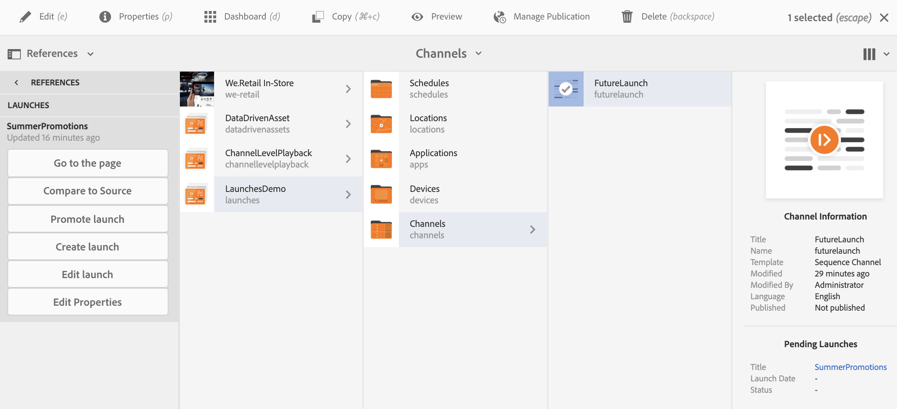

# 론치 {#launches}

컨텐츠 작성자는 론치라고 하는 채널의 향후 버전을 만들 수 **있으며** , 이 론치에 대한 라이브 날짜를 추가로 설정하면 컨텐츠가 디바이스나 플레이어에서 라이브될 수 있습니다.

작성자는 론치의 도움으로 론치의 각 채널을 미리 볼 수 있으며 검토 요청을 시작할 수 있습니다. 승인자 그룹은 알림을 받게 되며 요청을 승인하거나 거부할 수 있습니다. 라이브 날짜에 도달하면 컨텐츠가 장치에서 재생됩니다.

예를 들어 작성자가 c1, c2(채널)의 향후 버전을 만들려면 론치가 만들어지고 라이브 날짜가 설정됩니다(예: 11월 10일 오전 8시). 컨텐츠의 추가 업데이트는 검토를 위해 전송됩니다. 일단 승인되고 실시간 날짜(11월 10일 오전 8시)에 출시되면 디바이스 또는 플레이어에서 컨텐츠가 재생됩니다.

## 요구 사항 {#requirements}

AEM Screens 프로젝트에서 론치의 구현을 시작하기 전에 유예 기간 개념 및 관련 사항을 이해해야 합니다.

다음 섹션에서는 유예 기간 및 특별 구성 방법에 대해 설명합니다. 샘플 테스트 구성을 다운로드하여 사용량을 파악할 수도 있습니다.

### 유예 기간 이해 {#understanding-grace-period}

다음 설정을 통해 관리자는 론치에 필요한 유예 ***기간을&#x200B;***구성할 수 있습니다.

**유예 기간**:

* 출시 홍보
* 인스턴스를 게시할 리소스 게시
* 게시 인스턴스에서 컨텐츠를 다운로드하는 데 걸리는 시간 및 서버와 플레이어의 시간 차이

예를 들어, 서버가 PST에 있고 디바이스가 EST에 있고 최대 시간 차이는 3시간이며, 프로모션은 작성자에서 게시로 1분이 걸리고 플레이어는 10분이 소요되며, 리소스는 일반적으로 10-15분 내에 다운로드할 수 있다고 가정합니다. 그런 다음 유예 기간 = 시간 차이(3시간) + 론치를 홍보하는 시간(1분) + 론치를 게시할 시간(10분) + 플레이어에서 다운로드할 시간(10-15분) + 버퍼(10분) = 3시간 56분 = 14160초. 따라서 론치를 라이브로 예약할 때 이 오프셋으로 프로모션이 일찍 시작됩니다. 위의 방정식에서 대부분의 항목은 시간이 많이 걸리지 않으므로 서버와 플레이어의 최대 시간 차이를 알고 나면 이 오프셋을 추측할 수 있습니다.

### 즉시 사용 가능한 유예 기간 구성 {#configuring-out-of-the-box-grace-period}

기본적으로 론치의 유예 기간은 24시간으로 설정되므로 */콘텐트/화면*&#x200B;아래의 리소스에 대한 론치의 실시간 날짜를 설정할 때 이 오프셋으로 프로모션이 시작됩니다. 예를 들어 liveDate가 11월 24일 오전 9시(00분)로 설정되고 유예 기간이 24시간인 경우 프로모션 작업은 오전 9시 11월 23일에 시작됩니다.

### 구성 다운로드 {#downloading-configurations}

다음 테스트 구성을 다운로드합니다.

[파일 가져오기](assets/launches_event_handlerconfig-10.zip)

>[!NOTE]
>
>위에 언급된 구성은 이 테스트 구성에서 유예 기간으로서 600초를 갖습니다.

#### 구성 업데이트 {#updating-the-configurations}

위의 구성을 변경하려면 아래 지침을 따르십시오.

* com.adobe.cq.wc ***m.launches.impl.LaunchesEventHandler.config ***및 내용으로 /apps/system/config****파일의 sling:OsgiConfig/ nt:file을 만듭니다.

   *launches.eventhandler.updatemodification=B&quot;false&quot;launches.eventhandler.launch.promotion.graceperiod=[&quot;/content/screens(/.*):600&quot;]launches.eventhandler.threadpool.maxsize=I&quot;5&quot;launches.eventhandler.threadpool.priority=&quot;MIN&quot;*

* `launches.eventhandler.launch.promotion.graceperiod=["/content/screens(/.&#42;):600"`를 사용하면 경로/ *컨텐츠/화면에서*&#x200B;유예 기간을 600초로 설정할 수 있습니다.

즉, */content/screens*&#x200B;아래의 리소스에 대한 론치에 대해 라이브 날짜를 설정하면 프로모션은 이 오프셋으로 시작됩니다. 예를 들어 라이브 날짜가 11월 24일 오전 9시, 오전 9시로 설정되고 유예 기간이 600초인 경우 프로모션 작업은 오전 8시 50분에 시작됩니다.

## 론치 사용 {#using-launches}

아래 섹션을 따라 AEM Screens 프로젝트에서 론치를 구현합니다. 이 섹션에서는 다음과 같은 항목을 다룹니다.

1. **론치 만들기**
1. **론치 편집을 통해 라이브 날짜 및 범위 설정**

### 론치 만들기 {#creating-a-launch}

AEM Screens 프로젝트에 향후 게시 기능을 구현하려면 아래 절차를 따르십시오.

1. 아래 표시된 대로 AEM Screens 프로젝트에서 채널로 이동합니다(예: **LaunchesDemo** —> **채널** —> **FutureLaunch**).

   >[!CAUTION]
   >
   >AEM Screens 프로젝트의 기존 채널에서 론치를 만들어야 합니다.

   

1. FutureLaunch 채널을 **선택하고** 만들기를 **클릭합니다**. 드롭다운 **메뉴에서** 시작을 선택합니다.

   

1. 론치 **만들기** 마법사가 열립니다. 페이지 **추가를** 클릭하여 론치를 만들 AEM Screens 채널을 선택합니다.

   

1. 채널로 이동하고 선택을 **클릭합니다**.

   

1. 페이지를 선택하고 나면 다음을 클릭하여 **론치 만들기** 마법사에서 한 단계 **더** 이동합니다.

   

1. 론치 제목을 **여름** 판촉으로 **입력하면** 아래 그림과 같이 시작 **날짜를**&#x200B;설정할 필요가 없습니다. **만들기**&#x200B;를 클릭합니다.

   >[!NOTE]
   >
   >*소스 페이지 라이브 데이터* 상속을 **활성화하거나 선택하면** 론치에서 채널을 Live Copy로 만들 수 있습니다. 원래 채널에서 변경된 경우 이러한 변경 사항이 론치 채널에 자동으로 적용됩니다.
   >
   >
   >*비활성화 또는 선택* 해제소스 **페이지 라이브 데이터** 상속을 사용하면 론치에서 라이브 관계 없이 채널을 복사할 수 있습니다. 따라서 원래 채널을 변경하면 해당 변경 사항이 시작 채널에 적용되지 않습니다.

   

   >[!NOTE]
   >
   >이 단계에서 라이브 실행 날짜를 설정하거나 론치가 이미 만들어지면 속성을 편집하는 동안 나중에 설정할 수 있습니다.

1. 론치가 생성되었음을 알 수 있습니다. 열기를 클릭하여 **편집기에서** 페이지를 보거나 완료를 클릭하여 **프로젝트로** 돌아갈 수 있습니다.

   

   완료를 **클릭하면** LaunchesDemo **프로젝트로 돌아갈 수** 있습니다.

   

### 실행 속성을 편집하여 라이브 날짜 및 범위 설정 {#editing-the-launch-properties-to-set-the-live-date-and-scope}

론치를 만들었으면 론치 속성을 편집하여 라이브 날짜를 론치 범위로 설정해야 합니다.

아래 절차에 따라 론치 속성을 편집합니다.

1. 아래 그림과 같이 채널(**FutureLaunch**)으로 이동하고 채널을 선택합니다. 왼쪽 **측면** 레일에서 참조 레일을 엽니다.

   >[!NOTE]
   >
   >왼쪽 **레일에서 컨텐츠** 트리 옵션을 선택하여 만든 론치를 엽니다.

   

1. 론치로 **이동하고** 만든 론치(SummerPromotions)**를**&#x200B;선택합니다. 속성 **편집을 클릭합니다**.

   

1. SummerPromotions **시작** 대화 상자가 열립니다. 다음 필드를 채웁니다.

   * 론치 **날짜 선택**
   * 프로덕션 **준비 상태 확인**
   * 범위에서 **승인된 페이지** 홍보 **선택**
   >[!NOTE]
   >
   >자동 판촉 아래의 **시작 항목 이해**:

   >    * **론치**&#x200B;날짜(Launch Date)는 라이브 날짜, 즉 컨텐츠가 플레이어의 표준 시간대로 Screens 플레이어에서 재생되는 날짜/시간을 나타냅니다.
   >    * **Production** Ready를 사용하면 채널을 홍보할 수 있으며 론치를 사용할 준비가 되었음을 의미합니다.
   >    * **범위란**&#x200B;론치 중에 홍보할 수 있는 채널을 의미합니다.

   다음 세 가지 옵션을 사용하여 범위를 설정할 수 있습니다.
   1. **전체 론치**&#x200B;홍보:론치의 모든 채널은 설정된 라이브 날짜에 홍보됩니다.
   1. **수정된 페이지**&#x200B;홍보:편집된 시작 리소스만 홍보됩니다. 론치 검토가 필요하지 않은 경우 이 옵션을 사용하는 것이 좋습니다. 이렇게 하면 론치 채널의 수정 사항을 홍보할 수 있습니다.
   1. **승인된 페이지**&#x200B;홍보:승인된 페이지만 설정된 라이브 날짜에 홍보됩니다.
   

   >[!CAUTION]
   >
   >시작 프로모션은 서버의 시간대가 아닌 플레이어/장치의 시간대를 준수합니다.

1. 저장 **및 닫기를** 클릭하여 FutureLaunch **채널로 돌아갑니다** .

   

