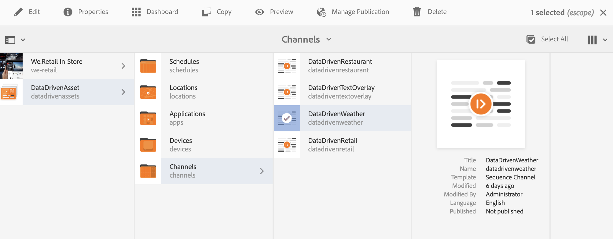

# 여행 센터 온도 활성화 {#travel-center-temperature-activation}

다음 사용 사례에서는 Google Sheets에 채워진 값을 기반으로 하여 트래블 센터 현지 온도 활성화 를 사용하는 방법을 보여줍니다.

## 설명 {#description}

이 사용 사례의 경우, Google Sheets 의 값이 50 미만이면 뜨거운 음료가 포함된 이미지가 표시됩니다. 값이 50보다 크거나 같으면 차가운 음료가 포함된 이미지가 표시됩니다. 다른 값이 있거나 값이 전혀 없으면 플레이어가 기본 이미지를 표시합니다.

## 전제 조건 {#preconditions}

여행 센터 현지 온도 활성화 구현을 시작하기 전에 설정 방법을 알아보십시오 ***데이터 저장소***, ***대상자 세분화*** 및 ***채널에 대한 타깃팅 활성화*** AEM Screens 프로젝트에서.

다음을 참조하십시오 [AEM Screens에서 ContextHub 구성](configuring-context-hub.md) 을 참조하십시오.

## 기본 흐름 {#basic-flow}

아래 단계에 따라 Travel Center Local Temperature Activation 사용 사례를 구현합니다.

1. **Google 시트 채우기**

   1. ContextHubDemo Google 시트로 이동합니다.
   1. 다음을 사용하여 열 추가 **`Heading1`** (온도에 대한 해당 값 포함)

   

1. **요구 사항에 따라 Audiences에서 세그먼트 구성**

   1. 대상의 세그먼트로 이동합니다( 참조). ***2단계: 대상자 세분화 설정*** 위치: **[AEM Screens에서 ContextHub 구성](configuring-context-hub.md)** 페이지 를 참조하십시오.

   1. 다음을 클릭합니다. **시트 A1 1** 및 클릭 **편집**.

   1. 비교 등록 정보를 클릭하고 구성 아이콘을 클릭합니다.
   1. 클릭 **구글시트/값/1/0** 의 드롭다운에서 **속성 이름**

   1. 다음을 클릭합니다. **연산자** 다음으로: **크거나 같음** 드롭다운 메뉴에서

   1. 다음을 입력합니다. **값** 다음으로: **50**

   1. 마찬가지로 **시트 A1 2** 및 클릭 **편집**.

   1. 다음을 클릭합니다. **비교 속성 - 값** 구성 아이콘을 선택합니다.
   1. 클릭 **구글시트/값/1/0** 의 드롭다운에서 **속성 이름**

   1. 다음을 클릭합니다. **연산자** 다음으로: **보다 작음** 드롭다운 메뉴에서

   1. 다음을 입력합니다. **값** 다음으로: **50**

1. 이동하여 채널()을 선택하고 **편집** 작업 표시줄에서 다음 예제에서는 **DataDrivenWeather**&#x200B;기능을 보여주는 데 순차적 채널이 사용됩니다.

   >[!NOTE]
   >
   >채널에는 이미 기본 이미지가 있어야 하며 다음에 설명된 대로 대상자를 사전 구성해야 합니다. [AEM Screens에서 ContextHub 구성](configuring-context-hub.md).

   

   >[!CAUTION]
   >
   >다음을 설정해야 합니다. **컨텍스트 허브** **구성** 채널 사용 **속성** > **개인화** 탭.

   

1. 클릭 **타겟팅** 편집기에서 **브랜드** 및 **활동** 드롭다운 메뉴에서 **타깃팅 시작**.

   

1. **미리보기 확인**

   1. 클릭 **미리 보기.** 또한 Google 시트를 열고 값을 업데이트합니다.
   1. 값을 50 미만으로 변경합니다. 차가운 음료수의 이미지를 볼 수 있을 것이다. Google 시트의 값이 50 이상이면 뜨거운 음료의 이미지가 표시됩니다.

   
