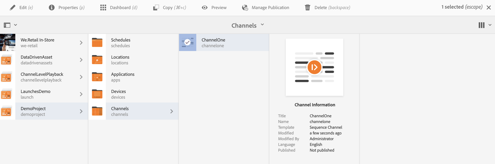
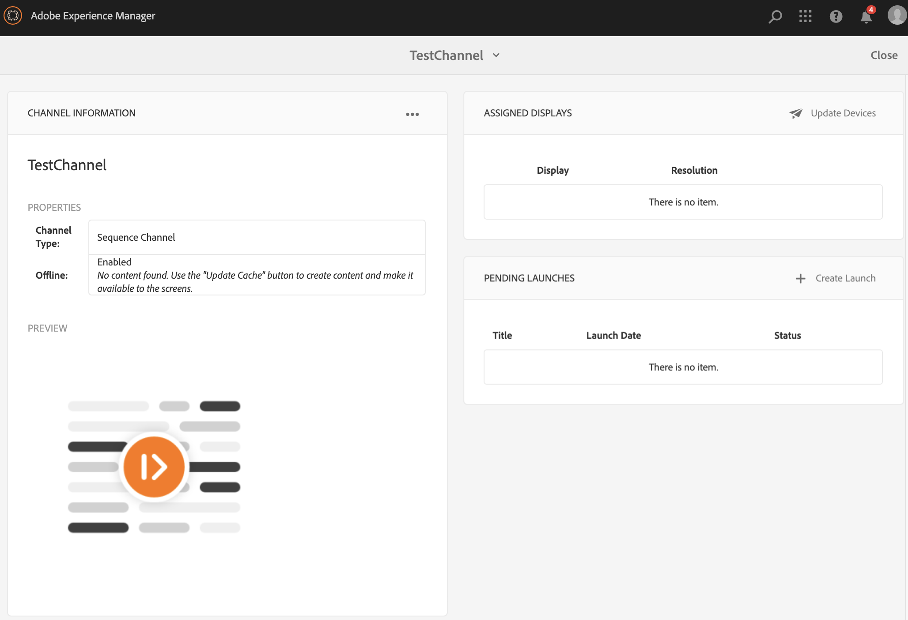

# 채널 생성 및 관리 {#creating-and-managing-channels}

채널에는 일련의 컨텐츠와 디스플레이 이미지 및 비디오가 표시되지만 웹 사이트나 단일 페이지 애플리케이션을 표시할 수도 있습니다.

이 페이지에서는 스크린용 채널의 만들기 및 관리에 대해 보여줍니다.

**전제 조건**:

* [스크린 구성 및 배치](configuring-screens-introduction.md)
* [스크린 프로젝트 만들기 및 관리](creating-a-screens-project.md)

## 새 채널 만들기 {#creating-a-new-channel}

스크린에 대한 프로젝트를 만들었으면 아래 절차에 따라 스크린 프로젝트를 위한 새 채널을 만드십시오.

1. Adobe Experience Manager 링크(왼쪽 위)를 선택한 다음 스크린을 선택합니다. Alternatively, you can go directly to: `https://localhost:4502/screens.html/content/screens`.
1. Navigate to Screens project and click **Channels**.
1. Click **Create** next to the plus icon in the action bar. 마법사가 열립니다(*자세한 내용은 채널 유형 참조*).

1. Select the template from the wizard and click **Next**.
1. Enter the properties for **Title and Tags**, **More Titles and Description**, **On/Off Time**, and **Vanity URL**.

1. **만들기**&#x200B;를 클릭하십시오. 채널이 만들어져서 채널 폴더에 추가됩니다.

### 채널 유형 {#channel-types}

다음과 같은 마법사를 사용하는 동안 다음 템플릿 선택 사항을 사용할 수 있습니다.

| **템플릿 선택 사항** | **설명** |
|---|---|
| 채널 폴더 | 채널 컬렉션을 저장할 폴더를 만들 수 있습니다. |
| 시퀀스 채널 | 구성 요소를 순차적으로 재생하는 채널을 만들 수 있습니다(슬라이드 쇼에서 하나씩). |
| 응용 프로그램 채널 | Screens 플레이어에서 사용자 지정 웹 애플리케이션을 선보일 수 있습니다. |
| 1x1 분할 화면 채널 | 단일 영역에서 구성 요소를 볼 수 있습니다. |
| 1x2 분할 화면 채널 | 두 영역에서 자산을 볼 수 있습니다(가로로 분할). |
| 2X1 분할 화면 채널 | 두 영역에서 자산을 볼 수 있습니다(세로로 분할). |
| 2x2 분할 화면 채널 | 네 개의 영역에서 자산을 볼 수 있습니다(매트릭스에서 가로 및 세로 분할). |
| 2 - 3 분할 화면 채널 | 두 영역(가로로 분할)의 자산을 다른 영역보다 큰 영역 중 하나로 볼 수 있습니다. |
| 왼쪽 또는 오른쪽 L-Bar 분할 화면 채널 | 컨텐츠 작성자가 적절한 크기의 영역에서 다양한 유형의 자산을 볼 수 있습니다. |

>[!NOTE]
>
>화면 분할 채널은 화면을 여러 영역으로 분할하므로 여러 경험을 동시에 나란히 재생할 수 있습니다. 경험은 정적 자산/텍스트 또는 포함된 시퀀스가 될 수 있습니다.

다음 예는 스크린 프로젝트(DemoProject *)에 대한 시퀀스 채널(* ChannelOne *)을 만드는*&#x200B;것을 보여줍니다.

>[!NOTE]
>
>위에서 언급한 1x2, 2x2 또는 2~3 분할 화면 채널과 같은 템플릿 선택 사항을 사용하여 서로 다른 영역을 만들 수 있습니다.

>[!IMPORTANT]
>
> 컨텐츠를 만들어 채널에 추가하면 다음 단계는 위치를 만든 다음 디스플레이를 만드는 것입니다. 또한 해당 채널을 디스플레이에 지정해야 합니다. 자세한 내용은 섹션 끝에 있는 아래 리소스를 참조하십시오.

## 채널 작업 {#working-with-channels}

채널을 편집하고, 속성 및 대시보드를 보고, 복사하고, 미리 보고 삭제할 수 있습니다.

>[!NOTE]
>
>아래 그림과 같이 채널을 선택합니다.

### 채널에 컨텐츠 추가/편집 {#adding-editing-content-to-a-channel}

채널에서 컨텐츠를 추가하거나 편집하려면 아래 절차를 따르십시오.

1. 편집할 채널을 선택합니다(위 그림 참조).
1. Click **Edit** from the top left corner of the action bar to edit the channel properties. 게시할 채널에 자산/구성 요소를 추가할 수 있는 편집기가 열립니다.

>[!NOTE]
>
>채널에 구성 요소를 추가할 수 있습니다. 자세한 **[내용은 채널에 구성 요소](adding-components-to-a-channel.md)**추가를 참조하십시오.

**채널에 비디오 업로드**

아래 절차에 따라 채널에 비디오를 업로드하십시오.

1. 비디오를 업로드할 채널을 선택합니다.
1. 작업 표시줄에서 **편집**&#x200B;을 클릭하여 편집기를 엽니다.
1. [자산] 아래에서 **비디오**&#x200B;를 선택하고 필요한 비디오를 드래그하여 놓습니다.

>[!NOTE]
>
>If you encounter issues uploading videos in your channel, see [Troubleshooting Videos](troubleshoot-videos.md).

### 속성 보기 {#viewing-properties}

채널의 속성을 보거나 편집하려면 아래 절차를 따르십시오.

1. 편집할 채널을 클릭합니다.
1. Click **Properties** from the action bar to view/edit the channel properties. 다음 탭들을 사용하면 선택 사항을 변경할 수 있습니다.

### 대시보드 보기 {#viewing-dashboard}

채널의 대시보드를 보려면 아래 절차를 따르십시오.

1. 편집할 채널을 선택합니다.
1. Click **Dashboard** from the action bar to view the dashboard. The **CHANNEL INFORMATION**,**ASSIGNED DISPLAYS**, and **PENDING LAUNCHES** panel opens, as shown in the figure below:

### 채널 정보 {#channel-information}

채널 정보 패널에서는 채널에 대한 미리 보기와 함께 채널 속성에 대해 설명합니다. 또한 채널이 오프라인인지 또는 온라인인지에 대한 정보도 제공합니다.

Click on the (**...**) from the **CHANNEL INFORMATION** action bar to view properties, edit the content, or to update cache (offline content) for the channel.

#### 매니페스트 보기 {#view-manifest}

채널 대시보드에서 매니페스트를 볼 수 있습니다.

>[중요 사항]
> 이 옵션은 AEM 6.4 기능 팩 8 또는 AEM 6.5 기능 팩 4에서만 사용할 수 있습니다.

채널 대시보드에서 이 옵션을 활성화하려면 다음 단계를 수행합니다.
1. **채널을 오프라인으로 설정**
   1. 채널을 선택하고 작업 **표시줄에서** 속성을 선택합니다
   1. 채널 **탭으로** 이동하여 **개발자 모드 선택 취소(채널이 온라인 상태가 되도록 강제 적용)** 확인
   1. Click **Save &amp; Close**
1. **오프라인 컨텐츠 업데이트**
   1. 채널을 선택하고 작업 **표시줄에서** 대시보드 선택
   1. 채널 **정보** 패널로 이동하고...을 *클릭합니다.*
   1. 오프라인 **컨텐츠 업데이트를 클릭합니다.**

이제 채널 대시보드의 **채널 정보** 패널에서 매니페스트 **** 보기 옵션을 볼 수 있습니다.

### 온라인 및 오프라인 채널 {#online-and-offline-channels}

>[!NOTE]
>
>기본적으로 채널을 만들 때 채널은 오프라인입니다.

채널을 만들 때 온라인 또는 오프라인 채널로 정의할 수 있습니다.

***온라인 채널***&#x200B;은 실시간 환경에서 업데이트된 컨텐츠를 표시하는 반면, ***오프라인 채널***&#x200B;은 캐시된 컨텐츠를 보여줍니다.

아래 절차에 따라 채널을 온라인으로 만드십시오.

1. **TestProject** --> **채널** --> **TestChannel**&#x200B;을 통해 채널로 이동합니다.

   채널을 선택하십시오.

   

   Click **Dashboard** from the action bar to view the status of the player. **채널 정보** 패널에서는 채널이 온라인인지 또는 오프라인인지에 대한 정보를 제공합니다.

   

1. 작업 표시줄에서 **속성**&#x200B;을 클릭하고 아래 표시된 대로 **채널** 탭으로 이동합니다.

   

1. 온라인 **으로 채널을 만들려면** 개발자 **** 모드(채널을 온라인 상태로 강제 적용)를확인하십시오.

   **저장 및 닫기**&#x200B;를 클릭하여 선택 사항을 저장합니다.

   

   Navigate back to the channel dashboard and now the **CHANNEL INFORMATION** panel shows the online status of the player.

   

>[!NOTE]
>
>채널을 오프라인으로 다시 구성하려면 **속성** 탭(3단계 참조)에서 개발자 모드 옵션 **을** 선택 해제한 다음 **채널 정보**&#x200B;패널에서 아래 그림과 같이오프라인 컨텐츠업데이트를 클릭합니다.

#### 장치 대시보드에서 자동 및 수동 업데이트 {#automatic-versus-manual-updates-from-the-device-dashboard}

다음 표는 장치 대시보드에서의 자동 및 수동 업데이트와 연관된 이벤트를 요약해 줍니다.

<table>
 <tbody>
  <tr>
   <td><strong>이벤트</strong></td>
   <td><strong>장치 자동 업데이트</strong></td>
   <td><strong>장치 수동 업데이트</strong></td>
  </tr>
  <tr>
   <td>온라인 채널의 변경</td>
   <td>자동으로 업데이트되는 컨텐츠</td>
   <td>
"장치: 푸시 구성"
 
또는,
 
장치에서 업데이트된 <strong><i>내용: 다시 시작</i></strong>
 </td>
  </tr>
  <tr>
   <td>오프라인 채널에서 변경되지만 채널 "푸시 콘텐츠"가 트리거되지 않습니다(오프라인 패키지를 다시 만들지 않음).</td>
   <td>콘텐츠 업데이트 없음</td>
   <td>콘텐츠 업데이트 없음</td>
  </tr>
  <tr>
   <td>오프라인 채널과 채널 "푸시 콘텐츠"의 변경이 트리거됩니다(새 오프라인 패키지).</td>
   <td>자동으로 업데이트되는 컨텐츠</td>
   <td>
장치에서 업데이트된 <strong><i>내용: 푸시 구성</i></strong>
 
또는,
 
장치에서 업데이트된 <strong><i>내용: 다시 시작</i></strong>
 </td>
  </tr>
  <tr>
   <td>
구성 변경

    <ul>
     <li>표시(강제 채널)</li>
     <li>장치</li>
     <li>채널 할당(새 채널, 제거된 채널)</li>
     <li>채널 할당(역할, 이벤트, 예약)</li>
    </ul> </td>
   <td>구성 자동 업데이트</td>
   <td>
장치에서 <strong><i>구성 업데이트: 푸시 구성</i></strong>
 
또는,
 
장치에서 <strong><i>구성 업데이트: 다시 시작</i></strong>
 </td>
  </tr>
 </tbody>
</table>

### 지정된 디스플레이 {#assigned-displays}

지정된 디스플레이 패널에는 채널과 연결된 디스플레이가 표시되고, 해상도와 함께 지정된 디스플레이의 스냅숏도 표시됩니다.

연결된 디스플레이들은 아래와 같이 **지정된 디스플레이** 패널에 나열됩니다.

>[!NOTE]
>
>위치에 디스플레이를 만드는 방법에 대한 자세한 내용은 다음을 참조하십시오.
>
>* [위치 만들기 및 관리](managing-locations.md)
>* [디스플레이 만들기 및 관리](managing-displays.md)

>

추가로, 아래와 같이 디스플레이 정보를 확인하려면 **지정된 디스플레이** 패널에서 디스플레이를 클릭하십시오.

### 다음 단계 {#the-next-steps}

채널을 만들고 채널에서 컨텐츠를 추가/편집한 후 다음 단계는 위치 및 디스플레이를 만드는 방법을 배우는 것입니다. 그런 다음, 해당 디스플레이에 채널을 지정하십시오.

다음 단계들에 대해서는 다음 리소스를 참조하십시오.

* [채널 만들기 및 관리](managing-channels.md)
* [위치 만들기 및 관리](managing-locations.md)
* [디스플레이 만들기 및 관리](managing-displays.md)

