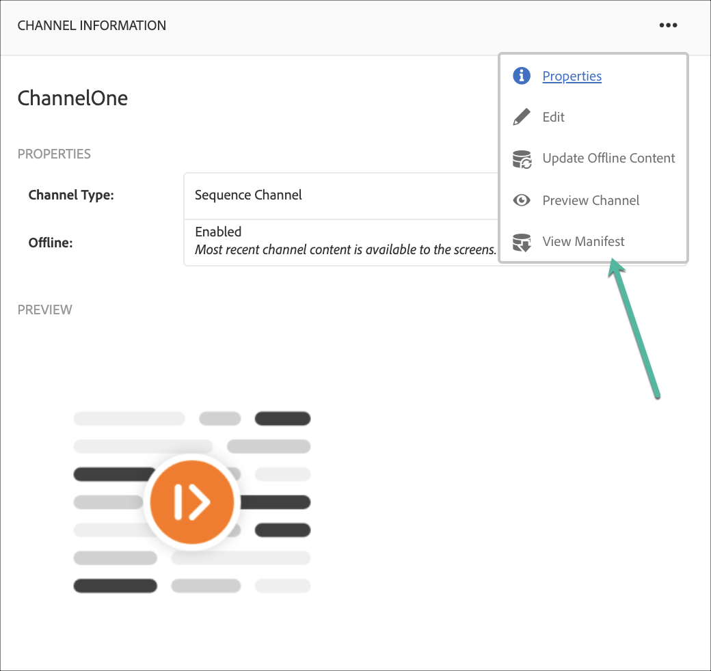

# 채널 만들기 및 관리 {#creating-and-managing-channels}

채널에는 일련의 컨텐츠(이미지 및 비디오)가 표시되며, 웹 사이트나 단일 페이지 애플리케이션도 표시됩니다.

이 페이지에는 AEM Screens에 대한 채널 만들기 및 관리 방법이 표시됩니다.

**전제 조건**:

* [Screens 구성 및 배포](configuring-screens-introduction.md)
* [Screens 프로젝트 만들기 및 관리](creating-a-screens-project.md)

## 새 채널 만들기 {#creating-a-new-channel}

AEM Screens에 대한 프로젝트를 만든 후 아래 단계에 따라 프로젝트에 대한 채널을 만드십시오.

1. Adobe Experience Manager 링크(왼쪽 상단)를 선택한 다음 화면 을 선택합니다. 또는 다음 위치로 직접 이동할 수 있습니다. `https://localhost:4502/screens.html/content/screens`.

1. Screens 프로젝트로 이동한 다음 **채널** 폴더를 삭제합니다.

1. 클릭 **만들기** 작업 표시줄에서

   

1. 다음 항목 선택 **시퀀스 채널** 템플릿 위치: **만들기** 마법사 및 클릭 **다음**.

   

1. 제목 입력 **ScreensChannel** 및 클릭 **만들기**.

   

1. 이제 시퀀스 채널이 **채널** 폴더를 삭제합니다.

### 채널 유형 {#channel-types}

마법사를 사용하는 동안 다음과 같은 템플릿 옵션을 사용할 수 있습니다.

| **템플릿 옵션** | **설명** |
|---|---|
| 채널 폴더 | 채널 컬렉션을 저장할 폴더를 만들 수 있습니다. |
| 시퀀스 채널 | 슬라이드 쇼에서 하나씩 구성 요소를 순차적으로 재생하는 채널을 만들 수 있습니다. |
| 응용 프로그램 채널 | Screens 플레이어에서 사용자 지정 웹 애플리케이션을 표시할 수 있습니다. |
| 1x1 분할 화면 채널 | 단일 영역에서 구성 요소를 볼 수 있습니다. |
| 1x2 분할 화면 채널 | 두 영역(가로 분할)에서 자산을 볼 수 있습니다. |
| 2X1 분할 화면 채널 | 두 영역(세로로 분할)에서 에셋을 볼 수 있습니다. |
| 2x2 분할 화면 채널 | 4개의 영역(행렬로 가로 및 세로로 분할)에서 에셋을 볼 수 있습니다. |
| 2 - 3 분할 화면 채널 | 두 영역(가로로 분할)의 에셋을 볼 수 있습니다. 이때 한 영역은 다른 영역보다 큽니다. |
| 왼쪽 또는 오른쪽 L-표시줄 분할 화면 채널 | 콘텐츠 작성자가 적절한 크기의 영역에서 다양한 유형의 에셋을 볼 수 있습니다. |

>[!NOTE]
>
>화면 분할 채널은 디스플레이를 여러 영역으로 분할하므로 여러 경험을 동시에 나란히 재생할 수 있습니다. 경험은 정적 에셋/텍스트 또는 포함된 시퀀스일 수 있습니다.

>[!IMPORTANT]
>
> 콘텐츠를 만들고 채널에 추가하면 다음 단계로 위치를 만든 후 디스플레이를 만듭니다. 또한 해당 채널을 디스플레이에 할당해야 합니다. 섹션의 끝에 있는 아래 리소스를 참조하십시오.

## 채널을 사용한 작업 {#working-with-channels}

채널을 편집하고, 등록 정보와 대시보드를 보고, 복사하고, 미리 보고, 삭제할 수 있습니다.

### 채널에 콘텐츠 추가/편집 {#adding-editing-content-to-a-channel}

채널에서 컨텐츠를 추가하거나 편집하려면 아래 단계를 따르십시오.

1. 편집할 채널을 선택합니다(위 그림에 표시됨).
1. 클릭 **편집** 채널 속성을 편집할 수 있도록 작업 표시줄의 왼쪽 상단 모서리에서 게시할 채널에 에셋/구성 요소를 추가할 수 있는 편집기가 열립니다.

>[!NOTE]
>채널에 구성 요소를 추가할 수 있습니다. 다음을 참조하십시오 **[채널에 구성 요소 추가](adding-components-to-a-channel.md)** 을 참조하십시오.

**채널에 비디오 업로드**

비디오를 채널에 업로드하려면 아래 단계를 따르십시오.

1. 비디오를 업로드할 채널을 선택합니다.
1. 클릭 **편집** 작업 표시줄에서
1. 편집기에서 **비디오** 에셋에서 필요한 비디오를 드래그 앤 드롭합니다.

>[!NOTE]
>채널에서 비디오를 업로드하는 데 문제가 발생하는 경우 다음을 참조하십시오. [비디오 문제 해결](troubleshoot-videos.md).

### 채널 속성 보기 또는 편집 {#viewing-properties}

1. 편집할 채널을 클릭합니다.
1. 클릭 **속성** 채널 속성을 보거나 편집할 수 있도록 작업 표시줄에서 을 클릭합니다. 다음 탭에서는 옵션을 변경할 수 있습니다.

### 대시보드 보기 {#viewing-dashboard}

1. 편집할 채널을 선택합니다.
1. 클릭 **대시보드** 작업 표시줄에서

### 채널 정보 {#channel-information}

[채널 정보] 패널에서는 채널에 대한 미리 보기와 함께 채널 속성에 대해 설명합니다. 또한 채널이 오프라인 상태인지 온라인 상태인지에 대한 정보도 제공합니다.

(**...**&#x200B;의 ) **채널 정보** 속성을 보거나, 콘텐츠를 편집하거나, 채널의 캐시(오프라인 콘텐츠)를 업데이트할 수 있는 작업 모음

#### 매니페스트 보기 {#view-manifest}

채널 대시보드에서 매니페스트를 볼 수 있습니다.

>[!IMPORTANT]
>이 옵션은 AEM 6.4 기능 팩 8 또는 AEM 6.5 기능 팩 4에서만 사용할 수 있습니다.

채널 대시보드에서 이 옵션을 활성화할 수 있도록 다음 단계를 따르십시오.

1. **채널을 오프라인으로 설정**
   1. 채널을 선택하고 **속성** 작업 표시줄에서
   1. 다음으로 이동 **채널** tab을 누르고 선택 취소했는지 확인 **개발자 모드(온라인 채널 강제 설정)** 옵션
   1. 클릭 **저장 및 닫기**
1. **오프라인 컨텐츠 업데이트**
   1. 채널을 선택하고 **대시보드** 작업 표시줄에서
   1. 다음으로 이동 **채널 정보** 패널 및 클릭 *...*
   1. 클릭 **오프라인 컨텐츠 업데이트**

다음이 표시됩니다. **매니페스트 보기** 옵션에서 **채널 정보** 패널 을 선택합니다.

### 온라인 및 오프라인 채널 {#online-and-offline-channels}

>[!NOTE]
>기본적으로 채널을 만들면 오프라인 상태가 됩니다.

채널을 만들 때 온라인 또는 오프라인 채널로 정의할 수 있습니다.

An ***온라인 채널*** 은 업데이트된 콘텐츠를 실시간 환경에 표시하지만 은 ***오프라인 채널*** 캐시된 콘텐츠를 표시합니다.

아래 단계에 따라 온라인으로 채널을 만듭니다.

1. 다음으로 채널 탐색 **테스트 프로젝트** > **채널** > **테스트 채널**.

   채널을 선택합니다.

   

   클릭 **대시보드** 플레이어의 상태를 볼 수 있도록 작업 표시줄에서 을 선택합니다. 다음 **채널 정보** 패널은 채널이 온라인인지 오프라인인지에 대한 정보를 제공합니다.

   

1. 클릭 **속성** 작업 표시줄에서 **채널** 아래 표시된 탭:

   

1. 다음 확인: **개발자** **모드(온라인 채널 강제 설정)** 온라인 상태로 만듭니다.

   클릭 **저장 및 닫기** 옵션을 저장합니다.

   

   채널 대시보드로 돌아가서 **채널 정보** 패널에 플레이어의 온라인 상태가 표시됩니다.

   

>[!NOTE]
>채널을 다시 오프라인으로 구성하려면 다음에서 개발자 모드 옵션을 선택 취소합니다. **속성** 탭(3단계에서 설명). 그런 다음 **채널 정보** 패널 클릭 **오프라인 컨텐츠 업데이트**&#x200B;을 참조하십시오.

#### 장치 대시보드의 자동 및 수동 업데이트 {#automatic-versus-manual-updates-from-the-device-dashboard}

다음 표에는 장치 대시보드의 자동 및 수동 업데이트와 관련된 이벤트가 요약되어 있습니다.

<table>
 <tbody>
  <tr>
   <td><strong>이벤트</strong></td>
   <td><strong>장치 자동 업데이트</strong></td>
   <td><strong>장치 수동 업데이트</strong></td>
  </tr>
  <tr>
   <td>온라인 채널 변경</td>
   <td>콘텐츠가 자동으로 업데이트됨</td>
   <td>
"장치: 푸시 구성"에서 콘텐츠 업데이트됨
 
또는,
 
콘텐츠 업데이트 일자 <strong><i>장치: 다시 시작</i></strong>
 </td>
  </tr>
  <tr>
   <td>오프라인 채널에서 변경하지만 채널 "푸시 콘텐츠"가 트리거되지 않음(오프라인 패키지 다시 만들기 없음)</td>
   <td>콘텐츠 업데이트 없음</td>
   <td>콘텐츠 업데이트 없음</td>
  </tr>
  <tr>
   <td>오프라인 채널 및 채널 "푸시 콘텐츠"의 변경 사항이 트리거됨(새 오프라인 패키지)</td>
   <td>콘텐츠가 자동으로 업데이트됨</td>
   <td>
콘텐츠 업데이트 일자 <strong><i>장치: 푸시 구성</i></strong>
 
또는,
 
콘텐츠 업데이트 일자 <strong><i>장치: 다시 시작</i></strong>
 </td>
  </tr>
  <tr>
   <td>
구성에서 변경

    <ul>
     <li>표시(강제 채널)</li>
     <li>장치</li>
     <li>채널 할당(새 채널, 제거된 채널)</li>
     <li>채널 할당(역할, 이벤트, 예약)</li>
    </ul> </td>
   <td>구성이 자동으로 업데이트됨</td>
   <td>
다음에 대한 구성이 업데이트됨: <strong><i>장치: 푸시 구성</i></strong>
 
또는,
 
다음에 대한 구성이 업데이트됨: <strong><i>장치: 다시 시작</i></strong>
 </td>
  </tr>
 </tbody>
</table>

### 지정된 디스플레이 {#assigned-displays}

다음 **할당된 디스플레이** 패널에는 채널과 연결된 디스플레이가 표시됩니다. 이 레이아웃은 해상도와 함께 지정된 디스플레이의 스냅샷을 제공합니다.

연관된 디스플레이가 **할당된 디스플레이** 패널, 아래 표시:

>[!NOTE]
>위치에 디스플레이를 만드는 방법에 대한 자세한 내용은 다음을 참조하십시오.
>
>* [위치 생성 및 관리](managing-locations.md)
>* [디스플레이 만들기 및 관리](managing-displays.md)
>

또한 **할당된 디스플레이** 패널 - 아래와 같이 표시 정보를 볼 수 있습니다.

### 다음 단계 {#the-next-steps}

채널을 만들고 채널에서 컨텐츠를 추가/편집한 다음 단계는 위치를 만들고 표시하는 방법을 배우는 것입니다. 그런 다음 해당 디스플레이에 채널을 할당합니다.

다음 단계는 다음 리소스를 참조하십시오.

* [채널 만들기 및 관리](managing-channels.md)
* [위치 생성 및 관리](managing-locations.md)
* [디스플레이 만들기 및 관리](managing-displays.md)
