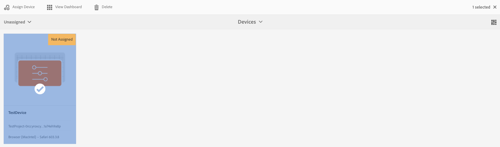
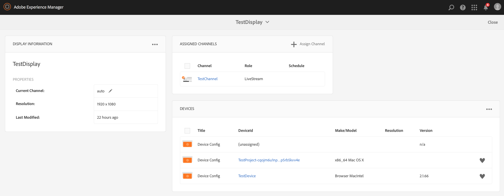

# 장치 관리 {#managing-devices}

>[!IMPORTANT]
>이 콘텐츠는 AEM On-Premise/AMS(AEM 6.5LTS 및 AEM 6.5)에 유효합니다. AEM as a Cloud Service Screens 콘텐츠의 경우 [AEM as a Cloud Service 안내서](https://experienceleague.adobe.com/ko/docs/experience-manager-cloud-service/content/screens-as-cloud-service/overview/introduction)를 참조하십시오.

이 페이지에서는 장치 지정에 대해 설명합니다.

장치 콘솔을 사용하면 장치 관리자에 액세스하여 장치를 디스플레이에 할당할 수 있습니다.

>[!CAUTION]
>
>장치를 할당하기 전에 등록하십시오. [장치 등록](device-registration.md)을 참조하세요.

## 장치 지정 {#device-assignment}

장치를 디스플레이에 할당하려면 아래 단계를 따르십시오.

1. 예를 들어 프로젝트의 Devices 폴더로 이동합니다.

   `http://localhost:4502/screens.html/content/screens/TestProject`

   

1. **장치** 폴더를 클릭하고 작업 표시줄에서 **장치 관리자**&#x200B;를 클릭합니다. 할당된 장치와 할당되지 않은 장치가 표시됩니다.

   

1. 목록에서 할당 해제된 장치를 클릭한 다음 작업 표시줄에서 **장치 할당**&#x200B;을 클릭합니다.

   

1. 목록에서 장치를 할당할 디스플레이를 클릭하고 **할당**&#x200B;을 클릭합니다.

   

1. 할당 프로세스를 완료하려면 **완료**&#x200B;를 클릭하십시오.

   디스플레이 대시보드는 **장치** 패널에 할당된 장치를 표시합니다.

   

   (**...**)을(를) 클릭합니다. **장치** 패널의 오른쪽 상단 모서리에서 장치 구성을 추가하거나 장치를 업데이트합니다.

   

>[!NOTE]
>
>새 Screens 프로젝트에 첫 번째 장치가 추가될 때마다 사용자 그룹이 생성됩니다.예를 들어 프로젝트 노드 이름이 *we-retail*&#x200B;이면 사용자 그룹 이름은 *screens-we-retail-devices*&#x200B;입니다.이 그룹은 아래 그림과 같이 **참가자** 그룹의 구성원으로 추가됩니다.

### 다음 단계 {#the-next-steps}

디스플레이에 채널을 할당하는 방법을 잘 이해했으면 t[모니터링 및 문제 해결](monitoring-screens.md)을 참조하십시오.

