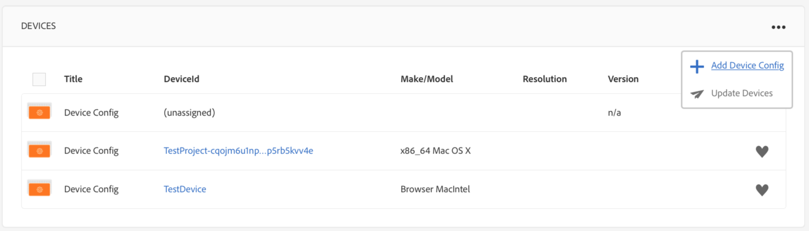

# 장치 관리 {#managing-devices}

이 페이지에서는 장치 지정에 대해 설명합니다.

장치 콘솔을 사용하면 장치 관리자에 액세스하여 디스플레이에 장치를 지정할 수 있습니다.

>[!CAUTION]
>
>장치를 지정하기 전에 등록해야 합니다. 자세한 내용은 [장치 등록](device-registration.md)을 참조하십시오.

## 장치 지정 {#device-assignment}

디스플레이에 장치를 지정하려면 아래 단계를 따르십시오.

1. 프로젝트의 장치 폴더로 이동합니다(예:

   `http://localhost:4502/screens.html/content/screens/TestProject`

   

1. Select your **Devices** folder and tap/click **Device Manager** in the action bar. 지정된 장치 및 지정이 취소된 장치가 표시됩니다.

   

1. Select an unassigned device from the list, and tap/click the **Assign Device** in the action bar.

   

1. Select the display you want to assign the device to from the list, and tap/click the **Assign**.

   

1. Tap/click the **Finish** to complete the assignment process.

   

   디스플레이 대시보드의 **장치** 패널에는 지정된 장치가 표시됩니다.

   

   **장치** 패널의 오른쪽 위 모서리에서 (**...**)을 클릭하여 장치 구성을 추가하거나 장치를 업데이트합니다.

   

>[!NOTE]
>
>첫 장치가 새 스크린 프로젝트에 추가될 때마다 사용자 그룹이 작성됩니다.
>For instance, if the project node name is *we-retail*, then the user group name is *screens-we-retail-devices*.
> 이 그룹은 아래 그림에서와 같이 **기여자** 그룹의 멤버로 추가됩니다.

### 다음 단계 {#the-next-steps}

디스플레이에 채널을 지정하는 방법을 잘 아는 경우 다음 리소스를 참조하십시오.

* [모니터링 및 문제 해결](monitoring-screens.md)

