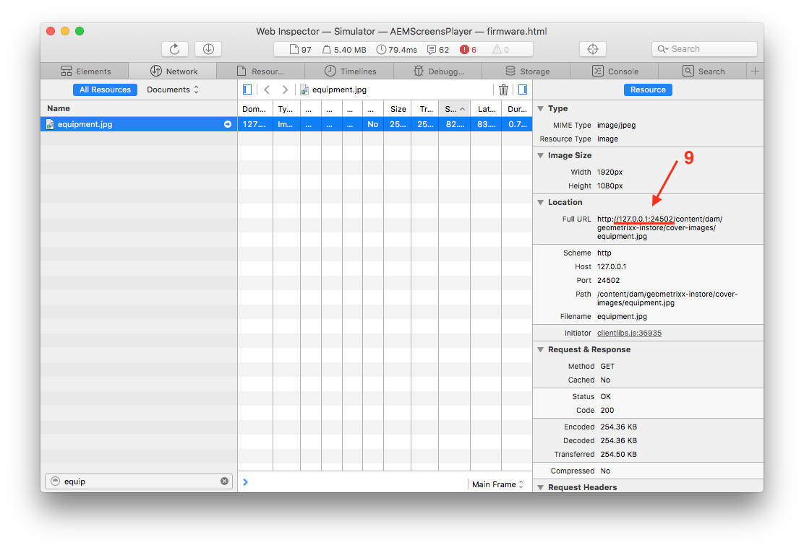

# Live Copy 만들기 및 관리 {#creating-and-managing-a-live-copy}

이 페이지에서는 채널의 Live Copy 생성 및 관리에 대해 설명합니다.

***Live Copy***&#x200B;는 원래 소스와의 라이브 관계가 유지되는 특정 사이트 컨텐츠의 사본입니다. 이 라이브 관계를 사용하면 Live Copy가 소스의 컨텐츠 및 페이지 속성을 상속할 수 있습니다.

이 페이지에서는 채널의 Live Copy 생성, 속성 보기, 상태 확인, Live Copy에 해당 채널의 변경 사항을 전파하는 것에 대해 설명합니다.

## Live Copy 생성 {#creating-a-live-copy}

아래 절차에 따라 프로젝트 폴더에 채널의 Live Copy를 생성하십시오.

1. Adobe Experience Manager 링크(왼쪽 위)를 선택한 다음 **스크린**&#x200B;을 선택합니다. 또는 다음 위치로 바로 이동할 수 있습니다.`http://localhost:4502/screens.html/content/screens`.

1. [스크린] 프로젝트로 이동하고 **채널**&#x200B;을 클릭합니다.
1. **만들기**&#x200B;를 클릭하고 **Live Copy**&#x200B;를 선택하여 채널의 Live Copy를 만듭니다.

1. 대상을 선택하고 **다음**&#x200B;을 클릭합니다.
1. Live Copy가 상주할 위치를 선택합니다.
1. **Live Copy 만들기** 페이지에서 **제목** 및 **이름**&#x200B;을 입력합니다.

1. 새 Live Copy의 컨텐츠를 보려면 **열기**&#x200B;를 클릭하고, 메인 페이지로 돌아가려면 **완료**&#x200B;를 클릭합니다.

또는, 채널의 새 Live Copy를 생성하기 위한 시각적 표시에 대해서는 아래 절차를 참조하십시오.

다음 예제는 대상 폴더가 ***채널***&#x200B;인 ***유휴 채널***&#x200B;에 대한 Live Copy(***IdleLiveCopy***) 생성을 보여줍니다.

## Live Copy 채널의 컨텐츠 보기 {#viewing-content-of-the-live-copy-channel}

Live Copy는 이미 존재하는 채널의 사본입니다.

Live Copy의 컨텐츠를 보려면 아래 절차를 참조하십시오.

1. [스크린] 프로젝트로 이동하고 위 섹션에 표시된 대로 Live Copy를 원래 생성한 위치를 클릭합니다. (여기에서 위치는 **채널** 폴더로 선택되었습니다.)

   

1. 작업 표시줄에서 **편집**&#x200B;을 클릭하여 채널의 컨텐츠를 확인합니다.

   

   >[!NOTE]
   >
   >Live Copy 채널의 컨텐츠를 볼 때 **Live Copy 상태**&#x200B;로서 메뉴의 추가 항목이 표시됩니다. 자세한 내용은 아래 섹션을 참조하십시오.

### Live Copy의 속성 보기 {#viewing-properties-of-a-live-copy}

또한 Live Copy 채널의 속성을 볼 수 있습니다.

1. Live Copy 채널로 이동하고 작업 표시줄에서 **속성**&#x200B;을 클릭합니다.

   

1. **Live Copy** 탭을 선택하여 채널의 세부 사항을 확인합니다.

   

### Live Copy 상태 {#live-copy-status}

아래 그림에 표시된 대로 **Live Copy 상태** 모드를 사용하면 채널에 있는 모든 자산의 관계 상태를 볼 수 있습니다.

1. **편집**&#x200B;을 클릭하여 **Live Copy 상태**&#x200B;를 선택하고 채널 컨텐츠의 Live Copy가 생성되는 원래 채널 연결을 확인합니다.

   

1. **Live Copy 상태**&#x200B;를 선택하여 미리 보기 페이지를 표시합니다.

   테두리가 녹색인 모든 리소스는 컨텐츠가 원래 채널에서 상속됨을 표시합니다.

   

### 상속 깨기 {#breaking-the-inheritance}

Live Copy에서 상속을 취소할 수도 있습니다. 그렇게 되면 컨텐츠가 원래 분기로부터 독립하게 됩니다.

다음 예는 편집 모드에서 이미지를 선택하고 오른쪽 위에 있는 상속 취소 기호를 클릭하는 것을 보여줍니다.

### 변경 사항을 Live Copy 채널에 전파 {#propagating-changes-to-the-live-copy-channel}

원래 채널에서 변경/업데이트 작업을 수행하는 경우, 이러한 변경 사항을 Live Copy 채널에도 전달해야 합니다.

아래 절차에 따라 변경 사항이 원래 채널에서 Live Copy 채널에 전파되도록 하십시오.

1. 원래 채널(***유휴 채널***)을 선택하고 작업 표시줄에서 **편집**&#x200B;을 클릭합니다.

   

1. 이 채널 컨텐츠를 편집합니다. 예를 들어, 이 채널에서 이미지를 삭제하십시오.

   

1. 채널의 Live Copy(***IdleLiveCopy***)를 선택하고 작업 표시줄에서 **편집**&#x200B;을 클릭합니다. 삭제한 이미지는 여전히 Live Copy에 표시됩니다.

   변경 사항을 전파하려면 채널을 동기화해야 합니다.

   

1. 변경 사항을 Live Copy 채널에 전파하려면 AEM 대시보드로 이동하여 Live Copy 채널을 선택하고 작업 표시줄에서 **속성**&#x200B;을 클릭합니다.

   

1. **Live Copy** 탭을 선택하고 작업 표시줄에서 **동기화**&#x200B;를 클릭합니다.

   

1. **동기화**&#x200B;를 클릭하여 변경 사항을 확인합니다. AEM 대시보드로 돌아가려면 **저장 및 닫기**&#x200B;를 클릭합니다.

   

   이제 Live Copy 채널에서도 이미지가 삭제되었음을 알 수 있습니다.

