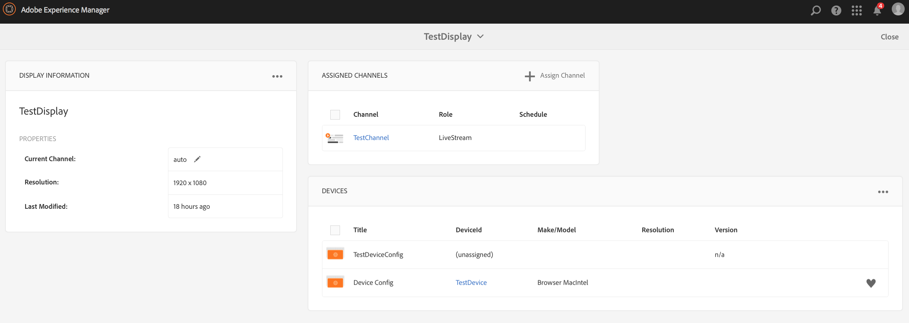

# 라이브 카피 만들기 및 관리 {#creating-and-managing-a-live-copy}

이 페이지에서는 채널의 라이브 카피를 만들고 관리하는 방법에 대해 설명합니다.

A ***Live Copy*** 는 원본 소스와의 라이브 관계가 유지되는 특정 사이트 콘텐츠의 사본입니다. 이 라이브 관계를 통해 Live Copy는 소스에서 콘텐츠 및 페이지 속성을 상속할 수 있습니다.

이 페이지에서는 채널의 라이브 카피를 만들고, 속성을 보고, 상태를 확인하고, 채널에서 라이브 카피로 변경 사항을 전달하는 방법을 설명합니다.

## Live Copy 만들기 {#creating-a-live-copy}

프로젝트 폴더에 채널의 라이브 카피를 만들려면 아래 단계를 따르십시오.

1. Adobe Experience Manager 링크(왼쪽 상단)를 선택한 다음 **스크린**. 또는 다음 위치로 직접 이동할 수 있습니다. `http://localhost:4502/screens.html/content/screens`.

1. Screens 프로젝트로 이동한 다음 **채널**.
1. 클릭 **만들기** 및 선택 **Live Copy** 따라서 채널의 라이브 카피를 만들 수 있습니다.
1. 대상을 선택하고 **다음**.
1. 라이브 카피를 저장할 수 있는 위치를 선택합니다.
1. 다음을 입력합니다. **제목** 및 **이름** 다음에서 **Live Copy 만들기** 페이지를 가리키도록 업데이트하는 중입니다.

1. 클릭 **열기** 새 live copy의 내용을 보려면 **완료** 기본 페이지로 돌아갑니다.

또는 채널의 새 라이브 카피를 만들기 위한 시각적 표현에 대해서는 아래 단계를 참조하십시오.

다음 예제에서는 라이브 카피(***IdleLiveCopy***&#x200B;에 대한 ) ***유휴 채널*** 대상 폴더를 로 사용 ***채널***.

## 라이브 카피 채널의 콘텐츠 보기 {#viewing-content-of-the-live-copy-channel}

라이브 카피는 존재하는 채널의 사본입니다.

라이브 카피의 콘텐츠를 보려면 아래 단계를 참조하십시오.

1. Screens 프로젝트로 이동하고 위의 섹션에 표시된 대로 원래 Live Copy를 만든 위치를 클릭합니다. (여기서 위치는 다음으로 선택됨) **채널** folder)

   

1. 클릭 **편집** 작업 표시줄에서

   

   >[!NOTE]
   >
   >라이브 카피 채널의 콘텐츠를 볼 때 메뉴에 있는 추가 항목은 로 표시됩니다. **Live Copy 상태**. 자세한 내용은 아래 섹션을 참조하십시오.

### 라이브 카피 속성 보기 {#viewing-properties-of-a-live-copy}

또한 라이브 카피 채널의 속성을 볼 수 있습니다.

1. 라이브 카피 채널로 이동하여 **속성** 작업 표시줄에서

   

1. 다음 항목 선택 **Live Copy** 을 탭하여 채널의 세부 사항을 볼 수 있습니다.

   

### Live Copy 상태 {#live-copy-status}

모드 **Live Copy 상태**&#x200B;아래 그림에서 보듯이 를 사용하면 채널에 있는 모든 에셋의 관계 상태를 볼 수 있습니다.

1. 클릭 **편집** 따라서 다음을 선택할 수 있습니다. **Live Copy 상태** 라이브 카피가 생성되는 원본 채널에 대한 채널 콘텐츠의 연결을 볼 수 있습니다.

   

1. 선택 **Live Copy 상태** 미리보기 페이지를 표시할 수 있습니다.

   녹색 테두리가 있는 모든 리소스는 컨텐츠가 원래 채널에서 상속되었음을 보여 줍니다.

   

### 상속 깨기 {#breaking-the-inheritance}

라이브 카피에서 상속을 취소할 수도 있으므로 콘텐츠는 원본 분기와 독립적입니다.

다음 예제에서는 편집 모드에서 이미지를 선택하고 오른쪽 상단의 상속 취소 기호를 클릭하는 방법을 보여 줍니다.

### 라이브 카피 채널에 변경 사항 전파 {#propagating-changes-to-the-live-copy-channel}

원래 채널을 변경하거나 업데이트하는 경우 이러한 변경 사항을 라이브 카피 채널에도 전파합니다.

변경 사항이 원래 채널에서 라이브 카피 채널로 전파되도록 하려면 아래 단계를 따르십시오.

1. 원본 채널 선택(***유휴 채널***) 및 선택 **편집** 작업 표시줄에서

   

1. 이 채널 콘텐츠를 편집합니다. 예를 들어 이 채널에서 이미지를 삭제합니다.

   

1. 채널의 라이브 카피(***IdleLiveCopy***) 및 선택 **편집** 작업 표시줄에서 삭제한 이미지는 여전히 Live Copy에 표시됩니다.

   변경 사항을 전파하려면 채널을 동기화합니다.

   

1. 라이브 카피 채널에 변경 사항을 전파하려면 AEM 대시보드로 이동하여 라이브 카피 채널을 선택하고 을 클릭합니다 **속성** 작업 표시줄에서

   

1. 다음 항목 선택 **Live Copy** 탭하고 선택 **동기화** 작업 표시줄에서

   

1. 선택 **동기화**&#x200B;을 선택한 다음 을 선택합니다. **저장 및 닫기** 을 클릭하여 AEM 대시보드로 돌아갑니다.

   

   이제 이미지가 Live Copy 채널에서도 삭제됩니다.
