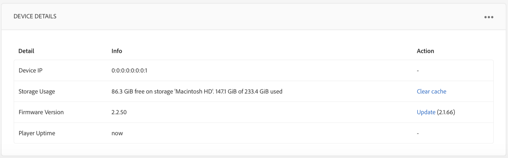

# 일정 만들기 및 관리 {#creating-and-managing-schedules}

>[!IMPORTANT]
>이 콘텐츠는 AEM On-Premise/AMS(AEM 6.5LTS 및 AEM 6.5)에 유효합니다. AEM as a Cloud Service Screens 콘텐츠의 경우 [AEM as a Cloud Service 안내서](https://experienceleague.adobe.com/en/docs/experience-manager-cloud-service/content/screens-as-cloud-service/overview/introduction)를 참조하십시오.

AEM Screens의 **일정**&#x200B;을 통해 재사용 가능한 그룹으로 채널을 구성할 수 있습니다. 이렇게 하면 콘텐츠를 표시할 각 디스플레이에 대해 개별적으로 할당을 반복하지 않아도 됩니다.

일정은 ***DayParting***&#x200B;과(와) 결합하면 하루 중 특정 시간에 여러 채널이 실행되는 글로벌 일정을 설정하고 모든 디스플레이에 대해 설정된 일정을 한 번에 재사용할 수 있습니다.

>[!NOTE]
>
>이 AEM Screens 기능은 AEM 6.3 Sites 기능 팩 1을 설치한 경우에만 사용할 수 있습니다. 이 기능 팩에 액세스하려면 Adobe 지원에 문의하고 액세스를 요청하십시오. 필요한 권한이 있으면 패키지 공유에서 다운로드할 수 있습니다.

## 일정 만들기 {#creating-a-schedule}

사용 사례에 대한 모든 활동을 관리할 수 있는 Screens 프로젝트에 대한 일정을 만들 수 있습니다.

채널의 일정을 만들려면 아래 단계를 수행하십시오.

1. Adobe Experience Manager 링크(왼쪽 상단)를 클릭한 다음 Screens을 클릭합니다. 또는 직접 `http://localhost:4502/screens.html/content/screens`(으)로 이동할 수 있습니다.
1. Screens 프로젝트로 이동한 다음 **일정**&#x200B;을 클릭합니다.
1. 작업 표시줄에서 **만들기**&#x200B;를 클릭합니다.
1. **만들기** 마법사에서 **예약**&#x200B;을 클릭하고 **다음**&#x200B;을 클릭합니다.

1. **이름** 및 **제목**&#x200B;을 입력하고 **만들기**&#x200B;를 클릭합니다.

프로젝트에서 지정된 이름과 제목의 예약 폴더를 볼 수 있습니다.

## 대시보드 보기 {#viewing-dashboard}

프로젝트에서 일정 폴더를 생성한 후 일정 대시보드에서 세부 정보를 볼 수 있습니다.

예약 대시보드를 보려면 아래 단계를 따르십시오. 다음 예제에서는 `We.Retail` 프로젝트의 대시보드를 보여 줍니다.

1. Screens(예: `We.Retail`) 프로젝트의 **일정** 폴더로 이동합니다.

   

1. 작업 표시줄에서 **대시보드**&#x200B;를 클릭합니다.

   **일정 정보**, **할당된 채널**, **할당된 디스플레이**&#x200B;와 같은 세 개의 다른 패널을 볼 수 있습니다.

   

   **일정 정보 패널** - [일정 정보 패널]의 오른쪽 상단 모서리에서 [속성]을 클릭하여 일정 속성을 보거나 변경합니다.

   **할당된 채널 패널** - 할당된 채널 패널의 오른쪽 상단에서 +채널 할당 을 클릭하여 채널 할당 대화 상자를 엽니다.

   **할당된 디스플레이 패널** - 할당된 디스플레이 패널에서 디스플레이 중 하나를 클릭하여 디스플레이 대시보드를 엽니다.

