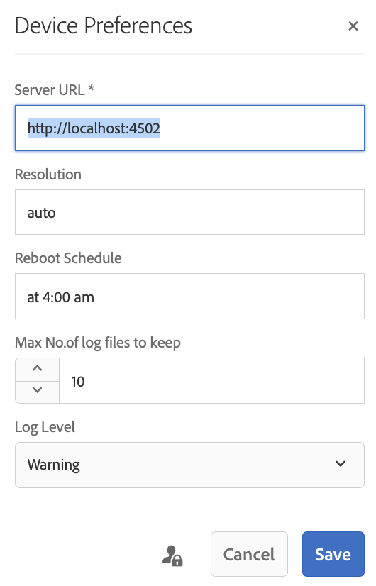

# 장치 제어 센터 문제 해결 {#troubleshooting-device-control-center}

장치 대시보드를 사용하여 AEM Screens 플레이어 활동 및 장치의 성능을 모니터링하고 문제를 해결할 수 있습니다. 이 페이지에서는 Screens 플레이어 및 할당된 장치의 인식된 성능 문제를 모니터링하고 해결하는 방법에 대한 정보를 제공합니다.

## Device Control Center에서 모니터링 및 문제 해결 {#monitor-and-troubleshoot-from-device-control-center}

활동을 모니터링하여 장치 대시보드를 사용하여 AEM Screens 플레이어 문제를 해결할 수 있습니다.

### 장치 대시보드 {#device-dashboard}

장치 대시보드로 이동하려면 아래 단계를 따르십시오.

1. 프로젝트에서 디바이스 대시보드로 이동합니다(예: ). ***테스트 프로젝트*** > ***장치***.

   클릭 **장치** 및 **장치 관리자** 작업 표시줄에서

   

1. 아래 그림과 같이 목록에는 할당된 디바이스와 할당되지 않은 디바이스가 표시됩니다.

   

1. 장치(**새 테스트 장치**) 및 클릭 **대시보드** 작업 표시줄에서

   

1. 이 페이지에는 장치 활동 및 기능을 모니터링할 수 있는 장치 정보, 활동 및 장치 세부 정보가 표시됩니다.

   

### 장치 활동 모니터링 {#monitor-device-activity}

다음 **활동** 패널에는 타임스탬프가 있는 AEM Screens 플레이어의 마지막 ping이 표시됩니다. 마지막 ping은 디바이스가 서버에 마지막으로 접속한 시간에 해당합니다.

을 클릭합니다. **로그 수집** 의 오른쪽 상단 모서리에서 **활동** 패널에 플레이어에 대한 로그를 표시합니다.

### 장치 세부 정보 업데이트 {#update-device-details}

다음 확인: **장치 세부 사항** 패널 을 통해 디바이스의 디바이스 IP, 스토리지 사용량, 펌웨어 버전 및 플레이어 가동 시간을 확인할 수 있습니다.

을 클릭합니다. **캐시 지우기** 및 **업데이트** 장치의 캐시를 지우고 를 업데이트하려면 [펌웨어](screens-glossary.md) 각각 이 패널의 버전입니다.

을 클릭합니다. **...** 의 오른쪽 상단 모서리에서 **장치 세부 사항** 패널 을 클릭하여 플레이어의 상태를 다시 시작하거나 새로 고칩니다.

### 장치 정보 업데이트 {#update-device-information}

다음 확인: **장치 정보** 패널. 여기에서 구성 업데이트, 장치 모델, 장치 OS 및 셸 정보를 볼 수 있습니다.

또한 (**...**)을 클릭하여 속성을 확인하거나 장치를 업데이트할 수 있습니다.

클릭 **속성** 을(를) 클릭하여 **장치 속성** 대화 상자. 장치 제목을 편집하거나 다음과 같은 구성 업데이트 옵션을 선택할 수 있습니다. **수동** 또는 **자동**.

>[!NOTE]
>
>장치의 자동 또는 수동 업데이트와 관련된 이벤트에 대한 자세한 내용은 섹션을 참조하십시오 ***장치 대시보드의 자동 및 수동 업데이트*** 위치: [채널 관리](managing-channels.md).

### 플레이어 스크린샷 보기 {#view-player-screenshot}

의 장치에서 플레이어 스크린샷을 볼 수 있습니다. **플레이어 스크린샷** 패널.

클릭 (**...**)을 클릭하여 플레이어 스크린샷 패널의 오른쪽 상단에 있는 **스크린샷 새로 고침** 실행 중인 플레이어의 스냅샷을 봅니다.

### 환경 설정 관리 {#manage-preferences}

다음 **환경 설정** 사용자는 패널 을 사용하여 다음에 대한 환경 설정을 변경할 수 있습니다. **관리자 UI**, **채널 전환기**, 및 **원격 디버깅** 디바이스용

>[!NOTE]
>이러한 옵션에 대한 자세한 내용은 [AEM Screens 플레이어](working-with-screens-player.md).

을 클릭합니다. **설정** 오른쪽 상단에서 디바이스 환경 설정을 업데이트합니다. 다음 기본 설정을 업데이트할 수 있습니다.

* **서버 URL**
* **해결**
* **재부팅 일정**
* **최대 수 보관할 로그 파일의 수**
* **로그 수준**

>[!NOTE]
>다음 로그 수준 중 하나를 클릭할 수 있습니다.
>* **사용 안 함**
>* **디버그**
>* **정보**
>* **경고**
>* **오류**

## OSGi 설정 문제 해결 {#troubleshoot-osgi-settings}

빈 레퍼러를 활성화하여 장치가 데이터를 서버에 게시할 수 있도록 합니다. 예를 들어 빈 레퍼러 속성이 비활성화된 경우 디바이스는 스크린샷을 다시 게시할 수 없습니다.

현재 이러한 기능 중 일부는 *Apache Sling Referrer 필터가 비어 있음* 은 OSGi 구성에서 활성화됩니다. 대시보드에 보안 설정으로 인해 이러한 기능 중 일부가 작동하지 않을 수 있다는 경고가 표시될 수 있습니다.

Apache Sling Referrer Filter Allow Empty 를 활성화하려면 아래 단계를 따르십시오

1. 다음으로 이동 **Adobe Experience Manager 웹 콘솔 구성**, 즉, `https://localhost:4502/system/console/configMgr/org.apache.sling.security.impl.ReferrerFilter`.
1. 다음 확인: **allow.empty** 옵션을 선택합니다.
1. **저장**&#x200B;을 클릭합니다.

### 권장 사항 {#recommendations}

다음 섹션에서는 네트워크 링크, 서버 및 플레이어를 모니터링하여 상태를 이해하고 문제에 대응할 것을 권장합니다.

AEM은 다음에 대한 내장 모니터링을 제공합니다.

* *하트비트* 5초마다 AEM Screens 플레이어가 작동 중임을 나타냅니다.
* *스크린샷* 플레이어에 표시되는 항목을 보여 주는 플레이어에서 가 표시됩니다.
* 다음 *AEM Screens 플레이어 펌웨어* 플레이어에 설치된 버전입니다.
* *사용 가능한 저장 공간* 플레이어에서.

타사 소프트웨어를 사용한 원격 모니터링용 Recommendations:

* 플레이어에서 CPU 사용량.
* AEM Screens Player 프로세스가 실행 중인지 확인합니다.
* 플레이어의 원격 재시작/재부팅
* 실시간 알림.

원격 로그인으로 문제를 진단하고 플레이어를 다시 시작할 수 있는 방식으로 플레이어 하드웨어 및 OS를 배포하는 것이 좋습니다.

#### 기타 리소스 {#additional-resources}

다음을 참조하십시오 [비디오 재생 구성 및 문제 해결](troubleshoot-videos.md) 채널에서 재생되는 비디오를 디버깅하고 문제를 해결하려면 다음을 수행하십시오.
