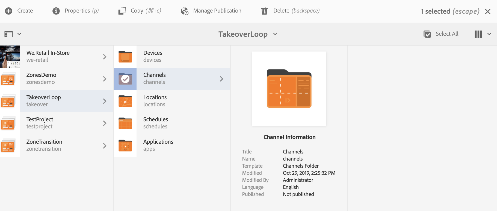
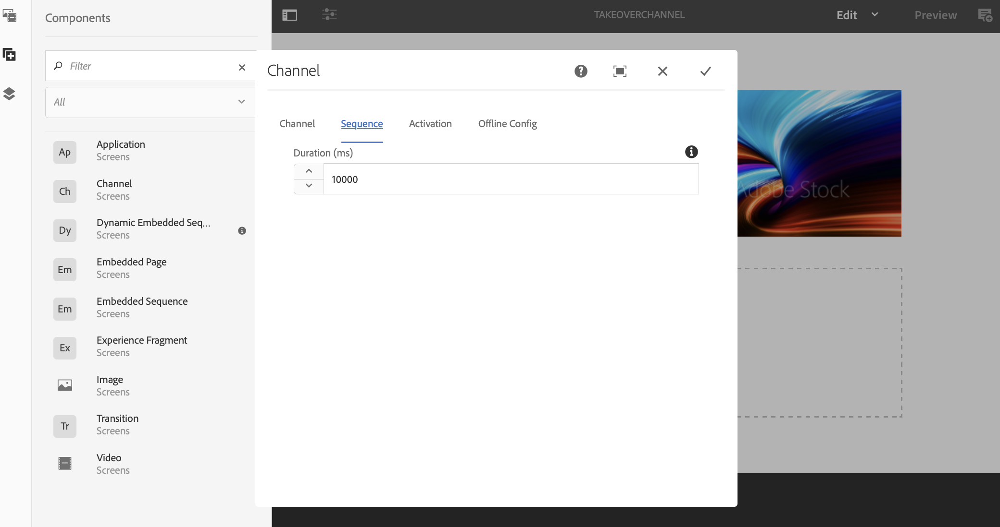

# 다중 영역을 단일 영역으로 전환 {#multizone-to-singlezone-use-case}

## 사용 사례 설명 {#use-case-description}

이 섹션에서는 단일 영역 레이아웃 채널과 대등하게 다중 영역 레이아웃 채널을 설정하는 방법을 강조하는 사용 사례 예제를 설명합니다. 다중 영역 채널에는 시퀀싱 이미지/비디오 자산이 있으며 다중 영역에서 단일 영역으로 또는 그 반대로 전환하는 프로젝트를 설정하는 방법을 보여줍니다.

### 전제 조건 {#preconditions}

이 사용 사례를 시작하기 전에 다음 방법을 이해했는지 확인하십시오.

* **[채널 만들기 및 관리](managing-channels.md)**
* **[위치 만들기 및 관리](managing-locations.md)**
* **[예약 생성 및 관리](managing-schedules.md)**
* **[장치 등록](device-registration.md)**

### 주 배우 {#primary-actors}

컨텐츠 작성자

## 프로젝트 {#setting-up-the-project} 설정

프로젝트를 설정하려면 아래 절차를 따르십시오.

1. 아래 표시된 대로 **TakeoverLoop**&#x200B;로 이름이 지정된 AEM Screens 프로젝트를 만듭니다.

   

1. **다중 영역 스크린 채널 만들기**

   1. **채널** 폴더를 선택하고 작업 표시줄에서 **만들기** 를 클릭하여 마법사를 열고 채널을 만듭니다.
   1. 마법사에서 **왼쪽-L 막대 분할 화면 채널**&#x200B;을 선택하고 **MultiZoneLayout**&#x200B;이라는 채널을 만듭니다.
   1. 채널에 컨텐츠를 추가합니다. 자산을 각 영역으로 끌어다 놓습니다. 다음 예제는 아래 표시된 대로 비디오, 이미지 및 텍스트 배너(포함된 시퀀스)로 구성된 **MultiZoneLayout** 채널을 보여줍니다.

   

   >[!NOTE]
   >
   >채널에서 다중 영역 레이아웃을 만드는 방법에 대한 자세한 내용은 [다중 영역 레이아웃](multi-zone-layout-aem-screens.md)을 참조하십시오.

1. **TakeoverChannel** 이라는 다른 채널을 **채널** 폴더에 만듭니다.

   

1. 작업 표시줄에서 **편집**&#x200B;을 클릭하여 이 채널에 컨텐츠를 추가합니다. 아래 그림과 같이 **채널** 구성 요소와 전환할 이미지 자산을 이 채널에 추가합니다.

   

1. 채널 구성 요소에 대한 설정을 열고 **MultiZoneLayout** 채널에서 만든 *단계 2*&#x200B;에 가리킵니다.

   

1. **시퀀스** 필드에서 기간을 **10000 ms**&#x200B;로 설정합니다.

   

1. 마찬가지로, 이미지(추가한 자산)에 대한 설정을 열고 기간을 **시퀀스** 필드에서 **3000ms**&#x200B;로 설정합니다.

   

## 미리 보기 {#checking-the-preview} 확인

플레이어에서 또는 편집기에서 **미리 보기**&#x200B;를 클릭하여 원하는 출력을 볼 수 있습니다.

출력에서는 다중 영역 레이아웃이 *10000 ms*&#x200B;에 대해 재생되는 방법을 보여 주고, 재생 기간이 *3000ms*&#x200B;인 단일 영역 레이아웃으로 전환한 다음 다시 다중 영역 레이아웃으로 전환하는 방법을 보여 줍니다.

>[!VIDEO](https://video.tv.adobe.com/v/30366)

>[!NOTE]
>
>요구 사항에 따라 채널 전환을 사용자 지정(다중 영역에서 단일 영역 레이아웃으로 또는 그 반대로)할 수 있습니다.