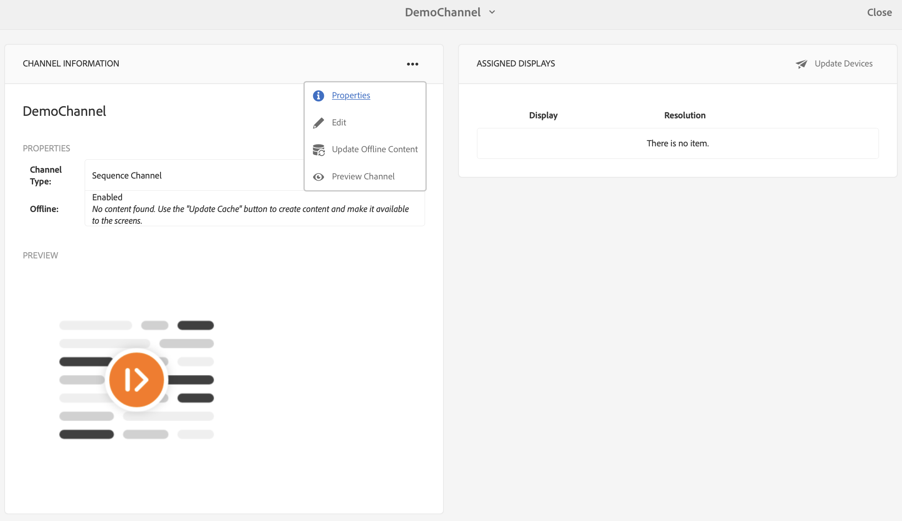

# 온디맨드 컨텐츠 업데이트 {#on-demand}

이 섹션에서는 발행물 관리를 위한 On-Demand 컨텐츠에 대해 설명합니다.

## 게시 관리:작성자에서 장치로 게시까지 컨텐츠 업데이트 제공 {#managing-publication-delivering-content-updates-from-author-to-publish-to-device}

AEM Screens에서 컨텐츠를 게시하고 게시 취소할 수 있습니다. 게시 관리 기능을 사용하면 작성자에서 장치에 게시하기 위한 컨텐츠 업데이트를 제공할 수 있습니다. 전체 AEM Screens 프로젝트 또는 채널, 위치, 장치, 애플리케이션 또는 일정 중 하나에 대해서만 컨텐츠를 게시/게시 취소할 수 있습니다.

### AEM Screens 프로젝트에 대한 게시 관리 {#managing-publication-for-an-aem-screens-project}

AEM Screens 프로젝트에 대한 콘텐츠 업데이트를 작성자에서 장치로 게시하려면 아래 절차를 따르십시오.

1. AEM Screens 프로젝트로 이동합니다.
1. 작업 **표시줄에서** 게시 관리를 클릭하여 프로젝트를 게시하여 인스턴스를 게시합니다.

   

1. The **Manage Publication** wizard opens. 동작을 선택하고 **게시** 시간을 지금 또는 나중에 예약할 수도 있습니다. **다음**&#x200B;을 클릭합니다.

   

1. 게시 관리 마법사에서 전체 프로젝트를 선택하려면 **이 확인란을** 선택합니다.

   

1. 작업 표시줄에서 **+ 하위** 포함을 클릭하고 모든 옵션을 선택 취소하여 프로젝트의 모든 모듈을 게시하고 게시할 **추가를** 클릭합니다.

   >[!NOTE]
   >
   >기본적으로 모든 상자가 선택되고 프로젝트의 모든 모듈을 게시하려면 확인란을 수동으로 선택 취소해야 합니다.

   

   **하위 포함 대화 상자 이해**

   위에 언급된 단계는 전체 컨텐츠를 게시하는 방법을 보여줍니다. 사용할 수 있는 다른 세 가지 대안을 사용하려면 해당 특정 옵션을 확인해야 합니다.
예를 들어 다음 이미지를 사용하면 프로젝트에서 수정된 페이지만 관리하고 업데이트할 수 있습니다.
   

   아래 설명을 따라 사용 가능한 옵션을 파악하십시오.

   1. **바로 아래 하위만**&#x200B;포함:이 옵션을 사용하면 프로젝트 구조의 하위 노드에만 업데이트를 관리할 수 있습니다.
   1. **수정된 페이지만 포함**:이 옵션을 사용하면 프로젝트 구조에서 변경 사항이 발견되는 프로젝트의 수정된 페이지에만 업데이트를 관리할 수 있습니다.
   1. **이미 게시된 페이지만**&#x200B;포함:이 옵션을 사용하면 이전에 게시된 페이지의 업데이트만 관리할 수 있습니다.

1. 게시 **관리** 마법사에서 **게시를 클릭합니다.**

   

   >[!NOTE]
   >
   >컨텐츠가 게시 인스턴스에 도달하도록 몇 초/분 동안 기다립니다.
   >
   >
   >    1. 프로젝트에 변경 사항이 없고 오프라인 콘텐츠 업데이트에 대한 내용이 없으면 워크플로우가 **작동하지 않습니다**.
   >    1. 게시 관리 워크플로우에서 게시 단추를 클릭한 후 작성자가 복제 프로세스를 완료하지 않으면(컨텐츠가 여전히 게시 인스턴스에 업로드 **중** ) 워크플로우가 작동하지 않습니다.

   > [!CAUTION]
   > 작성자 또는 컨텐츠 작성자는 작성 인스턴스에 연결된 디바이스의 변경 사항을 보려면 채널 대시보드에서 **오프라인 컨텐츠** 업데이트를 클릭하거나 프로젝트를 선택합니다. 이 경우 오프라인 컨텐츠 업데이트는 작성 인스턴스에서만 수행됩니다.

1. 프로젝트로 이동하고 작업 표시줄에서 **오프라인 컨텐츠** 업데이트를 클릭합니다. 이 작업은 동일한 명령을 게시 인스턴스로 전달하여 오프라인 zip이 게시 인스턴스에도 만들어지도록 합니다.

   

   >[!NOTE]
   >
   >게시 관리 워크플로우를 완료하고 작성 인스턴스를 가리키는 플레이어가 있는 경우 작성자에서 오프라인 컨텐츠 업데이트를 트리거해야 작성자 인스턴스에서 오프라인으로 업데이트를 만들 수 있습니다.

   >[!CAUTION]
   >
   >플레이어가 작성자 서버에 등록된 경우 작성자 인스턴스에서 오프라인 컨텐츠 업데이트를 트리거해야 합니다. 게시 인스턴스에 등록된 플레이어에는 오프라인 콘텐츠를 업데이트할 필요가 없습니다.

### 채널에 대한 게시 관리 {#managing-publication-for-a-channel}

AEM Screens 프로젝트에서 채널에 대한 콘텐츠 업데이트를 작성자에서 장치로 게시하려면 아래 절차를 따르십시오.

>[!NOTE]
>
>채널에 변경 사항이 있는 경우에만 이 섹션을 따르십시오. 이전 업데이트 오프라인 콘텐츠 이후에 채널에 변경 사항이 없는 경우 개별 채널에 대한 게시 관리 워크플로우가 작동하지 않습니다.

1. 스크린 프로젝트로 이동하고 채널을 선택합니다.
1. 작업 **표시줄에서** 게시 관리를 클릭하여 게시할 채널을 게시합니다.

   

1. The **Manage Publication** wizard opens. 동작을 선택하고 **게시** 시간을 지금 또는 나중에 예약할 수도 있습니다. **다음**&#x200B;을 클릭합니다.

   

1. 게시 **관리** 마법사에서 **게시를 클릭합니다.**

   

   >[!NOTE]
   >
   >컨텐츠가 게시 인스턴스에 도달하도록 몇 초/분 동안 기다립니다.

1. 게시 관리 워크플로우를 완료한 후에는 작성자에서 오프라인 컨텐츠 업데이트를 트리거해야 합니다. 그러면 작성자 인스턴스에서 오프라인으로 업데이트가 생성됩니다.

   채널 대시보드로 이동하고 오프라인 컨텐츠 **업데이트를 클릭합니다**. 이 작업은 동일한 명령을 게시 인스턴스로 전달하여 오프라인 zip이 게시 인스턴스에도 만들어지도록 합니다.

   

   >[!CAUTION]
   >
   >먼저 게시한 다음 이전 단계에 요약된 대로 오프라인 컨텐츠 업데이트를 트리거해야 합니다.

### 채널 및 장치 재할당: {#channel-and-device-re-assignment}

장치를 다시 할당한 경우 장치를 새 디스플레이에 다시 할당하면 초기 디스플레이와 새 디스플레이를 모두 게시해야 합니다.

마찬가지로 채널을 재할당한 경우 새 디스플레이에 채널이 다시 할당되면 초기 디스플레이와 새 디스플레이를 모두 게시해야 합니다.