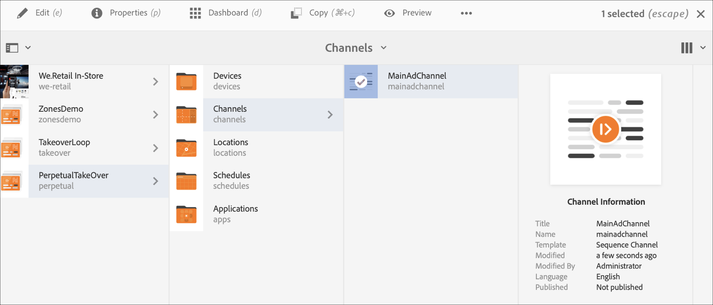
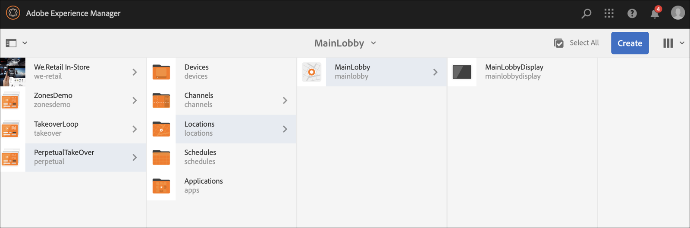

# 영구 인계 채널 {#perpetual-takeover-channel}

다음 페이지에서는 특정 시간 및 일 동안 지속적으로 재생되는 영구 인계 채널을 만드는 방법에 대한 프로젝트 설정을 강조하는 사용 사례를 보여줍니다.

## 사용 사례 설명 {#use-case-description}

이 사용 사례에서는 다음과 같은 채널을 만드는 방법을 설명합니다. *인수* 디스플레이 또는 디스플레이 그룹에 대해 일반적으로 재생되는 채널에서 사용됩니다. 인수는 특정한 날과 시간 동안 지속적으로 발생할 것이다.
예를 들어 매주 금요일 오전 9시부터 오전 10시까지 재생되는 퍼페츄얼 TakeOver 채널이 있습니다. 이 시간 동안에는 다른 채널이 재생되지 않습니다. 다음 예제에서는 매주 수요일 오후 2시부터 오후 4시까지 2시간 동안 콘텐츠를 재생할 수 있는 영구 인계 채널 을 만드는 방법을 보여줍니다.

### 전제 조건 {#preconditions}

이 사용 사례를 시작하기 전에 다음 방법을 이해했는지 확인하십시오.

* **[채널 만들기 및 관리](managing-channels.md)**
* **[위치 생성 및 관리](managing-locations.md)**
* **[일정 만들기 및 관리](managing-schedules.md)**
* **[장치 등록](device-registration.md)**

### 기본 작업자 {#primary-actors}

콘텐츠 작성자

## 프로젝트 설정 {#setting-up-the-project}

프로젝트를 설정하려면 아래 단계를 따르십시오.

**채널 및 디스플레이 설정**

1. 제목이 인 AEM Screens 프로젝트 만들기 **PerpetiveTakeOver**&#x200B;아래에 표시된 대로 를 클릭합니다.

   

1. 만들기 **주 광고 채널** 다음에서 **채널** 폴더를 삭제합니다.

   

1. 다음 항목 선택 **주 광고 채널** 및 클릭 **편집** 작업 표시줄에서 일부 에셋(이미지, 비디오, 포함된 시퀀스)을 채널로 드래그하여 놓습니다.

   

   >[!NOTE]
   >다음 **주 광고 채널** 이 예에서는 콘텐츠를 지속적으로 재생하는 시퀀스 채널을 보여 줍니다.

1. 만들기 **인계인수** 에서 컨텐츠를 접수하는 채널 **주 광고 채널** 매주 수요일 오후 2시부터 4시까지 합니다.

1. 을(를) 선택합니다. **인계인수** 및 클릭 **편집** 작업 표시줄에서 일부 에셋을 채널로 드래그하여 놓습니다. 다음 예에서는 이 채널에 추가된 단일 영역 이미지를 보여 줍니다.

   

1. 채널의 위치 및 디스플레이를 설정합니다. 예를 들어 다음 위치 **메인 로비** 및 표시 **메인 로비 디스플레이** 이 프로젝트에 대해 설정되었습니다.

   

**디스플레이에 채널 할당**

1. 디스플레이 선택 **메인 로비 디스플레이** 다음에서 **위치** 폴더를 삭제합니다. 클릭 **채널 할당** 작업 표시줄에서 열기 **채널 할당** 대화 상자.

   >[!NOTE]
   >디스플레이에 채널을 할당하는 방법에 대해 알아보려면 를 참조하십시오. **[채널 할당](channel-assignment.md)**.

1. 필드 채우기(**채널 경로**, **우선 순위**, 및 **지원되는 이벤트**&#x200B;의 ) **채널 할당** 대화 상자 및 클릭 **저장** 을(를) 할당하려면 **주 광고 채널** 화면에 표시합니다.

   * **채널 경로**: 경로 선택 **주 광고 채널** channel
   * **우선 순위**: 이 채널의 우선 순위를 1로 설정합니다.
   * **지원되는 이벤트**: 다음을 선택합니다. **초기 로드** 및 **유휴 화면**.

   

1. 디스플레이 선택 **인계인수** 다음에서 **위치** 폴더를 삭제합니다. 클릭 **채널 할당** 작업 표시줄에서 인수 채널을 할당합니다.

1. 을(를) 할당하려면 **인계인수** 예약된 시간에 디스플레이에 채널을 보내고 다음 필드를 다음에서 채웁니다. **채널 할당** 대화 상자 및 클릭 **저장**:

   * **채널 경로**: 경로 선택 **인계인수** channel
   * **우선 순위**: 이 채널의 우선 순위를 보다 크게 설정합니다. **주 광고 채널**. 예를 들어 이 예제에서 설정한 우선 순위는 8입니다.
   * **지원되는 이벤트**: 다음을 선택합니다. **유휴 화면** 및 **타이머**.
   * **예약**: 이 채널에서 표시를 실행할 예약에 대한 텍스트를 입력합니다. 의 텍스트 **예약** 이 예제에서 언급된 것은 *14:00 이후 및 16:00 이전에*.

      >[!NOTE]
      >에 추가할 수 있는 표현식에 대해 자세히 알아보려면 **예약**&#x200B;을(를) 참조하십시오. [표현식 예](#example-expressions) 아래 섹션.
   * **활성 시작일**: 시작일 및 시간.
   * **활성 종료일**: 종료 날짜 및 시간.

      예를 들어 의 텍스트는 **예약** 및 **활성 시작일** 및 **활성 종료일** 여기에서 날짜 및 시간을 사용하면 매주 수요일 오후 2시에서 오후 4시까지 콘텐츠를 재생할 수 있습니다.

      

      다음에서 디스플레이로 이동합니다. **인계인수** —> **위치** —> **메인 로비** —> **메인 로비 디스플레이** 및 클릭 **대시보드** 아래 표시된 대로 작업 표시줄에서 할당한 채널을 우선 순위로 봅니다.

      >[!NOTE]
      >인수채널의 우선 순위를 가장 높게 설정하는 것이 의무적이다.

      
이제 **인계인수** 채널이 을(를) 인수함 **주 광고 채널** 매주 수요일 오후 4시까지 2시간 동안 오후 2시에 2020년 1월 9일부터 2020년 1월 31일까지 콘텐츠를 재생한다.

## 표현식 예 {#example-expressions}

다음 표에는 디스플레이에 채널을 지정하는 동안 일정에 추가할 수 있는 몇 가지 표현식 예가 요약되어 있습니다.

| **표현식** | **해석** |
|---|---|
| 오전 8:00 이전 | 그 채널은 매일 오전 8시 이전에 재생된다 |
| 오후 2:00 이후 | 그 채널은 매일 오후 2시 이후에 재생된다 |
| 12:15 후 및 12:45 전 | 채널은 매일 오후 12시 15분 이후에 30분 동안 재생됩니다 |
| 12:15 이전 또는 12:45 이후 | 이 채널은 매일 오후 12시 15분 전에 재생되며 오후 12시 45분 이후에도 재생됩니다 |
| 1월 1일 오후 2시 이후 1월 2일 역시 1월 3일 오전 3시 이전 1월 3일에 해당한다 | 1월 1일 오후 2시 이후 채널 재생이 시작되어, 1월 2일 하루 종일 1월 3일 오전 3시까지 계속 재생된다 |
| 1월 1-2일 오후 2시 이후 역시 1월 2-3일 오전 3시 이전 | 채널은 1월 1일 오후 2시 이후에 플레이어를 시작하여 1월 2일 오전 3시까지 계속 재생하다가 1월 2일 오후 2시에 다시 시작하여 1월 3일 오전 3시까지 계속 재생됩니다 |

>[!NOTE]
>
>다음을 사용할 수도 있습니다. _군사 시간_ 대신 표기법(즉, 14:00) *오전/오후* 표기법(오후 2시)
