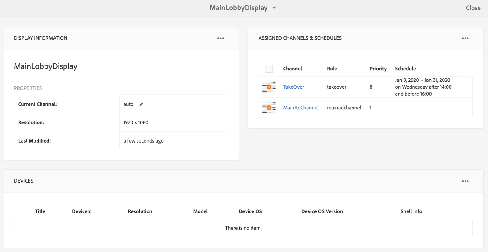

# 영구 인계 채널 {#perpetual-takeover-channel}

다음 페이지에서는 특정 시간 및 일 동안 지속적으로 재생되는 영구 인계 채널을 만드는 방법에 대한 프로젝트 설정을 강조하는 사용 사례를 보여줍니다.

## 사용 사례 설명 {#use-case-description}

이 사용 사례에서는 디스플레이 또는 디스플레이 그룹에 대해 일반 재생 채널에서 *을(를)*을(를) 대신하는 채널을 만드는 방법을 설명합니다. 인수는 특정한 날과 시간 동안 지속적으로 이루어진다.
예를 들어 매주 금요일 오전 9:00부터 오전 10:00까지 재생되는 영구 TakeOver 채널이 있습니다. 이 시간 동안에는 다른 채널이 재생되지 않습니다. 다음 예제에서는 매주 수요일 오후 2:00부터 오후 4:00까지 2시간 동안 콘텐츠를 재생할 수 있는 영구 인계 채널을 만드는 방법을 보여줍니다.

### 전제 조건 {#preconditions}

이 사용 사례를 시작하기 전에 다음 방법을 이해했는지 확인하십시오.

* **[채널 만들기 및 관리](managing-channels.md)**
* **[위치 만들기 및 관리](managing-locations.md)**
* **[일정 만들기 및 관리](managing-schedules.md)**
* **[장치 등록](device-registration.md)**

### 기본 작업자 {#primary-actors}

콘텐츠 작성자

## 프로젝트 설정 {#setting-up-the-project}

프로젝트를 설정하려면 아래 단계를 따르십시오.

**채널 및 디스플레이 설정**

1. 아래와 같이 **PerpetualTakeOver**(으)로 제목이 지정된 AEM Screens 프로젝트를 만듭니다.

   

1. **채널** 폴더에 **MainAdChannel**&#x200B;을(를) 만듭니다.

   

1. 작업 표시줄에서 **MainAdChannel**&#x200B;을 클릭하고 **편집**&#x200B;을 클릭합니다. 일부 에셋(이미지, 비디오, 포함된 시퀀스)을 채널로 드래그하여 놓습니다.

   

   >[!NOTE]
   >이 예제의 **MainAdChannel**&#x200B;은 콘텐츠를 계속 재생하는 시퀀스 채널을 보여 줍니다.

1. **MainAdChannel**&#x200B;에서 콘텐츠를 인수하고 매주 수요일 오후 2:00시부터 오후 4:00시까지 재생되는 **TakeOver** 채널을 만드십시오.

1. **TakeOver**&#x200B;를 클릭하고 작업 표시줄에서 **편집**&#x200B;을 클릭합니다. 일부 에셋을 채널로 드래그하여 놓습니다. 다음 예에서는 이 채널에 추가된 단일 영역 이미지를 보여 줍니다.

   

1. 채널의 위치 및 디스플레이를 설정합니다. 예를 들어 이 프로젝트에 대해 다음 위치 **MainLobby** 및 디스플레이 **MainLobbyDisplay**&#x200B;이(가) 설정되어 있습니다.

   

**디스플레이에 채널 할당**

1. **위치** 폴더에서 **MainLobbyDisplay** 디스플레이를 클릭합니다. **채널 할당** 대화 상자를 열 수 있도록 작업 표시줄에서 **채널 할당**&#x200B;을 클릭합니다.

   >[!NOTE]
   >디스플레이에 채널을 할당하는 방법을 알아보려면 **[채널 할당](channel-assignment.md)**&#x200B;을 참조하세요.

1. **채널 할당** 대화 상자에서 필드(**채널 경로**, **우선 순위**, **지원되는 이벤트**)를 채우고 **저장**&#x200B;을 클릭하여 **MainAdChannel**&#x200B;을(를) 디스플레이에 할당합니다.

   * **채널 경로**: **MainAdChannel** 채널의 경로를 클릭합니다.
   * **우선 순위**: 이 채널의 우선 순위를 1로 설정합니다.
   * **지원되는 이벤트**: **초기 로드** 및 **유휴 화면**&#x200B;을 클릭합니다.

   

1. **위치** 폴더에서 **TakeOver** 표시를 클릭합니다. 인계 채널을 할당할 수 있도록 작업 표시줄에서 **채널 할당**&#x200B;을 클릭합니다.

1. 예약된 시간에 디스플레이에 **TakeOver** 채널을 할당하는 중입니다. 그런 다음 **채널 할당** 대화 상자에서 다음 필드를 채우고 **저장**&#x200B;을 선택합니다.

   * **채널 경로**: **TakeOver** 채널의 경로를 클릭합니다
   * **우선 순위**: 이 채널의 우선 순위를 **MainAdChannel**&#x200B;보다 크게 설정합니다. 예를 들어 이 예제에서 설정한 우선 순위는 8입니다.
   * **지원되는 이벤트**: **유휴 화면** 및 **타이머**&#x200B;를 클릭합니다.
   * **일정**: 이 채널을 표시할 일정에 대한 텍스트를 입력하십시오. 이 예제에 언급된 **일정**&#x200B;의 텍스트는 수요일 14:00 이후와 16 :00*이전입니다.*

     >[!NOTE]
     >**일정**&#x200B;에 추가할 수 있는 식에 대한 자세한 내용은 아래의 [예제 식](#example-expressions) 섹션을 참조하십시오.
   * **활성 시작 날짜**: 시작 날짜 및 시간입니다.
   * **활성 종료 날짜**: 종료 날짜 및 시간입니다.

     예를 들어, 여기에서 **일정** 및 **활성 시작** 및 **활성 종료** 날짜 및 시간의 텍스트를 사용하면 매주 수요일 오후 2:00부터 오후 4:00까지 콘텐츠를 재생할 수 있습니다.

     

     **TakeOver** > **위치** > **MainLobby** > **MainLobbyDisplay**&#x200B;에서 표시로 이동한 다음 작업 표시줄에서 **대시보드**&#x200B;를 클릭하면 아래와 같이 우선 순위가 지정된 채널을 볼 수 있습니다.

     >[!NOTE]
     >인수채널의 우선 순위를 가장 높게 설정하는 것이 의무적이다.

     
이제 **TakeOver** 채널은 매주 수요일 오후 4:00까지 2시간 동안 오후 2:00에 **MainAdChannel**&#x200B;을(를) 인수하여 2020년 1월 9일부터 2020년 1월 31일까지 콘텐츠를 재생합니다.

## 표현식 예 {#example-expressions}

다음 표에는 디스플레이에 채널을 할당하는 동안 일정에 추가할 수 있는 몇 가지 표현식 예가 요약되어 있습니다.

| **식** | **해석** |
|---|---|
| 오전 8:00시 이전 | 이 채널은 매일 오전 8시 이전에 재생됩니다.:00 |
| 오후 2:00시 이후 | 이 채널은 매일 오후 2:00시 이후에 재생됩니다 |
| 12:15 후 및 12:45 전 | 이 채널은 매일 오후 12:15시 이후에 30분 동안 재생됩니다 |
| 12:15 이전 또는 12:45 이후 | 이 채널은 매일 오후 12:15 전에 재생되며, 오후 12:45 이후에도 재생됩니다. |
| 1월 첫 날 오후 2:00시 이후, 또한 1월의 두 번째 날 그리고 1월 셋째 날 오전 3:00시 전에. | 채널은 1월 01일 오후 2:00시 이후에 재생되며, 1월 02일에는 하루 종일 재생되며, 1월 03일 오전 3:00시까지 계속 재생됩니다 |
| 1월 1-2일 오후 2:00시 이후 또한 1월 2-3일 오전 3:00시 이전에. | 채널은 1월 01일 오후 2:00시 이후에 플레이어를 시작하고, 1월 02일 오전 3:00시까지 재생을 계속한 다음 1월 02일 오후 2:00시에 다시 시작하고, 1월 03일 오전 3:00까지 재생을 계속합니다 |

>[!NOTE]
>
>*A.M./P.M.*(오후 2:00) 대신 _군 시간_ 표기법(14:00)을 사용할 수도 있습니다.
