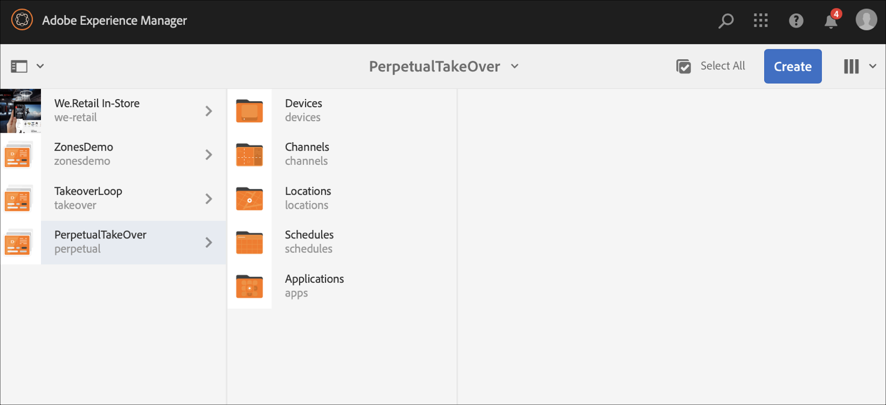

# 영구 TakeOver 채널 {#perpetual-takeover-channel}

다음 페이지에서는 특정 시간 및 시간 동안 지속적으로 재생되는 영구 TakeOver 채널을 만드는 방법에 대한 프로젝트 설정을 강조하는 사용 사례를 소개합니다.

## 사용 사례 설명 {#use-case-description}

이 사용 사례에서는 디스플레이 또는 디스플레이 그룹에 대해 일반적으로 재생되는 채널에서 *을 통해*에 도달하는 채널을 만드는 방법을 설명합니다. 그 인수는 특정한 날과 시간 동안 계속해서 일어날 것이다.
예를 들어, 매주 금요일 오전 9시부터 오전 10시까지 재생되는 영구 TakeOver 채널이 있습니다. 이 시간 동안에는 다른 채널이 재생되지 않아야 합니다. 다음 예제에서는 매주 수요일 오후 2시부터 오후 4시까지 2시간 동안 컨텐츠를 재생할 수 있는 영구 인계 채널 만들기를 보여줍니다.

### 전제 조건 {#preconditions}

이 사용 사례를 시작하기 전에 다음 방법을 이해했는지 확인하십시오.

* **[채널 만들기 및 관리](managing-channels.md)**
* **[위치 만들기 및 관리](managing-locations.md)**
* **[예약 생성 및 관리](managing-schedules.md)**
* **[장치 등록](device-registration.md)**

### 주 배우 {#primary-actors}

컨텐츠 작성자

## 프로젝트 {#setting-up-the-project} 설정

프로젝트를 설정하려면 아래 절차를 따르십시오.

**채널 및 디스플레이 설정**

1. 아래 표시된 대로 **ContinuousTakeOver**&#x200B;라는 AEM Screens 프로젝트를 만듭니다.

   

1. **채널** 폴더에서 **MainAdChannel**&#x200B;을 만듭니다.

   

1. **MainAdChannel**&#x200B;을 선택하고 작업 표시줄에서 **편집**&#x200B;을 클릭합니다. 일부 자산(이미지, 비디오, 포함된 시퀀스)을 채널에 끌어다 놓습니다.

   

   >[!NOTE]
   >이 예에서 **MainAdChannel**&#x200B;은 컨텐츠를 지속적으로 재생하는 시퀀스 채널을 보여줍니다.

1. **TakeOver** 채널을 만듭니다. 이 채널은 **MainAdChannel**&#x200B;의 컨텐츠를 가져오고 매주 수요일 오후 2시부터 오후 4시까지 재생됩니다.

1. **TakeOver**&#x200B;를 선택하고 작업 표시줄에서 **편집**&#x200B;을 클릭합니다. 일부 자산을 채널에 끌어다 놓습니다. 다음 예에서는 이 채널에 추가된 단일 영역 이미지를 보여줍니다.

   

1. 채널에 대한 위치 및 표시를 설정합니다. 예를 들어 이 프로젝트에 대해 **MainLobby** 위치 및 **MainLobbyDisplay** 표시가 설정되어 있습니다.

   

**디스플레이에 채널 지정**

1. **위치** 폴더에서 **MainLobbyDisplay** 표시를 선택합니다. 작업 표시줄에서 **채널 지정**&#x200B;을 클릭하여 **채널 지정** 대화 상자를 엽니다.

   >[!NOTE]
   >디스플레이에 채널을 할당하는 방법에 대해 알아보려면 **[채널 지정](channel-assignment.md)**&#x200B;을 참조하십시오.

1. **채널 지정** 대화 상자에서 필드(**채널 경로**, **우선순위** 및 **지원되는 이벤트**)를 채우고 **저장**&#x200B;을 클릭하여 **주 광고 채널**&#x200B;을 디스플레이에 할당합니다.

   * **채널 경로**:MainAdChannel 채널의  **** 경로를 선택합니다
   * **우선 순위**:이 채널의 우선순위를 1로 설정합니다.
   * **지원되는 이벤트**:초기  **로드** 및  **유휴 화면**&#x200B;을 선택합니다.

   

1. **위치** 폴더에서 **TakeOver** 표시를 선택합니다. 작업 표시줄에서 **채널 지정**&#x200B;을 클릭하여 인계 채널을 할당합니다.

1. **TakeOver** 채널을 예약된 시간에 디스플레이에 지정하고 **채널 지정** 대화 상자에서 다음 필드를 채우고 **저장**&#x200B;을 클릭합니다.

   * **채널 경로**:TakeOverchannel 경로를  **** 선택합니다
   * **우선 순위**:이 채널의 우선순위를 MainAdChannel보다  **크게 설정합니다**. 예를 들어 이 예에서 설정된 우선 순위는 8입니다.
   * **지원되는 이벤트**:유휴  **화면** 및 타이머 **를 선택합니다**.
   * **예약**:이 채널이 디스플레이를 실행할 예약의 텍스트를 입력합니다. 이 예제에 언급된 **예약**&#x200B;의 텍스트는 14:00 이후 수요일과 16:00 *입니다.*

      >[!NOTE]
      >**예약**&#x200B;에 추가할 수 있는 표현식에 대한 자세한 내용은 아래의 [예제 표현식](#example-expressions) 섹션을 참조하십시오.
   * ****&#x200B;에서 활성:시작 날짜 및 시간.
   * **활성 기간**:종료 날짜 및 시간.

      예를 들어, **예약** 및 **활성** 및 **활성&lt;/>의 텍스트는 여기에서 시작 날짜 및 시간을 통해 매주 수요일 오후 2시부터 오후 4시까지 컨텐츠를 재생할 수 있습니다.**

      

      **TakeOver** —> **위치** —> **MainLobby** —> **MainLobbyDisplay** 및 작업 표시줄에서 **대시보드**&#x200B;를 클릭하여 아래와 같이 우선순위가 있는 지정된 채널을 봅니다.

      >[!NOTE]
      >인계 채널의 우선 순위를 가장 높은 것으로 설정하는 것은 필수입니다.

      
assetNow,  **** TakeOverchannel은 매주 수요일 오후 2시에  **** MainAdChannel을 2시간 동안 인수하고, 2020년 1월 9일부터 2020년 1월 31일까지 컨텐츠를 재생합니다.

## 표현식 {#example-expressions} 예

다음 표에는 디스플레이에 채널을 지정하는 동안 예약에 추가할 수 있는 몇 가지 표현식 예가 요약되어 있습니다.

| **표현식** | **해석** |
|---|---|
| 오전 8시 이전 | 채널은 매일 오전 8시 전에 재생됨 |
| 오후 2시 이후 | 채널은 매일 오후 2시 이후에 재생됨 |
| 12시 15분 후 및 12시 45분 전 | 채널은 매일 오후 12시 15분 후에 30분 동안 재생됩니다. |
| 12시 15분 이전 12시 45분 이후도 | 채널은 매일 오후 12시 15분 전에 재생되고 그리고 오후 12시 45분 후에도 재생됩니다 |
| 1월 1일 오후 2:00 그리고 1월 2일 또한 1월 3일 오전 3:00 전에 3일에 | 채널은 1월 1일 오후 2시 이후에 재생되며, 1월 2일 하루 종일 1월 3일 오전 3시까지 계속 재생됩니다 |
| 1월 1일-2일 오후 2시 또한 1월 2일-3일 오전 3시 | 채널 시작 플레이어는 1월 1일 오후 2시 이후에, 1월 2일 오전 3시까지 계속 재생되고, 1월 2일 오후 2시에 다시 시작되고 1월 3일 오전 3시까지 계속 재생됩니다 |

>[!NOTE]
>
>*am/pm* 표기법(즉, 오후 2:00) 대신 _군대 시간_ 표기법(즉, 14:00)을 사용할 수도 있습니다.
