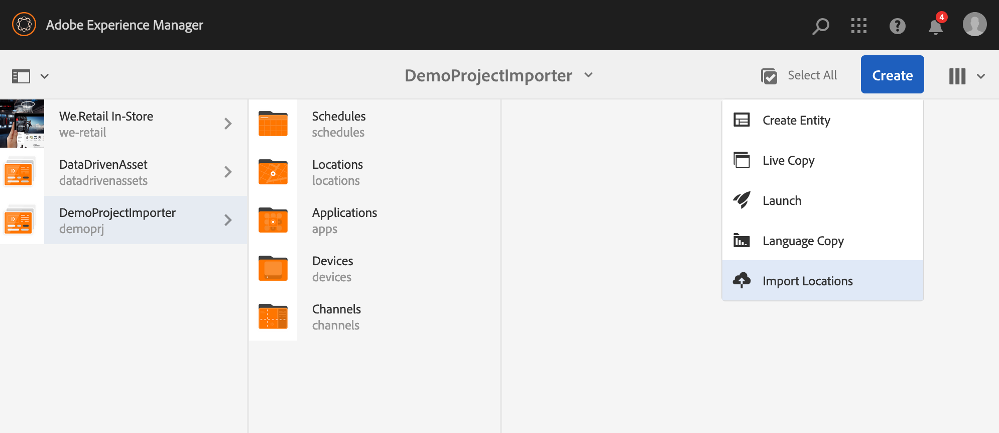

# 파일의 새 프로젝트 가져오기 {#new-project-importer-from-file}

이 섹션에서는 CSV/XLS 스프레드시트에서 AEM Screens 프로젝트로 위치 세트를 일괄 가져오는 기능에 대해 설명합니다.

## 소개 {#introduction}

조직에서 처음으로 AEM Screens 프로젝트를 설정하는 경우 모든 위치도 만듭니다. 프로젝트에 많은 위치가 포함된 경우 UI에서 많은 선택 및 대기가 필요한 지루한 작업이 발생합니다.

이 기능의 목표는 프로젝트를 설정하는 데 필요한 시간을 줄여 예산 문제를 해결하는 것입니다.

작성자가 스프레드시트를 입력 파일로 제공하고 시스템에서 백엔드에 위치 트리를 자동으로 만들도록 함으로써 다음과 같은 기능을 제공합니다.

* *UI를 통해 수동으로 선택하는 것보다 훨씬 우수한 성능을 달성합니다*
* *고객이 보유한 위치를 자체 시스템에서 내보내고 AEM에서 직접 쉽게 가져올 수 있습니다*

이 프로세스는 초기 프로젝트 설정 중에 또는 기존 AEM Screens을 새 위치로 확장할 때 시간과 비용을 모두 절약합니다.

## 아키텍처 개요 {#architectural-overview}

다음 다이어그램은 프로젝트 가져오기 기능의 아키텍처 개요를 보여 줍니다.

### 데이터 모델 {#data-model}

프로젝트 가져오기에 대한 데이터 모델은 아래에 설명되어 있습니다.

>[!NOTE]
>
>현재 릴리스는 위치 가져오기만 지원합니다.

| **속성** | **설명** |
|---|---|
| ***`path {string*}`*** | 위치에 대한 리소스 경로 |
| ***`[./jcr:title] {string*}`*** | 사용할 템플릿 이름(즉, *screens/core/templates/location*&#x200B;의 위치) |
| ***`template {string}`*** | 페이지에 사용할 선택적 제목 |
| ***`[./jcr:description] {string}`*** | 페이지에 사용할 선택적 설명 |

스프레드시트(CSV/XLS) 파일에는 다음 열이 필요합니다.

* **경로 {string}** - 가져올 위치의 경로입니다. 경로의 루트가 프로젝트의 위치 폴더인 *`/foo`*&#x200B;을(를) *`/content/screens/<project>/locations/foo`*(으)로 가져옵니다.
* **템플릿 {string}** - 지금은 허용되는 유일한 값이 &quot;location&quot;이지만 이 값은 이후의 모든 Screens 템플릿(`display`, `sequencechannel` 등)으로 확장됩니다.
* **[/*] {string}** - 위치에 설정할 모든 선택적 속성(즉, `./jcr:title`, `./jcr:description`, `./foo, ./bar`). 현재 릴리스에서는 필터링을 허용하지 않습니다.

>[!NOTE]
>
>위의 조건과 일치하지 않는 열은 모두 무시됩니다. 예를 들어, 시트(CSV/XLS) 파일에 파일의 **경로**, **템플릿**, **제목** 및 **설명** 이외의 다른 열이 정의되어 있으면 해당 필드가 무시됩니다. **프로젝트 가져오기**&#x200B;에서는 프로젝트를 AEM Screens 프로젝트로 가져오기 위한 추가 필드의 유효성을 검사하지 않습니다.

## 프로젝트 가져오기 사용 {#using-project-importer}

다음 섹션에서는 AEM Screens 프로젝트에서 프로젝트 가져오기를 사용하는 방법에 대해 설명합니다.

>[!CAUTION]
>
>제한 사항:
>
>* CSV/XLS/XLSX 확장명 이외의 파일은 현재 릴리스에서 지원되지 않습니다.
>* 가져온 파일 및 &quot;&quot;로 시작하는 모든 항목에 대한 속성 필터링이 없습니다./&quot;을(를) 가져옵니다.
>

### 사전 요구 사항 {#prerequisites}

* 제목이 **DemoProjectImport**&#x200B;인 프로젝트 만들기

* 가져와야 하는 샘플 CSV 또는 Excel 파일을 사용합니다.

데모 목적으로 아래 섹션에서 Excel 파일을 다운로드할 수 있습니다.

[파일 가져오기](assets/minimal-file.xls)

### 최소 필수 필드가 있는 파일 가져오기 {#importing-the-file-with-minimum-required-fields}

최소 필수 필드가 있는 위치 폴더로 파일을 가져오려면 아래 단계를 따르십시오.

>[!NOTE]
>
>다음 예제에서는 프로젝트를 가져오는 데 필요한 최소 4개의 필드를 보여줍니다.

1. AEM Screens 프로젝트(**DemoProjectImport**)로 이동합니다.

   

1. 사이드바 **&#x200B; 프로젝트 DemoProjectImporter &#x200B;**>**&#x200B; &#x200B;**>**&#x200B; 가져오기 위치 만들기**&#x200B;를 클릭합니다.

   

1. **가져오기** 마법사가 표시됩니다. 위치에 있는 프로젝트의 파일을 클릭하거나 *필수 구성 요소* 섹션에서 다운로드한 파일(***minimal-file.xls***)을 클릭합니다.

   파일을 선택한 후 **다음**&#x200B;을 클릭합니다.

   

1. 가져오기 마법사에서 파일(위치)의 내용을 확인하고 **가져오기**&#x200B;를 클릭합니다.

   

1. 따라서 이제 프로젝트로 가져온 모든 위치를 볼 수 있습니다.

   
