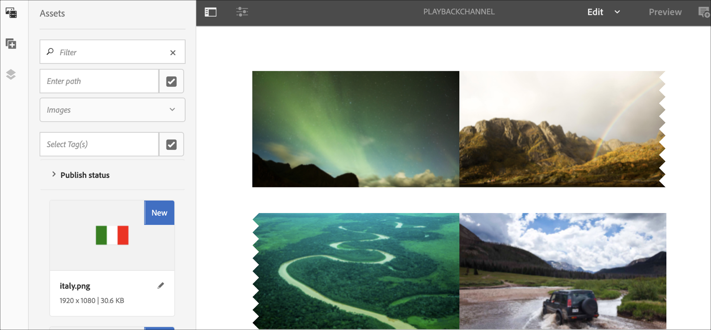

# 프로젝트 수준 이미지 재생 지속 시간 {#project-level-image-playback}

## 개요 {#overview}

이 기능을 사용하면 프로젝트 수준에서 이미지 재생 시간을 정의할 수 있습니다. 모든 이미지는 기본적으로 이 재생 기간을 상속합니다. 프로젝트 수준에서 지속 시간이 정의되지 않은 경우 기본 8초의 재생이 계속됩니다.

### 전제 조건 {#prerequisites}

이 기능을 사용하기 전에 이 기능 구현을 시작하기 위한 전제 조건으로 프로젝트를 설정해야 합니다. 예,

1. AEM Screens 프로젝트 만들기(이 예에서는 ProjectLevelPlayback ****)

1. 채널 폴더 아래에 시퀀스 채널을 **PlayBackChannel** 로 **만듭니다**

1. PlayBackChannel에 컨텐츠 **추가**

   

   예를 들어 다음 이미지는 PlayBackChannel 편집기에 추가된 이미지를 **보여줍니다** .

   

## 프로젝트 수준 이미지 재생 지속 시간 할당 편집 {#editing-project-level-image-playback-duration-assignment}

아래 섹션에서는 AEM Screens 프로젝트에서 컨텐츠의 재생 기간을 편집하는 방법에 대해 설명합니다.

### 프로젝트 수준에서 이미지 재생 기간 업데이트 {#updating-the-playback-duration-for-images-in-a-project}

>[!NOTE]
>이미지 또는 채널 레벨 재생 기간을 업데이트하려면 채널 레벨 이미지 재생 [기간을 참조하십시오](channel-level-image-playback.md).

프로젝트 수준 이미지 재생 지속 시간을 업데이트하는 방법에 대해 알아보려면 아래 절차를 따르십시오.

1. Navigate to your project **ProjectLevelPlayback** and click **Properties** from the action bar.
   

1. 채널에서 모든 이미지를 선택하고 왼쪽 상단에 있는 공구 모양 아이콘(아래 그림에 표시된 대로)을 클릭하여 채널 수준 구성 대화 상자를 엽니다.

   

1. **페이지** 대화 상자가 열립니다.

   >[!NOTE]
   >
   >기본적으로 채널의 이미지는 재생 지속 시간이 8초로 설정되고 비디오는 기본 지속 시간으로 재생됩니다.

   

   지속 **시간을** 8000(ms)에서 3000(ms)까지, 즉 3초로 편집합니다. 페이지 대화 상자의 오른쪽 상단에 있는 **확인** 표시를 클릭하여 변경 사항을 저장합니다.

   

### 결과 보기 {#viewing-the-result}

채널 재생 지속 시간(이 예에서는 3개 이미지 모두)을 업데이트하면 이미지가 8초 대신 3초 동안 재생됩니다(기본값).

