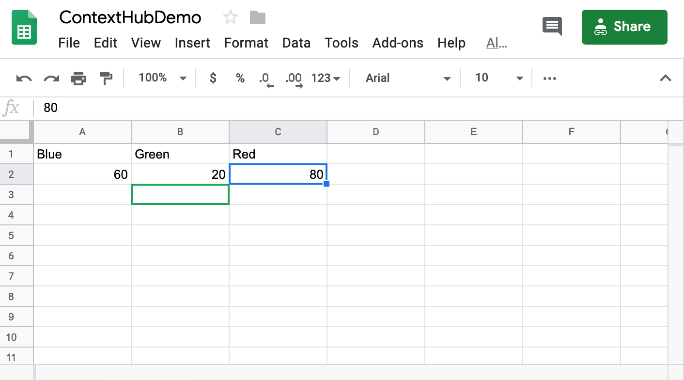
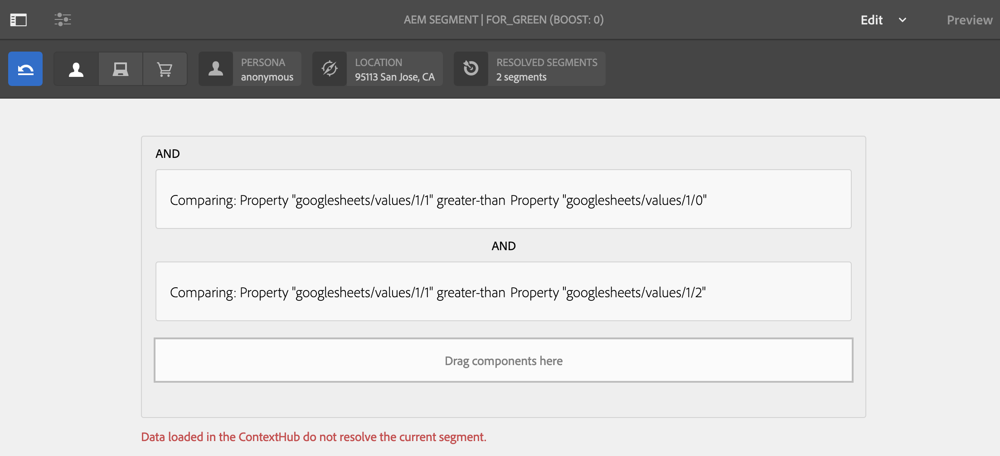
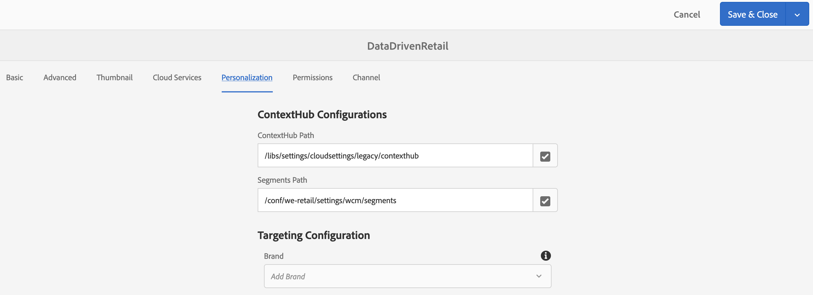

# 소매 재고 타깃팅 활성화 {#retail-inventory-targeted-activation}

>[!IMPORTANT]
>이 콘텐츠는 AEM On-Premise/AMS(AEM 6.5LTS 및 AEM 6.5)에 유효합니다. AEM as a Cloud Service Screens 콘텐츠의 경우 [AEM as a Cloud Service 안내서](https://experienceleague.adobe.com/en/docs/experience-manager-cloud-service/content/screens-as-cloud-service/overview/introduction)를 참조하십시오.

다음 사용 사례에서는 Google 시트의 값을 기반으로 하는 세 가지 이미지를 보여 줍니다.

## 설명 {#description}

이 사용 사례는 세 가지 색상의 스웨터에 대한 소매 재고 목록을 보여줍니다. Google Sheets에 기록된 재고에 있는 구매 가능한 스웨트 셔츠 수에 따라 가장 많은 수의 이미지(빨간색, 녹색 또는 파란색 스웨트 셔츠)가 표시됩니다.

빨강, 녹색 또는 파랑 스웨터는 사용 가능한 스웨터 수 중 가장 높은 값을 기준으로 표시됩니다.

## 전제 조건 {#preconditions}

소매 인벤토리 타깃팅 활성화를 구현하기 전에 AEM Screens 프로젝트에서 ***데이터 저장소***, ***대상자 세분화*** 및 ***채널에 대한 타깃팅 사용***&#x200B;을 설정하는 방법에 대해 알아보세요.

자세한 내용은 [AEM Screens에서 ContextHub 구성](configuring-context-hub.md)을 참조하십시오.

## 기본 흐름 {#basic-flow}

소매 재고 활성화 사용 사례를 구현하려면 아래 단계를 따르십시오.

1. **Google 시트 채우기**

   1. ContextHubDemo Google 시트로 이동합니다.
   1. 세 개의 다른 스웨트 셔츠에 해당하는 값이 있는 세 개의 열(빨간색, 녹색 및 파란색)을 추가합니다.

   

1. **요구 사항에 따라 대상 구성**

   1. 대상의 세그먼트로 이동합니다(자세한 내용은 **[AEM Screens에서 ContextHub 구성](configuring-context-hub.md)** 페이지의 ***2단계: 대상 세분화 설정*** 참조).

   1. 새 세그먼트 3개 추가 **For_Red**, **For_Green** 및 **For_Blue**.

   1. 작업 표시줄에서 **For_Red**&#x200B;을(를) 클릭하고 **편집**&#x200B;을(를) 클릭합니다.

   1. **비교: 속성 - 속성**&#x200B;을 편집기로 드래그 앤 드롭합니다.
   1. **구성** 아이콘을 클릭합니다.
   1. **첫 번째 속성 이름**&#x200B;의 드롭다운에서 **googlesheets/value/1/2**&#x200B;을(를) 클릭합니다.
   1. 드롭다운 메뉴에서 **연산자**&#x200B;을(를) 클릭하고 **보다 큼**&#x200B;을(를) 클릭합니다.
   1. **데이터 형식**&#x200B;을(를) 클릭하고 **숫자**(으)로 설정합니다.
   1. **두 번째 속성 이름**&#x200B;의 드롭다운에서 **googlesheets/value/1/1**&#x200B;을(를) 클릭합니다.
   1. **다른 비교: 속성 - 속성**&#x200B;을(를) 편집기로 드래그하여 놓고 **구성** 아이콘을 클릭합니다.
   1. **첫 번째 속성 이름**&#x200B;의 드롭다운에서 **googlesheets/value/1/2**&#x200B;을(를) 클릭합니다.
   1. 드롭다운 메뉴에서 **연산자**&#x200B;을(를) 클릭하고 **보다 큼**&#x200B;을(를) 클릭합니다.
   1. **데이터 형식**&#x200B;을(를) 클릭하고 **숫자**(으)로 설정합니다.
   1. **두 번째 속성 이름**&#x200B;의 드롭다운에서 **googlesheets/value/1/0**&#x200B;을(를) 클릭합니다.

   

   마찬가지로 아래 그림과 같이 비교 속성 규칙을 편집하고 **For_Blue** 세그먼트에 추가하십시오.

   

   마찬가지로 아래 그림과 같이 비교 속성 규칙을 편집하고 **For_Green** 세그먼트에 추가합니다.

   

   >[!NOTE]
   >
   >세그먼트 **For_Green** 및 **For_Green**&#x200B;의 경우 Google 시트의 값에 따라 현재 첫 번째 비교만 유효하므로 편집기에서 데이터를 해결할 수 없습니다.

1. **DataDrivenRetail** 채널(시퀀스 채널)로 이동하여 클릭합니다.
1. 작업 표시줄에서 **편집**&#x200B;을 클릭합니다.

   

   >[!CAUTION]
   >
   >채널 **속성** > **Personalization** 탭을 사용하여 **ContextHub** **구성**&#x200B;을(를) 이미 설정했어야 합니다.

   

   >[!NOTE]
   >
   >타깃팅 프로세스를 시작할 때 활동을 올바르게 나열하려면 **브랜드** 및 **영역**&#x200B;을(를) 모두 클릭하십시오.

1. **기본 이미지 추가**

   1. 채널에 기본 이미지를 추가하고 **타깃팅**&#x200B;을 클릭합니다.
   1. 드롭다운 메뉴에서 **브랜드** 및 **활동**&#x200B;을 클릭하고 **타깃팅 시작**&#x200B;을 클릭합니다.
   1. **타깃팅 시작**&#x200B;을 클릭합니다.

   

   >[!NOTE]
   >
   >타깃팅을 시작하기 전에 아래 그림과 같이 측면 레일에서 **+ 경험 타깃팅 추가**&#x200B;를 선택하여 세그먼트(**For_Green**, **For_Red**, **For_Blue**)를 추가하십시오.

   

1. 아래 표시된 대로 세 가지 다른 시나리오에 이미지를 모두 추가합니다.

   

1. **미리 보기 확인**

   1. **미리 보기**&#x200B;를 클릭합니다. 또한 Google 시트를 열고 값을 업데이트합니다.
   1. 세 개의 다른 열에 대한 값을 모두 변경합니다. 인벤토리에서 가장 높은 값에 따라 디스플레이 이미지가 업데이트됩니다.

   

