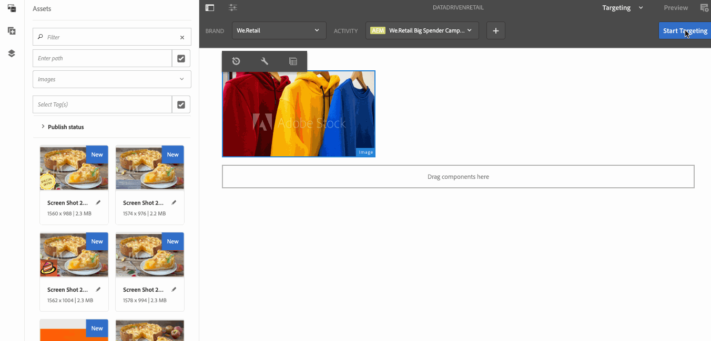

# 소매 재고 타깃팅 활성화 {#retail-inventory-targeted-activation}

다음 사용 사례에서는 Google 시트의 값을 기반으로 하는 세 가지 이미지를 보여 줍니다.

## 설명 {#description}

이 사용 사례에서는 세 가지 색상의 스웨터에 대한 소매 재고 목록을 보여줍니다. Google Sheets에 기록된 재고에 있는 구매 가능한 스웨트 셔츠 수에 따라, 가장 많은 수의 이미지(빨간색, 녹색 또는 파란색 스웨트 셔츠)가 화면에 표시됩니다.

이 사용 사례의 경우, 사용 가능한 스웨터 수 중 가장 높은 값을 기준으로 빨간색, 녹색 또는 파란색 스웨터가 화면에 표시됩니다.

## 전제 조건 {#preconditions}

소매 인벤토리 타기팅 활성화 구현을 시작하기 전에 설정 방법을 알아보세요. ***데이터 저장소***, ***대상자 세분화*** 및 ***채널에 대한 타깃팅 활성화*** AEM Screens 프로젝트에서.

다음을 참조하십시오 [AEM Screens에서 ContextHub 구성](configuring-context-hub.md) 을 참조하십시오.

## 기본 흐름 {#basic-flow}

소매 재고 활성화 사용 사례를 구현하려면 아래 단계를 따르십시오.

1. **Google 시트 채우기**

   1. ContextHubDemo Google 시트로 이동합니다.
   1. 세 개의 다른 스웨트 셔츠에 해당하는 값이 있는 세 개의 열(빨간색, 녹색 및 파란색)을 추가합니다.

   

1. **요구 사항에 따라 대상 구성**

   1. 대상의 세그먼트로 이동합니다( 참조). ***2단계: 대상자 세분화 설정*** 위치: **[AEM Screens에서 ContextHub 구성](configuring-context-hub.md)** 페이지 를 참조하십시오.

   1. 세 개의 새 세그먼트 추가 **For_Red**, **For_Green**, 및 **For_Blue**.

   1. 선택 **For_Red** 및 클릭 **편집** 작업 표시줄에서

   1. 을(를) 드래그 앤 드롭합니다 **비교 : 속성 - 속성** 를 편집기에 추가합니다.
   1. 다음을 클릭합니다. **구성** 아이콘.
   1. 선택 **googlesheets/value/1/2** 의 드롭다운에서 **첫 번째 속성 이름**.
   1. 다음 항목 선택 **연산자** 다음으로: **다음보다 큼** 드롭다운 메뉴에서 을(를) 선택합니다.
   1. 선택 **데이터 유형** 다음으로: **숫자**.
   1. 선택 **googlesheets/value/1/1** 의 드롭다운에서 **두 번째 속성 이름**.
   1. 드래그 앤 드롭 **다른 비교 : 속성 - 속성** 를 편집기에 추가하고 **구성** 아이콘.
   1. 선택 **googlesheets/value/1/2** 의 드롭다운에서 **첫 번째 속성 이름**.
   1. 다음 항목 선택 **연산자** 다음으로: **다음보다 큼** 드롭다운 메뉴에서 을(를) 선택합니다.
   1. 선택 **데이터 유형** 다음으로: **숫자**.
   1. 선택 **구글시트/값/1/0** 의 드롭다운에서 **두 번째 속성 이름**.

   

   마찬가지로 비교 속성 규칙을 편집하고에 추가합니다. **For_Blue** 아래 그림과 같은 세그먼트:

   

   마찬가지로 비교 속성 규칙을 편집하고에 추가합니다. **For_Green** 아래 그림과 같은 세그먼트:

   

   >[!NOTE]
   >
   >세그먼트의 경우 **For_Green** 및 **For_Green**, Google 시트의 값에 따라 현재 첫 번째 비교만 유효하므로 편집기에서 데이터를 해결할 수 없습니다.

1. 다음 위치로 이동하여 선택 **DataDrivenRetail** 채널(시퀀스 채널).
1. 클릭 **편집** 작업 표시줄에서

   

   >[!CAUTION]
   >
   >다음을 설정해야 합니다. **컨텍스트 허브** **구성** 채널 사용 **속성** > **개인화** 탭.

   

   >[!NOTE]
   >
   >다음 두 가지를 모두 선택합니다. **브랜드** 및 **영역** 타겟팅 프로세스를 시작할 때 활동을 올바르게 나열할 수 있습니다.

1. **기본 이미지 추가**

   1. 채널에 기본 이미지를 추가하고 **타겟팅**.
   1. 선택 **브랜드** 및 **활동** 드롭다운 메뉴에서 **타깃팅 시작**.
   1. 클릭 **타깃팅 시작**.

   

   >[!NOTE]
   >
   >타깃팅을 시작하기 전에 세그먼트를 추가합니다(**For_Green**, **For_Red**, 및 **For_Blue**)을 클릭하여 **+ 경험 타깃팅 추가** 아래 그림과 같이 측면 레일에서

   

1. 아래 표시된 대로 세 가지 다른 시나리오에 이미지를 모두 추가합니다.

   

1. **미리보기 확인**

   1. 클릭 **미리 보기.** 또한 Google 시트를 열고 값을 업데이트합니다.
   1. 세 개의 다른 열에 대한 값을 모두 변경합니다. 인벤토리에서 가장 높은 값에 따라 디스플레이 이미지가 업데이트됩니다.

   
