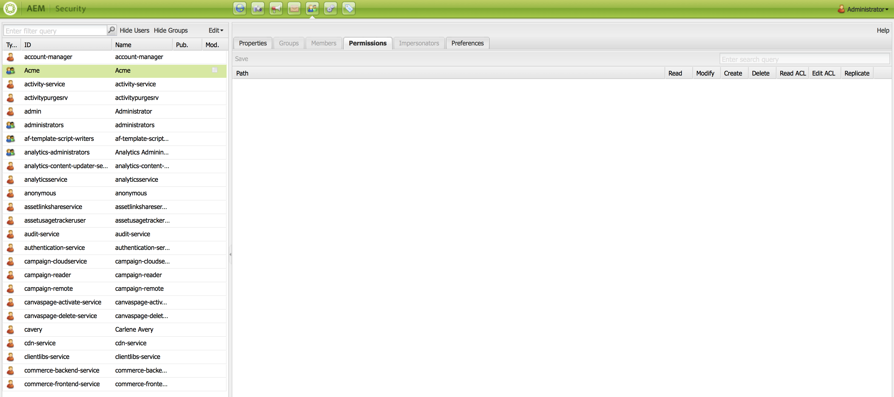

# ACL 설정 {#setting-up-acls}

다음 섹션에서는 개별 또는 팀이 자체 프로젝트를 처리하도록 ACL을 사용하여 프로젝트를 분리하는 방법을 설명합니다.

AEM 관리자는 프로젝트의 팀 구성원이 다른 프로젝트를 방해하지 않고 각 사용자에게 프로젝트 요구 사항에 따라 특정 역할이 할당되도록 해야 합니다.

## 권한 {#setting-up-permissions} 설정

다음 단계는 프로젝트에 대한 ACL 설정 절차를 요약합니다.

1. AEM에 로그인하고 **도구** > **보안**&#x200B;으로 이동합니다.

   

1. **그룹**&#x200B;을 클릭하고 ID(예: Acme)를 입력합니다.

   또는 이 링크인 `http://localhost:4502/libs/granite/security/content/groupadmin.html`을 사용하십시오.

   그런 다음 **저장**&#x200B;을 클릭합니다.

   

1. 목록에서 **기여자**&#x200B;를 선택하고 두 번 클릭합니다.

   

1. **Acme**(만든 프로젝트)를 **그룹에 구성원 추가**&#x200B;에 추가합니다. **저장**&#x200B;을 클릭합니다.

   

   >[!NOTE]
   >
   >프로젝트 팀 구성원이 플레이어를 등록하도록(모든 플레이어에 대해 사용자 생성을 포함함) 하려면 그룹 사용자 관리자를 찾아 사용자 관리자에 ACME 그룹을 추가합니다

1. **Acme** 프로젝트에서 작업할 모든 사용자를 **Acme** 그룹에 추가합니다.

   

1. 이 `(http://localhost:4502/useradmin)`를 사용하여 **Acme** 그룹에 대한 권한을 설정합니다.

   **Acme** 그룹을 선택하고 **권한**&#x200B;을 클릭합니다.

   

### 권한 {#permissions}

다음 표에는 프로젝트 수준의 권한이 있는 경로가 요약되어 있습니다.

| **경로** | **권한** | **설명** |
|---|---|---|
| `/apps/<project>` | 읽기 | 프로젝트 파일에 대한 액세스 권한 제공(해당되는 경우) |
| `/content/dam/<project>` | 모두 | DAM에서 이미지 또는 비디오와 같은 프로젝트 자산을 저장할 수 있는 액세스 권한을 제공합니다 |
| `/content/screens/<project>` | 모두 | /content/screens 아래의 다른 모든 프로젝트에 대한 액세스 제거 |
| `/content/screens/svc` | 읽기 | 등록 서비스에 대한 액세스 권한 제공 |
| `/libs/screens` | 읽기 | DCC에 대한 액세스 권한 제공 |
| `/var/contentsync/content/screens/` | 모두 | 프로젝트에 대한 오프라인 콘텐츠를 업데이트할 수 있습니다 |

>[!NOTE]
>
>경우에 따라 작성 기능(예: 자산 관리 및 채널 생성)을 관리자 기능(예: 플레이어 등록)과 분리할 수 있습니다. 이러한 시나리오에서 두 개의 그룹을 만들고 작성자 그룹을 기여자 그룹에 추가하고, 기여자 및 사용자 관리자 모두에게 관리자 그룹을 추가합니다.

### 그룹 만들기 {#creating-groups}

새 프로젝트를 만들려면 기본 권한 세트가 할당된 기본 사용자 그룹도 만들어야 합니다. 권한을 AEM Screens에 대한 일반적인 역할로 확장해야 합니다.

예를 들어 다음 프로젝트별 그룹을 만들 수 있습니다.

* 스크린 프로젝트 관리자
* 스크린 프로젝트 운영자(플레이어 등록, 위치 및 장치 관리)
* 스크린 프로젝트 사용자(채널, 일정 및 채널 지정 작업)

다음 표에는 AEM Screens 프로젝트에 대한 설명 및 권한이 있는 그룹이 요약되어 있습니다.

<table>
 <tbody>
  <tr>
   <td><strong>그룹 이름</strong></td>
   <td><strong>설명</strong></td>
   <td><strong>권한</strong></td>
  </tr>
  <tr>
   <td>Screens 관리자  <em>screens-admins</em></td>
   <td>AEM Screens 기능에 대한 관리자 수준 액세스</td>
   <td>
    <ul>
     <li>기여자 멤버</li>
     <li>사용자 관리자의 구성원</li>
     <li>모든 /content/screens</li>
     <li>모든 /content/dam</li>
     <li>모든 /content/experience-fragments</li>
     <li>모든 /etc/design/screens</li>
    </ul> </td>
  </tr>
  <tr>
   <td>Screens 사용자  <em>screens-users</em></td>
   <td>채널 및 일정을 만들고 업데이트하고 AEM Screens의 위치에 할당합니다</td>
   <td>
    <ul>
     <li>기여자 멤버</li>
     <li>&lt;project&gt; /content/screens</li>
     <li>&lt;project&gt; /content/dam</li>
     <li>&lt;project&gt; /content/experience-fragments</li>
    </ul> </td>
  </tr>
  <tr>
   <td>Screens 연산자  <em>screens-operators</em></td>
   <td>AEM Screens에서 위치 구조를 생성 및 업데이트하고 플레이어를 등록합니다</td>
   <td>
    <ul>
     <li>기여자 멤버</li>
     <li>jcr:all /home/users/screens</li>
     <li>jcr:all /home/groups/screens</li>
     <li>&lt;project&gt; /content/screens</li>
    </ul> </td>
  </tr>
  <tr>
   <td>Screens 플레이어  <em>screens-&lt;project&gt;-devices</em></td>
   <td>모든 플레이어 및 모든 플레이어/장치를 자동으로 기여자의 멤버로 그룹화합니다.</td>
   <td>
 기여자 멤버
 </td>
  </tr>
 </tbody>
</table>
