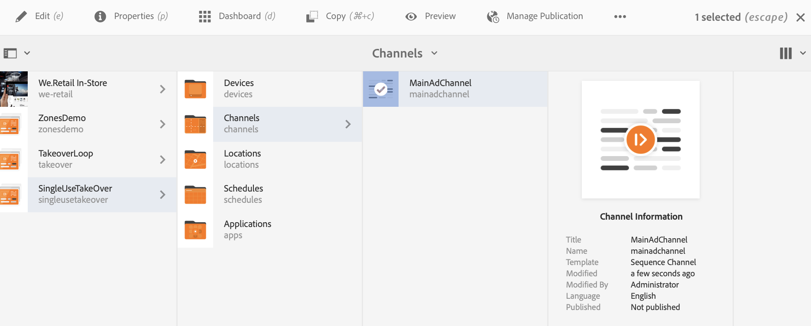

# 단일 사용 TakeOver 채널 {#single-use-takeover-channel}

다음 페이지에서는 특정 시간 동안 한 번만 재생되는 단일 TakeOver 채널을 만드는 방법에 대한 프로젝트 설정에 중점을 둔 사용 사례를 소개합니다.

## 사용 사례 설명 {#use-case-description}

이 사용 사례에서는 디스플레이 또는 디스플레이 그룹에 대해 일반적으로 재생되는 채널에서 *을 통해*에 도달하는 채널을 만드는 방법을 설명합니다. 인수는 한 번만 발생합니다.
예를 들어 금요일 오전 9시부터 오전 10시까지 재생되는 단일 TakeOver 채널이 있습니다. 이 시간 동안에는 다른 채널이 재생되지 않아야 합니다. 이 시간 전후에 단일 사용 인계 채널이 재생되지 않습니다. 다음 예제에서는 컨텐츠를 12월 31일 오전 12시부터 오전 12시까지 2분 동안 재생할 수 있는 단일 takeover 채널 생성을 소개합니다.

### 전제 조건 {#preconditions}

이 사용 사례를 시작하기 전에 다음 방법을 이해했는지 확인하십시오.

* **[채널 만들기 및 관리](managing-channels.md)**
* **[위치 만들기 및 관리](managing-locations.md)**
* **[예약 생성 및 관리](managing-schedules.md)**
* **[장치 등록](device-registration.md)**

### 주 배우 {#primary-actors}

컨텐츠 작성자

## 프로젝트 {#setting-up-the-project} 설정

프로젝트를 설정하려면 아래 절차를 따르십시오.

**채널 및 디스플레이 설정**

1. 아래 표시된 대로 **SingleUseTakeOver**&#x200B;라는 AEM Screens 프로젝트를 만듭니다.

   

1. **채널** 폴더에서 **MainAdChannel**&#x200B;을 만듭니다.

   

1. **MainAdChannel**&#x200B;을 선택하고 작업 표시줄에서 **편집**&#x200B;을 클릭합니다. 일부 자산(이미지, 비디오, 포함된 시퀀스)을 채널에 끌어다 놓습니다.

   

   >[!NOTE]
   >이 예에서 **MainAdChannel**&#x200B;은 컨텐츠를 지속적으로 재생하는 시퀀스 채널을 보여줍니다.

   

1. **TakeOver** 채널을 만듭니다. 이 채널은 **MainAdChannel**&#x200B;의 컨텐츠를 가져오고 특정 일 및 시간 동안에만 재생됩니다.

1. **TakeOver**&#x200B;를 선택하고 작업 표시줄에서 **편집**&#x200B;을 클릭합니다. 일부 자산을 채널에 끌어다 놓습니다. 다음 예에서는 이 채널에 추가된 단일 영역 이미지를 보여줍니다.

   

1. 채널에 대한 위치 및 표시를 설정합니다. 예를 들어 이 프로젝트에 대해 **Lobby** 위치 및 **MainLobbyDisplay**&#x200B;가 설정되어 있습니다.

   

**디스플레이에 채널 지정**

1. **위치** 폴더에서 **MainLobbyDisplay** 표시를 선택합니다. 작업 표시줄에서 **채널 지정**&#x200B;을 클릭합니다.

   

   >[!NOTE]
   >디스플레이에 채널을 할당하는 방법에 대해 알아보려면 **[채널 지정](channel-assignment.md)**&#x200B;을 참조하십시오.

1. **채널 지정** 대화 상자에서 필드(**채널 경로**, **우선순위** 및 **지원되는 이벤트**)를 채우고 **저장**&#x200B;을 클릭합니다. 이제 **MainAdChannel**&#x200B;을 디스플레이에 지정하였습니다.

   

1. **위치** 폴더에서 **TakeOver** 표시를 선택합니다. 작업 표시줄에서 **채널 지정**&#x200B;을 클릭하여 단일 사용 인계 채널을 할당합니다.

1. **TakeOver** 채널을 예약된 시간에 디스플레이에 지정하고 **채널 지정** 대화 상자에서 다음 필드를 채우고 **저장**&#x200B;을 클릭합니다.

   * **채널 경로**:TakeOver 채널의 경로를 선택합니다
   * **우선 순위**:이 채널의 우선순위를 MainAdChannel보다  **크게 설정합니다**. 예를 들어 이 예에서 설정된 우선 순위는 8입니다.

      >[!NOTE]
      >우선 순위는 일반적으로 재생되는 채널의 우선 순위 값보다 높은 값일 수 있습니다.
   * **지원되는 이벤트**:유휴  **화면** 및 타이머 **를 선택합니다**.
   * **예약**:이 채널이 디스플레이를 실행할 예약의 텍스트를 입력합니다. 예를 들어, 여기 텍스트를 사용하면 컨텐츠를 12월 31일 오전 12시 ~ 오전 12시 1분까지 재생할 수 있습니다.
이 예제에 언급된 **예약**&#x200B;의 텍스트는 23:58년 12월 31일에 *이고, 00.01*&#x200B;년 1월 1일에 있습니다.

      

      **SingleUseTakeOver** —> **위치** —> **Lobby** —> **MainLobbyDisplay**&#x200B;에서 디스플레이로 이동하고 작업 표시줄에서 **대시보드**&#x200B;를 클릭하여 아래에서 보듯이 우선순위가 지정된 채널을 봅니다.

      >[!NOTE]
      >인계 채널의 우선 순위를 가장 높은 것으로 설정하는 것은 필수입니다.

      

>[!NOTE]
>
>재생되면 단일 사용 TakeOver 채널을 삭제하는 것이 가장 좋습니다.
